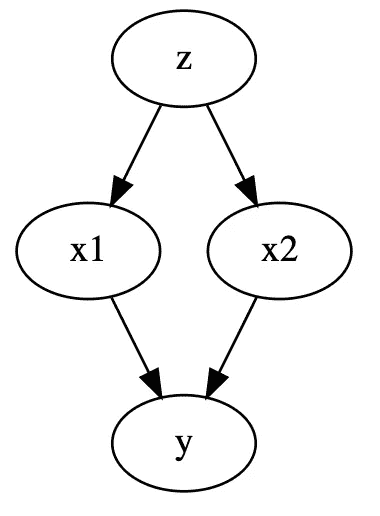
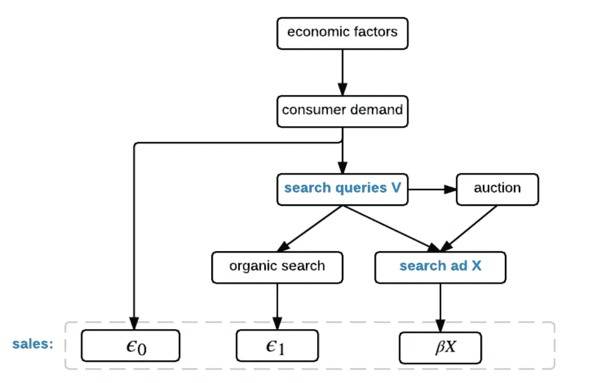
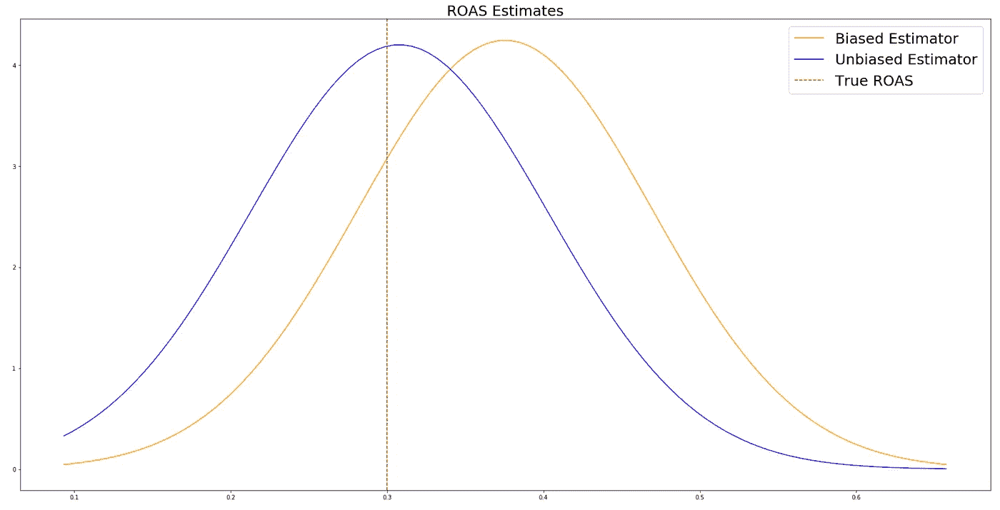
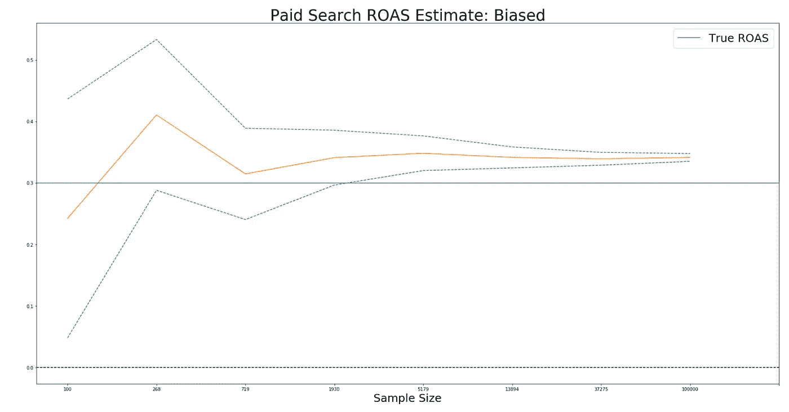
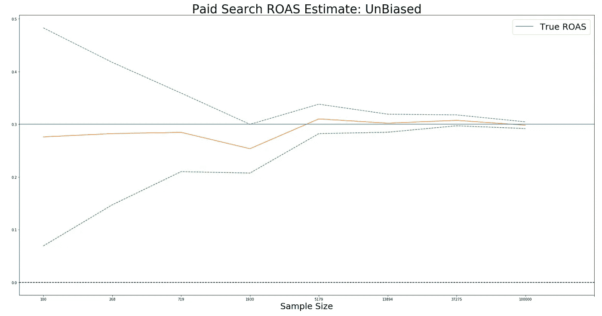

# 媒体混合模型中付费搜索的偏差修正:论文综述

> 原文：<https://towardsdatascience.com/bias-correction-for-paid-search-in-media-mix-modeling-paper-review-d3579cfaee9b?source=collection_archive---------31----------------------->

## 这篇文章提供了“媒体混合建模中付费搜索的偏差纠正”的高级概述，提供了关键概念的代码和实现。


**媒体组合建模中付费搜索的偏差修正:** [链接论文](https://arxiv.org/pdf/1807.03292.pdf)

媒体组合建模试图仅基于观察数据来估计媒体支出对销售的因果影响。众所周知，从观测数据中估计因果关系充满了挑战。

随着时间的推移，出现了两种主要的、互补的框架来处理因果推理。

1.  鲁宾的潜在结果框架。
2.  Pearl 的图形框架。

本文探讨了使用 Pearl 的图形框架来控制媒体组合建模中的选择偏差，特别是在付费搜索广告中。

## 问题设置

假设我们的目标是测量搜索广告(PPC)对销售的因果影响。在一个简单的回归模型中，我们可以回归销售支出并得出一个因果估计值:

> 销售额=平均值 _ 销售额+**roas _ 估计值** *搜索 _ 花费+误差

我们可以用普通的最小二乘法(OLS)来拟合上面的模型，在一个简单的世界中，这将产生对 roa 的精确估计。不幸的是，世界并非如此简单，我们知道经常会有令人困惑的变量。例如，我们知道有机搜索也是销售的驱动力，有机搜索和付费搜索都有一个潜在的原因，即消费者需求。下图说明了这一点。


以上，我们可以看到经济因素如何驱动消费者需求，进而驱动搜索查询，进而驱动付费搜索和有机搜索。

当我们使用上面定义的简单模型来模拟更复杂的世界时，我们会遇到选择偏差或更广泛的内生性问题。

> **内生性:**是计量经济学中使用的术语，指与误差项相关的解释变量。

简而言之，我们的模型捕捉或吸收了有机搜索在误差项和 ROAS 估计中的解释价值，从而产生有偏差的 ROAS 估计。

为了控制这一点，本文建议使用珀尔的后门标准。Pearl 的后门标准是基于使用图形模型来描述因果关系的思想。图形模型是有用的，因为它们允许我们结合领域知识和来自图论的思想。

其中一个想法就是分离。

> **D-separation** 是 directed-separation 的缩写，它允许我们在一个图中的两个节点被一组第三节点分隔(或有条件地相互独立)时进行通信。

例如，在下图中，给定 x1 和 x2，我们可以说 Z 与 Y 是 d 分离的，或条件独立的。



另一个重要的想法是**后门标准。**

> **后门准则:**给定一个因果图，一组变量 Z 相对于图中一个有序的变量对(X，Y)满足
> 后门准则，如果:1)Z 中没有一个节点是 X 的后代；以及 2) Z“阻塞”X 和 Y 之间包含指向 X 的箭头的每条路径

此外，如果一组节点 Z 满足有向对的后门准则(X →Y ),那么在给定足够大的数据集的情况下，我们可以揭示 X 对 Y 的无偏估计。这也被定义为**可识别性**。

为了让自己熟悉后门标准的概念，我建议尝试下面的代码片段(尝试创建各种图形，并确定哪些节点将满足后门标准)并探索其他资源。

```
from causalgraphicalmodels import CausalGraphicalModelsimple = CausalGraphicalModel(
    nodes=["x1", 'x2', 'z', 'y'],
    edges=[
        ("z", "x1"), 
        ("z", "x2"),
        ("x1", "y"),
        ("x2", "y"),
    ]
)simple.draw()simple.is_valid_backdoor_adjustment_set("x1", "y", {"z"})
```

## 申请搜索

现在，我们已经探索了一些与因果图模型相关的基本概念，我们可以看到它们是如何应用于恢复付费搜索的无偏 ROAS 估计的。首先，本文阐述了环境的因果结构。(见下图)



上图表明我们将影响建模为:

> sales = average _ sales+*roas _ estimate** search _ spend+error _ 0+error _ 1

其中 error_0 和 error_1 分别吸收了消费者需求和有机搜索的影响。

基于我们对图形模型的了解，我们现在知道，如果我们可以恢复搜索查询的度量，我们就可以满足(搜索广告 X →销售)的后门标准。为了测试这一点，我们可以使用一个叫做[因果图模型](https://github.com/ijmbarr/causalgraphicalmodels)的便利包。

```
from causalgraphicalmodels import CausalGraphicalModelsearch = CausalGraphicalModel(
    nodes=["economic_factors", "consumer_demand", "search_queriers", "auction", "organic_search", "paid_search", 'organic_search', 'sales'],
    edges=[
        ("economic_factors", "consumer_demand"), 
        ("consumer_demand", "sales"), 
        ("consumer_demand", "search_q"),
        ("search_q", "auction"), 
        ("auction", "paid_search"),
        ("search_q", "paid_search"),
        ("search_q", "organic_search"), 
        ("organic_search", "sales"), 
        ("paid_search", "sales"),
    ]
)search.is_valid_backdoor_adjustment_set("paid_search", "sales", {"search_q"})# output is True 
```

在上面的代码中，我们定义了因果图模型(DAG ),并测试我们的控制变量是否满足后门标准(payed _ search→sales)。

接下来，我们生成样本数据，运行 OLS 回归来比较满足和不满足后门标准时的估计值。

```
from causalgraphicalmodels import StructuralCausalModel
from causalgraphicalmodels import CausalGraphicalModel
import numpy as np# create structural causal model. This let's us generate data. search_data = StructuralCausalModel({
    "consumer_demand": lambda n_samples:                  np.random.normal(100,5, size=n_samples) ,
    "search_q":        lambda consumer_demand, n_samples: np.random.normal(consumer_demand*.3,  1, n_samples)  ,
    "organic_search":  lambda search_q, n_samples:        np.random.normal(search_q*.6, 1)                ,
    "paid_search":     lambda search_q, n_samples:        np.random.normal(search_q*.1, 1)                ,

    "sales":           lambda organic_search, paid_search, n_samples: np.random.normal(75 + organic_search*.2  + paid_search*.3,  1 )
})data = search_data.sample(156)# run OLS without backdoor criterion satisfied for paid search --> salesX = data[['paid_search' ]].values
X = sm.add_constant(X)results = sm.OLS(data.sales.values, X).fit()print(results.summary())# run OLS without backdoor criterion satisfied for paid search --> salesX = data[['paid_search' ]].values
X = sm.add_constant(X)results = sm.OLS(data.sales.values, X).fit()print(results.summary())# with backdoor criterion satisfied X = data[['paid_search',   'search_q']].values
X = sm.add_constant(X)results = sm.OLS(data.sales.values, X).fit()print(results.summary())
```

得出以下 ROAS 估计值:



正如我们所看到的，两种估计都捕捉到了真实的参数，无偏估计(满足后门标准)更接近真实的估计。

现在，您可能已经注意到，在代码示例中，我们只采样了 156 个数据点，这相当于三年的每周 MMM 数据。这并不是大量的数据，也提出了一个重要的问题，即我们如何知道我们的样本量何时足够？

该论文提出，当样本量足够大以允许非参数估计时，这种担心可以得到缓解，然而大样本量在 MMM 建模中并不常见。

为了进一步探索这一点，我制作了下图，展示了在样本量越来越大的情况下，ROAS 估计值和置信区间是如何变化的。



正如我们所见，无偏估计量收敛于真实参数，而有偏估计量过于乐观。此外，上图强调了小样本量如何产生非常大的置信区间。如果样本量很小，需要注意一些事情。

至此，我们已经完成了论文理论部分的主要内容，并涵盖了:

*   付费搜索中的选择偏差与 MMM 建模
*   因果图形模型/珍珠框架
*   如何应用于简单的付费搜索场景
*   如何模拟数据和实现模型
*   一些需要注意的“陷阱”

本白皮书更详细地介绍了这里涉及的主题，并继续介绍:

1.  复杂场景
2.  履行
3.  实证结果

我强烈推荐感兴趣的读者查看全文以了解更多细节。