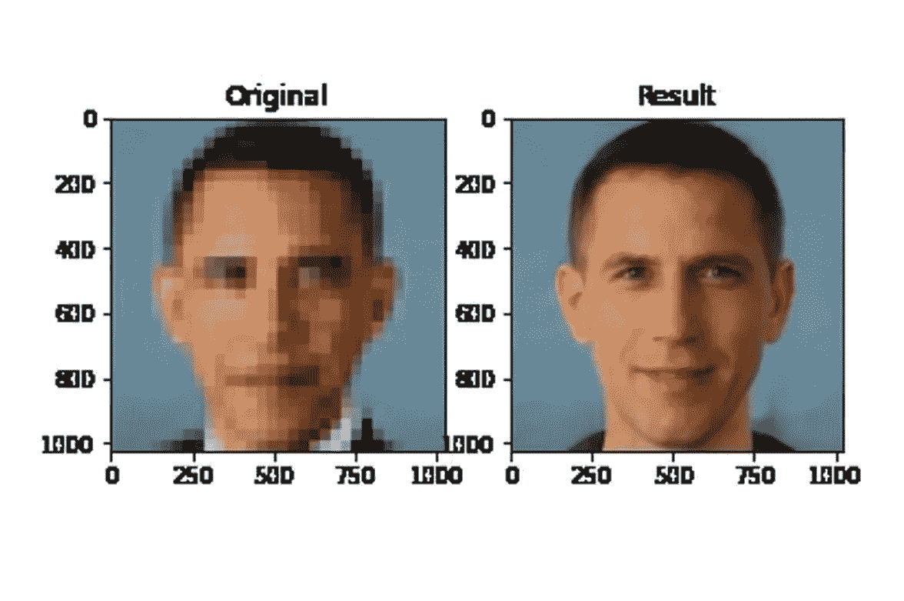

# 人工智能中的偏见:远不止是一个数据问题

> 原文：<https://towardsdatascience.com/bias-in-ai-much-more-than-a-data-problem-de6ef950c848?source=collection_archive---------52----------------------->

## 虽然数据偏差是人工智能不公平的一个众所周知的原因，但它绝对不是唯一的原因。

奥巴马被人工智能上采样为白人，最初作为这条推文的一部分发表:[https://twitter.com/Chicken3gg/status/1274314622447820801?s=20](https://twitter.com/Chicken3gg/status/1274314622447820801?s=20)

在过去的几天里，人工智能社区中有很多关于偏见的讨论，特别是在 Y [ann LeCun](http://yann.lecun.com/) 在这条推文之后加入了对话之后:

关于 PULSE 偏差的原始推文，一种新的照片上采样算法

[PULSE](https://arxiv.org/abs/2003.03808) 是创建这张图像的算法，它通过使用自我监督训练来搜索使用 GAN 生成的高分辨率人工图像的空间，并识别那些缩小到低分辨率图像的图像。该算法很快发现了一个偏差问题:给定著名非白人的下采样(但仍然非常容易识别)图像，该算法仍然对它们进行上采样，以产生白人输出。这是另一个明显的例子:

原始 AOC 照片，降采样图像和脉冲输出。

Lecun 回复了那条推文，声称 ML 系统因为数据的质量而存在偏见。

Yann Lecun 建立了数据偏差和人工智能偏差之间的关系

部分人工智能社区对这条推文做出了反应，声称 Lecun 的声明暗示 ML 系统只有在数据有偏差的情况下才会有偏差。参与对话的最活跃的专家之一是谷歌道德人工智能团队的技术联合负责人 Timnit Gebru。

Timnit Gebru 对 Yann Leccun 推文的回应

我必须承认，跟随那次谈话让我获得了许多关于人工智能伦理主题的有趣资源，尤其是偏见。让我与你分享一些我发现的最有趣的例子:

*   [**计算机视觉中的公平、问责、透明和道德**](https://sites.google.com/view/fatecv-tutorial/schedule) 作者[蒂姆尼特·格布鲁](https://en.wikipedia.org/wiki/Timnit_Gebru)和[艾米丽·丹顿](https://cephaloponderer.com/)。在当前背景下，特别适用于将[视觉计算用于监控目的](https://www.acm.org/binaries/content/assets/public-policy/ustpc-facial-recognition-tech-statement.pdf)。
*   [**我们的数据体项目**](https://www.odbproject.org/) :一个非常小的团体，致力于了解“政府和企业如何收集、存储和共享社区的数字信息”，特别是在边缘化的社区。
*   [**fast.ai 艾伦理资源**](https://www.fast.ai/2018/09/24/ai-ethics-resources/) ，由[瑞秋托马斯](https://www.fast.ai/about/#rachel)编译。一组非常有趣的视频、链接和对人工智能伦理专家和机构的介绍，值得关注。
*   [**关于 AI 系统的政治设计**](https://www.codingrights.org/decolonising-ai-a-transfeminist-approach-to-data-and-social-justice/) ，一篇很有意思的文章，揭穿了 AI 偏差只是由有偏差的数据造成的观点。

我在[迈向数据科学](https://towardsdatascience.com/about-us/home)中的一篇名为“计算机说不”的短文包括了我们在当前公司使用的处理人工智能伦理的框架的高级视图。正如你所看到的，通过人工智能实现真正积极的社会影响和公平有很多需要考虑的问题。

艾弗里斯人工智能伦理框架，版权所有。

我真的很高兴成为新的[斯普林格人工智能和伦理杂志](https://www.springer.com/journal/43681)的创始编委会成员，在这本杂志中，我将有幸与一个[了不起的专家小组](https://www.springer.com/journal/43681/editors)一起详细探讨这个话题。

你有任何你认为与人工智能伦理高度相关的资源吗？我将非常乐意与您合作，定期更新这篇文章。

*如果你喜欢读这篇文章，请* [*考虑成为会员*](https://dpereirapaz.medium.com/membership) *以便在支持我和媒体上的其他作者的同时，获得每个故事的全部信息。*