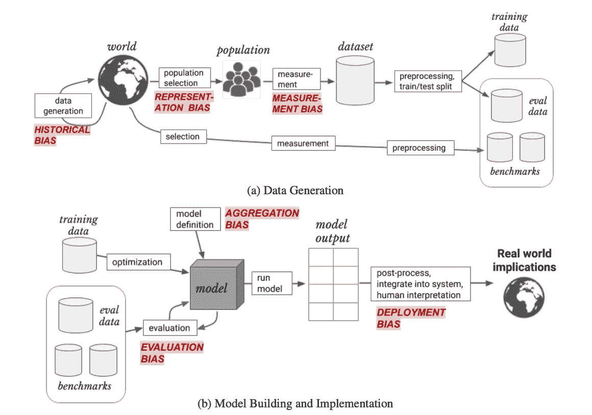

# 机器学习项目中的偏见

> 原文：<https://towardsdatascience.com/bias-in-machine-learning-projects-dbeea0f38466?source=collection_archive---------46----------------------->

## 我们应该害怕机器学习模型做出的自动化决策不公平吗？

(图片由 [Unsplash](https://unsplash.com/s/photos/artificial-intelligence?utm_source=unsplash&utm_medium=referral&utm_content=creditCopyText) 上的 [Deon Black](https://unsplash.com/@deonblack?utm_source=unsplash&utm_medium=referral&utm_content=creditCopyText) 拍摄)

# 引言。

我正在准备一场网上研讨会，在脑海中浮现的众多不同主题中，我在思考哪些主题可能会让我感兴趣。

我认为要成功实现一个机器学习项目，一个人应该真正意识到什么是陷阱，什么是要点，在项目过程中，哪里会犯重要的错误。

一个**关注的领域**肯定是关于偏差的**。为此，我决定投入一些时间，准备以下笔记。**

# 什么是偏见，为什么它很重要？

好吧，先说定义。而我会拿一个来自[维基百科](https://en.wikipedia.org/wiki/Bias):**偏见**是一个不成比例的权重*赞成*或*反对*一个想法或事情，通常是以[思想封闭](https://en.wikipedia.org/wiki/Closed-minded)、[偏见](https://en.wikipedia.org/wiki/Prejudice)或不公平的方式。…人们可能会对某个人、某个团体或某个信仰产生偏见。在科学和工程领域，偏见是一种系统误差。

因此，我们可以从说**偏差是我们的机器学习** (ML)模型中的系统误差开始。

当我们开发一个监督模型时(现在，让我们限制我们对这种类型模型的讨论)，给定一组输入 X = (x1，… xn)我们希望能够预测相关 y 的最可能值。我们认为在 X 和 y 之间存在有意义的关系

> y = f(X)

我们想要训练一个模型，**从一大组例子**开始，其中对于每个样本，我们给出输入值(X)和相应的期望值 y。

该模型使用一些非常通用的算法(例如神经网络)，但它从训练期间使用的数据中学习所有知识。

通常，在模型的开发过程中，可用数据的一部分被分离出来(保留)用于验证模型。在这个阶段，人们通常想要验证模型是否已经学习了可概括的知识。换句话说，如果它在训练阶段对看不见的数据表现良好。但是，在准备将该模型用于生产之前，在真实世界的数据上，应该进行许多测试来验证该模型是正确的。

我们可能会发现，我们的模型倾向于以系统和不合理的方式对一些样本(可能与人相关)给出有利的预测，而对其他样本给出不太有利的预测。如果我们在生产中使用模型之前发现了这个问题，那就太好了。

**一个例子**:让我们想象我们已经开发了一个深度学习模型，可以帮助我们诊断[黑色素瘤](https://en.wikipedia.org/wiki/Melanoma)，使用一部分皮肤的图片作为输入。

基于我们的验证集，看起来我们的模型有很好的准确性(90%？)，但后来我们开始了一项实地评估研究，我们发现这个模型**对深色皮肤的人**不太适用。系统地说，这类人群的错误率更高。我们在模型中发现了一个**偏差**。

毫无疑问，这是我们在某个地方犯的一个错误。但这是一个系统性的错误，而不是随机产生的错误。

我们仔细分析了数据收集过程，发现我们的数据集包含更高比例的皮肤白皙的人。很简单，因为众所周知，这些人暴露在阳光下的风险更高(这是风险因素之一)。添加更多来自深色皮肤人群的病变样本有助于提高该亚人群的准确性，并减少我们模型中的偏差。

这与道德规范，与我们认为的公平或不公平有必然联系吗？

这可能是我们想要回答的一个大问题。但这不是唯一的一个。现在，我们可以说是和不是。

让我试着表达我的第一个想法:每次我们制定一个规则，以某种方式区别对待几组人，我们应该问自己这是否公平。答案并不容易，因为对于什么是公平的，什么是不公平的，并没有一个普遍接受的定义。

公平是无法用数学来衡量的(这并不意味着我们不应该提出这个问题，这意味着答案并不容易)。

但是，这里的问题总是看起来更大，因为我们有一种祖传的恐惧，即计算机迟早会代替我们做决定。在故事的最后，ML 模型是做决策的东西。

# 首先，ML 中偏差的不同来源。

正如在每个科学领域一样，在得出任何结论之前，我们应该收集所有相关的信息(在这个过程中，我们应该不带偏见！).

所以，我们首先应该试着理解偏见从何而来。

ML 模型的开发几乎总是一个漫长的过程，有一系列的步骤。让我们试着做一个总结:

1.  模型应该回答的问题的定义。
2.  数据来源的识别
3.  数据收集
4.  数据提取、转换
5.  培训、验证和测试集的生成
6.  定义我们想要采用的算法类型
7.  算法的训练
8.  对训练模型的评估
9.  模型的部署
10.  证明文件
11.  随时监控模型的性能

嗯，大概这不是总结开发过程的唯一方式。但我认为这是支持我们讨论的好理由。

当我们看上面详细描述的步骤时，我们应该想到在每一个步骤中我们都可能犯错误。而且，这些错误中的一些可能会使我们的模型对样本的一个或多个亚群体产生系统误差。

因此，**没有任何故意的意图，我们可以在我们的模型**中引入偏差。

# 偏见有哪些不同的类型？

正如我们所说，我们可以在 ML 模型开发的不同步骤中引入偏差，因此我们可以有不同类型的偏差。在识别模型中可能的偏差来源的过程中，进行分类有助于指导我们。

**两位研究人员提出了一种有用的分类**，在这篇文章中:“[理解机器学习模型意外后果的框架](https://arxiv.org/pdf/1901.10002.pdf)”(h . Suresh，J. V. Guttag，麻省理工学院，2020 年 2 月)。

在文章中，他们确定了这六个类别:

*   历史偏见
*   表征偏差
*   测量偏差
*   聚集偏差
*   评估偏差
*   部署偏差

前三个涉及数据生成和收集。模型开发中的最后三个。

它们还提供了一个很好的图表，帮助我们将不同的类别与 ML 模型开发中的不同步骤联系起来:

(来源:H:苏雷什，J. V .古塔格，麻省理工学院，2020 年 2 月，[https://arxiv.org/pdf/1901.10002.pdf](https://arxiv.org/pdf/1901.10002.pdf))

我想对上面的图片补充一些考虑。

1.  如你所见，我们有不同的，多种来源的偏见
2.  还有其他引入偏差的方法:例如，当您在训练集和验证集之间拆分可用数据时，如果拆分不正确，您可能会最终在没有正确分布的集上评估和优化模型。或者，您可以从训练中“泄漏”一些信息到验证集，并测量您在现实中找不到的准确性

综上所述，我们必须仔细检查整个过程，以避免偏见。多重测试和测试越来越多的数据是有帮助的，正如我个人的建议，拥有一个拥有不同领域专业知识和背景的团队也是有帮助的。

# 反馈循环。

与偏差相关的另一个问题是，ML 模型会产生**反馈回路**。

什么是反馈回路？当**模型错误地产生“下一代输入数据”**，放大偏差，或模型本身产生的一些不正确的预测时，就会出现反馈回路。

让我们试着用一个(有点真实的)例子来解释:想象一下**一群人要宣传一个“假理论”**。他们制作了一个精美的视频来解释他们的理论。然后，他们在一个社交媒体上发布这个视频，推荐系统只基于用户的评分。这个组的所有人都给这个视频很高的评价。

**推荐引擎**基于这些评级，将开始向其他人推荐该视频，如果这些人给出更多积极的评级，就有可能开始一个积极的循环，越来越多的人将会看到该视频。

嗯，这个问题不是不真实的。例如，过去曾有文章暗示，YouTube**引擎创造了这种东西。我们都知道关于其他社交媒体是否会导致假新闻或仇恨言论传播增加的争论。**

一个例子来自《纽约时报》的文章:“(T12)YouTube 掀起了一股阴谋论热潮。能遏制吗？”。

在 [arXiv](https://arxiv.org/pdf/2007.13019.pdf#:~:text=Recommendation%20algorithms%20are%20known%20to,known%20as%20a%20feedback%20loop.) 上可以找到一篇有趣的论文，标题为“**推荐系统中的反馈回路和偏差放大**”。在这种情况下，产生的偏差可以被称为“**流行偏差**”:该模型倾向于根据流行度而不是内在质量来推送项目，这种偏差可以通过诸如协作过滤等算法来放大，如本文中所分析的。

# 模型可解释性。

偏见难以识别的原因之一是**有时 ML 模型被用作(神奇的)黑盒**。你在验证和测试集上验证了模型有足够高的精度，这就可以了。然后，您忽略了您无法解释为什么模型产生一些预测而不是其他预测(例如，为什么模型决定向一个客户提供贷款是高风险的)。

这是有可能发生的，尤其是当你使用有许多层的大型神经网络时。

但是，即使解释起来很复杂，**我们也不应该接受这样的情况**。首先，因为这个模型存在一个真实的风险，它包含了错误和偏见。第二，因为如果模型的使用有社会后果，这是不可接受的。第三，因为题目上可能有一些规定。

ML 的一个活跃研究领域是**模型可解释性**，在过去的几年里，许多技术已经被开发出来，甚至可以用来支持复杂模型的解释。

从一般的观点来看，我们谈论:

*   **一般可解释性**，当我们想大体描述模型如何工作时；例如，什么是最重要的特性，什么不是那么重要
*   **局部可解释性**:我们想要解释为什么模型已经做了一个单一的、特定的预测(例如对一个病人)

一种用于解释甚至复杂的非线性模型的技术是 **LiMe:局部可解释的模型不可知解释**，其中我们用线性模型对模型进行局部近似(局部意味着:围绕特定样本),以识别特征变化对预测的影响。例如，请参见[https://christophm . github . io/interpretable-ml-book/lime . html](https://christophm.github.io/interpretable-ml-book/lime.html)

**最后一句话，**对生活在**欧盟**的人来说很有趣:有些人倾向于错误地断言 **GDPR** 定义了“解释权”。这不是真的，这是一个不能简单裁定的问题。

总的来说，在 GDPR 有一篇文章(第 22 号)是关于完全自动化决策的可能性。如果满足三个条件，本条款适用:

*   有一个完全自动化的决策过程
*   该流程处理个人数据
*   它的目标是评估一个自然人的个人方面

在这种情况下，GDPR 禁止完全自动化的决策过程，如果它产生法律效力或如果它对用户的个性有重大影响。

这并不意味着你不能使用 ML 模型，但是，在上面描述的场景中，这个过程需要人工干预(决策过程不能完全由机器做出)。

此外，GDPR **并未规定“解释权”**。试图向人们解释一个 ML 模型的内部运作是相当困难的，而且在大多数情况下可能是无效的。但它规定了“知情权”和“反对权”。

最后，如果我们在从事 ML 模型开发的人之间交谈，我们有知识和工具来理解为什么一个模型产生一些决策，因此我们不应该接受一个模型被用作“黑箱”，而不理解它如何工作。

# 结论。

现在你可能清楚地了解到，ML 模型中的偏倚风险是一个可以分析的问题，如果不消除，这个问题可以大大减少。

关于“自动化决策”模型的采用有很大的担忧，特别是因为大多数人不理解这些模型是如何工作的，他们担心这些决策有偏见和不公平的风险。

但是，我认为，首先，我们应该将偏差视为一种系统误差:作为数据科学家和 ML 工程师，我们应该尽力避免或减少这种误差。然后，我们不应该把一个模型当作一个“暗箱”,总是试图解释决策和结果，看看它们是否有意义。

显然，我们不应该忘记 ML 模型的结果会产生社会和伦理后果。

然而，这类问题不应阻止我们认真考虑采用人工智能可能带来的巨大好处，即使是在社会领域。

# 更多信息。

如果你想要更多的信息，我会推荐“参考”一节中列出的文章，我已经从中获取了一些信息和图片。

我极力推荐的一本书是参考文献中的那本。第 3 条。这本书的第 3 章由 R. Thomas 博士撰写，包含了对偏见、反馈循环和其他与数据伦理相关的主题的广泛研究。

# 参考文献。

[1]理解机器学习模型的意外后果的框架，H. Suresh，J. V. Guttag，麻省理工学院，【https://arxiv.org/pdf/1901.10002.pd】T2f

[2]m . Mansoury，H. Abdollahpouri，M. Pechenizkiy，B. Mobasher，R. Burke，[https://arxiv . org/pdf/2007.13019 . pdf #:~:text = Recommendation % 20 algorithms % 20 are % 20 know n % 20 to，known % 20 as % 20a % 20 Feedback % 20 Loop](https://arxiv.org/pdf/2007.13019.pdf#:~:text=Recommendation%20algorithms%20are%20known%20to,known%20as%20a%20feedback%20loop)。

[3]fastai & py torch、J. Howards 和 S. Gugger 合著的《程序员的深度学习》，O'Reilly，2020 年。

[4]可解释的机器学习，[https://christophm.github.io/interpretable-ml-book/](https://christophm.github.io/interpretable-ml-book/)

*原载于 2020 年 11 月 9 日*[*https://luigisaeta . it*](https://luigisaetta.it/index.php/machine-learning/52-bias-in-machine-learning-projects)*。*