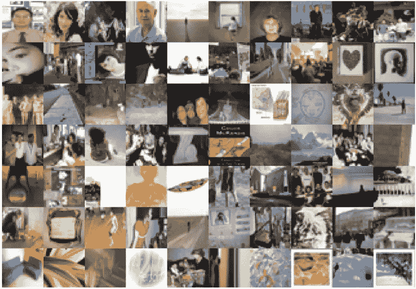

# 自然语言处理中的偏见:一个危险但可以解决的问题

> 原文：<https://towardsdatascience.com/bias-in-natural-language-processing-nlp-a-dangerous-but-fixable-problem-7d01a12cf0f7?source=collection_archive---------19----------------------->

## 自然语言处理(NLP)模型面临的最大新问题之一是它们学习的隐含偏见。

自然语言处理(NLP)是机器学习研究的最大领域之一，尽管当前的语言机器学习模型在许多语言理解任务上实现了数值上的高性能，但它们通常缺乏减少隐式偏差的优化。

马库斯·斯皮斯克在 [Unsplash](https://unsplash.com?utm_source=medium&utm_medium=referral) 上的照片

让我们从头开始。

**机器学习模型中的偏见是什么？**本质上，这是当机器学习算法表达隐含的偏差时，这些偏差在测试过程中经常未被检测到，因为大多数论文测试他们的模型的原始准确性。以下面这些表达性别偏见的深度学习模型为例。根据我们的深度学习模型，

*   “他是医生”比“她是医生”的可能性更高[ [来源](https://www.aclweb.org/anthology/P19-1159.pdf)
*   男人对于女人就像电脑程序员对于家庭主妇一样。[ [来源](https://www.aclweb.org/anthology/P19-1159.pdf) ]
*   有女性名词的句子更能表示愤怒。[ [来源](https://www.aclweb.org/anthology/P19-1159.pdf)
*   翻译“他是一名护士。她是一名医生”变成匈牙利语，再回到英语的结果是“她是一名护士”。他是医生。”[ [来源](https://www.aclweb.org/anthology/P19-1159.pdf)

在这些例子中，该算法本质上是表达刻板印象，这不同于诸如“男人对女人就像国王对王后一样”的例子，因为国王和王后有字面上的性别定义。国王被定义为男性，女王被定义为女性。电脑程序员没有被定义为男性，家庭主妇也没有被定义为女性，所以“男人对女人就像电脑程序员对家庭主妇一样”是有偏见的。

除了性别偏见之外，其他形式的偏见在我们的模型中也很突出。以下是一些其他形式的偏见的例子:

*   根据机器学习模型，黑人对于罪犯就像白人对于警察一样。[ [来源](https://www.aclweb.org/anthology/N19-1062/)
*   根据机器学习模型，合法对于基督教就像恐怖分子对于伊斯兰教一样。[ [来源](/how-biases-in-language-get-perpetuated-by-technology-b4edc5532f3f)
*   非裔美国人写的推文更有可能被人工智能标记为攻击性的。[ [来源](https://www.vox.com/recode/2019/8/15/20806384/social-media-hate-speech-bias-black-african-american-facebook-twitter)

如果你和我一样，你可能会想:*但是如果机器没有情感，它们怎么会有偏见呢？*

关键是机器学习模型在数据中学习**模式**。假设我们的数据倾向于将女性代词放在单词“护士”周围，将男性代词放在单词“医生”周围我们的模型将学习这些模式，并了解护士通常是女性，医生通常是男性。*呜呜*。不是我们自己的错，我们无意中训练我们的模型认为医生是男的，护士是女的。

**那么，如何解决这个问题呢？**像许多问题一样，自然语言处理中的偏见可以在早期或晚期解决。在这种情况下，早期阶段将对数据集进行去偏置，后期阶段将对模型进行去偏置。

流行的计算机视觉数据集 Tiny Images 在发现该数据集充满社会偏见后被撤回。图片来自(Torralba 等人，2008 年)。

**解决方案 A:去偏数据集。**为了取得成功，我们首先必须删除包含偏见的现有数据集。例如，麻省理工学院最近撤销了一个名为 Tiny Images 的流行计算机视觉数据集，因为它充满了社会偏见，包括种族主义，厌恶女性和贬低的标签。这并不意味着我们不能使用这些数据集，但这意味着我们应该删除它们并编辑它们以解决偏见。类似地，必须检查新的数据集以考虑偏差。到目前为止，对 debias 数据集最一致的方法是使数据集多样化。例如，如果数据集始终将女性代词放在单词“护士”周围，则可以通过添加护士是男性的数据来消除偏见。

**解决方案 B:去偏模型。**这是通过修改单词的实际矢量表示来实现的。例如，[硬 Debias 算法](https://arxiv.org/abs/1607.06520)和[双硬 Debias 算法](https://arxiv.org/pdf/2005.00965.pdf)修改向量表示以移除定型信息(例如“接待员”和“女性”之间的联系)，同时保留有用的性别信息(例如“女王”和“女性”之间的联系)。这些算法显示了有希望的结果，并且肯定是解决 NLP 偏差的好的一步。

我们还有时间解决偏见吗？尽管 NLP 作为一个领域发展迅速，但解决 NLP 模型中的偏见永远不会太迟。然而，无论我们如何解决这些偏见问题，我们仍然必须尽可能早地解决它们，最好是在模型达到真实世界设置之前。这是一个没有抓住偏见的例子，一个有偏见的模型最终被应用到现实世界，并产生了巨大的影响:

COMPAS 是一个在各州使用的人工智能系统，旨在预测犯罪者是否有可能再次犯罪。然而，该系统被证明对非裔美国人有隐性偏见，预测非裔美国人的假阳性数量是白种人的两倍。因为这种隐含的偏见在系统部署之前没有被发现，许多非裔美国人被不公平和不正确地预测会再次犯罪。

由[丹尼斯·简斯](https://unsplash.com/@dmjdenise?utm_source=medium&utm_medium=referral)在 [Unsplash](https://unsplash.com?utm_source=medium&utm_medium=referral) 上拍摄的照片

COMPAS 是一个帮助执法部门识别低风险和高风险罪犯的人工智能，结果证明它对非洲裔美国人有明显的偏见。图片获取自[*ProPublica*](https://www.propublica.org/article/machine-bias-risk-assessments-in-criminal-sentencing)*，发现这些偏见的组织。*

NLP 中的偏见是一个必须尽快解决的紧迫问题。让有偏见的模型进入现实世界的后果是巨大的，好消息是解决 NLP 偏见的方法的研究正在迅速增加。希望通过足够的努力，我们可以确保深度学习模型可以避免隐含偏见的陷阱，并确保机器能够做出公平的决定。

延伸阅读:

*   [这组研究人员有一堆关于 NLP 中偏见的论文。](http://web.cs.ucla.edu/~kwchang/publications_area/)
*   [ProPublica 关于 COMPAS 系统中的偏见的完整文章。](https://www.propublica.org/article/machine-bias-risk-assessments-in-criminal-sentencing)