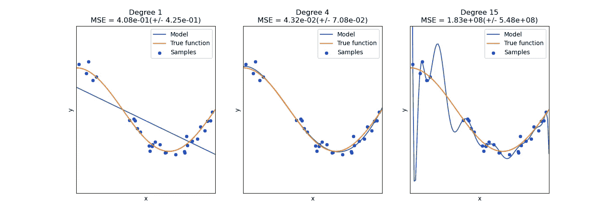
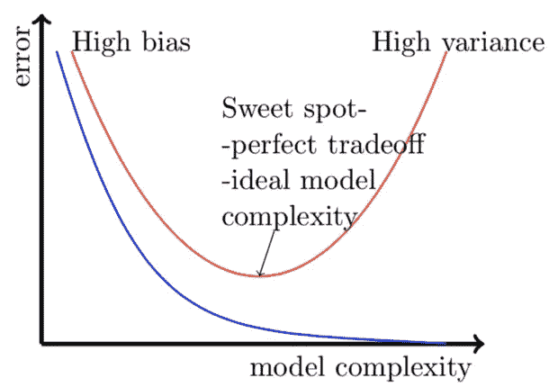

# 偏差、方差以及它们与欠拟合、过拟合的关系

> 原文：<https://towardsdatascience.com/bias-variance-and-how-they-are-related-to-underfitting-overfitting-4809aed98b79?source=collection_archive---------9----------------------->

## 我在学习一门课程时遇到了偏差、方差、欠拟合和过拟合这些术语。这些条款似乎令人望而生畏，网上的文章也无济于事。尽管与它们相关的概念很复杂，但术语本身却很简单。下面我将以一种易于理解的方式给出上述术语和偏差-方差权衡的简要概述。


艾萨克·史密斯在 [Unsplash](https://unsplash.com/s/photos/ml-graph?utm_source=unsplash&utm_medium=referral&utm_content=creditCopyText) 上拍摄的照片

假设您有一个分类模型、训练数据和测试数据

```
x_train , y_train // This is the training data
x_test , y_test // This is the testing data
y_predicted // the values predicted by the model given an input
```

误差率是模型预测值与正确值的平均误差。

# 偏见

假设我们已经对模型进行了训练，并尝试使用输入“x_train”来预测值。预测值为 y_predicted。偏差是 y_predicted 和 y_train 的误差率。

> 简而言之，可以将偏差视为训练数据的错误率。

当错误率高时，我们称之为高偏差，当错误率低时，我们称之为低偏差

# 差异

假设我们已经对模型进行了训练，这次我们尝试使用输入“x_test”来预测值。同样，预测值是 y_predicted。方差是 y _ 预测和 y _ 测试的误差率

> 简单地说，把方差看作是测试数据的错误率。

当错误率高时，我们称之为高方差，当错误率低时，我们称之为低方差

# 欠拟合

当模型在训练数据中具有高错误率时，我们可以说该模型是欠拟合的。这通常发生在训练样本数量过低的时候。由于我们的模型在训练数据上表现不佳，因此在测试数据上也表现不佳。

因此，训练数据中的高错误率意味着高偏差

> 简单地说，高偏差意味着拟合不足

# 过度拟合

当模型在训练数据中的错误率较低，但在测试数据中的错误率较高时，我们可以说模型过拟合。这通常发生在当训练样本的数量太高或者超参数已经被调整以在训练数据上产生低错误率时。

想想一个学生，他研究了一组问题，然后进行了一次模拟考试，其中包含了他们所研究的那些问题。他们可能在模拟考试中表现出色，但在包含看不见的问题的真实考试中，他们不一定表现出色。如果学生在模拟考试中得了 95%，但在真实考试中得了 50%，我们可以称之为过度适应。

因此，训练数据中的低错误率意味着低偏差，而测试数据中的高错误率意味着高方差

> 简单地说，低偏差和高方差意味着过度拟合

# 回归中的过度拟合和欠拟合



来源:[https://sci kit-learn . org/stable/auto _ examples/model _ selection/plot _ under fitting _ over fitting . html](https://scikit-learn.org/stable/auto_examples/model_selection/plot_underfitting_overfitting.html)

在第一张图中，我们尝试使用线性方程来拟合数据。这个模型很死板，一点也不灵活。由于线性方程的灵活性低，它不能预测样本(训练数据)，因此错误率高，偏差大，这反过来意味着**欠拟合**。这个模型在看不见的数据上表现不好。

在第二张图中，我们使用了一个 4 次方程。该模型足够灵活，可以正确预测大多数样本，但也足够严格，可以避免过度拟合。在这种情况下，我们的模型将能够在测试数据上做得很好，因此这是一个**理想** **模型**。

在第三张图中，我们使用 15 次方程来预测样本。虽然它能够预测几乎所有的样本，但它有太多的灵活性，将无法在看不见的数据上表现良好。这样一来，它在测试数据时会有很高的错误率。由于它在训练数据中差错率低(低偏倚)，在训练数据中差错率高(高方差)，所以是**过拟合**。

# 分类中的过拟合、欠拟合

假设我们有三个模型(模型 A、模型 B、模型 C ),训练和测试数据的错误率如下。

```
+---------------+---------+---------+---------+
| **  Error Rate**  | **Model A** | **Model B** | **Model C** |
+---------------+---------+---------+---------+
| **Training Data** |   30%   |    6%   |    1%   |
+---------------+---------+---------+---------+
|  **Testing Data** |   45%   |    8%   |   25%   |
+---------------+---------+---------+---------+
```

对于模型 A，训练数据的错误率太高，因此测试数据的错误率也太高。它有一个高偏差和高方差，因此它是欠拟合的。这个模型在看不见的数据上表现不好。

对于模型 B，训练数据的错误率低，测试数据的错误率也低。它具有低偏差和低方差，因此是一个**理想模型**。该模型将在看不见的数据上表现良好。

对于模型 C，训练数据的错误率太低。然而，测试数据的错误率也很高。它具有低偏差和高方差，因此它是**过拟合**。这个模型在看不见的数据上表现不好。

# **偏差-方差权衡**



来源:[https://medium . com/@ prvnk 10/bias-variance-trade off-ebf 13 ADC ea 42](https://medium.com/@prvnk10/bias-variance-tradeoff-ebf13adcea42)

当模型的复杂度太低时，即一个简单的模型，该模型将不能在训练数据或测试数据上很好地执行，因此它是欠拟合的

在最佳点上，该模型在训练数据和测试数据上的错误率较低，因此是理想的模型

随着模型复杂性的增加，该模型在训练数据上表现良好，但在测试数据上表现不佳，因此过拟合

感谢您阅读文章。请让我知道我是否犯了任何错误或有任何误解。总是乐于收到反馈:)

我最近用 WordPress 创建了一个博客，如果你能看看的话，我会很高兴的😃

 [## Python 项目教程-使用这些 Python 项目教程改进您的简历/作品集。

### 使用 Streamlit 共享部署您的机器学习 Web 应用程序在我以前的文章中，我谈到过构建一个…

realpythonproject.com](https://realpythonproject.com/) 

看看我关于准确度、回忆、精确度、F1 分数和混淆矩阵的教程

[](/understanding-accuracy-recall-precision-f1-scores-and-confusion-matrices-561e0f5e328c) [## 理解准确性、回忆性、精确性、F1 分数和混淆矩阵

### 这篇文章还包括显示你的困惑矩阵的方法

towardsdatascience.com](/understanding-accuracy-recall-precision-f1-scores-and-confusion-matrices-561e0f5e328c) 

在 LinkedIn 上与我联系

[](https://www.linkedin.com/in/rahulbanerjee2699/) [## Rahul baner JEE——产品工程实习生——EY | LinkedIn

### 查看 Rahul Banerjee 在世界上最大的职业社区 LinkedIn 上的个人资料。拉胡尔有 4 个工作列在他们的…

www.linkedin.com](https://www.linkedin.com/in/rahulbanerjee2699/)