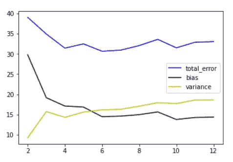
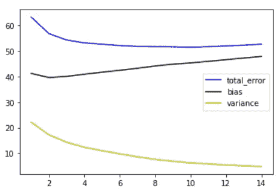

# 偏差方差分解

> 原文：<https://towardsdatascience.com/bias-variance-decomposition-d0e22d1506b1?source=collection_archive---------34----------------------->

## 使用 mlxtend 库演示偏差和方差权衡的实际实现


迈克·冯在 [Unsplash](https://unsplash.com/photos/RvM_tS_C7sE) 上的照片

我们经常想知道如何从一堆机器学习方法中选择一种方法，为给定的数据集提供最好的结果。

> “为特定问题陈述选择具有适当复杂性的最佳模型的过程称为模型选择”

这给我们带来了统计学习方法的一个非常重要的属性，称为偏差方差权衡，它强调模型在训练数据集中学习关联的程度。

在本文中，我们将讨论什么是偏差和方差，以及如何减少它们。最后，我们将实现几个实际的例子来看看这些概念是如何应用于模型构建的。

那么，我们开始吧。

由于偏离实际真相，预测中有 3 种类型的误差:

1.  **不可约误差**
2.  **偏置**
3.  **差异**

不可约误差是对数据中固有噪声的度量。可能总会有一些预测因素对目标变量有一些小的影响，并且不是我们模型的一部分。

因此，无论我们选择多好的模型，它都不能完美地逼近实际函数，从而留下无法减少的误差。

因此，让我们关注我们在构建模型时可以控制的内容，即偏差和方差以及[如何控制](https://en.wikipedia.org/wiki/Bias%E2%80%93variance_tradeoff)。

为此，我们将使用' mlxtend '库(由 Sebastian Raschka 开发)来计算 ['bias_variance_decomp'](http://rasbt.github.io/mlxtend/user_guide/evaluate/bias_variance_decomp/) 。

## **偏差:**

偏差是指当模型学习的近似函数对于非常复杂的问题来说微不足道时的误差，从而忽略了预测器和目标之间的结构关系。

高偏差导致拟合不足和较高的训练误差。可以通过向模型增加更多信号来减少，即，如果我们可以添加更好地描述与目标变量关联的特征。

让我们看下面的例子:

我们假设好像所有的特性都不能立刻可用，并按照其贡献的顺序(来自 df_feat)一次引入一个特性。从下面的图表可以明显看出，以较高的方差为代价，偏差显著下降



添加功能以降低偏差

但是如果我们在模型中已经有了全面的特征，也就是说，没有从商业知识中引入额外的特征，但是偏差仍然很高，该怎么办呢？在这种情况下，我们需要改进建模空间，即使用能够更好地理解数据中结构细微差别的算法。

## **差异:**

方差是模型学习的近似函数在不同训练集之间差异很大的程度。高方差导致过度拟合

当模型的复杂程度增加时，它开始通过学习微小的波动来拟合数据，甚至是随机噪声的程度。

由于模型在训练数据中学习到一些偶然存在的模式，而这些模式并不是数据的真实属性，因此在测试数据中可能不存在类似的模式。这导致较低的训练误差，但是非常高的测试集误差

正则化方法通常用于控制方差。

在上述示例中，我们将 lasso 模型(正则化参数设置为 0.05)中的方差与线性回归中的方差进行了比较，观察到方差减少了 7.5%

```
variance Reduction: -7.53%
At the expense of introducing bias: 5.87%
```

[剪枝](https://en.wikipedia.org/wiki/Decision_tree_pruning#:~:text=Pruning%20is%20a%20technique%20in,by%20the%20reduction%20of%20overfitting.)常用于正则化决策树。

我们观察到通过修剪树，方差减少了 62 %

```
variance Reduction: -62.01%
At the expense of introducing bias: 118.32%
```

让我们看看当我们在 *K 最近邻*算法中增加邻居数量时，偏差和方差会发生什么变化

由于越来越多的邻居决定输出，这导致了具有更低方差和更高偏差的更简单的模型。



高 k 值导致 KNN 中的高偏差和低方差

## **权衡:**

我们看到，为了减少一个误差，我们最终增加了另一个误差，这是不可取的。那么，我们如何减少偏差和方差。是否可以实现？

答案是肯定的！

这两个误差项不以线性方式变化；因此，预测误差取决于两者的相对变化率。

集成和交叉验证是克服偏差方差困境的常用方法。

让我们来看看，与单一决策树相比，随机森林如何在不增加太多偏差的情况下减少 82%的方差

```
variance Reduction: -82.29%
At the expense of introducing bias: 10.73%
```

Jupyter 笔记本可以在[这里](https://github.com/vidhi-am/bias-variance-trade-off/blob/master/Bias%20Variance_decomp.ipynb)找到。