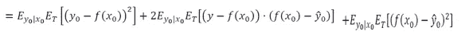
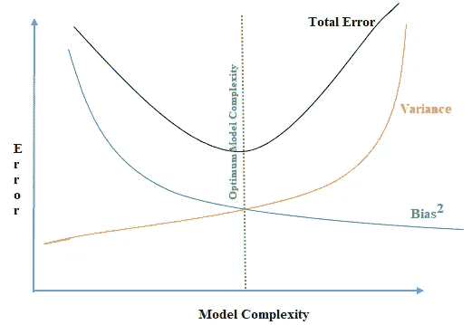

# 偏差-方差权衡:360 度视角

> 原文：<https://towardsdatascience.com/bias-variance-trade-off-a-360-degree-view-86648f69f8?source=collection_archive---------37----------------------->

## 你需要知道的关于偏差、方差和权衡的一切。

[来源](https://www.pxfuel.com/en/free-photo-jract) (pxfuel — royaltyfree)

大多数从事机器学习的人都听过“偏差-方差权衡”这个短语。但我在采访或与 ML 或数据科学工程师讨论时观察到，我们大多数人甚至不清楚上述短语中的偏差和方差是什么意思，忘记理解权衡吧。

在本文中，我将使用两种方法来解释“偏差”、“方差”和“偏差-方差权衡”——**第一种方法将参考日常生活中的例子**进行概念性解释，以便即使没有数据科学或统计背景的普通人也能理解它，**第二种方法将使用一点数学知识**(统计、代数、概率等)。)来强化解释。这两种方法将齐头并进。

# 偏差和方差:

**第一种方法:“普通人！”**

我们将使用著名的牛眼类比来解释偏差和方差这两个术语。

根据资料来源改编的偏差和方差图解:[http://scott.fortmann-roe.com/docs/BiasVariance.html](http://scott.fortmann-roe.com/docs/BiasVariance.html)

让我们假设牛眼(黄点)是我们想要预测的真实值(目标)。我们开始玩(预测)，投了几次飞镖(蓝点)。想象 X 轴和 Y 轴穿过中心，如图所示。每个蓝点将有 x 和 y 坐标；将绿点视为所有蓝点的平均值。通俗地说，我们可以说平均来说，我们击中了绿点。绿点(平均预测值)和黄点(真实值)之间的距离称为“偏差”。

而蓝点(预测)在绿点(预测的平均值)周围的分散程度称为“方差”。

用正式的话来说，

*偏差:估计值的平均值与真实平均值的差异量。*

*方差:预测围绕其均值的预期方差。*

**第二种方法:“数学观”**

让我们在数学和建模的光芒下看看。

假设，一个模型

***y = f(x)+ɛ***

其中“X”是自变量，Y 是目标或因变量。ɛ(ε)是均值为零的随机误差项。

考虑我们要预测' y '的值，f̂(f-hat)代表 f 的估计值，ŷ(y-hat)代表它对应的' y '值。

***ŷ=f̂(x)***

正如我们看到的，y 是 x 和'ɛ'的函数，ŷ的精度取决于 f̂和ɛ.f̂的精度可以提高，因此它被称为“可约误差”,但是由于“ɛ”引起的误差不能被减少，因为它与“x”无关，因此它被称为“不可约误差”。

设，E()代表期望值或平均值。因此，下面的表达式表示实际值和预测值之间的平方差的平均值或期望值

作者照片

我们正在测量预期的预测误差——EPE。如果我们以如下所示的均方误差 MSE 为例。

作者照片

x0 处的 MSE 可以写成:

作者照片

其中“T”是训练数据集。所以，EPE 变成了

作者照片

在很多地方，我们会看到它被直接写成，

作者照片

这是真的，但这个结果是如何得出的，几乎没有人谈论或解释。让我们尝试更深入地了解一下(**可以跳过，但为了更好地理解，建议看一看)如果不感兴趣，请直接跳到“但是取舍在哪里？”**

派生:

作者照片

让我们加上 f(x0)，

作者照片

只是，ŷ0 依赖于“t”训练数据集。因此，我们可以用(a+b) = a +b +2a.b 改写上述等式，如下所示

作者照片

让我们来看第一项，因为它独立于 T，所以可以写成

作者照片

第二个量可以写成

作者照片

这可以进一步分解，如

第一学期，

第二任期，

最后一个学期，

把这些放回到上面的等式中，我们看到，第一项抵消了第三项，第二项抵消了第四项，因此主等式中的中间项= 0。

现在主方程的最后一项，

进一步扩展它，

而且，我们知道

把这个放回我们得到的原始方程中，

如果我们记得，根据偏差和方差的定义

因此，我们得到最终等式——

(作者供图)

# 但是取舍在哪里呢？

正如我们所见，偏差更有可能是由于预测模型或函数的简化——f̂.所以，如果我们增加模型的复杂度，它就会降低。这听起来是一个好主意，增加复杂度，减少偏差，从而减少 EPE，但没有这么快。“差异”中还有另一个术语。

# 权衡:我来了！

从上面的模型中可以明显看出，为了*减少误差，我们需要最小化方差和偏差，*，但是问题是这些术语相对于模型复杂性的相反行为。

让我们举一个 K 近邻的例子来更好地理解它。我假设我们知道 K-最近邻算法，所以不去深入它的细节。

K-nn 插图(作者照片)

但是对于那些不知道的人来说，这个算法的基础是预测一个点的值，我们看它最近的 k 个点，然后取这 k 个最近点的平均值。这意味着成为该点的预测值。例如，如果 k = 2，点‘P6’值可以通过它的邻居 p4、p10 来预测。

**第一招:“庶人！”**

具有 P11 实际值的 K-nn(作者提供照片)

让我们取模型复杂性的两个极端——仅基于“k”的值，看看它对偏差和方差的影响。我们有一个实际值为 5.8(蓝色)的新点“p11”，我们想预测它的值。

先说最简单的模型 K=10。

总共有 10 个点，因此‘p11’的值将是所有点的平均值，如下图*绿色‘p11’*所示。

K=10 的 K-nn(最简单的模型)(作者供图)

直观上，我们可以看到考虑所有的点是不好的。如果我们有 3 岁或 5 岁的数据，那么在预测 30 岁左右的人的价值时考虑这些数据是没有意义的。让我们看看偏差和方差有什么说法！

*偏差:我们可以直接看到这里的偏差非常高(记住偏差的定义)。*

*方差:假设点“11”在年龄= 40 时，即使在给定模型下，11 的预测值也不会改变，因为我们考虑了所有的点。所以这是方差= 0 的完美场景。*

现在我们取 K = 1。

K = 1 的 K-nn(复杂模型)(作者供图)

*偏差:将点 3 的值作为最接近的值。这里看起来好多了*(我知道不是最好的例子，但你可以考虑另一个例子，如房价和轴是位置和价格)。与距离较远的点相比，距离最近的点更有意义。

*方差:假设点 11 在 32 岁，那么最接近的点应该是 9，因此新的预测值应该与当前值有很大不同。因此，它具有很高的方差。*

此外，直觉上，测量最亲近的人的身高是没有意义的。因此这种模式也是不好的。

最佳点位于两者之间的某个地方，我们考虑足够多的近点，这样我们可以捕捉到邻域中的不同变化，但同时不会捕捉到所有随机的远点或噪声。

我希望在直觉层面上，它有助于理解偏差-方差权衡。现在，让我们转向数学，来真实地了解它。

**第二种方法:“数学观”**

回想一下我们的预期预测误差(EPE)公式，

(作者供图)

对于 K-最近邻，它将变成，

(作者供图)

因此，我们可以看到，增加“K”会减少方差，因为“K”是分母，而偏差会增加。

如果我们绘制偏差、方差和总误差与模型复杂性的关系，我们将得到下图。

偏差方差权衡(最优模型复杂度)(作者提供图片)

因此，我们看到最佳点将是，相对于复杂性的偏差梯度等于相对于复杂性的方差梯度，符号相反。因为如果我们向右移动到这一点，偏差的减少小于方差的增加，这被称为*过拟合，如果你向左移动，反之亦然，这被称为 ***欠拟合*** 。*

*从人类的角度来看，我总是喜欢将过度拟合与孩子记忆教科书中给出的数学解决方案但不理解它联系起来——因此，如果问题来自教科书(训练数据集)，他/她可以完美地回答，但如果问题来自外部(看不见的测试数据集)，他/她就不会表现得那么好。同时，如果你没有学习公式(太基础的模型)，没有解决教科书上的大量问题，你将无法解决教科书上的问题以及测试中的问题，因为你没有足够的知识。最重要的是理解概念，记住基本公式，然后练习。*

*我希望所有这些都有意义，与阅读本文之前相比，偏差-方差及其权衡现在更加清楚了。*

***参考文献:***

*[1]Trevor Hastie、Robert Tibshirani 和 Jerome Friedman，**统计学习的要素:数据挖掘、推理和预测** **(2008)***

*[2]Gareth James，Daniela Witten，Trevor Hastie，和 Robert Tibshirani，**统计学习的介绍及其在 R (2013)** 中的应用*

*[3]Scott Fortman-Roe，[了解偏差-方差权衡(2012)](http://scott.fortmann-roe.com/docs/BiasVariance.html)*