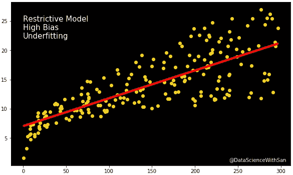
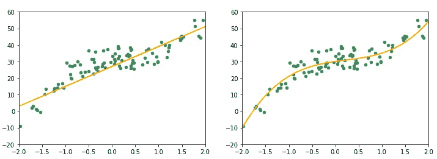
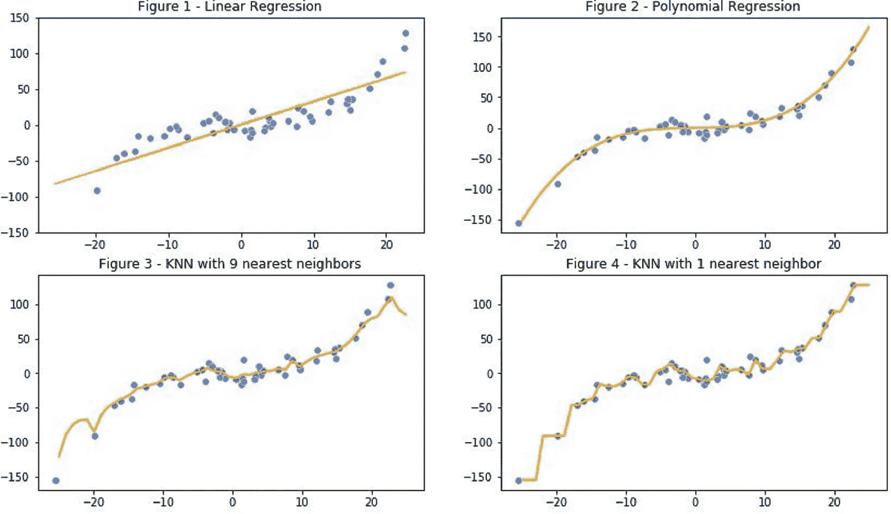
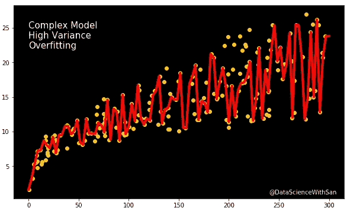

# 偏差-方差权衡

> 原文：<https://towardsdatascience.com/bias-variance-tradeoff-7ca56ba182a?source=collection_archive---------39----------------------->

## 在建立机器学习模型之前，请阅读此内容。

paweczerwi ski 在 [Unsplash](https://unsplash.com?utm_source=medium&utm_medium=referral) 上的照片

一些事实只是在我们的脑海中混乱，然后很难回忆起什么是什么。在回忆偏差和方差之间的差异时，我也有过类似的经历。你在这里的事实表明你也被这些条款弄糊涂了。

所以让我们来理解什么是偏差和方差，什么是偏差-方差权衡，以及它们如何在机器学习中发挥不可避免的作用。

## 偏见

让我问你一个问题。为什么人类会有偏见呢？或者是什么促使他们时不时地表现出一些偏见？

我敢肯定你有一个好答案或许多好答案。但是总结一下，我们看到身边偏见的最根本原因是——*心态的放松。*

作为人类，我们很容易将我们的思想和偏好倾向于我们喜欢的，我们钦佩的，或者我们认为正确的东西，而不会使我们的思想弯曲太多。

对于我们生活中的大部分决定，我们不想让我们的大脑去分析每一个场景。现在，一个人可能会在做重要且有结果的事情时进行调查，一丝不苟，或相当系统化，但在大多数情况下，我们懒得这样做。

但是这种人类的偏见直觉和机器学习有什么关系呢？让我们来了解如何。

考虑下图。

图片来自 [Sangeet Aggarwal](https://medium.com/u/db3258338f2f?source=post_page-----7ca56ba182a--------------------------------)

人们很容易猜测这个数字代表了简单线性回归，这是一个不灵活的模型，假设输入和输出变量之间存在线性关系。这个*假设、近似和限制*将*偏差*引入到这个模型中。

因此*偏差指的是使用简单(或限制性)模型*近似复杂问题时观察到的误差。

人类和机器之间的这种类比可以很好地理解 ***不灵活会带来偏见*** 。

观察下图。这些图代表了用于拟合相同数据的两种不同模型。你认为哪一个会导致更高的偏差？

图片由 [Sangeet Aggarwal](https://medium.com/u/db3258338f2f?source=post_page-----7ca56ba182a--------------------------------)

右边的情节比左边的灵活得多。它与数据更加吻合。另一方面，左边的图表示拟合不佳的模型，该模型假设数据中存在线性关系。这种由于偏高造成的拟合不良也被称为 ***欠拟合*** 。欠拟合会导致较差的性能和较低的精度，如果需要，可以通过使用更灵活的模型来纠正。

让我们总结一下关于偏见的要点:

*   **当使用限制性(不灵活)模型来解决复杂问题时，会引入偏差**
*   **随着模型灵活性的增加，训练数据的偏差开始减小。**
*   **偏差会导致拟合不足，进而导致性能和预测不佳。**

那么如何才能摆脱这种偏见呢？我们可以建立一个更灵活的模型来拟合我们的数据，并消除拟合不足。

那么，我们是否应该继续构建更复杂的模型，直到将误差降至最低？让我们试着用一些随机生成的数据来做这件事。

图片由 [Sangeet Aggarwal](https://medium.com/u/db3258338f2f?source=post_page-----7ca56ba182a--------------------------------)

现在花几秒钟时间观察这些图，看看如何增加我们的模型的复杂性来训练相同的数据，减少偏差和拟合不足，从而减少训练误差。

*   图 1 显示了限制性最强的模型，即我们前面看到的线性模型。这个模型中的偏差肯定是最高的。
*   图 2(多项式回归)是一条更平滑的曲线，进一步减少了训练误差，因此显示出比线性模型更小的偏差。
*   图 3 显示了 K=9 的 K-最近邻(KNN)模型，该模型能够比前两个模型更准确地对数据进行分类。
*   图 4，K=1 的 KNN 模型，密切跟踪数据，几乎没有错误分类任何样本。与所有以前的模型相比，它给出了最少的偏差和欠拟合。

那么，你会选择这四个中的哪一个来解决你的问题呢？

如果你选择了图 4，这是我们很多人都想做的，那么你最有可能遭受 ***高方差的诅咒。***

## 方差

假设你要参加一个你讨厌的科目的考试。你理解这些概念有困难，所以为了通过考试，你决定一个字一个字地学习，而不是真正关心为什么要写，写什么。现在，你可能会在考试前给你的朋友留下深刻印象，如果他问你课本上的同样的问题。但是你很可能会在考试中表现很差，如果万一问题与你预期的不一样，或者如果它们要求你使用一些逻辑而不是记忆。

在机器学习中，当一个模型在训练数据集上表现得如此之好，以至于它几乎记住了每一个结果时，它在运行测试数据集时可能表现得非常糟糕。

这种现象被称为 ***过拟合*** ，通常在构建非常复杂和灵活的模型时观察到。

图片由 [Sangeet Aggarwal](https://medium.com/u/db3258338f2f?source=post_page-----7ca56ba182a--------------------------------) 提供

那么什么是 ***方差*** ？

*方差是我们的模型在不同数据集上进行预测时必须改变的量。*

让我们简化上面的陈述→如果我们用它来估计看不见的数据的输出，我们的模型不应该产生高误差。也就是说，如果模型在训练数据集上显示出好的结果，但是在测试上显示出差的结果，则称其具有**高方差**。

因此，好的模型不是只在训练数据集上表现良好的模型。它应该能够在任何其他数据集上产生良好的结果。这么说吧，你不会想制造一辆只能在班加罗尔街道上行驶良好的自动驾驶汽车，而一旦离开城镇，就会显示太多错误。

因此，构建一个非常复杂的模型可能会以过度拟合为代价。一个人必须明白 ***过多的学习会带来高方差*** 。

让我们来看看关于方差的一些关键点。

*   **方差是模型在对未知数据进行预测时需要改变的量。**
*   **高方差相当于模型过拟合。**
*   线性回归等限制性模型显示低方差，而更复杂、更灵活的模型会引入高方差。

## 困惑

那么我们如何消除偏差和方差呢？看起来解决一个会导致另一个溜进来。

我们看到，限制模型会在训练时导致高偏差和欠拟合。另一方面，增加其灵活性会导致方差和过度拟合。

解决方法是什么？

## 偏差-方差权衡

重要的是要记住，在建立机器学习模型时，一些偏差和一些差异将始终存在。偏差和方差都会增加模型的总误差。

为了最小化可约误差(偏差+方差)，我们必须找到两者之间的最佳点，偏差和方差都有最小可能值。这被称为偏差-方差权衡。这更多的是预测准确性(方差)和模型可解释性(偏差)之间的权衡。

这就是偏差和方差。我希望这篇文章能帮助你理解这些术语。[不断学习应用](https://www.datacamp.com/?tap_a=5644-dce66f&tap_s=910084-843f05&utm_medium=affiliate&utm_source=sangeetaggarwal)。敬请关注。