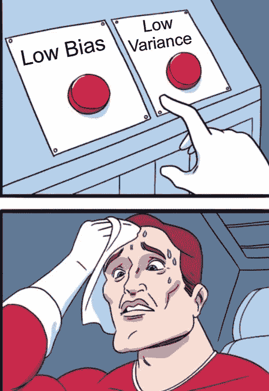
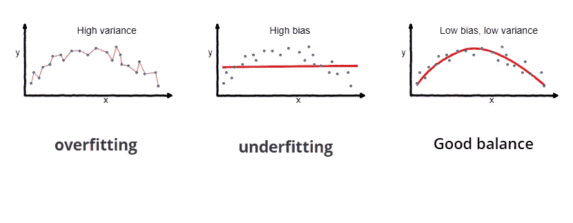
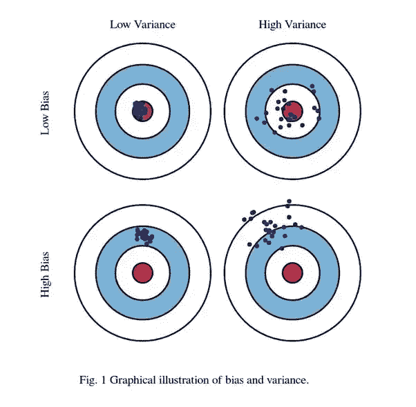

# 偏差-方差权衡如何影响机器学习算法

> 原文：<https://towardsdatascience.com/bias-variance-tradeoff-e8995c42b55b?source=collection_archive---------21----------------------->

## 偏差-方差权衡的直观解释

监督机器学习算法试图根据历史数据预测未来的观察值。在构建模型时，我们理想地想要一个模型，它不仅能准确地捕捉不规则性，还能概括样本外的数据。不幸的是，通常不可能同时做到这两点。当我们试图平衡这两者时，偏差-方差权衡就出现了。理解偏差-方差分解在衡量预测模型性能中的重要性是极其重要的。

简而言之，由于偏差和方差导致的预测误差有助于我们建立一个模型，该模型在训练数据(用于训练模型的数据)和测试数据(模型先前未发现的数据)上表现良好。

# 什么是偏见？

关于反应和预测变量之间真实潜在关系的假设引入了偏差。当我们的假设接近真实关系时，偏差较小。但是如果我们对真实的关系做一个过于简化的假设，就会导致很大的偏差。

我前天写了一份试卷，但我不知道试卷将如何出题。我认为考试会很容易(引入了偏见)。我只是对每一章做了一个概述，假设试卷会有选择题，我会从选项中得到帮助。

原来，这份论文是主观的，有 3 个基于概念的论文问题。猜猜我考试的表现？很糟糕！！

为什么？因为假设它是容易的仍然是好的，但是假设它将是 MCQ 格式引入了高偏差并且导致了差的结果。

我们希望避免对真实模式做出过于简化的假设，以避免高偏差。

线性回归被认为是高偏倚的，因为我们假设真实的关系是线性的。不幸的是，现实世界中的大多数统计关系都不是线性的。但是，由于可解释性，线性回归在某些情况下通常是首选。

# 什么是方差？

如果我们不断给模型提供更多的参数，以便更好地学习训练数据，模型最终也会学习随机噪声。学习随机噪声会降低模型对看不见的数据进行归纳的能力。这会导致过度拟合和高方差。这变得有问题，因为当您使用两个不同的训练集来估计一组参数时，来自这些训练集的参数估计相差很大，从而导致高方差。

我哥哥讨厌数学！！他一步一步地把课本上的所有问题都抢过来了，却没有理解其中的概念。正因为如此，他在他的老师(老师推荐了这本书，并要求学生彻底解决)设置的班级测试中表现出色。然而，期末考试是由一位资深数学教授设计的，没有一个问题是直接从书上来的。你猜怎么着？

他把事情搞砸了！！

上面的例子是一个纯粹的过度拟合的例子。你能很好地学习你所看到的东西，从而表现出色。但是只要纸样稍有变化，你就搞砸了。

下图是实际数据拟合曲线的图示(过度拟合和欠拟合的实例)。蓝点代表观察值，红色曲线是我们估计的 x 和 y 之间的统计关系。

让我们看另一个例子，并尝试更深入地理解这个问题，即偏差和方差如何影响精度和准确度。目标是击中靶心的著名镖靶例子:

> 低偏差、低方差:高精度(击中目标)、高精度(始终如一)
> 
> 低偏差，高方差:高精度(击中目标)，低精度(不一致)
> 
> 高偏差、低方差:低精度(偏离目标)、高精度(始终如一)
> 
> 高偏差、高方差:低准确度(偏离目标)、低精确度(不一致)

机器学习算法面临类似的情况，我们需要在偏差和方差之间进行权衡，以使我们的模型准确和通用。它是关于实现模型可解释性和模型复杂性之间的折衷。像线性回归这样的模型是高度可解释的，而具有更精确结果的神经网络就像一个黑盒。

下面的图表将给出偏差和方差如何影响模型误差的估计。

找到一个最佳模型就是找到正确的平衡。

参考资料:

[1]http://scott.fortmann-roe.com/docs/BiasVariance.html

[2][https://towards data science . com/understanding-the-bias-variance-trade off-165 e 6942 b229](/understanding-the-bias-variance-tradeoff-165e6942b229)

[3][https://www . quora . com/What-is-high-bias-and-high-variance-in-machine-learning-terminals-in-simplely-terms](https://www.quora.com/What-is-high-bias-and-high-variance-in-machine-learning-terminology-in-simplest-terms)