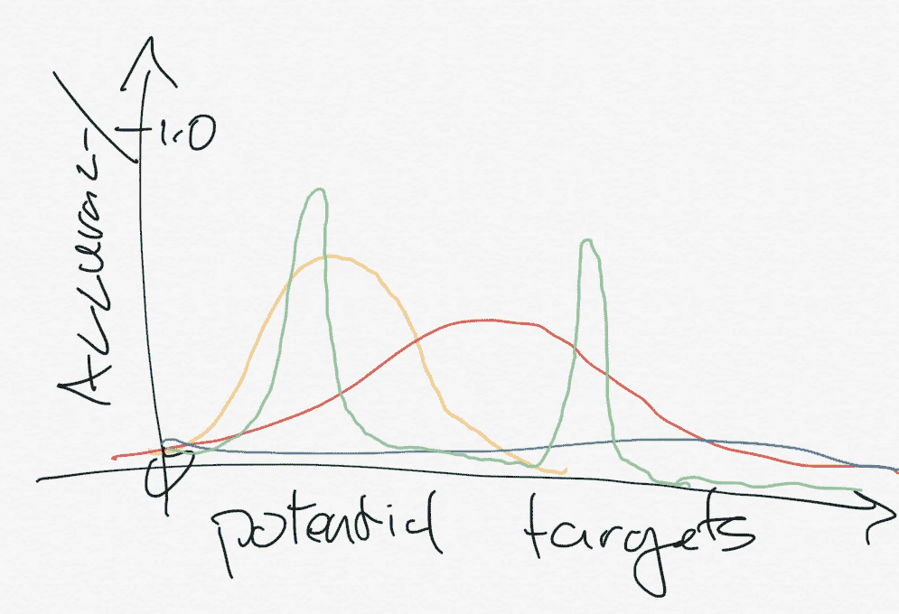
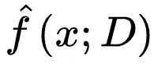
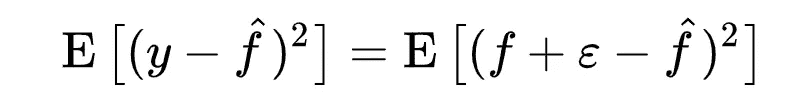
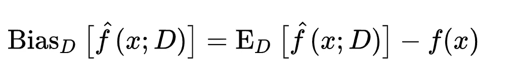
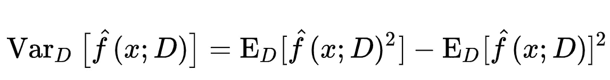
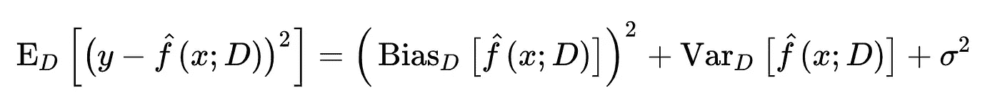
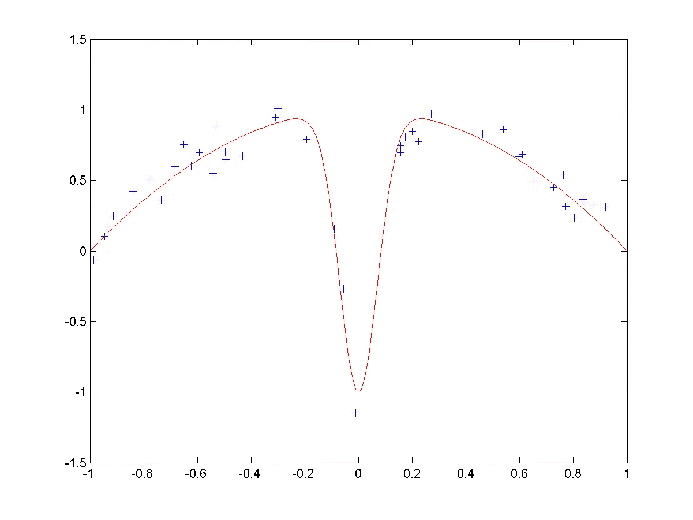
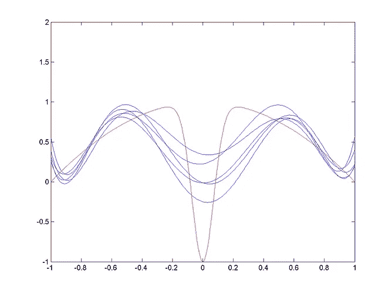
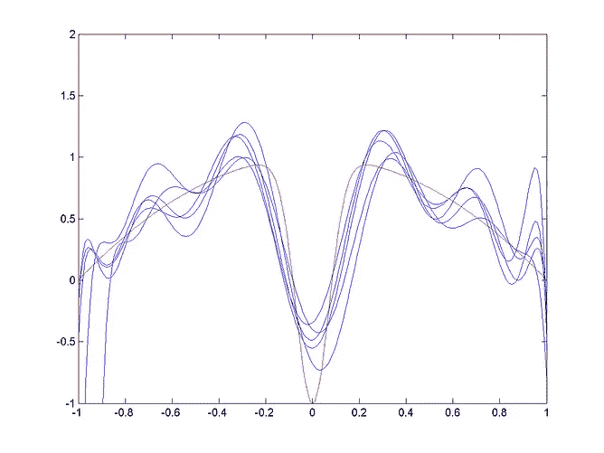
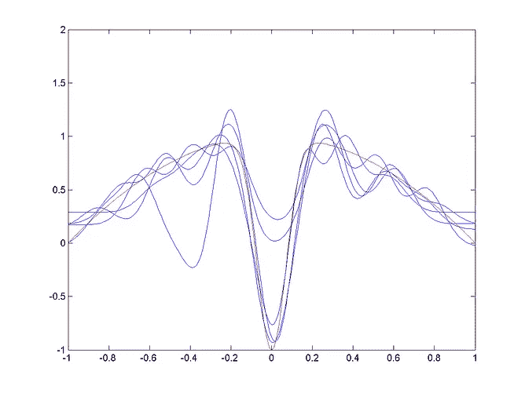

# 偏差-方差权衡-机器学习的基础

> 原文：<https://towardsdatascience.com/bias-variance-tradeoff-fundamentals-of-machine-learning-64467896ae67?source=collection_archive---------37----------------------->

模型容量和预测方差的权衡如何控制机器学习设计？

偏差-方差权衡是机器学习的基本设计决策。这是模型容量和预测方差之间的权衡——所以我们必须决定 ***我们的模型在哪个方面会是错误的*** 。本文将从主题上解释这种权衡如何与**没有免费的午餐**相关，并展示如何从**概率分布**中产生切换。

> 所有的模型都是错的，但有些是有用的——乔治·博克斯

资料来源——作者，哥斯达黎加 Playa Hermosa。

# 没有免费的午餐

每当一个优化、程序或算法在一个感兴趣的领域获得了信息或专门化，它就会在其他地方失去能力。不付出就无法获得任何东西，这一观点就是“没有免费的午餐”定理。这是机器学习主题和偏差-方差权衡的关键思想。

目标空间上的可能分布。没有一个模型可以在任何地方都达到完美的准确性——能力的分布是不同的。从最大到最小的指定顺序是绿色、黄色、红色、蓝色。

## 作为分布的模型准确性

将模型精度映射到目标空间上的[概率密度函数](https://en.wikipedia.org/wiki/Probability_density_function)是一个很好的心理模型。它告诉我们一个事实，任何模型的积分——任何分布——必须等于 1，或者是设计空间中的某个常数。在左边，我已经描绘了不同的模型如何预测目标空间。

## 神经网络的容量

没有免费的午餐定理也适用于神经网络。在这种情况下，当我们有一个容量有限(有限层，神经元)的网络时，我们的预测能力是有限的。**改变设定网络上的训练方法，改变输出的焦点**。一个网络的总容量是有限的，即精度曲线的积分是常数。一个模型可以在一个领域(特定的测试分布)获得准确性，但是在其他领域会失去能力。

在训练网络时，工程师通常会寻求测试误差的最小化，或者何时对未知的预测最准确。**在未知元素上最大化预测是平坦化预测准确度的分布(覆盖范围越大，特异性越低)。**

 [## 搜索和优化领域没有免费的午餐

### 在计算复杂性和最优化中，没有免费的午餐定理是这样一个结果，即对于某些类型…

en.wikipedia.org](https://en.wikipedia.org/wiki/No_free_lunch_in_search_and_optimization) 

设计决策是特异性对普遍性。这在数字上如何继续？

# 偏差方差权衡

同样，有用的机器学习模型的核心是模型的底层结构和下游预测中产生的变化之间的反向权衡。从数字上看，我们引入的这种关系被称为偏差-方差权衡。

## 数字上

预测模型的符号。

如果我们观察预测值“f-hat”对数据集的准确性，就会发现一个有用的等式。考虑模型拟合如何不同于真实数据， *f* ，加上噪声，ε — ( *y = f + ε* )。

预测值的平均误差(MSE)。

这里所发生的是通过概率规则和公理，我们推导出数值偏差-方差权衡。首先，模型的偏差和方差的定义。

> 偏差:模型结构与训练集的匹配程度。

偏见模型结构。查看下面的等式，偏差是数据集上模型的平均值与真实值之间的差异。想一想，当对来自未知 *(m，b) y=mx+b* 的噪声数据拟合直线时，我们可以添加偏移或斜率等项，以更接近数据。一个 *y=cx* 或 *y =c* 的模型将远离真实的、始终高的偏置。但是增加像 *y=cx+d+ex* 这样的项可能会降低偏差，但代价是。

> 方差:模型因所用数据的微小变化而改变的程度。

方差在模型中带有不确定性。 *x* 的一个小变化会对预测产生多大的改变？再次考虑最后一个例子。有偏解 *y=cx* 或 *y =c* 会随着 *x* 的扰动而发生非常小的变化。但是，当我们添加高阶项来进一步降低偏差时，方差风险会增加。直观地说，我们可以在方程中看到这一点，因为我们有了新的项，它是期望中模型的平方(左)。*右边的项将一个均值项与方差联系起来，以说明偏移量。*

经过几个步骤(省略)，我们得到了我们想要的方程。这里的推导是[(维基百科)](https://en.wikipedia.org/wiki/Bias%E2%80%93variance_tradeoff#Derivation)。注意，σ是原始函数噪声(ε)的标准差。

偏差方差权衡。

这里发生的是——无论模型如何改变，偏差和方差项将具有相反的关系。在训练数据集 *D* 上有一个误差最小化的点，但是不能保证数据集 100%反映真实世界。

## 一个例子

考虑一个例子，我们试图将数据点拟合到一个模型，source — [Wikipedia](https://en.wikipedia.org/wiki/Bias%E2%80%93variance_tradeoff) 。

采样数据和真实函数。

底层函数(红色)采样时带有噪声。然后，我们想用近似法来拟合采样点。使用[径向基函数](https://en.wikipedia.org/wiki/Radial_basis_functions)构建模型(蓝色，如下)。从左到右，模型获得术语和容量(多行，因为多个[模型在数据](https://en.wikipedia.org/wiki/Cross-validation_(statistics))的不同子集上被训练)。很明显，左边的模型具有更高的偏差——结构相似，但数据点之间的差异很小。向右，方差增加。

不同的模型适合。从左到右，模型中使用的术语越来越多。每个模型在采样点的不同子集上训练。这是偏差-方差权衡的可视化。来源— [维基百科](https://en.wikipedia.org/wiki/Bias%E2%80%93variance_tradeoff)。

模型的这种变化就是偏差方差权衡。

# 含义

机器学习是创造智能代理的科学，这些智能代理从训练分布归纳到新数据。ML 系统做出预测。这种权衡存在于每个部署的系统中，因为真实世界是未知的。作为一名机器学习工程师，重要的是要记住你可能在模型中部署了太多的特异性——特别是如果它可能有挥之不去的道德决策(例如，对群体的偏见)。

更多？订阅我关于机器人、人工智能和社会的时事通讯！

 [## 自动化大众化

### 一个关于机器人和人工智能的博客，让它们对每个人都有益，以及即将到来的自动化浪潮…

robotic.substack.com](https://robotic.substack.com/)