# 机器学习模型中的偏差-方差权衡:一个实例

> 原文：<https://towardsdatascience.com/bias-variance-tradeoff-in-machine-learning-models-a-practical-example-cf02fb95b15d?source=collection_archive---------20----------------------->

## 了解模型误差以及如何改善它。


布雷特·乔丹在 [Unsplash](/s/photos/scale?utm_source=unsplash&utm_medium=referral&utm_content=creditCopyText) 上的照片

在监督机器学习中，目标是建立一个高性能的模型，该模型善于预测手头问题的目标，并且以低偏差和低方差来进行预测。

但是，如果你减少偏差，你最终会增加方差，反之亦然。这就是[偏差-方差权衡](https://en.wikipedia.org/wiki/Bias%E2%80%93variance_tradeoff)发挥作用的地方。

在这篇文章中，我们将研究在机器学习模型的上下文中偏差和方差意味着什么，以及您可以做些什么来最小化它们。

为了建立一个有监督的机器学习模型，你需要一个看起来有点像这样的数据集。

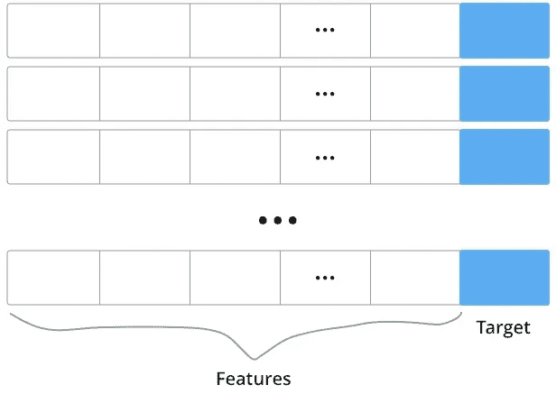

监督学习中使用的数据集结构。

这是一系列的数据记录，每一个都有几个特征和一个目标，就是你要学会预测的东西。但是在开始构建模型之前，您需要将数据集分成两个不同的子集:

*   训练集
*   测试设备

您通常会随机选择 20%的数据记录，并将其作为测试集，剩下 80%的数据集用于训练模型。这通常被称为 80/20 分割，但这只是一个经验法则。

# 对训练和测试集的需求

训练集和测试集有不同的目的。

训练集教导模型如何预测目标值。至于测试集，顾名思义，它用于测试学习的质量，如果模型擅长预测学习过程中使用的数据之外的数据。

> *通过测试集，您将看到该模型是否能将其预测推广到训练数据之外。*

我们可以用以下方法来衡量这个过程中两个阶段(学习和预测)的质量:

*   训练错误，
*   测试误差，也称为泛化误差。

好的模型具有低的训练误差。但是你必须小心，不要把训练误差压得太低，以至于模型过拟合训练数据。当模型过度拟合数据时，它会完美地捕获训练集的模式，从而成为仅预测训练集结果的专家。

乍一看，这听起来很棒，但它有一个缺点。如果模型擅长预测训练集中的目标，它就不太擅长预测其他数据。

# 偏差-方差权衡

为了理解这种权衡，我们首先需要看看模型的误差。在实践中，我们可以将模型误差分成三个不同的部分。

> *模型误差=不可约误差+偏差+方差*

不可约误差与偏差和方差无关。但是后两者是反向相关的，每当你降低偏差，方差就会增加。就像训练误差和测试误差一样。

## **不可约误差**

这个误差是建立模型的机器学习工程师无法控制的。这是由数据中的噪声、不代表数据中真实模式的随机变化或尚未作为特征捕获的变量的影响所导致的错误。

减少这类错误的一种方法是识别对我们正在建模的问题有影响的变量，并将它们转化为特征。

## **偏置**

偏差是指捕捉数据集中真实模式的能力。

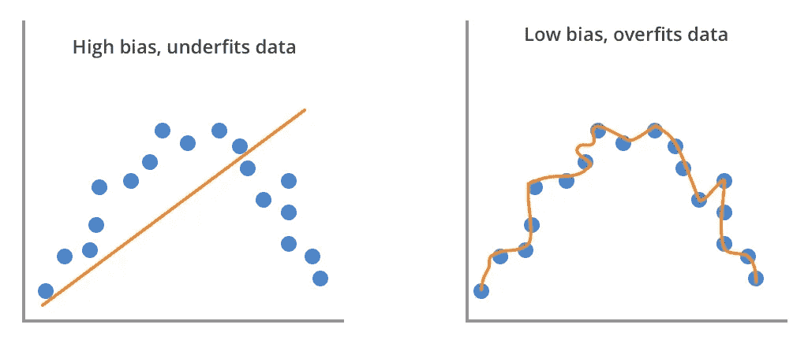

简单模型(左)与复杂模型(右)的偏差。

它在数学上表示为预期的预测目标值和真实目标值之间的平方差。

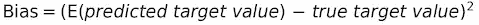

所以，当你有一个无偏的模型时，你知道平均预测值和真实值之间的差异是零。并且它被平方以更重地惩罚离目标的真实值更远的预测。

具有高偏差的模型会使数据欠拟合。换句话说，它将采用一种简单化的方法来模拟数据中的真实模式。

但是一个低偏差的模型比它应该的更复杂。它会过度适应它用来学习的数据，因为它会尽可能多地捕捉细节。因此，除了训练数据之外，它在概括方面做得很差。

你可以通过观察训练误差来发现偏差。当模型具有高训练误差时，这是高偏差的迹象。

为了控制偏差，您可以添加更多的特征并构建更复杂的模型，始终在数据的欠拟合和过拟合之间找到平衡。

## **差异**

方差捕获每个数据记录的预测范围。

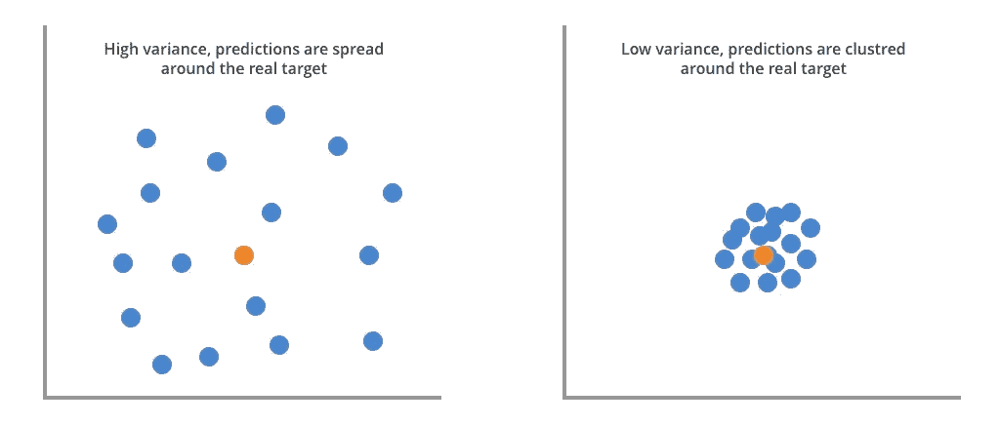

具有高(左)和低(右)方差的模型中的预测范围。

这是一个衡量每个预测与该测试集记录的所有预测的平均值相差多远的指标。并且它也被平方以惩罚离目标的平均预测更远的预测。

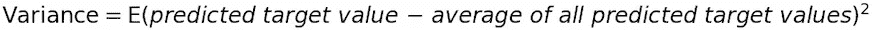

即使您构建的每个模型输出的预测值略有不同，您也不希望这些预测值的范围很大。

您还可以通过查看测试误差来发现模型中的差异。当模型具有高测试误差时，这是高方差的标志。

减少差异的一种方法是使用更多的训练数据来构建模型。该模型将有更多的实例可供学习，并提高其概括预测的能力。

例如，如果无法用更多的训练数据构建模型，您可以构建一个包含[bootstrap aggregation](https://en.wikipedia.org/wiki/Bootstrap_aggregating)的模型，通常称为 bagging。

降低方差的其他方法包括减少特征的数量，使用特征选择技术，以及使用像[主成分分析](/principal-component-analysis-algorithm-in-real-life-discovering-patterns-in-a-real-estate-dataset-18134c57ffe7)这样的技术来降低数据集的维度。

# **现在让我们看看这是怎么回事**

我创建了一个随机数据集，它遵循系数为-5，-3，10 和 2.5 的四次多项式，从最高到最低。

因为我们要用模型来拟合这些数据，所以我把它分成了训练集和测试集。训练数据是这样的。

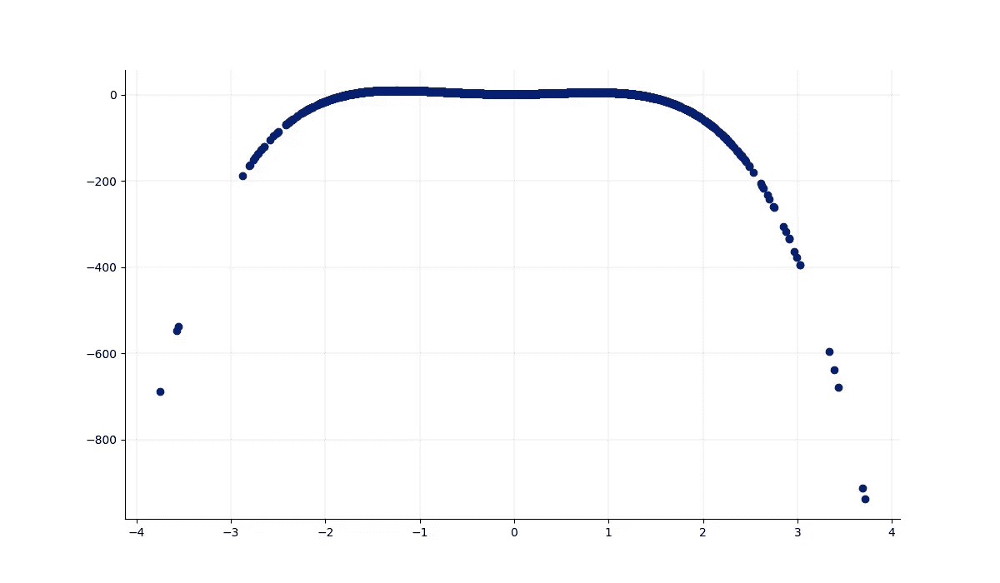

从随机数据生成的四次多项式的训练集。

```
dataset_size = 5000# Generate a random dataset and that follows a quadratic distribution
random_x = np.random.randn(dataset_size)
random_y = ((-5 * random_x ** 4) + (-3 * random_x ** 3) + 10 * random_x ** 2 + 2.5 ** random_x + 0.5).reshape(dataset_size, 1)# Hold out 20% of the dataset for training
test_size = int(np.round(dataset_size * 0.2, 0))# Split dataset into training and testing sets
x_train = random_x[:-test_size]
y_train = random_y[:-test_size]x_test = random_x[-test_size:]
y_test = random_y[-test_size:] # Plot the training set data
fig, ax = plt.subplots(figsize=(12, 7))# removing to and right border
ax.spines['top'].set_visible(False)
ax.spines['right'].set_visible(False)# adding major gridlines
ax.grid(color='grey', linestyle='-', linewidth=0.25, alpha=0.5)
ax.scatter(x_train, y_train, color='#021E73’)plt.show()
```

我们可以从检查模型的复杂性如何影响偏差开始。

我们将从简单的线性回归开始，逐步用更复杂的模型来拟合这些数据。

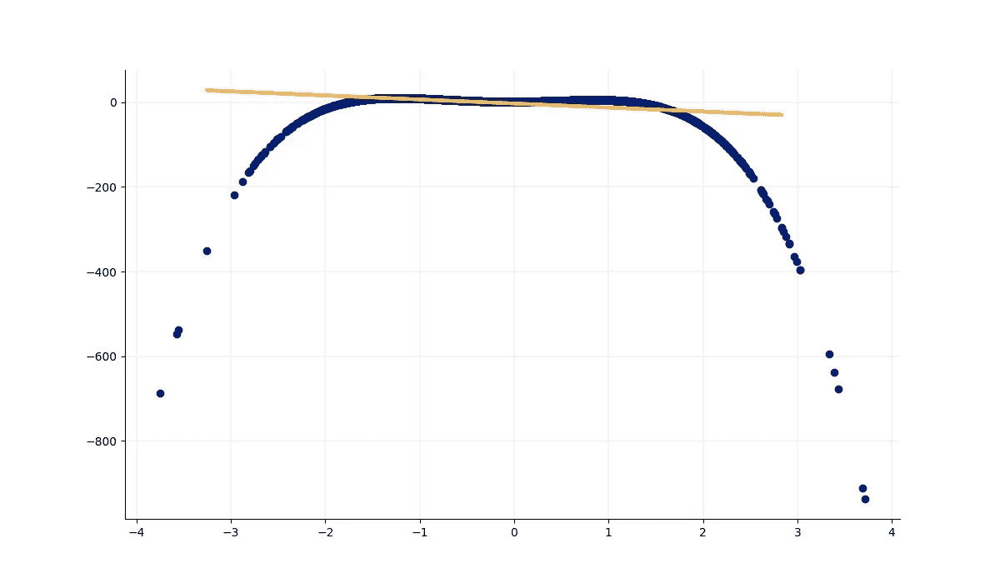

适合训练数据的简单线性回归模型。

```
# Fit model
# A first degree polynomial is the same as a simple regression linelinear_regression_model = np.polyfit(x_train, y_train, deg=1)# Predicting values for the test set
linear_model_predictions = np.polyval(linear_regression_model, x_test) # Plot linear regression line
fig, ax = plt.subplots(figsize=(12, 7))# removing to and right border
ax.spines['top'].set_visible(False)
ax.spines['right'].set_visible(False)# adding major gridlines
ax.grid(color='grey', linestyle='-', linewidth=0.25, alpha=0.5)
ax.scatter(random_x, random_y, color='#021E73')plt.plot(x_test, linear_model_predictions, color='#F2B950', linewidth=3)plt.show()
```

这种类型的模型肯定太简单了，它根本不遵循数据的模式。

我们将量化该模型与训练和测试误差的拟合，使用均方误差计算，并查看偏差和方差。

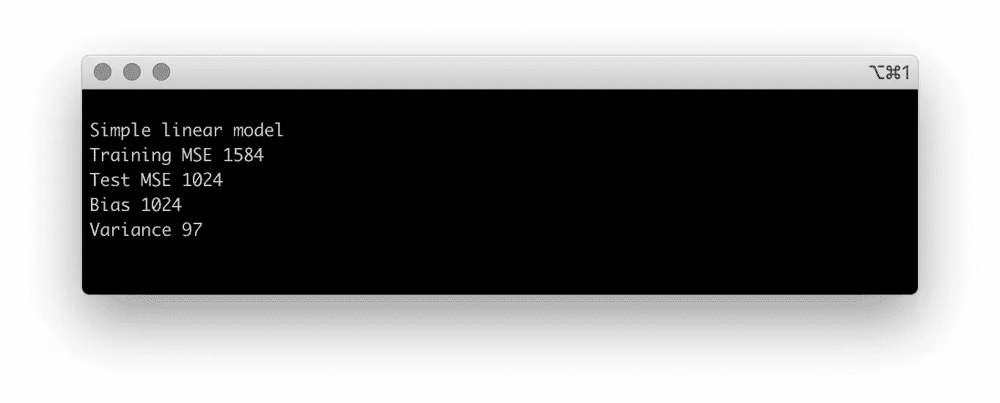

简单线性回归模型的度量。

```
# A few auxiliary methods
def get_bias(predicted_values, true_values):
*""" Calculates model bias****:param*** *predicted_values: values predicted by the model* ***:param*** *true_values: true target values for the data* ***:return****: integer representing the bias of the model**"""*return np.round(np.mean((predicted_values - true_values) ** 2), 0)def get_variance(values):
*""" Calculates variance of an array of values****:param*** *values: array of values* ***:return****: integer representing the variance of the values**"""*return np.round(np.var(values), 0)def get_metrics(target_train, target_test, model_train_predictions, model_test_predictions):*"""
Calculates
1\. Training set MSE
2\. Test set MSE
3\. Bias
4\. Variance* ***:param*** *target_train: target values of the training set* ***:param*** *target_test: target values of the test set* ***:param*** *model_train_predictions: predictions from running training set through the model* ***:param*** *model_test_predictions: predictions from running test set through the model* ***:return****: array with Training set MSE, Test set MSE, Bias and Variance**"""*training_mse = mean_squared_error(target_train, model_train_predictions)test_mse = mean_squared_error(target_test, model_test_predictions)bias = get_bias(model_test_predictions, target_test)variance = get_variance(model_test_predictions) return [training_mse, test_mse, bias, variance]# Fit simple linear regression model
# A first degree polynomial is the same as a simple regression linelinear_regression_model = np.polyfit(x_train, y_train, deg=1)# Predicting values for the test set
linear_model_predictions = np.polyval(linear_regression_model, x_test)# Predicting values for the training set
training_linear_model_predictions = np.polyval(linear_regression_model, x_train)# Calculate for simple linear model
# 1\. Training set MSE
# 2\. Test set MSE
# 3\. Bias
# 4\. Variancelinear_training_mse, linear_test_mse, linear_bias, linear_variance = get_metrics(y_train, y_test, training_linear_model_predictions, linear_model_predictions)print('Simple linear model')
print('Training MSE %0.f' % linear_training_mse)
print('Test MSE %0.f' % linear_test_mse)
print('Bias %0.f' % linear_bias)
print('Variance %0.f' % linear_variance)
```

让我们看看使用复杂模型是否真的有助于降低偏差。我们将对该数据进行二阶多项式拟合。

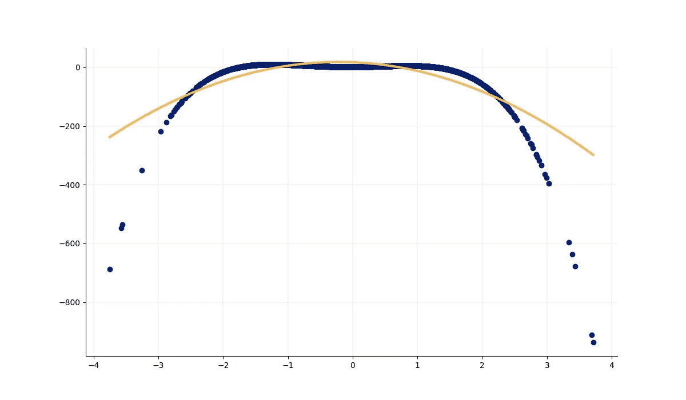

拟合训练数据的二次多项式模型。

二次多项式减少偏差是有意义的，因为它越来越接近数据的真实模式。

我们也看到了偏差和方差之间的反比关系。


二次多项式模型的度量。

```
#############################
# Fit 2nd degree polynomial #
############################## Fit model
polynomial_2nd_model = np.polyfit(x_train, y_train, deg=2) # Used to plot the predictions of the polynomial model and inspect coefficients
p_2nd = np.poly1d(polynomial_2nd_model.reshape(1, 3)[0])
print('Coefficients %s\n' % p_2nd)# Predicting values for the test set
polynomial_2nd_predictions = np.polyval(polynomial_2nd_model, x_test)# Predicting values for the training set
training_polynomial_2nd_predictions = np.polyval(polynomial_2nd_model, x_train)# Calculate for 2nd degree polynomial model
# 1\. Training set MSE
# 2\. Test set MSE
# 3\. Bias
# 4\. Variancepolynomial_2nd_training_mse, polynomial_2nd_test_mse, polynomial_2nd_bias, polynomial_2nd_variance = get_metrics(y_train, y_test, training_polynomial_2nd_predictions, polynomial_2nd_predictions)print('2nd degree polynomial')
print('Training MSE %0.f' % polynomial_2nd_training_mse)
print('Test MSE %0.f' % polynomial_2nd_test_mse)
print('Bias %0.f' % polynomial_2nd_bias)
print('Variance %0.f' % polynomial_2nd_variance)# Plot 2nd degree polynomial
fig, ax = plt.subplots(figsize=(12, 7))# removing to and right border
ax.spines['top'].set_visible(False)
ax.spines['right'].set_visible(False)# Adding major gridlines
ax.grid(color='grey', linestyle='-', linewidth=0.25, alpha=0.5)x_linspace = np.linspace(min(random_x), max(random_x), num=len(polynomial_2nd_predictions))plt.scatter(random_x, random_y, color='#021E73')
plt.plot(x_linspace, p_2nd(x_linspace), '-', color='#F2B950', linewidth=3)plt.show()
```

当我们再次将模型的复杂度增加到三次多项式时，我们看到偏差略有改善。但是方差又增加了。

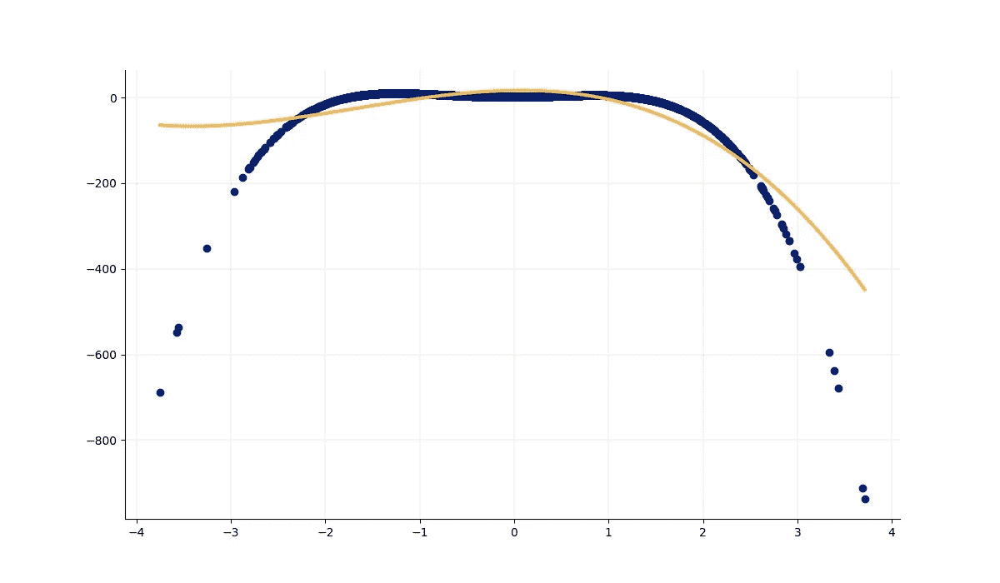

拟合训练数据的三次多项式模型。

剧情变化不大，但是看指标就清楚了。

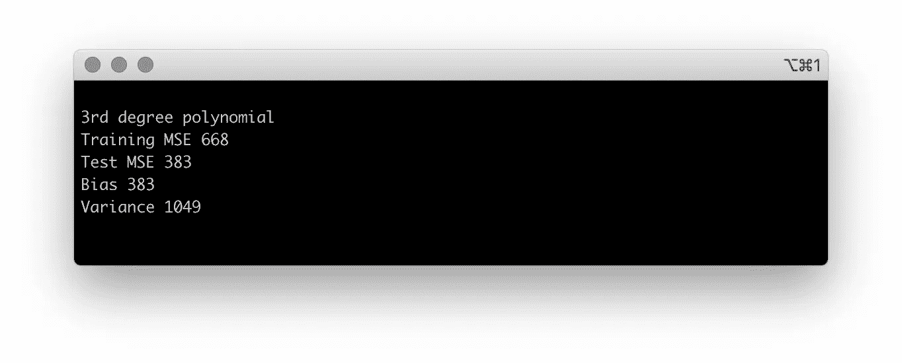

三次多项式模型的度量。

```
#############################
# Fit 3rd degree polynomial #
#############################print('3rd degree polynomial')# Fit model
polynomial_3rd_model = np.polyfit(x_train, y_train, deg=3)# Used to plot the predictions of the polynomial model and inspect coefficientsp_3rd = np.poly1d(polynomial_3rd_model.reshape(1, 4)[0])print('Coefficients %s' % p_3rd)# Predict values for the test set
polynomial_3rd_predictions = np.polyval(polynomial_3rd_model, x_test)# Predict values for the training set
training_polynomial_3rd_predictions = np.polyval(polynomial_3rd_model, x_train)# Calculate for 3rd degree polynomial model
# 1\. Training set MSE
# 2\. Test set MSE
# 3\. Bias
# 4\. Variancepolynomial_3rd_training_mse, polynomial_3rd_test_mse, polynomial_3rd_bias, polynomial_3rd_variance = get_metrics(y_train, y_test, training_polynomial_3rd_predictions, polynomial_3rd_predictions) print('\nTraining MSE %0.f' % polynomial_3rd_training_mse)
print('Test MSE %0.f' % polynomial_3rd_test_mse)
print('Bias %0.f' % polynomial_3rd_bias)
print('Variance %0.f' % polynomial_3rd_variance) # Plot 3rd degree polynomial
fig, ax = plt.subplots(figsize=(12, 7))# removing to and right border
ax.spines['top'].set_visible(False)
ax.spines['right'].set_visible(False)# Adding major gridlines
ax.grid(color='grey', linestyle='-', linewidth=0.25, alpha=0.5)x_linspace = np.linspace(min(random_x), max(random_x), num=len(polynomial_3rd_predictions))
plt.scatter(random_x, random_y, color='#021E73')
plt.plot(x_linspace, p_3rd(x_linspace), '-', color='#F2B950', linewidth=3)plt.show()
```

总结这个实验，我们可以真正看到偏差-方差权衡的作用。随着我们增加模型的复杂性，偏差不断减少，而方差增加。

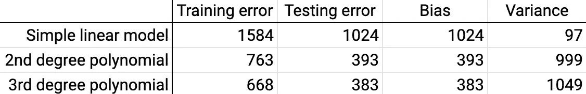

实验结果总结。

希望你在建立机器学习模型时，对偏差和方差的作用有了更好的理解。

*感谢阅读！*