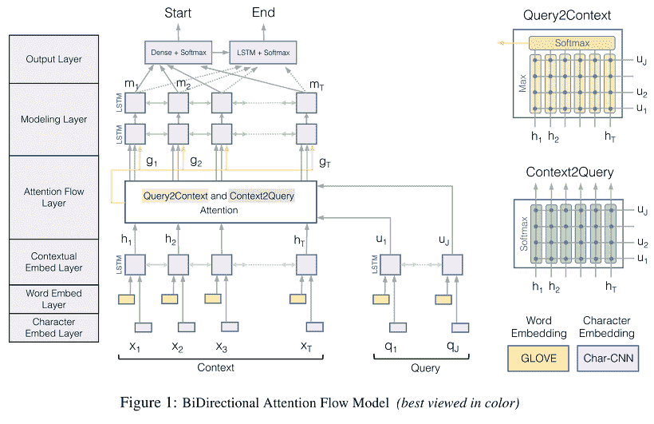
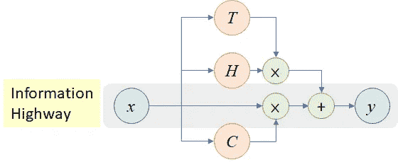
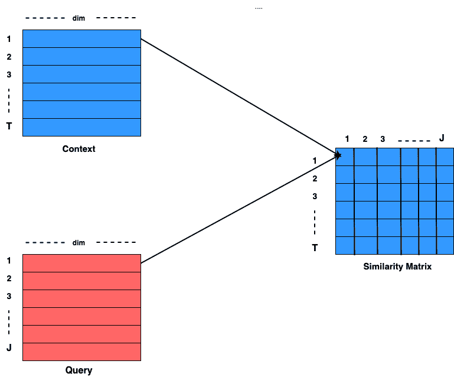
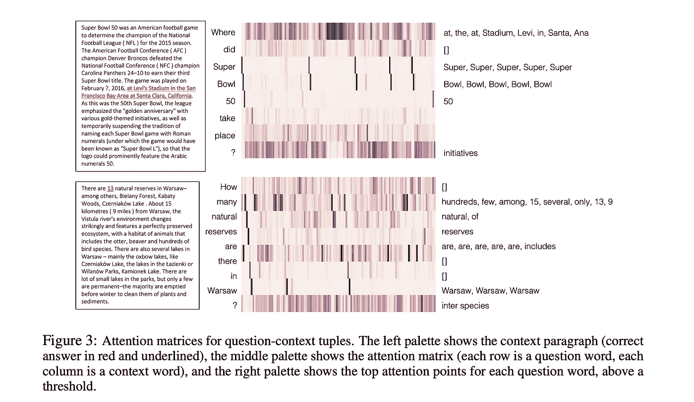
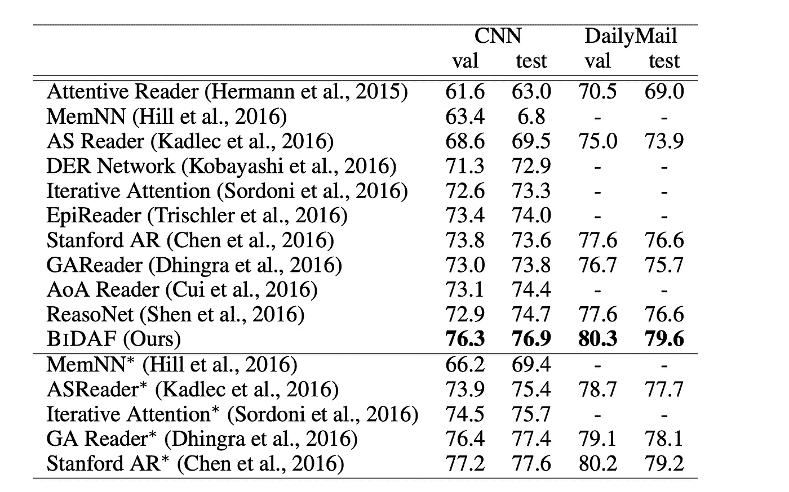

# 机器理解的双向注意流模型

> 原文：<https://towardsdatascience.com/bidirectional-attention-flow-model-for-machine-comprehension-d533f5600007?source=collection_archive---------34----------------------->


使用 BiDAF 回答问题

## 深入研究 BiDAF 模型

问题回答一直是自然语言处理的主要工作领域。我将讨论并实施一篇在质量保证相关问题上表现出色的研究论文的关键要素。那么，我们在问答中做什么呢？给我们一个上下文，并根据该上下文进行查询。模型的任务是找到问题的准确答案。答案可能在上下文中，也可能不在上下文中。如果它存在，那么这个任务可以被公式化为一个分类问题，如果它不存在，那么我们就转向一个更加困难的文本生成问题。但是对于所有这些，我们需要一个好的特征向量，它包含来自上下文和查询的信息以及它们之间的关系。

我将要谈论的论文是 Minjoon Seo 等人的[机器理解的双向注意力流](https://arxiv.org/pdf/1611.01603.pdf)。我们将主要讨论架构的技术部分，并将按顺序实现这些部分。总的来说，这里主要是用较少的文本编写代码。下面给出的是 BiDAF 的架构。



来源:https://allenai.github.io/bi-att-flow/BiDAF.png

如图所示，模型中的文本表示首先使用字符级嵌入层，然后使用单词级嵌入，如 Glove 或 Word2vec。最后，将两种表示连接在一起，得到最终的表示。为了简单起见，我们只能在代码中使用单词级的手套嵌入。

一旦我们获得文本序列中每个单词的向量表示，我们将在双向 LSTM 层中馈送该序列，以获得良好的上下文表示。图中没有显示的一个重要的东西是高速公路网。因为我在以前的博客中没有提到过这个术语，所以在进入实现部分之前，我们将简单讨论一下。

## 公路网络

想象一个具有非常深的结构的网络，包括 NN 层的多个堆叠。使用梯度下降很难优化深度较大的模型。此外，如果使用多个堆栈，由于绝对值小于 1 的变量相乘过多，会出现信息丢失。因此，将模型的深度增加到某一点之后，并不会使之前的结果受益。

受 LSTMs 的启发，提出了高速公路网络，其中使用门控机制将信息直接传播到下一层(因此出现了术语高速公路)。其结构如下所示:



来源:[https://miro . medium . com/max/1120/1 * qHf _ ahv 8 yjjskqok4k S4 jw . png](https://miro.medium.com/max/1120/1*qHf_AHv8yJJsKQok4KS4Jw.png)

引入了一个变换门 T，它只是一个神经网络，后面跟着一个 sigmoid 激活。这意味着变换门将产生一个概率，该概率与当前层的输出相乘，并传播到下一层。线性门，C 无非是 1-T，是与当前层的输入相乘，传入下一层的概率。高速公路网络的一种变体，残差网络，其中 C 和 T 都等于 1，用于微软著名的图像分类模型 ResNet。结果表明，对于复杂问题，现在可以使用高速公路网络建立一个包含数百个图层的模型。

在这篇博客中，我们还将为每个双向 LSTM 使用高速公路网络，以实现强大的信息流。

## 相似矩阵

通常，注意力机制用于概括查询的上下文向量。但是在这里，通过使用上下文和查询表示来计算共享的相似性矩阵，而不是为查询计算单个关注，计算两个方向上的关注，即，上下文 2 查询和查询 2 上下文，以最大化信息增益。相似矩阵是形状为 TxJ 的矩阵，其中 T 是上下文的序列长度，J 是查询的序列长度。这两种关注度都可以通过共享的相似度矩阵来计算。整个计算机制如下图所示:



可以看出，为了计算 S_ij，输入为 C_i 和 Q_j，计算公式如下:

其中[；]是跨行的连接操作，[o]是逐元素的乘法操作，W_ij 是大小为[1×3 * dim]的可训练权重向量。

# 上下文 2 查询和查询 2 上下文注意

Context2Query Attention 表示每个上下文单词在查询句子中的重要单词。这意味着 Context2Query 的形状应该是[TxJ]，这可以通过按行取相似性矩阵的 softmax 来实现:

C2Q = Softmax(S，axis=-1)

有人参与的查询，AQ = C2Q。查询，shape=[Txdim]，[。=矩阵乘法]

Query2Context Attention 表示每个查询单词在上下文句子中最相似的单词。这是通过首先从相似性矩阵中取出最大元素，然后对其应用 softmax 来获得的。因此，最终输出是形状= [Tx1]的概率向量。

参与上下文= Q2C t 上下文，shape=[1xdim]

最终参与上下文，AC = tile(参与上下文，T)，shape = [Txdim]

# 合并操作

该操作用于组合由注意力 C2Q 和 Q2C 获得的信息。合并操作将原始上下文(OC)、参与查询和参与上下文作为输入，并给出如下所示的最终表示:

Merge(OC，AQ，AC)=[OC；AQ；AQ 主管；OC o AC]，其中[；]是按行连接，[o]是按元素乘法。

合并层为我们提供了一个 shape = [T x 4 * dim]的输出，它可以进一步用于输入另一组双向 LSTMs，后跟一个 softmax，以获得答案的开始和结束概率。开始和结束概率是给定段落中答案的开始和结束索引的概率。正如前面所讨论的，只有答案在段落中，开始和结束概率的概念才会起作用。如果没有，我们已经将最终的表示提供给一个解码器，使它成为一个序列生成问题。

喔！我没有遵守我的承诺，保持讨论简短，主要集中在编码部分😀。无论如何，让我们现在做一些 PYTHONING 化的工作(Google 的 Meena 告诉了我这个单词)。

# 相似矩阵

```
**class** **SimilarityMatrix**(keras**.**layers**.**Layer):

    **def** **__init__**(self,dims, ******kwargs):
        self**.**dims **=** dims
        super(SimilarityMatrix, self)**.**__init__(******kwargs)

    **def** **similarity**(self, context, query):
        e **=** context*****query
        c **=** K**.**concatenate([context, query, e], axis**=-**1)
        dot **=** K**.**squeeze(K**.**dot(c, self**.**W), axis**=-**1)
        **return** keras**.**activations**.**linear(dot **+** self**.**b)

    **def** **build**(self, input_shape):
        dimension **=** 3*****self**.**dims
        self**.**W **=** self**.**add_weight(name**=**'Weights',
                                shape**=**(dimension,1),
                                initializer**=**'uniform',
                                trainable**=**True)

        self**.**b **=** self**.**add_weight(name**=**'Biases',
                                shape**=**(),
                                initializer**=**'ones',
                                trainable **=**True)

        super(SimilarityMatrix, self)**.**build(input_shape)

    **def** **call**(self, inputs):
        C, Q **=** inputs
        C_len **=** K**.**shape(C)[1]
        Q_len **=** K**.**shape(Q)[1]
        C_rep **=** K**.**concatenate([[1,1],[Q_len],[1]], 0)
        Q_rep **=** K**.**concatenate([[1],[C_len],[1,1]],0)
        C_repv **=** K**.**tile(K**.**expand_dims(C, axis**=**2),C_rep)
        Q_repv **=** K**.**tile(K**.**expand_dims(Q, axis**=**1), Q_rep)

        **return** self**.**similarity(C_repv, Q_repv)

    **def** **compute_output_shape**(self, input_shape):
        batch_size **=** input_shape[0][0]
        C_len **=** input_shape[0][1]
        Q_len **=** input_shape[1][1]
        **return** (batch_size, C_len, Q_len)

    **def** **get_config**(self):
        cofig **=** super()**.**get_config()
        **return** config
```

# Context2Query 查询注意

```
**class** **Context2QueryAttention**(keras**.**layers**.**Layer):
    **def** **__init__**(self, ******kwargs):
        super(Context2QueryAttention, self)**.**__init__(******kwargs)

    **def** **build**(self, input_shape):
        super(Context2QueryAttention, self)**.**build(input_shape)

    **def** **call**(self, inputs):
        mat,query **=** inputs
        attention **=** keras**.**layers**.**Softmax()(mat)
        **return** K**.**sum(K**.**dot(attention, query), **-**2)

    **def** **compute_output_shape**(self,input_shape):
        mat_shape, query_shape **=** input_shape
        **return** K**.**concatenate([mat_shape[:**-**1],query_shape[**-**1:]])

    **def** **get_config**(self):
        config **=** super()**.**get_config()
        **return** config
```

# 查询 2 上下文

```
**class** **Query2ContextAttention**(keras**.**layers**.**Layer):
    **def** **__init__**(self, ******kwargs):
        super(Query2ContextAttention, self)**.**__init__(******kwargs)

    **def** **build**(self, input_shape):
        super(Query2ContextAttention, self)**.**build(input_shape)

    **def** **call**(self, inputs):
        mat,context **=** inputs
        attention **=** keras**.**layers**.**Softmax()(K**.**max(mat, axis**=-**1))
        prot **=** K**.**expand_dims(K**.**sum(K**.**dot(attention,context),**-**2),1)
        final **=** K**.**tile(prot, [1,K**.**shape(mat)[1],1])
        **return** final

    **def** **compute_output_shape**(self,input_shape):
        mat_shape, cont_shape **=** input_shape
        **return** K**.**concatenate([mat_shape[:**-**1],cont_shape[**-**1:]])

    **def** **get_config**(self):
        config **=** super()**.**get_config()
        **return** config
```

# 大合并

```
**class** **MegaMerge**(keras**.**layers**.**Layer):
    **def** **__init__**(self, ******kwargs):
        super(MegaMerge, self)**.**__init__(******kwargs)

    **def** **build**(self, input_shape):
        super(MegaMerge, self)**.**build(input_shape)

    **def** **call**(self, inputs):
        context, C2Q, Q2C **=** inputs
        CC2Q **=** context*****C2Q
        CQ2C **=** context*****Q2C
        final **=** K**.**concatenate([context, C2Q, CC2Q, CQ2C], axis**=-**1)
        **return** final

    **def** **compute_output_shape**(self, input_shape):
        C_shape,_,_ **=** input_shape
        **return** K**.**concatenate([C_shape[:**-**1], 4*****C_shape[**-**1:]])

    **def** **get_config**(self):
        config **=** super()**.**get_config()
        **return** config
```

# 高速公路

```
**class** **HighwayLSTMs**(keras**.**layers**.**Layer):
    **def** **__init__**(self, dims, ******kwargs):
        self**.**dims **=** dims
        super(HighwayLSTMs, self)**.**__init__(******kwargs)

    **def** **build**(self, input_shape):
        self**.**LSTM **=** keras**.**layers**.**Bidirectional(keras**.**layers**.**LSTM(self**.**dims, return_sequences**=**True))
        super(HighwayLSTMs, self)**.**build(input_shape)

    **def** **call**(self, inputs):
        h **=** self**.**LSTM(inputs)
        flat_inp **=** keras**.**layers**.**Flatten()(inputs)
        trans_prob **=** keras**.**layers**.**Dense(1, activation**=**'softmax')(flat_inp)
        trans_prob **=** K**.**tile(trans_prob, [1,2*****self**.**dims])
        trans_prob **=** keras**.**layers**.**RepeatVector(K**.**shape(inputs)[**-**2])(trans_prob)
        out **=** h **+** trans_prob*****inputs
        **return** out

    **def** **compute_output_shape**(self, input_shape):
        **return** input_shape

    **def** **get_config**(self):
        config **=** super()**.**get_config()
        **return** config
```

现在唯一剩下的事情就是将这些片段应用到一个人的用例中。我希望我没有让你厌烦(当然没有，如果你正在读这一行的话)。

# 结果和结论

我们现在已经讨论了 BiDAF 模型的各个部分的技术方面和实现。现在，让我们通过一个例子来说明这种注意力机制是如何为一个特定的问题找到答案的。



在上图中，给出的方块是两个问题的注意力矩阵可视化。矩阵的每一列表示段落中的上下文单词，而每一行表示问题向量中的单词。块越粗，它的注意力权重就越大。在块 1 中，可以清楚地看到，对于问题中的单词“Where”，给予单词“at，the，stadium，Levi，In，Santa，Ana”更多的权重。甚至它可以把焦点放在问号“？”上这其中涉及到更多的“倡议”二字。

从结果的角度来看，BiDAF 在 SQUAD、CNN/DailyMail 数据集上进行了测试，结果如下:



# **参考文献**

如果你想阅读更多的主题，没有什么比研究论文本身更好的了。

1.  ***比达夫:***[https://arxiv.org/pdf/1611.01603.pdf](https://arxiv.org/pdf/1611.01603.pdf)
2.  ***公路网:***[https://arxiv.org/abs/1505.00387](https://arxiv.org/abs/1505.00387)

我希望你喜欢这个博客，如果你对我有任何建议或者你想联系，你可以点击下面的链接:

***领英:***[https://www.linkedin.com/in/spraphul555/](https://www.linkedin.com/in/spraphul555/)

现在是签名的时候了，

# 不断学习，不断分享

*原载于 2020 年 2 月 8 日*[*https://spraphul . github . io*](https://spraphul.github.io/blog/bidaf)*。*