# 使用机器学习和 PySpark 进行大数据分析

> 原文：<https://towardsdatascience.com/big-data-analyses-with-machine-learning-and-pyspark-135119ef6b31?source=collection_archive---------38----------------------->

## 大数据是一个描述大量数据的术语，包括结构化和非结构化数据。

**简介**

在我们使用机器学习和 PySpark 深入大数据分析之前，我们需要定义机器学习和 PySpark。

先说机器学习。当你在谷歌搜索栏上输入机器学习，你会发现下面的定义:**机器学习是一种数据分析的方法，可以自动建立分析模型。**如果我们更深入地研究机器学习和在线可用的定义，我们可以进一步说，ML 实际上是以数据为基础的人工智能的一个分支，即所有决策过程、识别模式等。，都是由最少的人接触。由于 ML 允许计算机在没有显式编程的情况下找到隐藏的见解，因此它被广泛应用于所有领域来完成这一任务——在数据中找到隐藏的信息。

机器学习和当初一样，什么都不是。它经历了许多发展，正日益变得更受欢迎。它的生命周期分为两个阶段:培训和测试。

接下来是 PySpark MLlib，它实际上是一个机器学习库，可扩展并在分布式系统上工作。在 PySpark MLlib 中，我们可以找到多种机器学习算法(线性回归、分类、聚类等等)的实现。MLlib 自带数据结构——包括密集向量、稀疏向量、局部和分布式向量。库 API 非常用户友好和高效。

**问题**

在我们工作的每个行业中，都有很多很多挑战可以通过使用这些技术来解决。在这个特殊的案例中，我们需要在一个金融机构中进行多种统计计算。一个例子是根据独立变量的数量(例如年龄、余额、持续时间、银行活动)。

如何利用机器学习解决这个问题，最后的结果会是什么？为了展示该解决方案，我们将使用在此[链接](https://www.kaggle.com/rouseguy/bankbalanced/data)上公开的大数据示例。

**解决方案**

逻辑回归是解决方法。这是一种预测分类反应的流行方法，是预测结果概率的广义线性模型的特例。

在开始编码之前，我们需要初始化 Spark 会话并定义文件的结构。之后，我们可以使用 Spark 从 csv 文件中读取数据。我们有一个很大的数据集，但是在这个例子中，我们将使用大约 11，000 条记录的数据集。

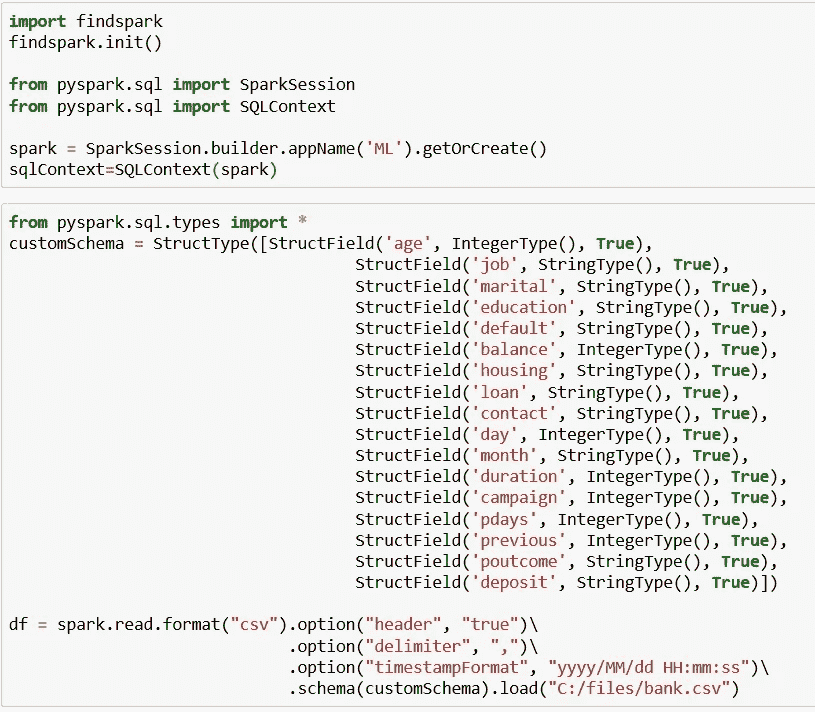

看下面的表格，我们可以看到只有一列(前一列)的最小值等于零(0 ),这个值对于这个例子是不切实际的。

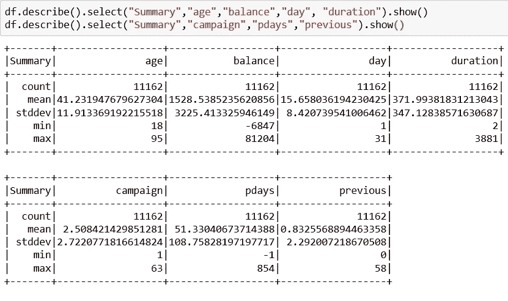

因此，我们将所有的零替换为 Nan。此外，存款字段被定义为一个值为“是”和“否”的字符串，因此我们必须对该字段进行索引。使用字符串索引器，我们将把值从“是”/“否”更改为 1/0。

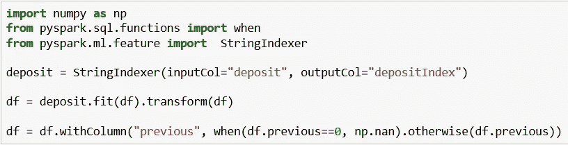

现在，我们可以通过调用一个估算器来简单地估算前一列中的 Nan。估算器使用缺失值所在列的平均值或中值来填补数据集中的缺失值。输入列应该是 Double 或 Float 类型。

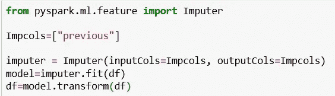

我们还想使用分类字段，所以我们必须将这些字段映射到一列二进制向量，通常只有一个值。然后，我们可以找到变量之间的相关性，并选择我们应该使用哪个变量。因为分类字段是字符串类型，所以我们将使用字符串索引器将一列标签字符串编码为一列标签索引。

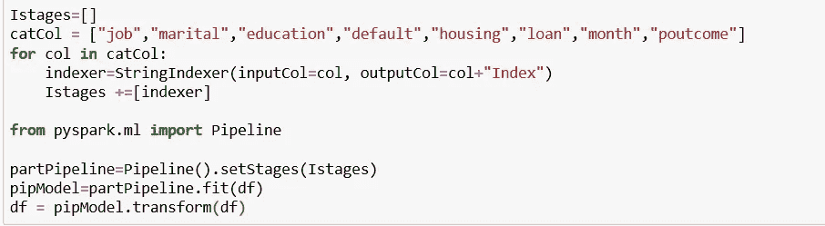

接下来，我们将确定数字特征是否相关(包括索引分类字段)。在下图中，我们可以看到没有高度相关的数值变量。因此，我们将为模型保留所有这些。**注意** : pandas 库仅用于绘图——我们无法使用 pandas 读取大数据文件，但它确实有助于绘图。

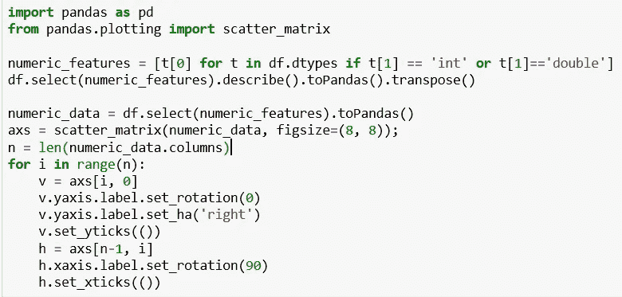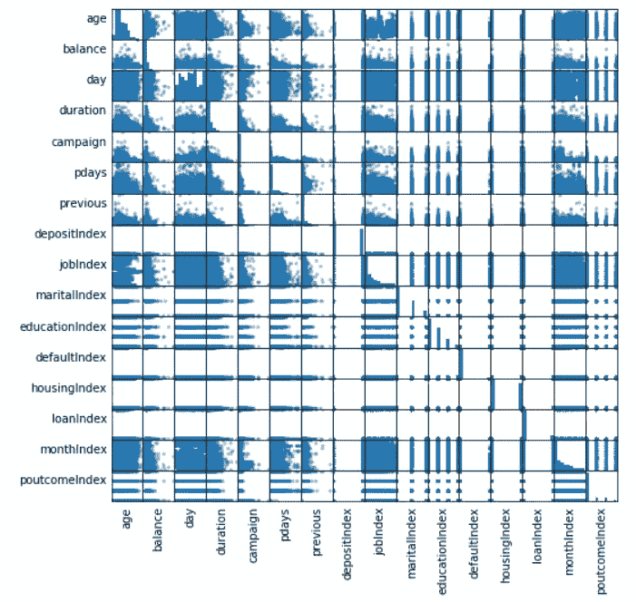

然后，我们将使用独热编码，该编码将分类特征(表示为标签索引)映射到二进制向量，该向量至多具有单个 1 值，该值指示所有特征值集合中特定特征值的存在。在这之后，我们将使用向量组合器，它允许我们将多个向量组合成一个向量，在这种情况下，我们将把带数值字段的向量与带分类字段的向量组合起来，后者现在已被转换。在这之后，我们将使用管道。流水线被指定为一系列阶段，每个阶段或者是转换器或者是估计器。这些阶段按顺序运行，输入数据帧在通过每个阶段时会发生转换。

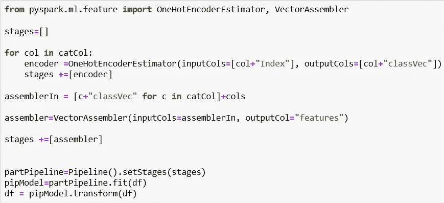

我们已经创建了一个特征向量，现在让我们使用 StandardScaler 对新创建的“feature”列进行标量化。StandardScaler 是一种估计器，可用于数据集以生成 StandardScalerModel。然后，该模型可以将数据集中的矢量列转换为具有单位标准差和/或零均值要素。在我们的例子中，我们使用的是标准差。

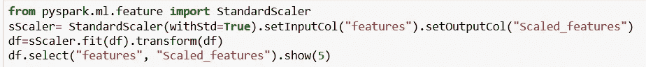

之后，我们将使用随机分割方法来分割测试和训练集中的数据。

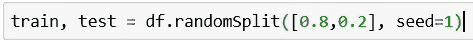

现在，让我们看看数据集中 1 和 0 的百分比。

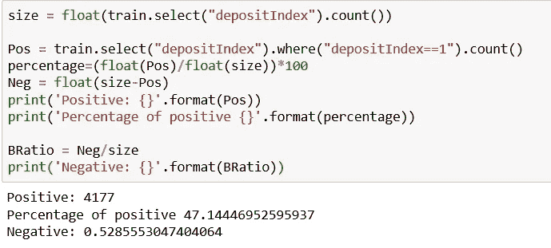

我们可以看到，在我们的数据集(训练)中，我们有 47.14 %的阳性和 52.85 %的阴性。我们的树是平衡的，所以我们可以走了。

接下来，我们将使用 Spark ML 提供的 ChiSqSelector 来选择重要的特性。它对带有分类特征的标记数据进行操作。ChiSqSelector 使用卡方独立性检验来决定从哪些特性中进行选择。我们将使用参数 **fpr** —它选择 p 值低于阈值的所有特征，从而控制选择的假阳性率。

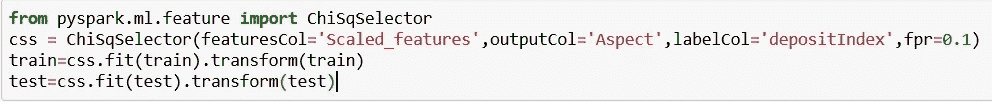

我们将创建逻辑回归模型，并拟合训练集。我们可以在最终结果中看到，哪些客户有存款(1)，哪些没有存款(0)。

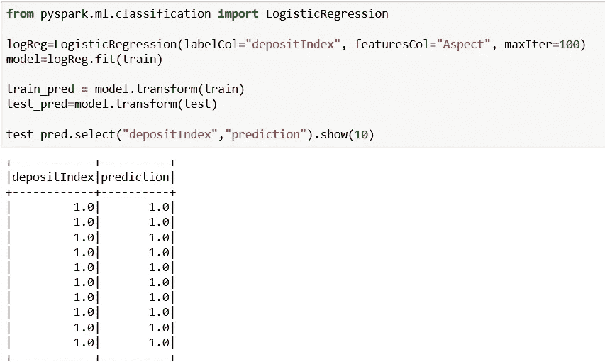

现在让我们使用 Spark ML 中的 BinaryClassificationEvaluator 类来评估模型。默认情况下，BinaryClassificationEvaluator 使用 ROC 下的面积作为性能指标。

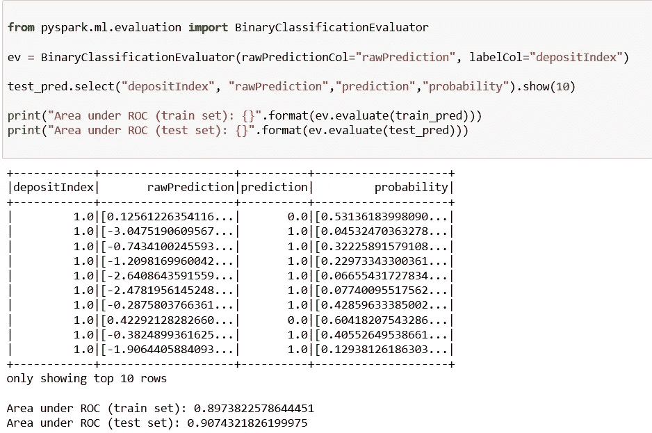

**结果**

在对我们的大型数据集执行逻辑回归后，我们可以得出结果，并确定哪些客户有存款(1)，哪些没有存款(0)。我们还可以看到预测的准确性，在这种情况下，它大约为 0.82。

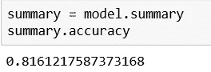

逻辑回归的目的是根据独立变量的值对事件发生的概率进行建模。将来，如果我们遇到这种问题，我们可以使用这种方法对大数据集进行准确预测。

**使用大数据的机器学习的未来**

机器学习意味着在计算机如何学习和预测方面前进了一步。它在各个部门都有应用，并且正在各地广泛使用。更广泛地应用机器学习和分析让我们能够更快地应对动态情况，并从快速增长的数据宝库中获得更大的价值。自从机器学习出现以来，它就越来越受欢迎，而且不会很快停止。

如果你对这个话题感兴趣，请随时联系我。

领英简介:[https://www.linkedin.com/in/ceftimoska/](https://www.linkedin.com/in/ceftimoska/)

博客原文可从以下链接获得:[https://interworks . com . MK/big-data-analyses-with-machine-learning-and-py spark/](https://interworks.com.mk/big-data-analyses-with-machine-learning-and-pyspark/)

另外，你可以在下面的链接中找到另一篇类似的博文:[https://interworks.com.mk/focusareas/data-management/](https://interworks.com.mk/focusareas/data-management/)