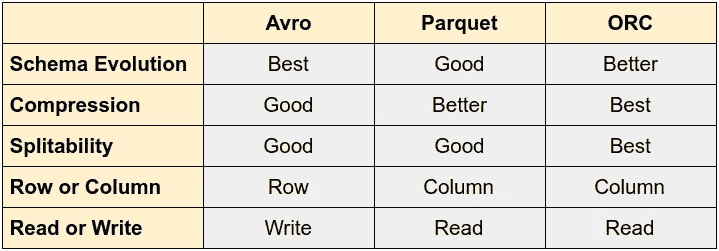
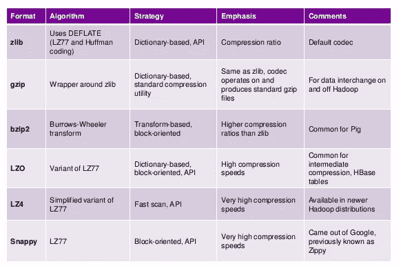

# 大数据文件格式解释

> 原文：<https://towardsdatascience.com/big-data-file-formats-explained-dfaabe9e8b33?source=collection_archive---------8----------------------->

斯坦尼斯拉夫·康德拉蒂耶夫在 [Unsplash](https://unsplash.com?utm_source=medium&utm_medium=referral) 上的照片

# 介绍

对于**数据湖**，在 **Hadoop** 生态系统中，使用**文件系统。然而，大多数云提供商已经将其替换为自己的深度存储系统，如 [**S3**](https://aws.amazon.com/s3/) 或 [**GCS**](https://cloud.google.com/storage/) 。使用深度存储时，选择正确的文件格式至关重要。**

**这些文件系统或深度存储系统比数据库便宜，但只提供基本存储，不提供强有力的保证。**

**您需要根据您的需求和预算，为您的使用情形选择合适的存储。例如，如果预算允许，您可以使用数据库进行接收，然后一旦数据被转换，就将其存储在您数据湖中以供 OLAP 分析。或者，您可以将所有内容存储在深层存储中，而将一小部分热数据存储在快速存储系统(如关系数据库)中。**

# ****文件格式****

**请注意，深度存储系统将数据存储为文件，不同的文件格式和压缩算法为某些用例提供了好处。**你如何在你的数据湖中存储数据是至关重要的**，你需要考虑**格式**、**压缩**，尤其是**你如何** [**分割**](https://mungingdata.com/apache-spark/partitionby/) **你的数据。****

**最常见的格式有 CSV、JSON、****、** [**协议缓冲区**](https://developers.google.com/protocol-buffers/) **、** [**拼花**](https://parquet.apache.org/) 、 [**ORC**](https://orc.apache.org/) 。****

********

****文件格式选项****

****选择格式时要考虑的一些事情有:****

*   ****你的数据的结构:一些格式接受嵌套数据，比如 JSON、Avro 或 Parquet，其他的则不接受。即使有，也可能不是高度优化的。Avro 是嵌套数据最有效的格式，我建议不要使用 Parquet 嵌套类型，因为它们非常低效。进程嵌套的 JSON 也非常占用 CPU 资源。一般来说，建议在摄取数据时将数据拉平。****
*   ******性能**:Avro 和 Parquet 等一些格式比其他此类 JSON 表现更好。即使在 Avro 和 Parquet 之间，对于不同的用例，一个会比另一个更好。例如，因为 Parquet 是一种基于列的格式，所以使用 SQL 查询数据湖很好，而 Avro 更适合 ETL 行级转换。****
*   ******易阅读**:考虑是否需要人阅读数据。JSON 或 CSV 是文本格式，是人类可读的，而更高性能的格式如 parquet 或 Avro 是二进制的。****
*   ****压缩:有些格式比其他格式提供更高的压缩率。****
*   ****模式演变:在数据湖中添加或删除字段远比在数据库中复杂。像 Avro 或 Parquet 这样的格式提供了某种程度的模式进化，允许您在更改数据模式的同时查询数据。像[**Delta Lake**](https://delta.io/)format 这样的工具提供了更好的工具来处理模式的变化。****
*   ******兼容性** : JSON 或 CSV 被广泛采用，几乎与任何工具兼容，而性能更高的选项集成点更少。****

## ****文件格式****

*   ******CSV** :兼容性、电子表格处理和人类可读数据的良好选择。数据必须是平面的。它效率不高，并且不能处理嵌套数据。分隔符可能有问题，这会导致数据质量问题。将此格式用于探索性分析、概念验证或小型数据集。****
*   ******JSON** :在 API 中大量使用。嵌套格式。它被广泛采用，人们可以阅读，但是如果有很多嵌套字段，就很难阅读。非常适合小型数据集、着陆数据或 API 集成。如果可能，在处理大量数据之前转换为更有效的格式。****
*   ******Avro** :非常适合存储行数据，非常高效。它有一个模式并支持进化。与卡夫卡大融合。支持文件分割。将其用于行级操作或 Kafka 中。写数据很棒，读起来比较慢。****
*   ******协议缓冲区**:非常适合 API，尤其是 [**gRPC**](https://grpc.io/) 。支持模式，速度非常快。用于 API 或机器学习。****
*   ******拼花**:柱状收纳。它有模式支持。它与 Hive 和 Spark 配合得非常好，作为一种将列数据存储在使用 SQL 查询的深层存储中的方法。因为它将数据存储在列中，所以查询引擎将只读取具有所选列的文件，而不是整个数据集，这与 Avro 相反。将其用作报告层。****
*   ****类似于拼花地板，它提供了更好的压缩性。它也提供了更好的模式进化支持，但是不太受欢迎。****

# ****文件压缩****

****最后，您还需要考虑如何**压缩数据**，权衡文件大小和 CPU 成本。一些压缩算法速度较快，但文件较大，而另一些速度较慢，但压缩率较高。更多详情请查看此 [**文章**](http://www.dbtalks.com/article/what-are-different-data-compression-methods-in-hadoop/) 。****

********

****压缩选项(图片由作者提供)****

****我推荐使用**快节奏的**处理**流数据**，因为它不需要太多的 CPU 能力。对于**批次来说，bzip2** 是一个很好的选择。****

# ****结论****

****正如我们所看到的，CSV 和 JSON 是易于使用、人类可读的常见格式，但缺乏其他格式的许多功能，这使得它太慢，无法用于查询数据湖。 **ORC 和 Parquet** 在 Hadoop 生态系统中广泛用于**查询数据**，而 [**Avro**](https://avro.apache.org/) 也在 Hadoop 之外使用，特别是与 Kafka 一起用于摄取，非常适合**行级 ETL** 处理。面向行的格式比面向列的格式具有更好的模式进化能力，这使它们成为数据摄取的一个很好的选择。****

******更新**:我目前在坦桑尼亚帮助当地的一所学校，我创建了一个 [**GoFundMe 活动**](https://www.gofundme.com/f/help-the-mango-school-children-in-tanzania) 来帮助孩子们，通过这个[链接](https://www.gofundme.com/f/help-the-mango-school-children-in-tanzania)来捐款，每一点帮助！****

****我希望你喜欢这篇文章。欢迎发表评论或分享这篇文章。跟随[***me***](https://twitter.com/JavierRamosRod)**进行以后的帖子。******