# 10 分钟内的大数据

> 原文：<https://towardsdatascience.com/big-data-in-10-minutes-bead3c012ba4?source=collection_archive---------27----------------------->

来源:https://www.flickr.com/people/22402885@N00

是的，10 分钟就可以开始处理您的第一个大数据集！

在本文中，我将向您展示如何轻松进入大数据世界，前提是您有一些 Python 背景。

开始这个小旅程的最佳点是首先了解什么是大数据。答案真的取决于你电脑的 RAM 大小和处理速度。对于传统的 PC 来说，超过 8GB 或 16GB 的任何东西都很难处理。公司的机器可能会吃得更多一点。因此，大数据基本上是任何太大而无法以传统方式处理的数据集。

那么我们如何处理大数据呢？显然，一种方法是购买更多的内存和更强的处理器。但是这非常昂贵，并且也不是可扩展的解决方案。在数据集非常大(> 1TB)的情况下，它可能也不起作用。相反，有一个更好的、可扩展的解决方案。就是在多台计算机/计算单元上划分数据集和工作量。然而，这并不意味着你需要自己购买硬件和连接机器。幸运的是，互联网服务为我们提供了现成的完整计算基础设施。

Amazon AWS 就是这样一种服务，用户可以根据需要租用任意数量的计算单元来处理任意数量的数据。计算单元位于亚马逊服务器上，随时听候您的调遣。使用 AWS 服务的费用是完全透明的，按每小时每单位计算。不要担心，在本例中运行第一次大数据分析的总成本应该不到 4 美元。

话虽如此，让我们开始工作吧！

**第 1 步**创建一个亚马逊 AWS 账户:

**1a。**去[https://aws.amazon.com/](https://aws.amazon.com/)记账

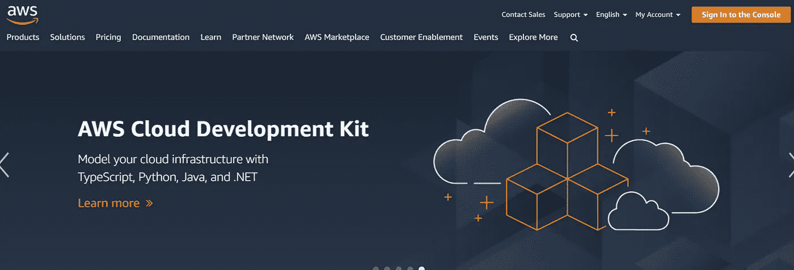

创建 AWS 帐户

**1b。除了通常的信息，您还需要输入您的信用卡详细信息。这是注册的最后一步。为了检查你的信用卡是否真实，亚马逊 AWS 会从你的账户中一次性扣除 1 美元(相当烦人，我同意)。**

提供信用卡信息

在帐户设置期间，选择您的位置:*美国西部(俄勒冈州)*(这不是强制性的，但它不会伤害)

**步骤 2** 是启动您的集群

**2a。**集群是一群并行工作的计算机实例/处理器的另一种说法。登录您的 AWS 帐户，进入左上角的 S*services*，输入 *EMR* 。这代表 Elastic Map Reduce，它是亚马逊的一项并行计算服务。

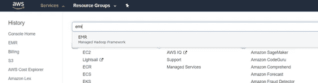

亚马逊提供很多服务，选择 EMR

**2b。**一旦进入 *EMR，*进入左侧面板的*集群*，点击*创建集群*

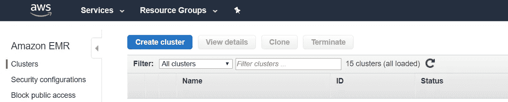

开始做一个集群

**2c** 。然后点击*进入高级选项*，确保你的启动模式设置为*集群。*

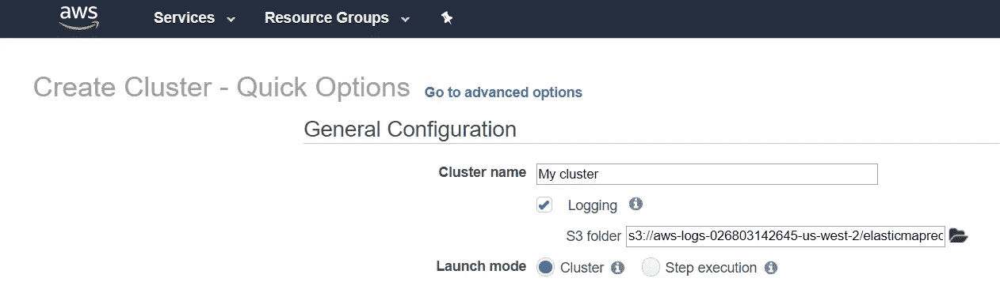

转到高级选项

一旦你进入高级选项，有 4 页要填写，按照我下面的方法设置它们。

**2d。**在第一页(软件和步骤)，确保您使用最新的 EMR 版本，并选择 Spark、Hive 和 Hadoop。此外，选择泽佩林，色相，Ganglia 和猪是一个好主意。点击*下一步。*

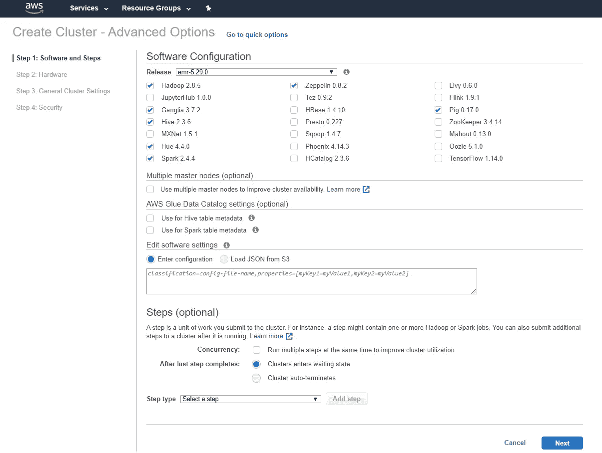

群集高级选项的第一页—软件

**2e。**在第 2 页(硬件)中，我们应该选择实例/处理器类型和实例数量。亚马逊 AWS 提供了许多不同的[实例/处理器类型](https://aws.amazon.com/ec2/instance-types/)。它们有不同的用途和[价格](https://aws.amazon.com/emr/pricing/)，所以调查哪种配置最适合您的任务是个好主意。

在这个例子中，我选择了五个 M5.xlarge 处理器(1 个主实例和 4 个核心实例)。这提供了比普通电脑多 10 倍的内存。事实证明，这样的构造对于处理 12 GB 和 2500 万行的数据集已经足够好了。

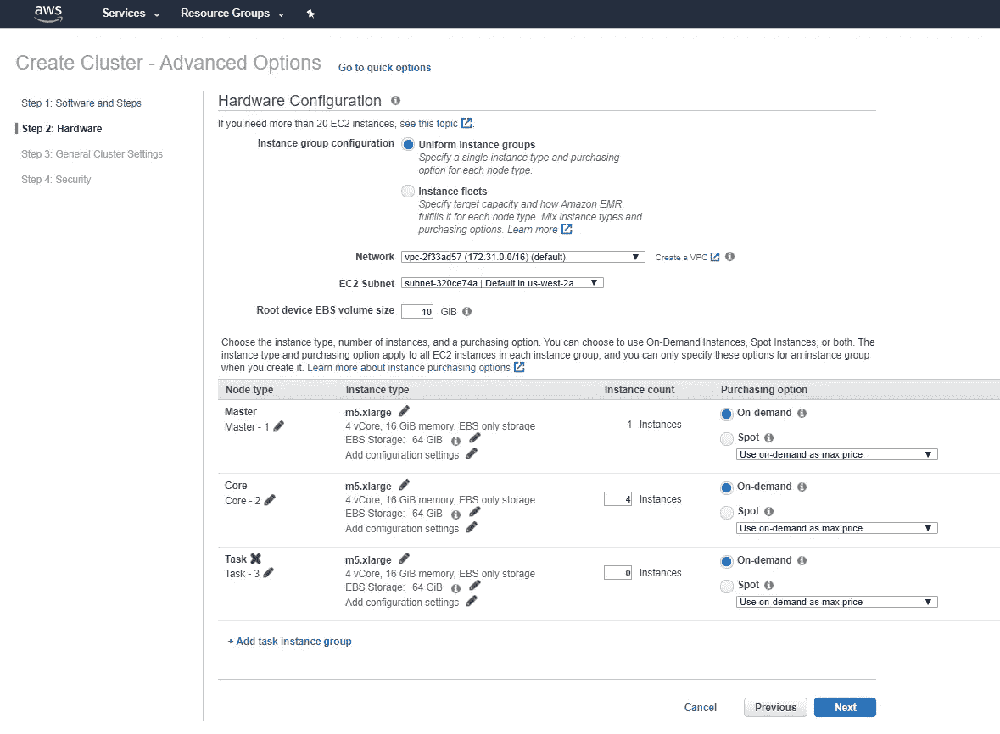

群集高级选项的第 2 页—硬件设置

**2f。**在集群高级选项的第 3 页(常规集群设置),我们应该为集群命名

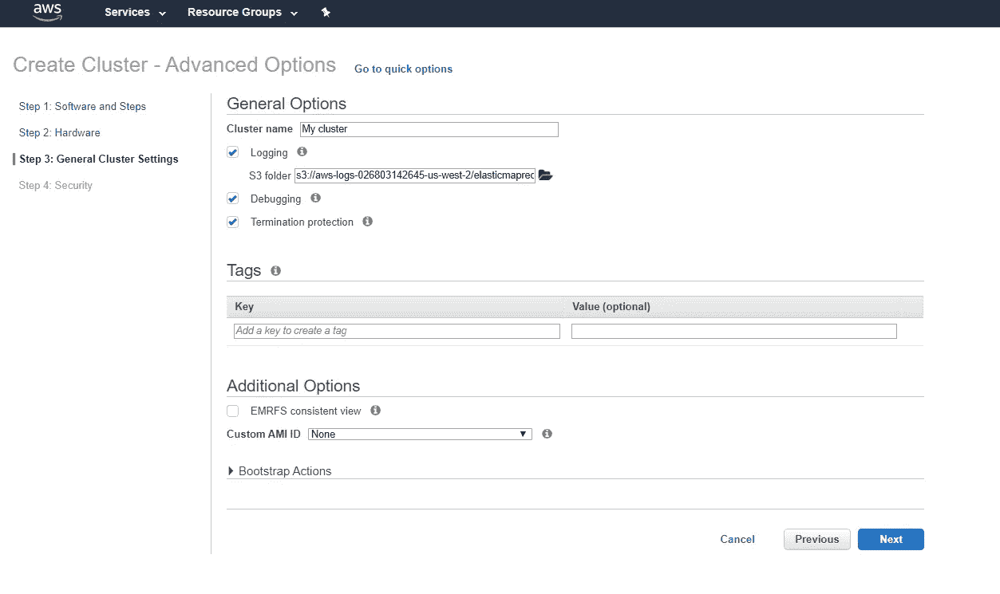

群集高级选项的第 3 页—常规设置

**2g。**在集群高级选项的第 4 页(安全)中，您可以设置安全配置。我们不会太关注这个，因此我选择了*在没有 EC2 密钥对的情况下继续。*你可以在这里阅读更多关于 EC2 密钥对[的信息。](https://docs.aws.amazon.com/AWSEC2/latest/UserGuide/ec2-key-pairs.html)

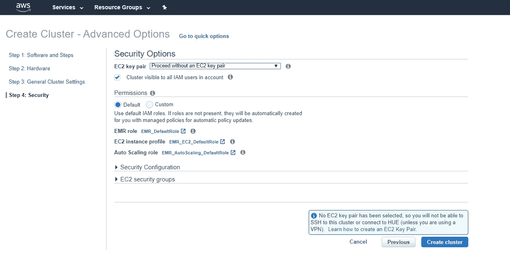

群集高级选项第 4 页—安全性

**2h。**现在您的集群已经设置好了，点击*创建集群，*将出现以下屏幕

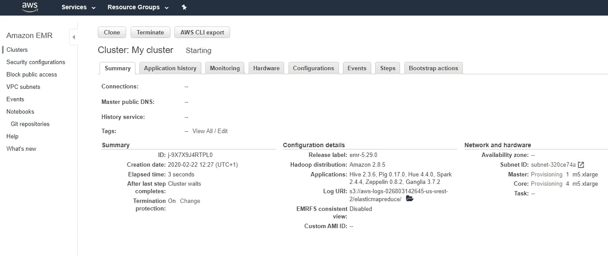

您的集群几乎准备好了

**2i。**点击左侧窗格中的*集群*。您的集群的状态是*开始*。一旦集群准备就绪，状态将变为*等待(集群就绪)。*此外，一旦集群可以使用，集群名称旁边的空绿色圆圈将变成一个完整的绿色圆圈。随时刷新页面，检查圆圈是否变成全绿色。

等待完整的绿色圆圈出现

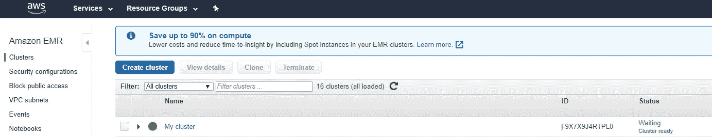

您的集群已经准备好了！

**2j。**现在我们应该为您的代码设置工作空间了。亚马逊 EMR 在平台中集成了 Jupyter 笔记本。在左侧窗格中点击*笔记本*，然后点击*创建笔记本*。

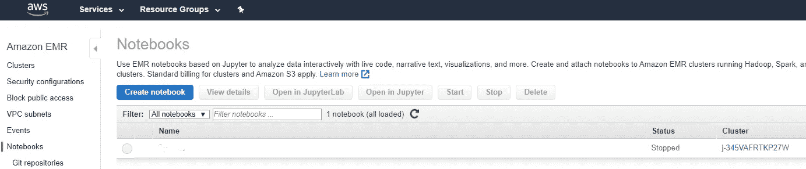

启动 Jupyter 笔记本

**2k。**为您的笔记本命名，然后点击*选择*(在集群下)，将您的笔记本连接到您刚刚创建的集群。

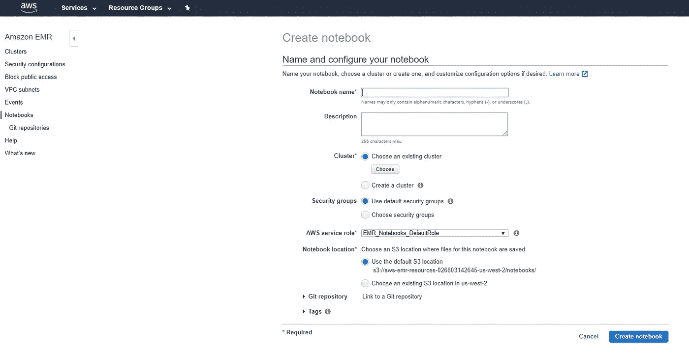

为您的笔记本命名

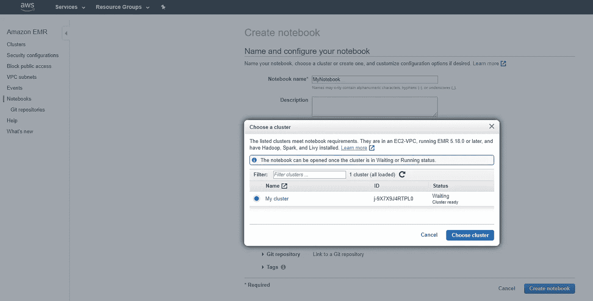

将您的笔记本电脑连接到集群

**2l。**然后点击*选择集群*然后*创建笔记本*。你的笔记本也需要几分钟准备好。一旦准备就绪，它将从*开始*变为*就绪*。点击上方中的*打开。*

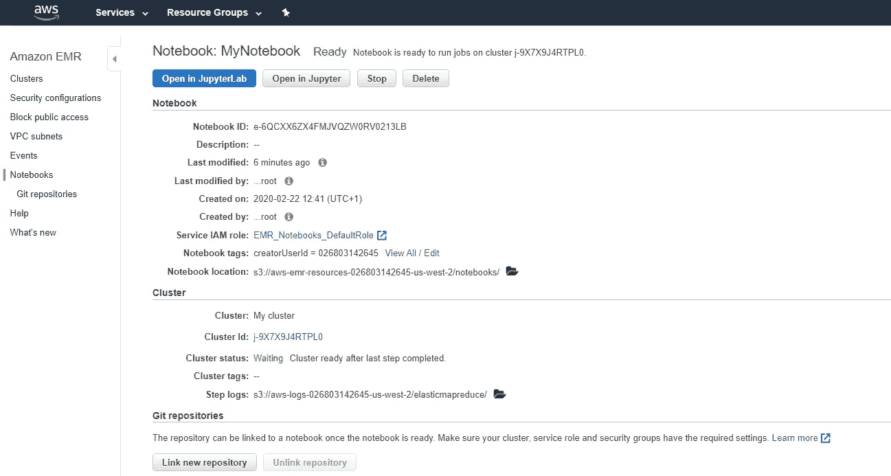

等到你的笔记本准备好了

**2m。您的 Jupyter 笔记本将在另一个浏览器窗口中打开。一旦打开笔记本，一定要点击*内核/改内核* / *PySpark。这是第二步的最后一部分。***

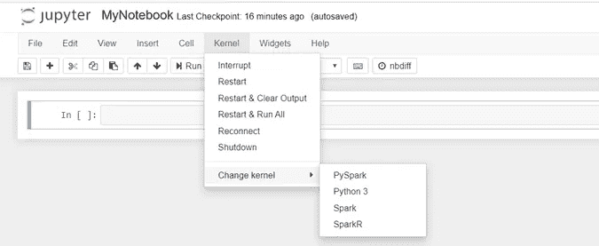

将您的 Jupyter 笔记本设置为 PySpark

**第三步**是准备你的(大)数据

3a。返回 AWS 第一页，转到*服务*并找到 S3。S3 是亚马逊提供的一个非常大的云数据库。这是您的数据应该存储的地方。

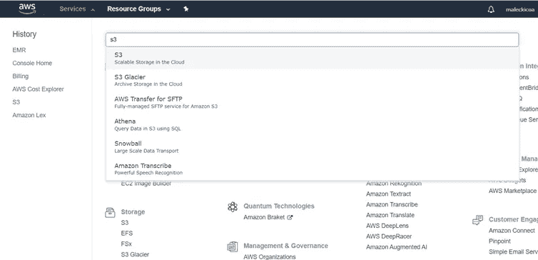

去亚马逊 S3

**3b。**在 S3 中，点击*创建桶*。这是一个存储库，您将在其中上传数据。

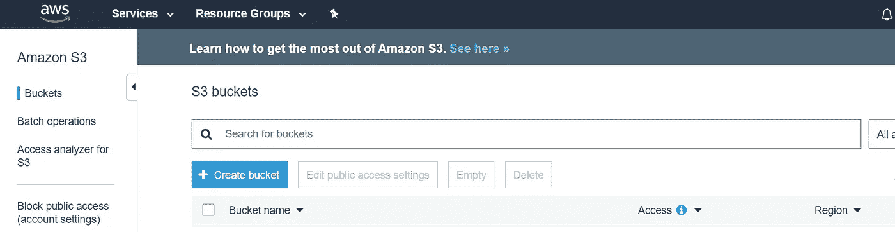

在亚马逊 S3 创建一个桶

**3c。给你的铲斗起一个独特的名字。亚马逊 S3 上没有两个桶可以共享同一个名称**

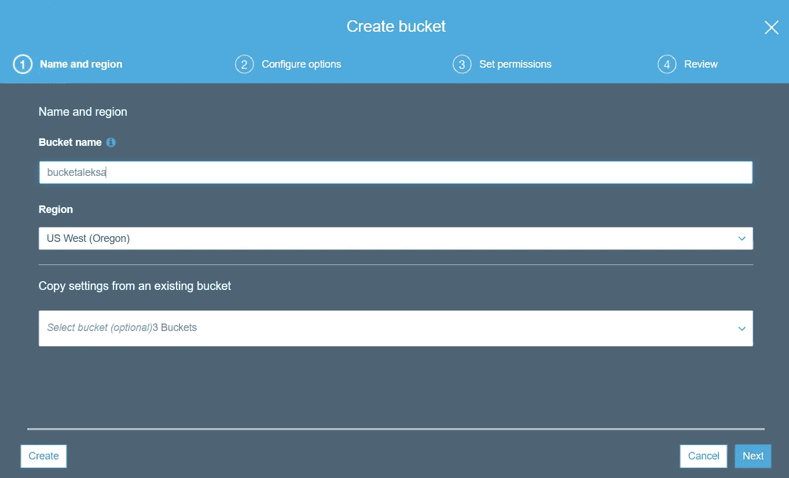

给你的 S3 桶一个独特的名字

**3d。点击桶来打开它**

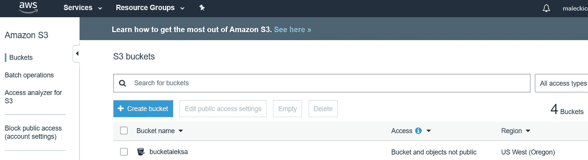

打开你的桶

**3e。**您现在可以将数据添加到您的存储桶中。对于小于 160 GB 的文件，您可以简单地将它们拖放到您的存储桶中。(要上传大于 160 GB 的数据，您必须使用 AWS CLI、AWS SDK 或亚马逊 S3 REST API)

出于本教程的目的，您可以继续使用[这个虚拟数据集](https://github.com/maleckicoa/Sparkify-Project/blob/master/sparkify_log_small.json)。将其下载到您的本地机器，然后上传到您的 bucket。

虚拟数据集只有几 MB，所以不是大数据。如果你有一个合适的大数据集，可以自由地使用它来代替虚拟数据集。

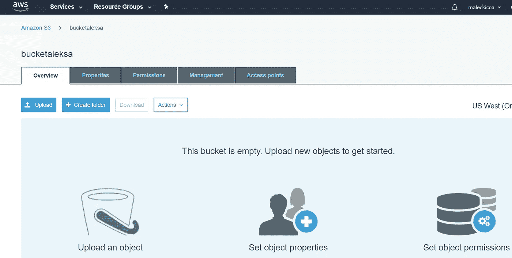

将数据上传到您的铲斗

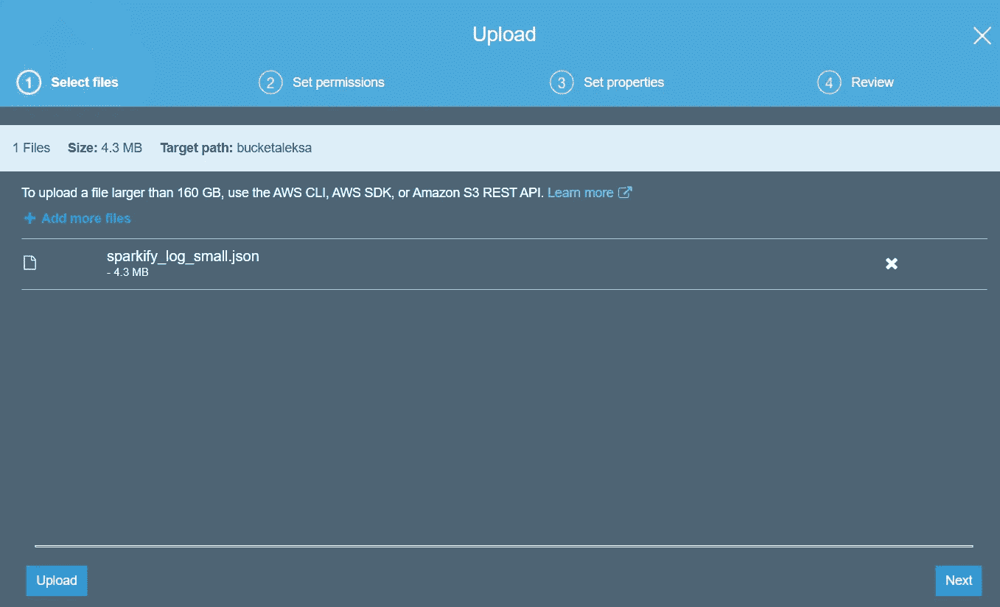

您的数据将出现在存储桶中

**3f。**查看您的数据是否在桶中

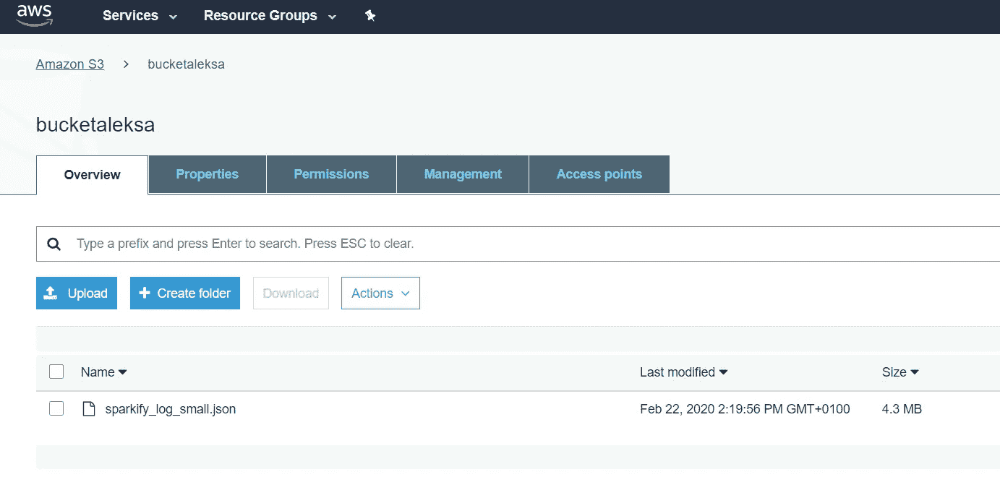

您的数据在桶里，准备分析

**3g。**现在已经为分析做好了一切准备。到您的数据的路径具有以下模式:“s3n:// *您的存储桶名* / *您的文件名.扩展名类型*”。

您将使用该路径将 S3 数据导入您的 Jupyter 笔记本

**第四步**就是最后做你的大数据分析！

**4a。**从导入基本的 PySpark 包开始。

PySpark 是一个 API，一个用来支持 Python 在 Spark 上运行的工具。Spark 是一个集群计算框架，最近几乎成了大数据的同义词。简而言之，Spark 正在协调分布在多个处理单元上的工作负载。做大数据，和 Spark 交互，也可以选择 Scala，Java 或者 R，而不是 Python(PySpark)。

因为我对 Python 很熟悉，所以在这个例子中我选择了 PySpark。你会发现 PySpark 与原生 Python 语法非常相似，但是万一遇到困难，你可以在这里查找[。](/pyspark-and-sparksql-basics-6cb4bf967e53)

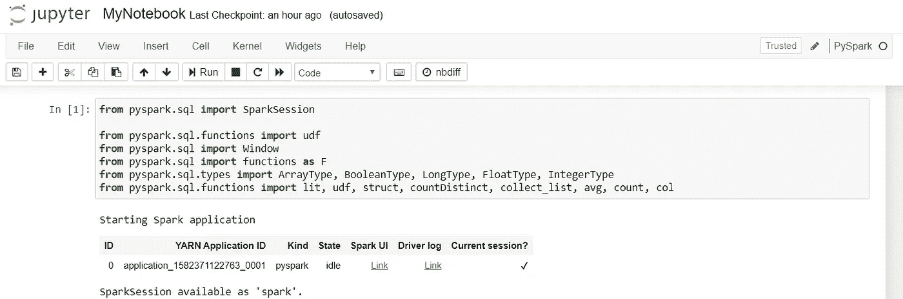

导入 PySpark 包

**4b。**创建一个 Spark 会话，并使用之前创建的路径从 Bucket 导入数据。

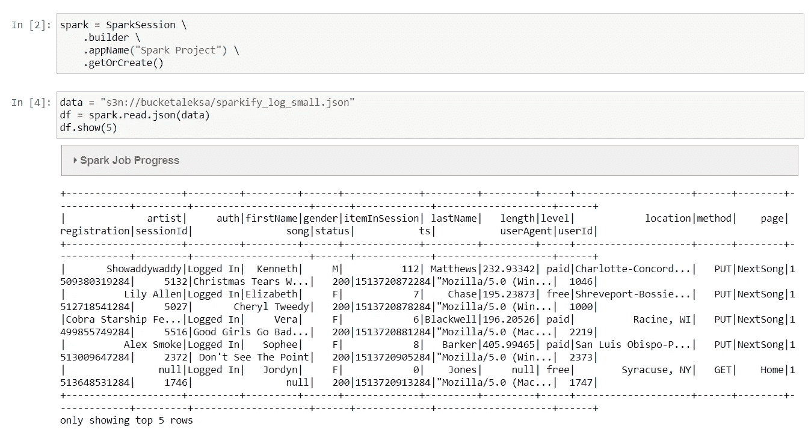

将数据导入 Jupyter 笔记本

**4c。**做你的分析。您可以选择 PySpark 或 SQL 语法。如果您选择使用 SQL 语法，不要忘记创建临时表。您只能对临时表运行查询，而不能直接对 PySpark 数据框运行查询。

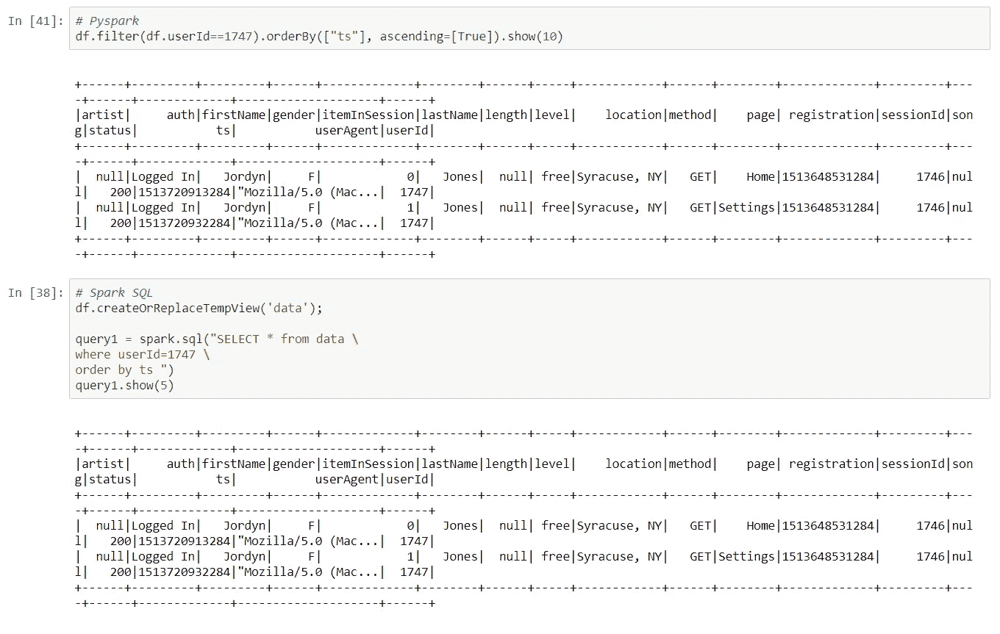

选择本机 PySpark 或 SQL 语法来处理您的数据

如果你想对你的数据运行 ML 算法，[这里的](/machine-learning-with-pyspark-and-amazon-emr-3149dbc847ae)是一个关于如何在 PySpark 中完成的例子。

**第 5 步**是终止您的会话

**5a。**完成分析后，确保终止集群。否则你可能会付出高昂的代价。返回*服务/ EMR/集群*并点击*终止。*

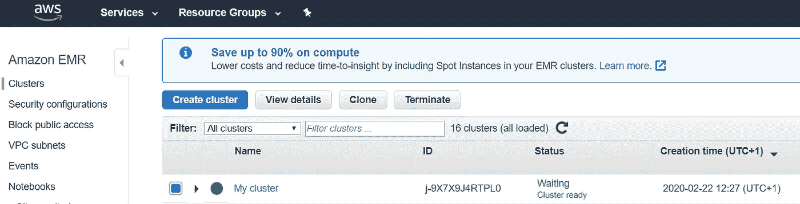

不要忘记终止集群

**5b。**集群需要几分钟才能关闭

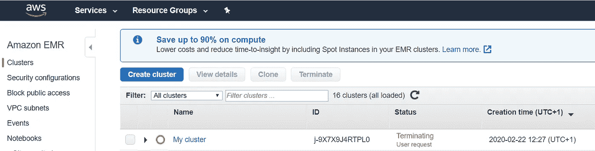

检查集群是否正在终止

**5c。之后，你应该*停止*或*删除*你的笔记本，同时删除你的 S3 桶。只要保存在 AWS 服务器上，这两者都会产生(实际上非常小的)成本。所以如果真的不需要，就删掉。在删除之前，不要忘记在本地下载您的笔记本，否则您会丢失代码。**

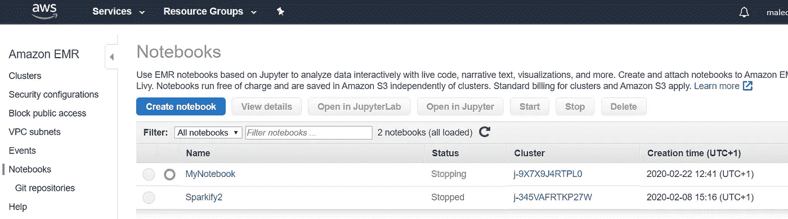

**5d。**删除你的 S3 桶

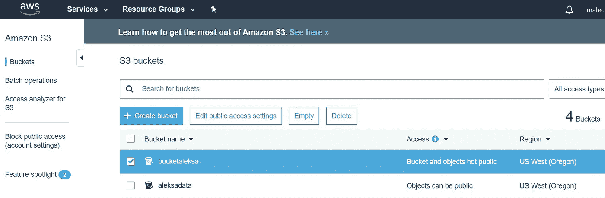

删除您的存储桶

**5e。**最后一步是前往您的账户名称/ *我的账单仪表板*查看您的账单

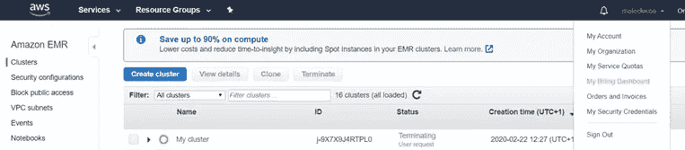

检查您的账单仪表板

**5f。**如前所述，如果您正确地遵循了所有步骤，那么本次练习的总账单不会超过 3 美元，还不包括 1 美元的信用卡检查费。(正如您在下面看到的，我设法产生了更高的成本，但这只是因为我运行了几天我的集群)。

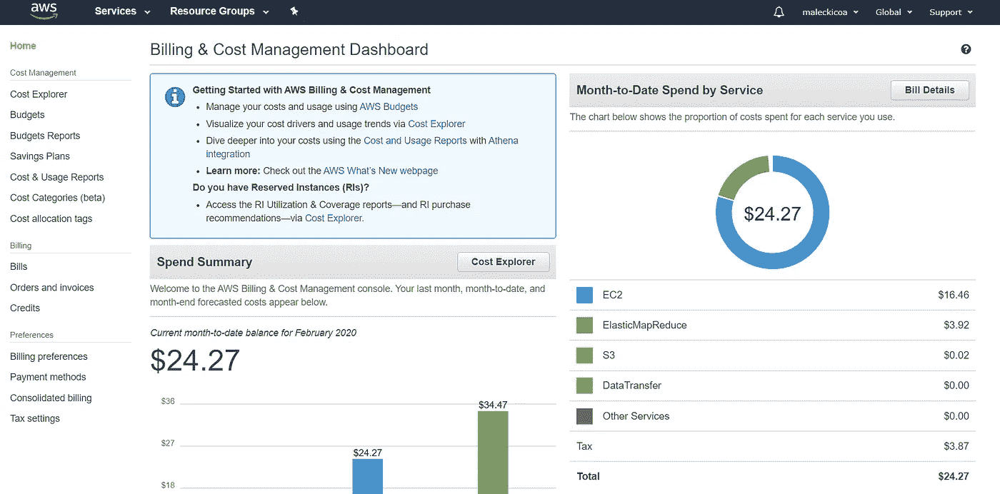

计费仪表板提供了一些不错的 AWS 成本可视化

# 总结

我们的小旅程即将结束，让我们快速总结一下我们所经历的上述步骤:

*   开立亚马逊 AWS 账户
*   使用 AWS EMR 服务设置并激活您的集群
*   制作一个 Jupyter 笔记本，并将其与您的集群连接
*   将您的数据上传到亚马逊 S3
*   运行分析

# 就是这样！:)

# 祝贺您设置了您的第一个大数据分析！！

如果您做的一切都正确，完成上述配置步骤应该需要大约 10 分钟。我希望这篇文章对您有用，并祝您在未来的大数据事业中取得更大的成功！