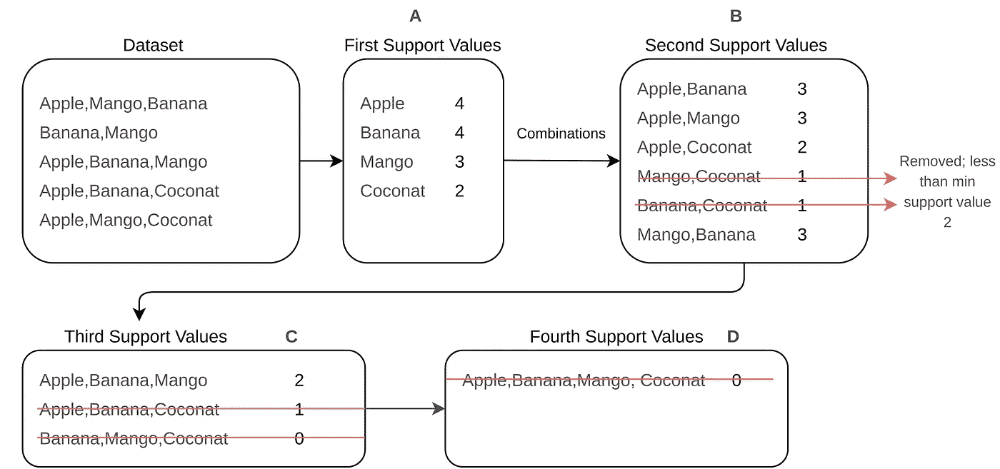

# 基于 Spark 的 Apriori 算法的大数据购物篮分析

> 原文：<https://towardsdatascience.com/big-data-market-basket-analysis-with-apriori-algorithm-on-spark-9ab094b5ac2c?source=collection_archive---------5----------------------->

## 在 PySpark 上从头开始应用 Apriori 算法


[乔丹马德里](https://unsplash.com/@jordanmadrid)在 [Unsplash](https://unsplash.com/?utm_source=medium&utm_medium=referral) 上的照片

客户购买特定产品的概率可能基于几个因素。客户的交易历史、人口统计特征和兴趣等因素都是这方面的例子。如果我们没有这些因素。这意味着顾客以前没有来过我们的商店，我们没有他/她的数据(甚至没有性别)。在这种情况下，我们有办法找到客户可能购买的产品。通常，这些方法中使用的数据属于之前在商店中购物的其他顾客。这些方法获取所有交易，控制交易中的每个项目(产品)，并找到显示客户在同一个篮子中购买最多的产品的模式。发现这些模式的方法称为频繁模式挖掘或关联规则挖掘[1]。

Apriori 算法是用于频繁模式挖掘的算法之一。在本文中，我将解释如何在 **Python** 中用 **Spark** 应用 **Apriori 算法**。在开始应用下面的代码之前，了解“Apriori 算法”是如何工作的是很重要的。我还将解释 Apriori 的基础知识，但如果你想详细了解它，请阅读我以前的文章[**什么是“Apriori 算法”及其工作原理**](https://medium.com/@sergencansiz/what-is-apriori-algorithm-and-how-it-works-c99a9513753d)。在这篇文章中，将会看到以下几个部分，

*   应用先验知识的一个实例
*   什么是火花，为什么我们应该使用它
*   如何准备交易数据
*   先验术语和基础
*   使用 PySpark 从头开始应用 Apriori

> **快捷方式:**您可以在我的 GitHub 仓库中找到 python PySpark 上 Apriori 算法实现的源代码，并且可以使用为 Spark 创建的模块。

[](https://github.com/sergencansiz/apriori-pyspark) [## 塞尔根坎西斯/先验派斯帕克

### 该模块被开发用于在基于 RDD 的 pyspark 上运行 apriori 算法。在功能更新之前，应该显示数据…

github.com](https://github.com/sergencansiz/apriori-pyspark) 

## 示例案例

假设纽约市有一个蔬菜水果商。这家蔬菜水果商是纽约市最大的蔬菜水果商，一个月有数百万顾客。蔬菜水果商的老板仅在一天内就购买了大量的产品。然而，有些日子她卖不完所有的产品，就把它们扔掉，因为产品的寿命到期了。因此，扔掉产品会造成大量损失。因此，蔬菜水果店的老板决定创新他们的营销策略。她想为她的蔬菜水果商雇佣一名数据科学家。这位数据科学家的职责是创建一种算法，可以找到客户将产品放入购物篮后可能会购买的产品。她将为算法为每个特定客户找到的产品提供折扣。由于这种算法，她计划及时销售她的产品。好主意！
现在，假设她雇佣的数据科学家是你，你会如何开始？

## 环境

Apache Spark [2]是一个开源分析引擎，专注于速度、易用性和分布式系统。它运行机器学习算法的速度比非分布式系统快 100 倍[3]。如果有大量数据集，Spark 将是分析该数据集的最佳选择。好的，让我们回到我们的例子:考虑到蔬菜水果商一个月有数百万的顾客，你将不得不处理数百万的交易数据。为了提供更快的数据分析，最好的选择之一可能是 Spark。

## 你如何准备你的数据？

首先，你应该做的是准备一个客户交易的数据集。但是，你不应该忘记，一个顾客可能会从蔬菜水果店里购买一件或多件商品，这意味着我们的数据集不能每行都有一定数量的列。因此，我决定逐行编写事务，并用逗号分隔事务中的每一项，并保存为“txt 或 CSV”文件。每一行都用逗号分隔的项目表示每个交易。例如，在第一次交易中，客户购买了苹果、芒果和香蕉，在第二次交易中，客户购买了香蕉和芒果。如果您有 CSV 格式的数据集，您也可以使用它(它已经用逗号分隔，但不要忘记删除标题行)。

# 算法—先验

在 Spark 上实现 Apriori 之前，我们需要理解它的主要术语和概念。Apriori 算法依赖于项目集的频率。它创建包含项目组合的不同表格。它扫描显示所有交易的主数据集，并通过考虑这些组合在主数据集内出现的次数来查找频率[4]。在 Apriori 算法中，这些频率被称为**支持值**。此外，表格的数量根据最大项目集长度而变化。如果最大项目集长度为 5，则意味着将有 5 个支持值表。但是，有一个最小支持值，用于决定哪个项目集应该留在表中。假设最小支持值已经被决定为 2。因此，如果任何项目集在主数据集中出现的次数少于 2 次，我们应该从表中删除该项目集。

让我们检查下图，以便理解先验是如何工作的。为了简单易懂，我在下图中取了一些交易记录。



先验-支持表(图片由作者提供)

“数据集”代表我们的交易数据,“数据集”中的每一行都显示了客户同时购买的每个交易项目集。表 a 中有单项频率。这是我们需要为 Apriori 算法创建的第一个表。在表 A 之后是表 B，它包括单个项目的二进制组合。最重要的部分是这里的项目顺序没有意义。所以，“苹果，芒果”和“芒果，苹果”是一回事。因此，在生成项目组合时，必须移除项目集的副本。从表 B 中可以看出，支持值小于 2 的“香蕉-椰子”和“芒果-椰子”的项目集已经被删除。然而，在表 C 中有单个项目的三重组合，并且支持显示在主数据集中出现多少次的值。支持值小于 2 的项目集也从此表中删除。如果您看到表 D，则只有一个支持值为 0 的项目集，它有四个单项。应用算法时不应考虑该表。因为在主数据集中没有这样的交易。

那么，如果一个客户买了苹果，利用上图中的这些支持表，我们怎么计算他买芒果的概率呢？为了计算该概率，我们需要将“芒果”和“芒果，苹果”的支持值放在一起。“芒果”的支持值为 4，“芒果，苹果”的支持值为 3。我们可以计算概率；(3 / 4) * 100 = %75.这个概率被称为先验的**置信值**。对该值的解释是，购买芒果的客户可能会购买置信度为%75 的苹果产品。

现在，我们知道如何计算**支持度**和**置信度**值。我们可以用 PySpark 来研究 Apriori 算法。在下面一节中我们将看到；

*   使用 PySpark 读取数据
*   解析数据以激发 RDD 对象
*   使用“MapReduce”查找项目的第一个支持值
*   决定最小支持值
*   使用“MapReduce”创建以下支持表
*   计算置信度值
*   决定客户购买哪种产品时信心十足

## 用 PySpark 读取数据集

PySpark 在 rdd 上工作，这意味着我们需要将所有事务记录转换成多个 rdd。在此之前，我们需要确保 SparkContext 已创建，以便定义 rdd 的每个记录并读取 CSV 文件。

> 在开始本节之前，请确保您的系统上安装了 **Spark** 和 **PySpark** 。

首先，在你的工作目录中创建一个名为“apprioriSpark.py”(或者任何你想要的名字)的 python 文件，然后你可以通过下面的命令轻松地创建一个 SparkContext(你还应该从 P **ySpark** 导入 **SparkContext** )。

代码 1:用 PySpark 创建 spark 上下文

创建 SparkContext 后，我们可以使用 SparkContext 中的 textFile()方法读取数据。请确保您的数据文件与 python 文件位于同一目录中。

代码 2:用 Spark 读取文本文件

## 将交易项目解析到 RDD

默认的 textFile()方法逐行读取文件，这意味着 CSV 文件中的每一行都将是一个 RDD 值。这些 rdd 包括 CSV 行作为单个字符串值(结果在第 6 行)。这就是为什么我们需要映射到每个 RDD，并用逗号分割这些单个值，以便获得行中的每个项目，并将它们分割到一个 RDD 数组中。为了跑那段路。

代码 3:将项目解析到数组中

现在，您可以清楚地看到，事务数据集中的每一行都由逗号分隔。在我们的 RDD 中，每个数组都代表客户交易的项目列表。我们通过考虑属于客户的每一笔交易，成功地将文件转换为 Spark RDD 对象。

## 为先验获取项目的第一支持值

Apriori 算法依赖于项目的频率。因为第一，我们需要获得每一个项目的频率。这些频率将是我们在表 1 中的第一个支持值(如前一节所述)。为了做到这一点，我们需要将 rdd 中的每一项提取到数组的所有项中。我们可以通过使用“平面图”方法做到这一点。

代码 4:文件中项目的平面映射

从结果可以看出；我们所有的交易项目都在一个数组中。现在我们可以计算每个独特的项目的频率。不要忘记，这些频率将是我们的第一支持值。如果我们将致力于“NumPy”阵列，找到频率将是容易的。但是，我们在 rdd 上工作，这就是为什么我们需要通过考虑“MapReduce”方法来找到获得频率的方法。解决方案；首先，我们可以将每个项目转换为一个“元组”对象，并添加“1”作为“元组”的第二个项目。我们可以通过使用“reduceByKey”(类似于 SQL 中的 groupby 方法)方法对这些值求和。通过对元组的第二个数字求和，我们可以获得每个唯一项目的频率(客户交易发生的次数)。我们还需要在功能部分列出独特的项目。因此，我们也可以通过使用“distinct”方法来获得独特的项目。

代码 5:生成第一个支持值

如果在上面的代码片段之后运行“supportRdd.collect()”，就会得到第一个 item -support 元组(假设为表 A)。从支持值可以看出，“苹果”比其他品牌出现的频率更高。这意味着购买“苹果”产品的可能性比其他产品更大。这些支持值是通过分别考虑每个项目获得的。我们还需要考虑它们如何在事务中一起出现。得益于此，我们可以通过 Apriori 算法计算置信度值。我们将在接下来的课程中看到这些步骤。

## 最小支持值

为了决定哪些项目集将留在支持表中，我们需要定义一个最小支持值。我们可以选择最小支持值作为第一个支持值数组(表)中的最小频率。如果项目集数组中的任何支持值小于最小支持值，我们应该从该数组中删除该项目集。如果我们的数据没有很多记录，最小支持度可能是 1。在这种情况下，我们可以将最小支持度定义为 2 或任何大于 1 的值。

代码 6:支持 RDD 对象和最小支持

在本例中，我们发现最小支持值为 1。为了获得更一致的结果，我们可以将最小支持度设置为 2。这意味着，如果任何项目或项目集在交易中出现少于 2 次，我们不会考虑它。从第 8 行可以看出，我们根据最小支持值过滤了第一个项目集表(这是单个项目支持值)。我们还创建了一个“baseRdd”对象。“baseRdd”代表我们对每一项的第一支持值。此对象将使用即将到来的组合支持值进行更新。我们还需要定义“supportRdd ”,它只显示没有支持值的项目。我们将在下一节中使用它来创建项目的组合。

## 进入 Apriori 算法

在本节之前，我们只找到了每个项目的支持值(频率)。现在，我们将创建一个在 while 循环中生成项目组合的算法。在每个循环中都将创建不同的支持表。当不存在任何支持值大于最小支持值的组合时，该 while 循环将结束。该算法将控制这些项目组合在每个循环的事务数据集中一起出现**和**的次数，并将其保存在 RDD 中。

我们已经创建了一个“supportRdd”对象，它只包含第一个表的项目集，没有支持值(每行只有一个项目)。现在，我们将在 while 循环中使用这个 RDD，将它与唯一的项目组合起来，以便创建其他支持表。然而，这个 RDD 将在每次循环之后被更新。比如说；

```
# Fitst supportRDD
([Apple] , [Mango] , [Banana] , [Grapes])# After first loop = supportRDD 
([Apple,Mango],[Mango,Banana],[Apple,Banana],[Apple,Grapes] ......)# After second loop = supportRDD
([Apple,Mango,Grapes] , [Apple,Banana,Grapes] ........ )
```

该算法将根据最小支持值过滤每个组合表。当没有项目设置时，while 循环将结束。此外，我们还需要定义一个函数，它可以在组合的项目集中找到副本。如前所述；(苹果，芒果)和(芒果，苹果)的集合对于 Apriori 算法来说是一样的。正因为如此，我们需要找到这样的模式，并删除其中的**。从下面的代码片段可以看到，有一个函数叫做“removeReplica”。该函数在组合后删除这些重复项，并只返回其中一项。**

**耶！我们准备创建 while 循环。首先，我们需要定义一个变量，我们可以在每个循环中控制项目集长度。它在上面的代码片段中表示为“c”。这个“c”变量从 2 开始。为什么？请记住，我们已经创建了第一个支持表“supportRdd”。所以，在 while 循环中支持表将从 c=2 开始。这意味着将在 while 循环中创建的第一个支持表将具有包含 2 个项目的项目集。为了创建项目的组合，我们可以使用 PySpark 附带的“笛卡尔”函数(第 6 行)。它被创建，我们将删除重复的项目(在第 7 行)。我们将使用“c”变量，以便比“c”变量更多地过滤组合项目(在第 9 行)。然而，我们也使用“distinct”方法来获得一个惟一的项目集，以防万一。**

**正如你所看到的，在每个循环中创建了两个对象“组合”和“组合 _2”。上面已经解释过了。“Combined_2”则是“Combined”变量和整个数据集(每笔交易)的每一行的组合。从第 14 行可以看出，有一个过滤过程控制每个项目集，不管“组合”的项目集是否在数据集中。如果数据集中没有任何这样的项目集，则它移除该项目集。毕竟我们也是用“reduceByKey”的方法得到频率，按照最小支持值过滤。在第 21 行，我们将最终的支持表添加到“baseRDD”中，它包含我们所有的项目集支持值(理论上它被称为 table)。但是，我们还需要用不带支持值的“combined_2”更新“supportRdd”变量。这个过程将继续下去，直到“supportRdd”中没有任何项目集。**

**最后，我们可以计算置信度值。您可以使用以下代码来计算 baseRdd(整个项目集组合)的每个组合的置信值。有一个“Filter”类，可以根据置信度计算过滤数据。它还包括计算置信度的“计算置信度”方法。**

**如果运行 baseRddConfidence.collect()可以获得所有置信度值。您还可以过滤大于特定置信度的结果。结果中的几个例子如下所示:**

```
[[['Apple'], ['Mango'], 58.333333333333336], 
 [['Mango'], ['Apple'], 70.0], 
 [['Apple'], ['Banana'], 41.66666666666667], 
 [['Apple'], ['Mango', 'Banana'], 33.33333333333333], 
 [['Mango', 'Apple'], ['Banana'], 57.14285714285714], 
 [['Apple', 'Banana'], ['Mango'], 80.0], 
 [['Mango', 'Banana'], ['Apple'], 66.66666666666666], 
 [['Mango', 'Apple'], ['Raspberry'], 28.57142857142857
 [['Raspberry', 'Apple'], ['Mango'], 50.0], 
 [['Mango', 'Raspberry'], ['Apple'], 50.0], 
 [['Mango', 'Banana'], ['Raspberry'], 33.33333333333333], 
 [['Mango', 'Raspberry'], ['Banana'], 50.0], 
 [['Raspberry', 'Banana'], ['Mango'], 50.0]]
```

**数组中的第一个项目集显示客户购买的产品，第二个项目集显示如果客户购买了第一个项目集中的产品，他们可能会购买的产品。数组的最后一个元素显示了该模式的置信度值。例如，购买芒果的客户可能会以%58 的信心购买苹果。再比如；购买芒果和香蕉的顾客可能会以 66.6%的信心购买苹果。如果仔细看前两个数组["Mango "，" Apple" ]和["Apple "，" Mango"]的置信度值不同。我们来写一下对[“芒果”= >“苹果”](芒果之后买苹果的信心)的支持公式**

```
( support(["Mango" , "Apple"]) / support(["Mango"]) ) * 100 = 70
```

**和公式[“苹果”= >“芒果”]**

```
( support(["Mango" , "Apple"]) / support(["Apple"]) ) * 100 = 58
```

**["芒果"]"苹果"]的支持度是 7，["芒果"]的支持度是 10，["苹果"]的支持度是 12。虽然在两种计算中[“苹果”“芒果”]的出现频率(支持度)相同，但由于“苹果”的出现频率和“芒果”的出现频率不同，所以它们的置信度值也不同。**

**您也可以通过使用以下代码来转换结果 pandas 数据框；**

## **结论**

**在本文中，我们学习了什么是频繁模式挖掘，以及如何将其应用于 Apriori 算法。我们以一个数据集为例，从头开始在 PySpark 上应用 Apriori 算法。您还可以查看其他 FPM 方法，如 FPGrowth、Eclat 等。理解了先验知识之后，你就可以很容易地理解其他方法是如何工作的。如果你有任何问题，请随时提问。**

**希望对你有帮助…**

## **参考**

**[**【1】**频繁模式挖掘
【https://en.wikipedia.org/wiki/Frequent_pattern_discovery】T4](https://en.wikipedia.org/wiki/Frequent_pattern_discovery)**

****【2】**阿帕奇火花
[*https://spark.apache.org/*](https://spark.apache.org/)**

****【3】**什么是火花
[*https://databricks.com/spark/about*](https://databricks.com/spark/about)**

**【https://en.wikipedia.org/wiki/Apriori_algorithm [](https://en.wikipedia.org/wiki/Apriori_algorithm) [*先验算法*](https://en.wikipedia.org/wiki/Apriori_algorithm)**