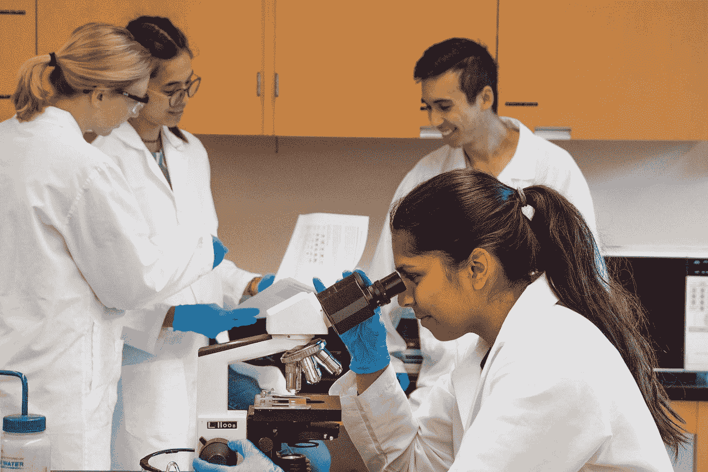

# 大数据显示每个人都会撒谎

> 原文：<https://towardsdatascience.com/big-data-says-everybody-lies-b7e9e28376c2?source=collection_archive---------17----------------------->

## 为什么大数据如此重要，为什么您也应该关注它

詹·西奥多在 [Unsplash](https://unsplash.com?utm_source=medium&utm_medium=referral) 上的照片

# 你的直觉在骗你

在我们的日常生活中，除了高科技，绝大多数人都是凭直觉做决定和给出建议。在他们的一生中，他们吸收了大量的数据，这些数据安全地保存在他们的大脑中，使他们能够对问题做出结论。

然而，这带来了几个问题:

1.  你所有的观察(数据点)都是从你的角度出发的。这意味着你会看到一个有限的画面。
2.  随着时间的推移，你的大脑会改变记忆，你能记住的就这么多

以篮球为例。你可能听说过贫穷的成长会帮助你成为一名优秀的 NBA 球星。有很多成功的故事证明，看到勒布朗·詹姆斯，所以这一定是真的。但你听到的故事只是成功的故事(生存偏差)；你没听到剩下的。

> “下一个弗洛伊德将是数据科学家。下一个马克思将是数据科学家。下一个索尔克很可能会成为一名数据科学家。”

这就是为什么大数据非常有益，可以帮助回答有趣的问题。大数据可以从全国范围内获取数据，看看成长为穷人或中产阶级对你的 NBA 梦想是否有任何影响。事实证明确实如此。如果你不是出身贫寒，你更有可能进入 NBA。

# 这个博客是关于什么的？

除非你过去十年一直躲在石头下面，否则你肯定听说过大数据。这是一个越来越受欢迎的话题。这种现象如此普遍，以至于一本关于大数据的书登上了**纽约畅销书**排行榜！

谷歌大数据趋势

这本书名为《每个人都在撒谎:网络能告诉我们的真实身份》，作者塞思·斯蒂芬斯-达维多夫茨。

 [## 每个人都会撒谎

### 纽约时报畅销书。年度经济学家书籍

books.google.co.uk](https://books.google.co.uk/books/about/Everybody_Lies.html?id=8dEkDwAAQBAJ&printsec=frontcover&source=kp_read_button&redir_esc=y#v=onepage&q&f=false) 

嗯，我读了这本书，总共 300 页左右，我觉得它很吸引人。为了不让你也不得不去读它，我试图在这篇博客中提炼出这本书的信息。我希望你会觉得有趣。

[乔·塞拉斯](https://unsplash.com/@joaosilas?utm_source=medium&utm_medium=referral)在 [Unsplash](https://unsplash.com?utm_source=medium&utm_medium=referral) 上的照片

# 图书概述

总的来说，这本书描绘了什么是大数据，以及如何使用它来识别某些以前未知的真相。它举例说明了它是多么有用，如果你不给予应有的关注，它会被有意或无意地误解。

在整本书中，赛斯给出了大数据的例子和它揭示的真理，同时给你提供了令人兴奋的轶事，很像史蒂芬·都伯纳和史蒂芬·列维特的《魔鬼经济学》(另一本畅销书)。

> “数据科学采用自然、直观的人类流程——发现模式并理解它们——并为其注入类固醇”

更具体地说，这本书探索了许多数据集，包括来自 Google Trends 和 PornHub 的数据。在这样做的过程中，它引起了人们对政治(选举、演讲以及对种族主义的影响等)等话题的关注。)，在金融或赛马中寻找优势，以及人类的性。

如果你决定要读这本书，不要过多关注细节，以免毁了它，以下是关键要点！

[真诚媒体](https://unsplash.com/@sincerelymedia?utm_source=medium&utm_medium=referral)在 [Unsplash](https://unsplash.com?utm_source=medium&utm_medium=referral) 上拍摄的照片

# 大小不如拥有正确的数据重要

> 大数据革命不是收集越来越多的数据。这是关于收集正确的数据。

自本世纪初以来，我们目睹了数据生成和可用性的大幅增长。你想要什么样的数据并不重要；它很可能存在！

据认为，在未来五年内，我们每天将产生大约 500 的数据！为了扩大规模，1 EB 等于 1，000，000 TB。

人们正在做各种疯狂的实验，在海量数据中寻找能让他们在行业或工作中获得优势的东西。

这方面的例子包括:

1.  **对冲基金**正在使用推特和谷歌数据来计算哪些股票会涨跌。在某些情况下，他们甚至通过低轨道卫星监控停车场。没错——他们去太空给停车场拍照是为了获得优势！
2.  研究人员在全国各地对赛马进行医疗程序，以找出是什么让赛马禁食。这样，他们就可以预测并确定下一个大赢家。这样做，他们既能知道如何赌钱，又能为拥有和比赛这些马的人充当马匹侦察员。

可能性真的是无穷无尽！

照片由[米切尔罗](https://unsplash.com/@mitchel3uo?utm_source=medium&utm_medium=referral)在 [Unsplash](https://unsplash.com?utm_source=medium&utm_medium=referral)

# 每个人都会撒谎，除了对谷歌

人们一次又一次地发现，当人们认为自己被监视时，他们往往会撒谎。根据赛斯的说法，说谎是很普遍的。

> “一切都是数据！有了这些新数据，我们终于可以看穿人们的谎言了。”

人们对朋友、社交媒体和调查撒谎。在某种程度上，他们也可能对自己撒谎。只有当你放大人们的行为，并在他们认为没人看的时候关注他们真正的问题(见谷歌搜索)，你才能开始从谎言中看到真相。

> 网飞在其生命周期的早期也得到了类似的教训:不要相信别人告诉你的；相信他们所做的。

利用公共调查的数据，人们可以很快了解美国人有多少安全性行为。然而，将这一数据与避孕套销售进行比较，似乎存在相当大的差距。通过查看谷歌趋势数据，我们可以发现大量关于“无性婚姻/关系”的搜索

同样的逻辑也适用于回顾特朗普大选。当美国正在庆祝后种族时代的成功时，特朗普当选了。塞思的谷歌趋势分析再次揭示了一些非常令人担忧的结果。

照片由 [NASA](https://unsplash.com/@nasa?utm_source=medium&utm_medium=referral) 在 [Unsplash](https://unsplash.com?utm_source=medium&utm_medium=referral) 拍摄

# 大数据，小范围

研究人员和机构一直在收集大量的数据集。拥有大型数据集并不是什么新鲜事。大数据背后的理念是这种数据的深度和广度。您可以收集前所未有的详细数据。人家居然会免费递过来！

> “大数据允许我们有意义地放大数据集的小部分，以获得关于我们是谁的新见解。”

有了新级别的数据，数据科学家可以在微观和宏观级别上放大和缩小，以了解更多信息。他们可以从国家一级的分析开始，然后向下移动到州、城市、城镇、村庄，甚至社区。

照片由 [Aki Tolentino](https://unsplash.com/@akipotpot?utm_source=medium&utm_medium=referral) 在 [Unsplash](https://unsplash.com?utm_source=medium&utm_medium=referral) 上拍摄

# 公司如何利用大数据影响你

鉴于每个人都在撒谎，人们不禁要问调查的价值何在。公司一直使用焦点小组来确定人们喜欢或不喜欢某个产品，但对使用 A/B 测试更有选择性，因为它往往更昂贵。

A/B 测试是应用随机实验来理解变量变化的影响的过程。正如你所想象的，由于变量和可变值的数量无限，公司需要在这个过程中分配大量的资源。

然而，在互联网和软件时代，游戏完全变了。公司可以推出不同的内容，在不同的人群中稍加修改，然后观察他们如何与之互动。这可能包括一些文本的颜色、措辞、字体、位置；什么都有可能。

> “2011 年，谷歌工程师进行了 7000 次 A/B 测试。而且这个数字还在不断上升。”

这个过程被政客、软件公司和几乎所有想要获得优势的人所使用。他们不关心为什么你的潜意识喜欢那种措辞，或者当你看到它时，为什么你的大脑会活跃起来并与之互动——只关心你会这样做。

> “2009 年，谷歌在 A/B 测试中测试了 41 种略微不同的蓝色后，一名沮丧的设计师辞职了。但这位设计师支持艺术胜过痴迷的市场研究的立场，并没有阻止这种方法的传播。

由 [Unsplash](https://unsplash.com?utm_source=medium&utm_medium=referral) 上的[信托“Tru”kat sande](https://unsplash.com/@iamtru?utm_source=medium&utm_medium=referral)拍摄的照片

# 你最好再检查一下那些结果

与任何事情一样，在处理大数据和统计数据时，需要注意一些陷阱。有一些你可能会屈服的常见错误，所以值得仔细检查你的结果。

同样不言而喻的是，你无疑应该仔细检查别人对具体结果的说法。

## 维度的诅咒

用随机变量重复一个实验足够多次，果然，你会发现一些相关性。然而，仅仅因为你找到了一段关系，并不意味着它就在那里。

换句话说，随着数据维度级别的提高，您需要更多的观察数据来支持您的分析。没错；您的大数据可能不够大！

## 相关性并不意味着因果关系

仅仅因为你能够在你的数据集中找到两个变量之间的关系，并不意味着一个导致另一个。举个例子，你的研究让你认识到“所有喝水的人都会死”这个事实。这是一个事实上正确的说法，但如果你说死亡是由饮水引起的，那你就错了。

这种现象被称为“反向因果关系”，需要注意的是，相关性并不意味着因果关系。

奥比·奥尼耶德在 [Unsplash](https://unsplash.com?utm_source=medium&utm_medium=referral) 上拍摄的照片

# 大数据的伦理

大数据非常强大，可以应用到生活的各个方面。这就提出了使用这种做法的道德问题。

举个例子，一个特定的行为是你下一步要做什么的一个重要的统计预测。公司或政府是否应该提前采取措施？会做第一个动作而不是预测的第二个动作的人的百分比是多少？

或者考虑回答某些类型的问题的含义，这些问题可能不需要回答。

# 结论

总的来说，我觉得这本书很有趣。从这本书里可以获得很多好的观点和一种思维方式。总之，作者说他希望这本书与《魔鬼经济学》不相上下或者超越它。我会说，这是一个很好的尝试，但不完全在同一水平上。

如果你喜欢这本书的概述，也许你也会喜欢我对“我们为什么睡觉”的评论:

 [## 关于睡眠的 5 个重要事实

### 我从阅读《我们为什么睡觉》中学到了什么

medium.com](https://medium.com/swlh/5-important-facts-about-sleep-76b92d23f3d8)