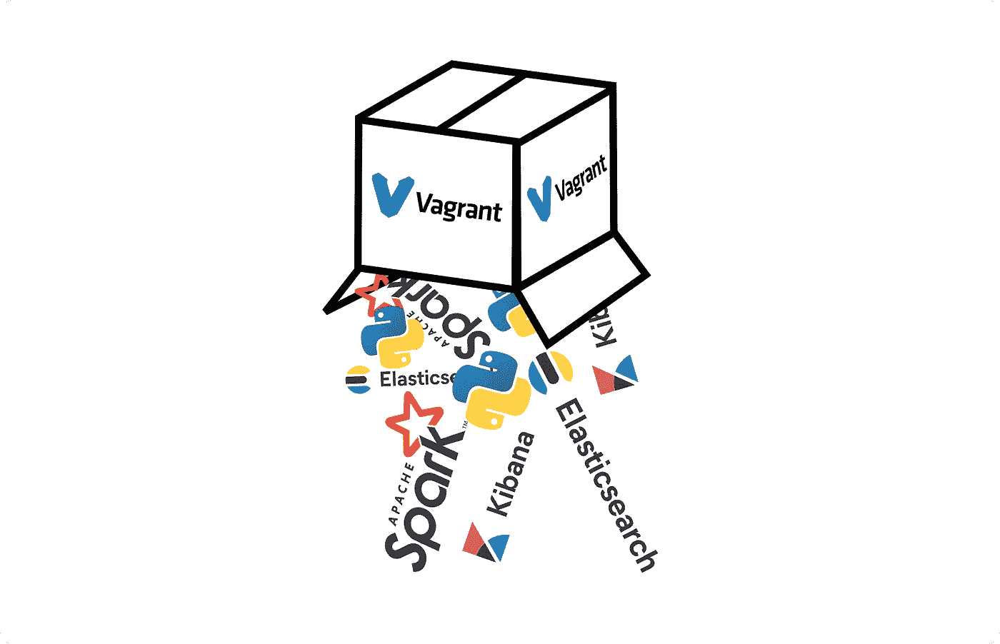

# 大数据，小盒子

> 原文：<https://towardsdatascience.com/big-data-small-box-d9896310259f?source=collection_archive---------41----------------------->

## 使用 VirtualBox: Spark、ElasticSearch & Kibana 构建和浏览大数据开发环境。


照片由[法比奥](https://unsplash.com/@fabioha?utm_source=unsplash&utm_medium=referral&utm_content=creditCopyText)在 [Unsplash](https://unsplash.com/s/photos/big-data?utm_source=unsplash&utm_medium=referral&utm_content=creditCopyText) 上拍摄

**TL；博士**:看看我们如何使用 Vagrant 来构建和配置一个大数据开发环境，它小到可以装进你的笔记本电脑。用一行代码启动这个环境。掌握 ElasticSearch、Kibana 和 Spark 的基础知识:将 Spark 数据帧索引到 Elasticsearch，然后了解如何使用 Python、Kibana 或 good ol' cURL 查询索引。享受使用虚拟机的乐趣，提高您对大数据堆栈中一些关键技术的熟练程度。

我已经尽可能地让这篇文章易于理解，你应该能够在不了解我们将使用的任何技术的情况下理解这篇文章。

# 1.介绍

在本文中，我们将把大数据堆栈中的关键技术联系在一起，探索数据如何在这些组件之间流动，以及每个组件发挥什么功能。我们将能够通过使用一种让我们构建和配置虚拟机，并为它们提供软件的技术，非常容易地做到这一点。事实上，如果你已经做到了这一步，你离拥有一个功能性的“大数据”开发环境只有几步之遥，尽管没有处理 TB 级数据集的资源。

您将能够使用此设置来学习如何在自己的时间内高效使用大数据技术堆栈(并且在没有人看到的情况下犯错误)，以便在真正使用这些技术时，您将拥有坚实的基础和一些实践经验！

## 内容

1.  [简介](#7fec)
2.  [入门](#f5f8)
3.  [弹性搜索和基巴纳](#28f3)
4.  [火花](#e4f3)
5.  [ElasticSearch Hadoop](#9535)
6.  [快捷方式](#ebea)
7.  [进一步练习和阅读](#e15a)

# 2.入门指南

是时候开始运行了..travel 允许我们根据写在 travel 文件中的指令初始化、供应和配置虚拟机。一个浮动文件包含虚拟机供应器的指令，以及(可能)在虚拟机上下载、安装和配置软件所需的所有其他内容(尽管指令块可以重构为在供应过程中执行的单独脚本)。这意味着，如果你幸运的话，有人已经创建了一个描述虚拟机的流浪文件，它有能力做你想做的事情，你可以直接进入有趣的部分。要开始使用我为本文创建的 VM，请遵循下面的步骤。

1.  下载并安装 vagger(以及类似[VirtualBox](https://www.virtualbox.org/wiki/Downloads))[https://www.vagrantup.com/intro/getting-started](https://www.vagrantup.com/intro/getting-started)这样的 VM 提供者)，检查你是否可以创建一个基本的裸机 VM。
2.  从[这里](https://github.com/kjarvis1905/vagrant-elk)克隆我的 GitHub 库，这包含一个将被用来创建一个特定 VM 的流浪文件，以及一些安装脚本来为它提供我们想要使用的软件。
3.  *进入克隆的 git repo，打开命令控制台并键入`vagrant up`。

*作为设置虚拟机过程的一部分，Spark 从[这里](https://spark.apache.org/downloads.html)下载并安装。实际上，在下载 Spark 之前，我已经包含了一个步骤，让安装脚本检查`spark-2.4.6-bin-hadoop2.7.tgz`文件是否已经存在于与流浪者文件相同的目录中，如果是，那么下载步骤被跳过。我建议手动下载这个文件，放在流浪汉文件目录下，因为下载这个`.tgz`的默认镜像站点会超级慢。

一旦你输入了`vagrant up`，就是这样！喝杯茶犒劳一下自己，因为安装和配置不会在瞬间完成。

这个简单的小命令只是触发了一系列事件的连锁反应，最终将创造一个完全成熟的大数据虚拟机供我们使用和探索。事情是这样的:

1.  创建了一个虚拟机。
2.  Python、Spark、ElasticSearch 和 Kibana 都被安装在虚拟机上。
3.  一个 Python 虚拟环境(虚拟机中的虚拟环境？矩阵多？)时，PySpark 是根据 Spark 附带的源代码构建的，并安装到该虚拟环境中。

在了解如何使用我们的虚拟机探索这些技术之前，让我们简要了解一下它们各自扮演的角色，以及它们通常如何在生产大数据环境中一起使用。

1.  **火花**。Spark 是我们的分布式计算引擎，接受使用 Python 或 Scala API 等指定的指令，并在我们的集群中优化和并行化所需的数据转换。Spark 用于在内存中快速处理大型分布式数据集。
2.  **弹性搜索**。ElasticSearch (ES)是一个搜索引擎，它允许我们对事物(文档)进行索引，这样我们可以非常快速地搜索和检索特定的信息。在本文的后面，我们将介绍如何直接从 Spark 数据帧中索引文档。可以使用一组由 es 服务器作为端点公开的 API 来搜索、更新和删除索引。这为我们提供了在非常大的数据集上构建面向用户的应用程序所必需的响应能力。
3.  **基巴纳。**基巴纳有多种用途。它可以作为一种工具，以一种用户友好的方式探索经济服务指数。我们还可以使用 Kibana 构建仪表板，并使用其开发工具来学习如何与 ElasticSearch 交互。

尽管 ElasticSearch 和 Kibana 是数据可能流向的“目的地”,但我们将通过查看这两个工具来开始探索我们闪亮的新虚拟机，因为服务器进程应该已经在运行了！

## 启动、停止和重新启动虚拟机

您可以在方便的时候轻松地停止和启动 VM。要停止 VM，在游民文件所在目录的 shell 中键入`vagrant halt`(如果您已经通过 ssh 进入 VM，请确保在执行该命令之前关闭 ssh 连接)。当您想重启 VM，并从您离开的地方开始，只需运行`vagrant up`。谢天谢地，这将比我们第一次运行虚拟机时快得多！



我们的虚拟机由 vagger 和 VirtualBox 构建，托管了多项大数据技术。

# 3.弹性搜索和 Kibana

虚拟机启动并运行后，让我们执行一些基本的检查，以确保一切正常。您应该已经克隆了 git 存储库，并运行命令`vagrant up`来启动、配置和供应虚拟机。现在运行命令`vagrant ssh`将 ssh 导入正在运行的机器。使用以下命令检查 ElasticSearch 和 Kibana 是否已成功启动:

`systemctl status elasticsearch` (2.a)

`systemctl status kibana` (2.b)

这两个命令应该向我们显示一些看起来令人放心的输出，告诉我们我们的服务正在运行。如果一切正常，运行以下代码应该没有问题:

`curl -XGET http://127.0.0.1:9200/_cat/health?v` (3)

我们刚刚向 ElasticSearch REST API 提交了一个 HTTP GET 请求，我们应该会收到一个响应，给出一些关于弹性集群状态的诊断信息。从 ES 索引中查询和检索信息同样简单！我们可以尝试的下一件事是切换到我们主机上的浏览器并导航到`127.0.0.1:5602`(注意，在`Vagrantfile`中，我们已经配置了来宾虚拟机的端口`5601`，这是 Kibana 正在侦听的端口，用于将流量转发到主机上的端口`5602`)。在我们的浏览器中，我们应该能够看到一个闪屏，告诉我们 Kibana UI 正在启动。加载后，导航至“开发工具”(左侧导航面板底部的扳手图标)。这使我们能够访问一个控制台，该控制台允许我们向 es 服务器发送请求，并帮助我们处理语法、自动完成以及探索可用的选项。响应显示在相邻的窗口中。尝试输入`GET /_cat/health?v`并将查询发送到 ES 服务器。在引擎盖下，发生了与我们执行(3)时非常相似的事情。

很高兴知道我们的 ES 集群正在运行——但是更好的做法是完成文档的索引和搜索过程。导航到一个工作目录—可能是`/home/vagrant`，然后使用下面的命令下载并解压缩一些示例数据。

`wget https://download.elastic.co/demos/kibana/gettingstarted/accounts.zip` (4.a)

`unzip accounts.zip` (4.b)

现在我们将使用 ElasticSearch [批量上传 API](https://www.elastic.co/guide/en/elasticsearch/reference/current/docs-bulk.html) 来索引`accounts.json`中的文档。为此，我们需要向 ES 服务器发出一个`POST`请求。完整的命令是:

`curl -H "Content-Type: application/x-ndjson" -XPOST 127.0.0.1:9200/financial/_bulk?pretty --data-binary @accounts.json` (5)

注意`accounts.json`是根据 API [文档](https://www.elastic.co/guide/en/elasticsearch/reference/current/docs-bulk.html)中概述的要求方便地格式化的。这就在`financial`索引中创建了 1000 个新文档。一个成功的请求将会得到一个由类似下面的单元组成的长响应:

```
"index" : {
        "_index" : "financial",
        "_type" : "_doc",
        "_id" : "990",
        "_version" : 4,
        "result" : "updated",
        "_shards" : {
          "total" : 2,
          "successful" : 1,
          "failed" : 0
        },
        "_seq_no" : 3998,
        "_primary_term" : 1,
        "status" : 200
      }
```

现在让我们从索引中检索一些文档。为了增加多样性，切换回浏览器中打开的 Kibana 应用程序。转到控制台，键入`GET /financial/_doc/1`，然后“点击发送请求”。在相邻的窗口中，我们将看到响应，应该是成功的，以及带有`_id = 1`的文档的内容。将使用文档的内容填充`_source`属性。注意，我们可以通过使用不同的工具，比如`curl`，来发出请求，从而获得相同的结果。

如果你已经做到了这一步，祝贺你。您已经拥有了使用 ElasticSearch 和 Kibana 进行探索和实验所需的一切。请记住，稍后您可以轻松地停止并重新启动您的虚拟机，以继续接下来的步骤。

# 4.火花

我们要使用的下一项技术是 Spark。Spark 实际上是高性能大数据处理的同义词。我想在这里介绍它的原因是，可以直接将 Spark 数据帧的行索引到一个弹性簇中。这使得直接从数据处理管道向 Elastic 写出步骤(我们的输出)变得非常容易，在 Elastic 中，可以通过 API 搜索索引和检索单个文档，或者使用 Kibana 仪表板浏览和可视化。在我更详细地介绍如何做到这一点之前，让我们先了解一下如何在我们的流浪者虚拟机中使用 Spark。Spark 有用多种语言编写的 API，我们将使用 Python API，也就是 PySpark。

从连接到虚拟机的 shell 中，导航到`/vagrant/examples`，并运行

`pipenv shell`，(6)

这将激活已经使用`pipenv`设置好的 Python 虚拟环境。通过使用 pip 构建和安装 Spark 发行版中包含的 PySpark 源代码，PySpark 已经被安装到这个虚拟环境中。如果您有兴趣更详细地理解这些步骤，您可以查看 GitHub 资源库中的`bootstrap/install/spark_install.sh`和`bootstrap/install/setup_demo_project.sh`脚本。

此时，你有两个选择:一组捷径，或者绕远路。要查看可用的快捷方式，请查看快捷方式部分。

请继续阅读，寻找一种更为基础的方法，我们将一个接一个地分解中间步骤。

我们应该做的第一件事是启动 Python 解释器并运行以下命令，以检查我们是否可以正确启动 Spark 会话:

```
(examples) vagrant@vagrant:/vagrant/examples$ python
Python 3.5.2 (default, Jul 17 2020, 14:04:10)
[GCC 5.4.0 20160609] on linux
Type "help", "copyright", "credits" or "license" for more information.
>>> import pyspark
>>> from pyspark.sql import SparkSession
>>> ss=SparkSession.builder.getOrCreate()
```

这将为您提供一个 SparkSession 对象，它是底层 Spark 魔法的主要入口点，接下来我们应该使用它将一些数据加载到 DataFrame 中。为此，我们将重复使用上一节中获得的`accounts.json`。我们需要通过删除包含索引/id 信息的行来快速转换这些数据，这样我们就可以将数据读入 Spark 数据帧。我们可以使用`sed`(流编辑器)来完成，您可以在单独的 shell 中使用它:

```
cat accounts.json | sed -n 's/\({"a.*}\)/\1/\p' > accounts_edited.json
```

用`head -n 5 accounts_edited.json`检查结果，你会注意到我们用索引信息去掉了断续的行。你还会注意到我的正则表达式非常懒惰，在更一般的情况下会很快失效。我不找借口。

切换回我们的 Python 解释器，将 json 文件加载到 Spark 数据帧中(注意，如果您将数据下载到不同的位置，则必须在代码片段中设置适当的路径):

```
>>> import json
>>> import os
>>> data_file = os.path.join(os.environ['HOME'], 'accounts_edited.json')
>>> with open(data_file, 'r') as f:
...   data = [Row(**json.loads(l)) for l in f]
...
>>> df = ss.createDataFrame(data)
>>> df.printSchema()
root
 |-- account_number: long (nullable = true)
 |-- address: string (nullable = true)
 |-- age: long (nullable = true)
 |-- balance: long (nullable = true)
 |-- city: string (nullable = true)
 |-- email: string (nullable = true)
 |-- employer: string (nullable = true)
 |-- firstname: string (nullable = true)
 |-- gender: string (nullable = true)
 |-- lastname: string (nullable = true)
 |-- state: string (nullable = true)
```

这个 Spark 数据帧与您可能在使用 Spark 的任何类型的数据处理管道的末端(或中间(或开始…))使用的对象完全相同。我们接下来要做的是看看如何将这个对象中包含的数据直接索引到 ElasticSearch 中。

# 5.ElasticSearch Hadoop

现在，为了能够将 Spark 数据框架直接索引到 ElasticSearch 中，我们需要付出一些努力来进行设置——即 ElasticSearch 和 Spark 之间的接口，该接口由 [ElasticSearch Hadoop](https://www.elastic.co/what-is/elasticsearch-hadoop) 提供。同样，一些工作已经完成了:所需的归档文件已经在 VM 的供应期间下载并解压缩，相关的代码片段可以在这里找到。您还会注意到，我在`.bashrc`文件中添加了一个`export`语句，定义了一个名为`ES_HDP_JAR`的环境变量。将该变量的值回显到控制台，以查看实例化会话时需要传递给 Spark 的 jar 文件的路径。正是因为包含了这个 jar 文件，我们才可以直接使用 PySpark DataFrameWriter 对象中的索引数据。我们可以利用 Python 中的环境变量来轻松配置新的 SparkSession:

```
(examples) vagrant@vagrant:/vagrant/examples$ python
Python 3.5.2 (default, Jul 17 2020, 14:04:10)
[GCC 5.4.0 20160609] on linux
Type "help", "copyright", "credits" or "license" for more information.
>>> import os
>>> from pyspark import SparkConf
>>> from pyspark.sql import SparkSession
>>> sconf = SparkConf().set('spark.jars', os.environ['ES_HDP_JAR'])
>>> ss = SparkSession.builder.config(conf=sconf).getOrCreate()
```

我们将索引使用前面步骤中的`accounts_edited.json`数据创建的数据帧。我们需要运行的命令是:

```
>>> df.write\
... .format('org.elasticsearch.spark.sql')\
... .option('es.nodes', 'localhost')\
... .option('es.port', 9200)\
... .option('es.resource', 'sparkindex')\
... .save()
```

上面的命令使用数据帧`df`的内容创建一个新的索引`sparkindex`。要查看这个新索引的内容，请切换回 Kibana 控制台(或使用等效的命令行),并使用带有空“match_all”子句的搜索 API:

```
GET /sparkindex/_search
{
  "query": {
    "match_all": {}
  }
}
```

请注意，ElasticSearch 文档包含了与上面类似的示例，带有“复制为 cURL”选项，因此您可以看到如何使用 cURL 实现相同的结果。

响应的正文将包含一些匹配的文档:

```
"hits" : [
      {
        "_index" : "sparkindex",
        "_type" : "_doc",
        "_id" : "PFapu3MB4cJ_QglfiKLK",
        "_score" : 1.0,
        "_source" : {
          "account_number" : 1,
          "address" : "880 Holmes Lane",
          "age" : 32,
          "balance" : 39225,
          "city" : "Brogan",
          "email" : "[amberduke@pyrami.com](mailto:amberduke@pyrami.com)",
          "employer" : "Pyrami",
          "firstname" : "Amber",
          "gender" : "M",
          "lastname" : "Duke",
          "state" : "IL"
        }
      }
]
```

注意，因为我们没有指定一个列作为惟一的文档标识符，所以已经代表我们生成了`_id`字段。

[返回目录](#7)

# 6.捷径

在`/vagrant/examples`中输入`pipenv shell`，然后输入`spark-es-demo --help`，您会看到有几个命令可以运行:

`spark-es-demo make-spark-dataframe` (7.a .)

`spark-es-demo spark-to-es` (7.b)

`spark-es-demo search-es-index` (7。c)

运行这些并检查各自的代码(在`/vagrant/examples/examples/spark_demo.py`中可以找到)应该会给你一些有用的、有文档记录的例子来参考。

(7.a)将下载一些演示数据，并将其放入 Spark 数据帧中。

(7.b)将带您了解通过 Spark DataFrame 将数据放入弹性集群的整个过程。

(7.c)将允许您编写一个基本的匹配查询并提交给一个 ES 集群。默认情况下，它会寻找一个名为`sparkindex`的索引，运行(7。b)将创建它，并将一些数据放入其中，以便该命令可以成功运行。运行带有`--match-all`选项的命令将提交一个匹配所有查询并返回一些结果，这样您就可以看到一些从 es 索引返回的文档示例。系统会提示您选择要搜索的字段，然后要求您输入要搜索的值。将返回实际结果的一些组合有:

`0\. firstname`接着是`Nanette`(感谢 Nanette)

`3\. employer`接着是`Anocha`(感谢 Anocha)

试着找出一些其他的。

# 7.进一步练习

在前面的章节中，我们简要介绍了如何使用一些关键的大数据技术。我们已经通过示例逐步了解了如何:

1.  使用 ElasticSearch REST API 索引和查询数据。
2.  使用 Kibana 及其开发工具和控制台与 ElasticSearch 集群进行交互。
3.  使用 Python 配置 SparkSession，并使用 ElasticSearch Hadoop 接口将数据直接从 Spark 数据帧索引到 ElasticSearch 索引。
4.  通过使用 Python 的 urllib 编写请求来搜索 ES 索引。

从这里开始，您可以使用我们的 vagger 开发环境来磨练您的大数据技能:熟练使用 Lucene，这是 ElasticSearch 用来编写搜索并返回与我们的查询匹配的文档的库，使用 Kibana 来构建仪表板以可视化和探索您最喜欢的数据集，构建 ETL 管道以将转换的数据集写入 ElasticSearch 索引，等等。