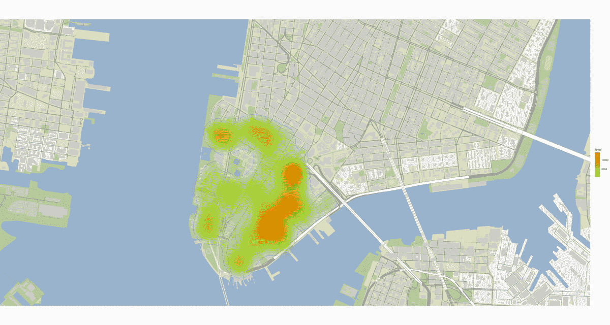
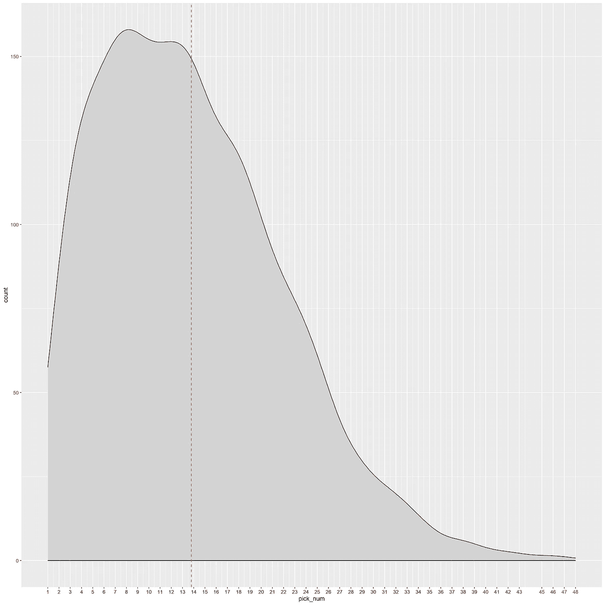
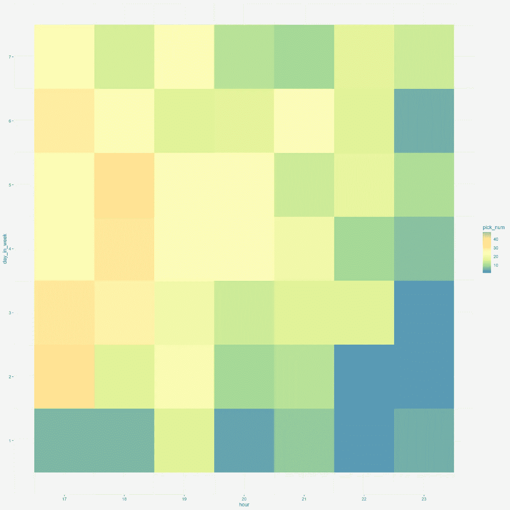
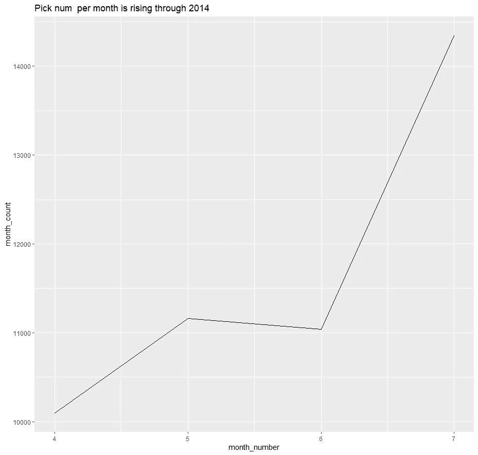
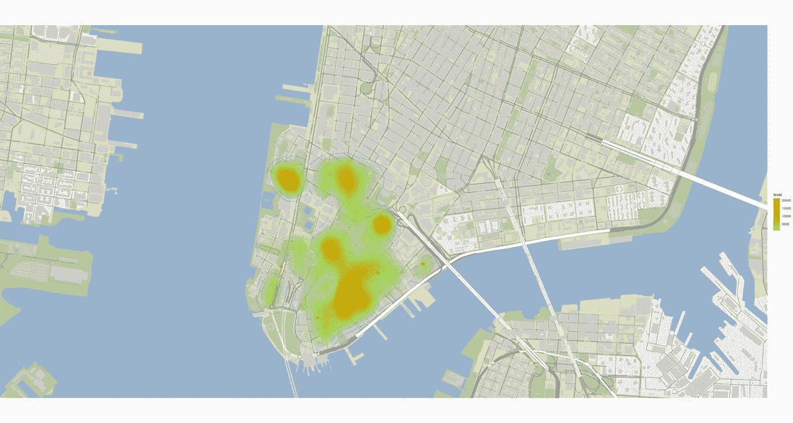
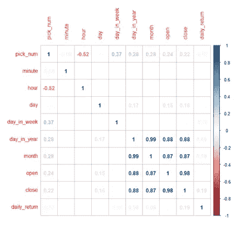
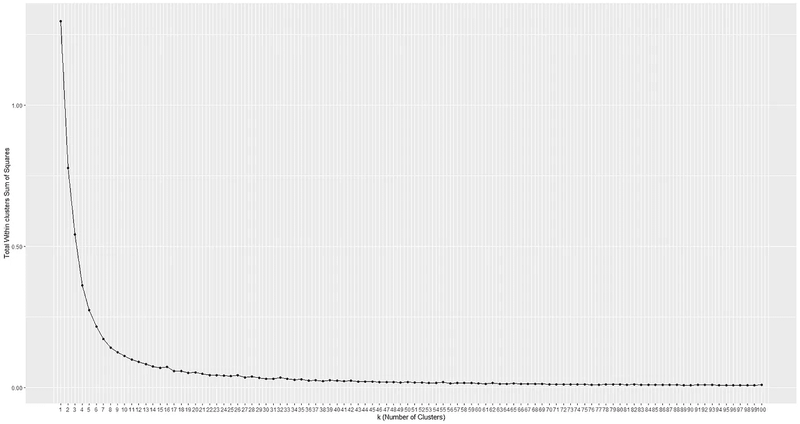
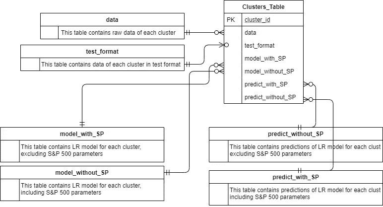

# 大数据；纽约优步天气预报

> 原文：<https://towardsdatascience.com/big-data-uber-forecast-in-new-york-5a25ffb9914f?source=collection_archive---------48----------------------->


维克多·拉兹洛拍摄于[的照片](https://pixabay.com/photos/taxi-uber-transportation-city-1999009/)

## 将 450 万条记录转化为见解和预测

在这个故事中，我描述了我作为一名经济学学生在特拉维夫大学学习大数据课程时开发的预测方法。

我收到了纽约市 450 万份优步骑行订单的数据集，它将司机和那些对骑行感兴趣的人联系起来。
该数据集包含 2014 年 4 月至 7 月的观测数据，包括订购地点和时间。
根据数据集，我被要求每隔 15 分钟预测未来一个月(2014 年 9 月)的订单数量。

首先，我将描述对数据的研究，以发现模式和联系，然后基于研究见解，将交叉检查额外的数据。
最后，将阐述预测游乐设施未来趋势的模型。



## 数据研究

首先，我已经根据项目规范清理了数据；缩小了从纽约证券交易所到午夜的 1 公里半径范围，确保没有丢失的数据单元。
然后，订单被分成 15 分钟的时间段窗口。
我创建了下面的[图，它描述了在 15 分钟的时间段内，给定数量的订单](https://github.com/AvivYaniv/Big-Data-Uber-Forecast-In-New-York/blob/master/Data%20Exploration/PicknumDistribution/graph_distribution.png)出现的次数。
(即已经有 20 个订单的次数【x 轴】，在 15 分钟时段窗口中是在【y 轴】)。



乘坐次数分布

正如你所看到的，这个分布峰值接近它的平均值，然后急剧下降。
分布尾部主要由[异常](https://en.wikipedia.org/wiki/Anomaly_(natural_sciences))时间段窗口组成，在这些时间段内，乘车需求激增。
这种[模式在其他月份也保持一致](https://github.com/AvivYaniv/Big-Data-Uber-Forecast-In-New-York/tree/master/Data%20Exploration/PicknumDistribution)。
这种订单数量惊人的现象引发了我的好奇心，因此我整理了下表[，其中描述了主要事件和天气状况](https://github.com/AvivYaniv/Big-Data-Uber-Forecast-In-New-York/blob/master/Data%20Exploration/Peak%20Pick%20Nums%20Versus%20Events%20and%20Climate/Peak%20Pick%20Nums%20Versus%20Events%20and%20Climate.xlsx)。
该表按乘坐次数降序排列，旨在发现重大事件和多雨天气与接送次数之间是否存在关联。
如您所见，在 52%的 40 次以上游乐设施时段窗口和 48%的 30-40 次游乐设施时段窗口中，确实出现了重大活动的寒冷天气，这可能描述了游乐设施需求的飙升。
虽然这可以解释时隙窗口中的一些异常，但这些原因(如未来天气或重大事件)是无法预测的，因此在设计模型时要特别注意处理它们。

继续进行数据研究，创建[“热图”，描述一周中每一天每一个小时的订单数量](https://github.com/AvivYaniv/Big-Data-Uber-Forecast-In-New-York/blob/master/Data%20Exploration/PeakNumHoursInDay/color_distribution.png)。



每天每小时的乘车次数热图

正如你所看到的，工作日下午 17 点至 19 点的需求有所上升(可能是因为下班通勤)，工作日深夜时段的需求有所下降。
这种[模式在其他月份也保持一致](https://github.com/AvivYaniv/Big-Data-Uber-Forecast-In-New-York/tree/master/Data%20Exploration/PeakNumHoursInDay)。

此外，不同月份的[订单总量趋势显示](https://github.com/AvivYaniv/Big-Data-Uber-Forecast-In-New-York/blob/master/Data%20Exploration/UberGrowth/Pick%20num%20%20per%20month%20is%20rising%20through%202014.png)[优步在 4-7 月份](https://github.com/AvivYaniv/Big-Data-Uber-Forecast-In-New-York/tree/master/Data%20Exploration/UberGrowth)增长，在 5 月份有所倾斜。



2014 年 4 月至 7 月优步订单数量的增长

此外，我还研究了需求领域及其模式。
下面的[热图用暖色](https://github.com/AvivYaniv/Big-Data-Uber-Forecast-In-New-York/blob/master/Data%20Exploration/Heatmap/heatmap.png)描述了一周不同日子里订单数量最高的区域。


每天的动态热图；暖色是订单数量较多的区域

正如你所看到的，需求在一周的不同日子里会发生变化，尤其是工作日和周末之间。

然而，“温暖”区域在不同月份之间保持不变，与每日热图相比，表现出较低的熵。



不同月份的动态热图；暖色是订单数量较多的区域

这些温暖的区域与曼哈顿提到的[吸引点](https://github.com/AvivYaniv/Big-Data-Uber-Forecast-In-New-York/tree/master/Data%20Exploration/Attractions)和[兴趣点相关联。
另一个有趣的观察是，温暖的地区不靠近火车站，火车站在那些时间经常经过。有理由相信，在某些情况下，火车是优步乘车的替代品。](https://github.com/AvivYaniv/Big-Data-Uber-Forecast-In-New-York/blob/master/Data%20Exploration/Attractions/quora.com-As%20a%20tourist%20what%20is%20the%20best%20area%20of%20New%20York%20to%20stay%20in.pdf)

最后，建立了一个相关矩阵。



## **建立模型**

开发的模型是一个[聚类](https://en.wikipedia.org/wiki/Cluster_analysis)模型。
每一个订单都被分配到一个聚类，而聚类中心就在最温暖地区的中心。
这样的划分是为了独立地了解每个区域的模式，因为不同的区域在不同的日子和时间变暖——然而星团的中心又被称为“[质心](https://en.wikipedia.org/wiki/Centroid)”几乎是静止的。
为了选择正确的聚类数量，我在聚类平方和图中创建了一个[总数。
该图用于确定合理的集群数量(用 K 表示)，使用](https://en.wikipedia.org/wiki/Total_sum_of_squares)[“肘法”](https://en.wikipedia.org/wiki/Elbow_method_(clustering))启发式；收益递减不再值得额外成本的分界点(当解释的数据量微不足道时，停止添加新的聚类或提高 K)。



[聚类平方和图内合计](https://en.wikipedia.org/wiki/Total_sum_of_squares)

所选择的群集数量(可在代码中配置)是 K=8，其质心与上述较温暖的区域相匹配。

为了构建模型，在将订单划分为聚类之后，使用由 [Hadley Wickham](http://hadley.nz/) 为聚类开发的 [dplyr 库](https://dplyr.tidyverse.org/)构建了一个指定的表。
主表中的每一行都匹配一个聚类的数据，并且对其应用了[线性回归](https://en.wikipedia.org/wiki/Linear_regression)。
以这种方式，模型被训练以独立地学习每个聚类的模式，并且[回归](https://en.wikipedia.org/wiki/Linear_regression)将基于每个聚类的独特特征为每个聚类产生不同的系数。
未来 15 分钟时隙窗口的期望预测是所有聚类预测的总和。



线性[回归](https://en.wikipedia.org/wiki/Linear_regression)模型为:

```
pick_num ~ minute + hour + day_in_week + hour*day_in_week
```

增加了一周中的小时和天之间的相互作用，以掌握它们的不同组合的效果。

此外，如上所述，每个月都有异常时段窗口，订单量非常大；
为了解决这一问题，并消除天气或不可预测事件的负面影响，为每个集群引入了订单量阈值，阈值=9，可通过代码进行配置。
以基于集群的方式削减阈值有利于禁用一个集群中的异常，而不会对另一个集群产生副作用，并且与设置全局阈值相比更加灵活。

## 摘要和其他模型

总而言之，我已经从数据研究和识别不同日期和时间的模式开始，并继续研究不同月份和温暖地区的模式。

我发现在不同的月份之间，温暖的地区几乎保持不变。
然而，在一周的不同日子里，尤其是当比较工作日和周末时，温暖的区域发生了变化。
然后，研究了时间段窗口中的异常情况，其中订单数量激增。
寒冷天气、重大事件和那些异常现象之间的关联已经得到证实。
有了这些见解，我开发了一个与温暖地区相匹配的聚类模型，并独立地学习了每个聚类的模式。
除了开发的模型之外，简单的线性模型(尽管很明显它们不能掌握全局)以及[随机森林](https://en.wikipedia.org/wiki/Random_forest)模型也已经过测试(以及与聚类模型的组合)——然而这些模型都没有超过上述模型所达到的 [R](https://en.wikipedia.org/wiki/Coefficient_of_determination) 。
最后，提出了一种模型，该模型将城市划分为感兴趣的区域，并为每个区域学习唯一的系数，从而最小化异常的不良影响。

***喜欢这篇文章吗？随意长按👏下面的按钮😀***