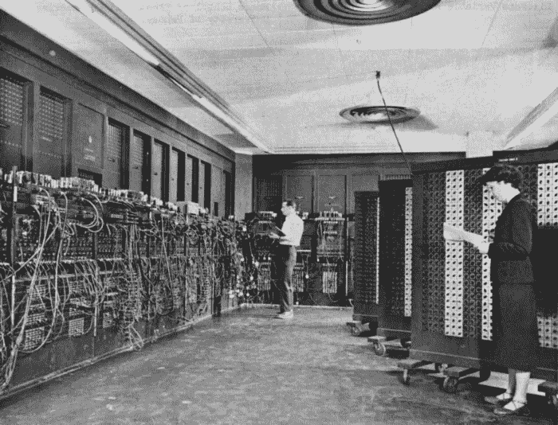
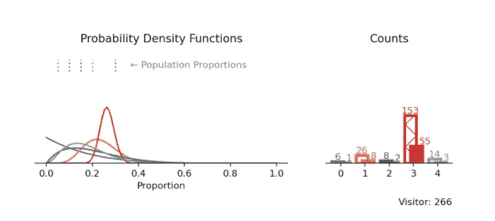
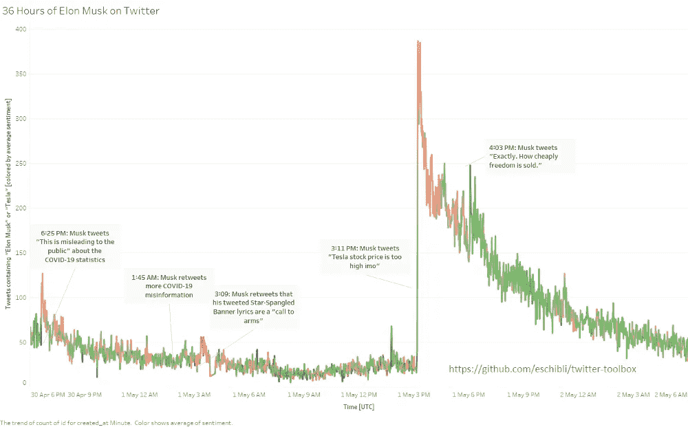

# 大数据:昨天、今天和明天

> 原文：<https://towardsdatascience.com/big-data-yesterday-today-and-tomorrow-389de1a46cd8?source=collection_archive---------53----------------------->

美国陆军照片，n.d .公共领域

## [什么是“大数据”——了解历史](/what-is-big-data-understanding-the-history-32078f3b53ce)

由[詹姆斯·怀恩加](https://medium.com/u/b75ea42c54c2?source=post_page-----389de1a46cd8--------------------------------) — 18 分钟阅读

一次历史之旅，我们是如何走到这一步的，我们释放了哪些能力，以及我们下一步要去哪里？

Guillermo Ferla 在 Unsplash 上拍摄的照片

## [重新审视聚类算法](/a-fresh-look-at-clustering-algorithms-c3c4caa1a691)

通过 [Dmitry Selemir](https://medium.com/u/856e22453cfd?source=post_page-----389de1a46cd8--------------------------------) — 14 分钟读取

这个项目根本没有到最后阶段。分享当前的想法，详细检查代码，获得一些反馈，看看是否值得进一步开发。

## [多臂强盗实验的视觉探索](/a-visual-exploration-of-multi-armed-bandit-experiments-278f1f15c4f1)

保罗·斯图布利 — 9 分钟阅读

在营销数据科学部门工作有一个不变的事实:在实验和开发之间做出选择从来都不容易。当你想推出限时优惠时，尤其如此，因为你事先对不同版本的优惠效果知之甚少。

田宽在 Unsplash 上的照片

## [使用 DVC 构建可维护机器学习流水线的终极指南](/the-ultimate-guide-to-building-maintainable-machine-learning-pipelines-using-dvc-a976907b2a1b)

由[德博拉·梅斯基塔](https://medium.com/u/dd9e06a0a640?source=post_page-----389de1a46cd8--------------------------------) — 10 分钟阅读

当我的 ML 项目开始发展时，我通常会感到焦虑，因为:一切都开始变得混乱，我知道它变得一团糟，但我不知道如何改善它。我喜欢使用开源工具和框架，因为随着项目的发展，贡献者的知识会“嵌入”其中。

## [使用 twitter-nlp-toolkit 进行简单的 Twitter 分析](/simple-twitter-analytics-with-twitter-nlp-toolkit-7d7d79bf2535)

埃里克·希布利(Eric Schibli)—4 分钟阅读

Twitter 是商业分析和学术或教学自然语言处理最丰富的数据源之一；Kaggle 上的许多顶级数据集都是在 Twitter 上收集的，最受欢迎的文本嵌入之一是使用 Twitter 训练的，几乎每个公司都在积极监控 Twitter。

我们的每日精选将于周一回归！如果你想在周五收到我们的 [*每周文摘*](/receive-our-newsletters-681049ffa0cf) *，很简单！跟随* [*我们的出版物*](http://towardsdatascience.com/) *，然后进入你的设置，打开“接收信件”您可以在此* *了解有关如何充分利用数据科学* [*的更多信息。*](/how-to-get-the-most-out-of-towards-data-science-3bf37f75a345)