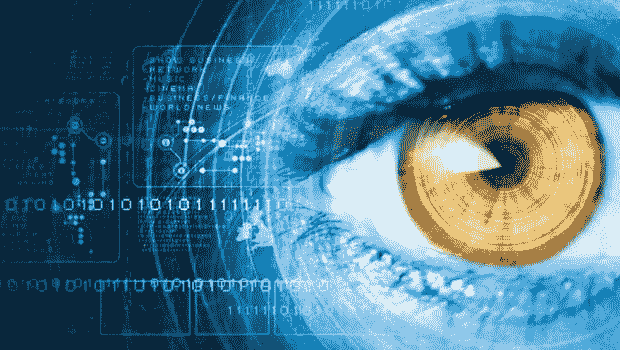

# 大型科技公司正向我们走来。但是我们可以阻止它。

> 原文：<https://towardsdatascience.com/big-tech-is-coming-for-us-but-we-can-stop-it-a61ba00101e9?source=collection_archive---------25----------------------->

## 监控数据化世界中的隐私。

来源:[可信评论](https://www.trustedreviews.com/news/your-next-flagship-phone-could-pack-iris-scanning-security-measures-2932136)

早上闹钟响的时候，你做的第一件事是什么？就在你睡觉前？你周围有多少人正在使用他们的手机或电脑？

过去的十年改变了我们人类的日常生活。几乎不可能用几种不同的方式来衡量我们使用了多少技术。订购比萨饼、跟踪您的心跳、与朋友分享片刻、关注新闻——我们在任何事情上都使用技术。它的可负担性和可访问性使它更加有趣和成功，因为它已经嵌入到我们所做的一切事情中，无论是专业的还是个人的。然而，所有这些进步和便利都是有代价的。在过去的十年中，像“数字 DNA”和“数据阴影”这样的术语已经成为现实，并突显了我们不断从我们使用的各种技术服务中收集的大量信息。对消费者来说，技术带来了一种奇妙的满足感。然而，在后台，技术开始要求通过监视、控制和行为影响来扩大关于我们在线活动的数据集。随着这些系统逐渐走向全知，是时候我们考虑承认问题，设置限制并大声说出来了。

那么，这项技术是如何工作的呢？

算法。算法是告诉计算机如何执行任务的一段代码——计算机在解决问题的操作中必须遵循的一组规则，以产生特定的结果。对于普通大众来说，算法本质上是一个塑造我们周围世界的黑匣子。然而，我们不知道它们是什么，也不知道我们如何受到它们的影响。我们当前的数字环境要求我们在过去的偏见影响我们的未来之前打开这些算法黑匣子。是时候让我们的声音和需求被听到了。

弗兰克·帕斯奎尔推广了“算法自我”的概念，“T1”是在网上战略自我推销中得到很好实践的自我。虽然算法仍然不透明，但社会规范正在迅速变化。他提到，“一种网络眩晕由此产生，因为我们被迫推销我们的算法自我，但却对这样做的最佳方式感到困惑。”这提出了一个重要的问题——谁在为我们推动这个决策过程？谁负责激发我们尝试自我推销的不同方式？Pasquale 探讨了监控在公众日常使用的技术中的存在，以及从所有数据收集中提取的指标如何允许“大规模行为调节”

如果我们跳入热门电视节目《黑镜》的反乌托邦宇宙，剧集《俯冲》就是一个被监控的世界修改我们行为的完美例子，它根据我们过去的所作所为“建议”我们该做什么和如何表现。在这个世界上，在由社会等级奖励的善意和善良的表面下，个人被剥夺了情感和身体上的个人主义和自由意志。被困住和控制，他们在努力自我优化和自我提升时成为指令的追随者。

有点担心吧？事实上，这是不太遥远的未来。大约 13 小时后，中国将最早于 2020 年推出反乌托邦记分卡系统。虽然中国已经实行了大量的审查制度，但这一制度将赋予当权者对其公民几乎完全的控制权。公民的行为将在各个方面进行排名，任何不符合“规则”的行为都将受到惩罚更高的分数意味着更高的生活质量，这完全取决于有效地成为中国政府的奴隶，失去一个人作为一个人的所有权利。

现在，你可能会觉得这很惊人，但是我们在美国也有类似的系统。

在中国，公民现在和将来都是政府审查和行为修正的受害者。虽然美国是建立在自由的价值观上的，但我们这里有私人实体，主要是在硅谷，他们也在类似的轨道上进行他们自己版本的监控和修改。Twitter 最近禁止了政治广告，这凸显了由消费者数据收集驱动的在线广告的力量。这是关于你和我的数据。目标是保护普通人免受虚假政治广告、被篡改的视频和误导信息的传播。Twitter 的首席执行官杰克·多西提到，政治信息的传播“应该是挣来的，而不是买来的”在过去的选举中，社交媒体上的这类广告被认为不公正地影响了选民，导致一些人可能认为不具代表性的选举结果。然而，我们认为这一禁令是对用户可以接触的内容的控制行为，还是一种保护形式？

技术变得既具有创新性又具有破坏性，并正在慢慢接管政府过去的工作。我们必须将权力交还给人民。算法推动技术流程的成功。这些流程不透明，存在歧视和偏见影响我们决策的风险。但是，我们应该责怪算法决定了我们在做什么，还是应该责怪构建这些算法的人？有关数据权利的问题始于脸书-剑桥分析公司数据丑闻的公开。在一次关于脸书在数字世界中的角色的对话中，Kickstarter 的前数据主管弗雷德·贝纳森(Fred Benenson)描述了一种被称为“数学清洗”的趋势:我们倾向于崇拜像脸书这样的程序，认为它们完全是客观的，因为它们的核心是数学。他说，“算法和数据驱动的产品将永远反映建造它们的人类的设计选择。”我们没有被机器控制；我们正被极少数强大的人所控制。这就是我们如何变得相同并失去我们的个人主义。我们能阻止它吗？

技术革命不仅仅发生在网上，也发生在个人层面和整个社会结构中。随着我们继续依赖技术，我们正在放弃越来越多的关于我们自己的信息作为交换。公众越早集体理解技术的根深蒂固的影响，我们就能越早让剥削我们的跨国科技公司承担责任。我们从导致其余部分的问题开始——透明度。作为用户，权力在我们手里。