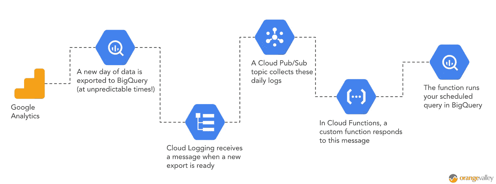
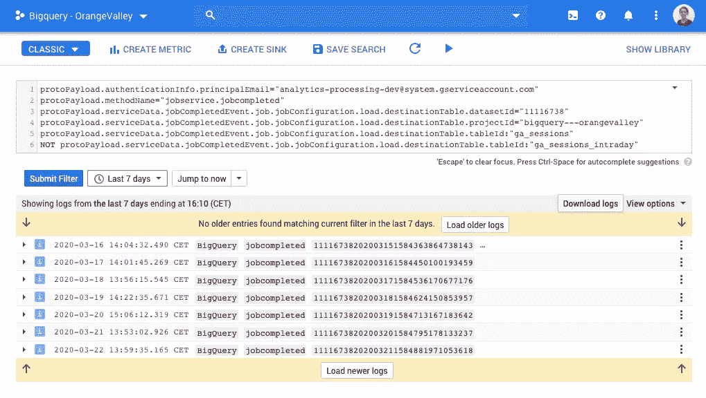
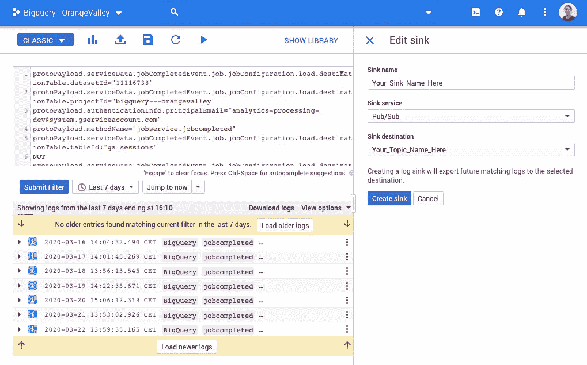
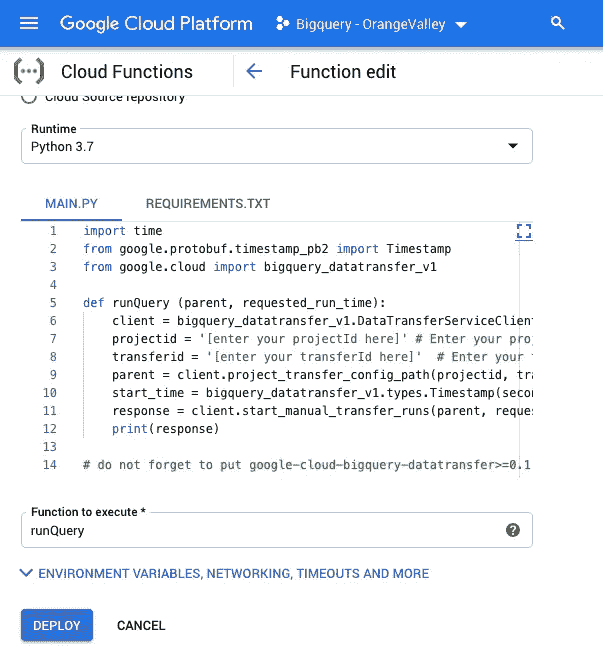

# BigQuery +云函数:如何在新的谷歌分析表可用时立即运行查询

> 原文：<https://towardsdatascience.com/bigquery-cloud-functions-how-to-run-your-queries-as-soon-as-a-new-google-analytics-table-is-17fbb62f8aaa?source=collection_archive---------1----------------------->

## 如何确保您的表格、仪表板和数据传输始终保持最新的分步指南



如果你的谷歌分析视图链接到 BigQuery，你可能正在享受它带来的好处。您的数据中没有抽样，您可以引入第三方数据，您对您的数据有更多的控制权等等。

但是，有一件事困扰着我。也许这也困扰着你。每天从 Google Analytics 导出到 BigQuery 表(ga_sessions_YYYYMMDD)的确切时间可能有些不可预测。这使得在这个数据集上运行计划查询而不冒一点风险是不可能的。

*   您可能过早设置了计划查询。如果由于某种原因，Google Analytics 的导出被延迟，您可能会错过一天的数据。每次发生这种情况时，您都必须手动更正。或者你可以考虑使用日内表。但这可能也不理想，因为谷歌声明:“在每日导入完成之前，当天的数据不是最终数据。你可能会注意到日内和每日数据之间的差异”(见文档[这里](https://support.google.com/analytics/answer/3437719?hl=en&ref_topic=3416089))。
*   *您可能会将计划查询设置得太晚。在这种情况下，如果出口延迟，你可能是安全的。但是，您的仪表板的基础表和/或向其他数据系统的可能转移可能不像决策者需要的那样是最新的。*

当然，在这个不确定的日冕时代，你可以称之为第一世界的问题。但因为这是一个我可以帮助解决的问题，我将带您一步步地了解如何在 Google Analytics 新的每日导出准备就绪时运行您的预定查询。结果是一个更加可靠的设置，其中您的表和仪表板总是尽可能地保持最新。

我们将采取的步骤是:

1.  在云日志中创建一个过滤器，隔离确认新的 Google Analytics 表准备就绪的每日日志。
2.  设置一个收集这些每日日志的云发布/订阅主题。
3.  部署一个云函数，一旦用新日志更新了发布/订阅主题，它就在 BigQuery 中运行您的计划查询。

# 第一步。云日志记录

*   好的。首先要做的是打开[云日志](https://console.cloud.google.com/logs)。
*   单击搜索字段右侧的小下拉箭头，选择“转换为高级过滤器”。至少，在我写这篇文章的时候，它还在那里😉。
*   您可以复制/粘贴下面的代码来创建一个过滤器，该过滤器将隔离确认新的 Google Analytics 表(ga_sessions_YYYYMMDD)已创建的日志。不要忘记在前两行填写您自己的数据集 ID 和项目 ID。

```
protoPayload.serviceData.jobCompletedEvent.job.jobConfiguration.load.destinationTable.datasetId="[REPLACE_WITH_YOUR_DATASET_ID]"protoPayload.serviceData.jobCompletedEvent.job.jobConfiguration.load.destinationTable.projectId="REPLACE_WITH_YOUR_PROJECT_ID"protoPayload.authenticationInfo.principalEmail="[analytics-processing-dev@system.gserviceaccount.com](mailto:analytics-processing-dev@system.gserviceaccount.com)"protoPayload.methodName="jobservice.jobcompleted"protoPayload.serviceData.jobCompletedEvent.job.jobConfiguration.load.destinationTable.tableId:"ga_sessions"NOT protoPayload.serviceData.jobCompletedEvent.job.jobConfiguration.load.destinationTable.tableId:"ga_sessions_intraday"
```

*   如果您将时间范围调整为过去 7 天，您现在应该每天都会看到一条消息。在下面的截图中，您可以看到导出的确切时间的不可预测性。在这个例子中，有时候桌子在下午 2 点之前就准备好了，有时候在下午 3 点之后。如果你的屏幕是这样的，你就准备好进入下一步了！



谷歌日志中的截图

# 第二步。云发布/订阅

Pub/Sub 代表发布-订阅，可以看作是系统之间的消息传递系统。在这种情况下，我们希望创建一个新的发布/订阅主题，收集我们在上一步中隔离的日志。这样，每次有新的 Google Analyicts 表可用时，都会收集一条消息。

*   点击上面截图中的“创建汇”。
*   输入接收器名称时，您可以随心所欲地发挥创造力。
*   选择“发布/订阅”作为接收服务。
*   选择创建一个新的云发布/订阅主题，并为其命名，以便在下一步中记住。
*   点击“创建接收器”,您就可以开始下一步了。



Google 日志中的屏幕截图:创建发布/订阅接收器和主题

# 第三步。云函数

在最后一步中，我们将创建一个云函数(用 Python 编写),它在每次发布/订阅主题被触发时运行。然后，该函数向 [BigQuery DataTransfer API](https://cloud.google.com/bigquery-transfer/docs/reference/datatransfer/rest) 发送一个请求，在一个预定的(按需)SQL 查询上开始手动传输运行。

*   开启[云功能](https://console.cloud.google.com/functions)
*   选择创建新功能。
*   选择“云发布/订阅”作为触发器，并选择您在上一步中创建的发布/订阅主题。
*   选择“Python 3.7”(或者更高版本，如果你将来读到这篇文章的话🚀)作为运行时。



如何设置谷歌云功能的屏幕截图

*   复制/粘贴下面的代码，并将其放在“Main.py”文件中。

*   用要运行的计划查询的详细信息替换项目 ID 和转移 ID。
*   您可以在您的[计划查询](https://console.cloud.google.com/bigquery/scheduled-queries)的配置选项卡中找到这些 ID。资源名称显示了一个 URL，您可以在其中找到这两个 ID:“*projects/[THIS _ IS _ YOUR _ PROJECT _ ID)/locations/us/TRANSFER configs/[THIS IS YOUR TRANSFER _ ID]*”。
*   在这种情况下，我假设您已经创建了想要运行的计划查询。如果您还没有，现在是时候在 BigQuery 中用[创建您的预定查询](https://cloud.google.com/bigquery/docs/scheduling-queries)了。最好将查询设置为“按需”运行，否则它可能会运行得太频繁。
*   将下面的一小段代码添加到“Requirements.txt”中，这样它就有了运行 Python 代码所需的所有包。

```
google-cloud-bigquery-datatransfer==1
```

*   将“runQuery”设置为要执行的函数。
*   点击部署！

# 现在:享受自动化👍

如果您已经正确地设置了所有内容，那么一旦新的每日表被导出到 BigQuery，您的预定查询就会立即开始运行！这意味着你可以高枕无忧，享受你的谷歌分析数据总是新鲜的。

*如果你有任何建议、意见或问题，请不要犹豫，在下面的评论中问我。*