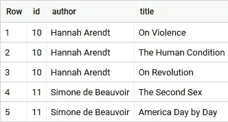
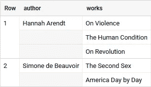
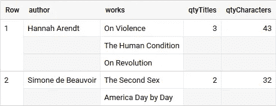
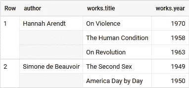
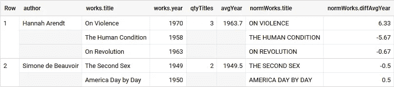
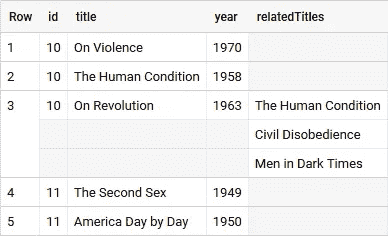
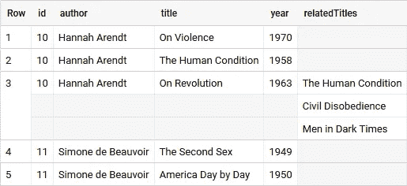
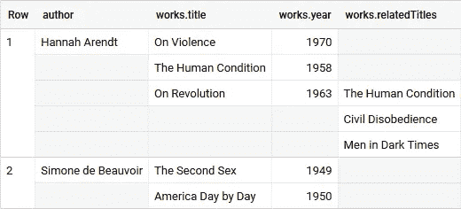
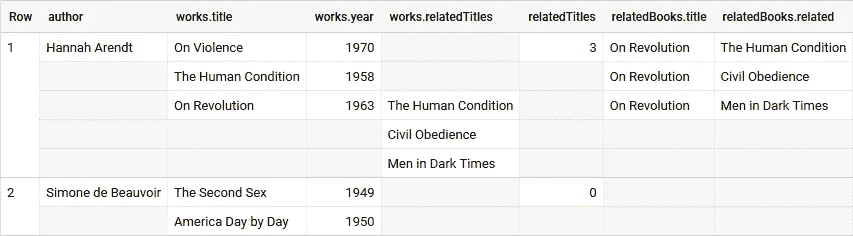

# BigQuery:使用 SQL 创建嵌套数据

> 原文：<https://towardsdatascience.com/bigquery-creating-nested-data-with-sql-727b761f1755?source=collection_archive---------10----------------------->

正如我在我的另一篇文章 [BigQuery:嵌套数据上的 SQL](/https-medium-com-martin-weitzmann-bigquery-sql-on-nested-data-cf9589c105f4)中所阐述的，在嵌套数据上使用 SQL 是非常高效的——只要任务在后端是可并行化的。但是，如果您的数据来自平面表，例如 CSV，则必须首先转换数据。

作者照片

# 嵌套单个值

通常——在平面表场景中——您只需要使用`JOIN`来组合两个表:

上面查询的结果表——试试吧！

但是当然，我们永远不会保存这样的表，因为有些字段只是一遍又一遍地重复，占用存储空间，这反过来会产生可避免的成本。

但是如果我们使用表`authors`和*将书籍放入数组*中，我们就不会重复作者字段。在 BigQuery 中，我们可以使用`[ARRAY_AGG()](https://cloud.google.com/bigquery/docs/reference/standard-sql/functions-and-operators#array_agg)`轻松做到这一点，这是一个聚合函数，可以与`GROUP BY`结合使用，将值放入数组中:

嵌套在“works”数组中的标题——自己试试吧！

如果我们保存这个结果表，我们将通过有效地存储信息来避免成本，并且我们可以去掉一些 id，因为我们不再需要加入。

它还降低了查询的复杂性，因为信息位于同一个表中。您不必想象表 A 和表 B 以及它们加入后的样子，然后才考虑如何选择和分组，您可以直接选择和分组。

看看这里的最后一个`SELECT`语句——想象我们将结果表存储在某个地方，而不是放入`WITH`。

使用 UNNEST()编写子查询(第 24 行)在 [BigQuery:嵌套数据上的 SQL](/https-medium-com-martin-weitzmann-bigquery-sql-on-nested-data-cf9589c105f4)中有介绍

上面查询的结果表——试试看！

在这里，我们可以轻松地对数组应用各种聚合技术，或者简单地将数组与其父数组交叉连接以获得一个平面表。为了进一步分析，我们预先连接了表，但保持了存储效率。我们甚至引入了两个字段 *qtyTitles* 和 *qtyCharacters* ，它们已经告诉了我们关于数组的事情——这对数组聚合中的常见用例很有帮助。

# 嵌套多个值

让我们引入另一个字段，看看如何在一个数组中存储多个字段。让我们快速思考一下:我们在一个数组中一次只能存储一种元素类型——这是一个简单的列表:`[1,1,2,3,5,8]`。所以我们需要把多个值变成一个复数值的东西。对此的解决方案是`STRUCT`，它基本上是一个带有要求的键-值对列表:键必须保持不变，值不允许改变它们的数据类型:`[{a:1,b:x},{a:2,b:y},{a:3,b:z}]`。这也是 BigQuery 被称为“半结构化”的原因。

有几种方法可以构建结构，但是与`ARRAY_AGG()`结合使用最方便的是函数`[STRUCT()](https://cloud.google.com/bigquery/docs/reference/standard-sql/data-types#constructing_a_struct)`。只需选择要嵌入到数组中的字段，并将它们放入一个结构中:

第 15–17 行显示了每个组(array_agg + group by)中被放入数组的结构

带点的列标题表示结构

为此，我们准备了一个预连接表:

我们甚至可以使用`ARRAY()`和`SELECT AS STRUCT`从现有的数组创建新的复杂数组。此外，窗口函数的作用域是由数组的边界自动确定的！

上面查询的结果表

创建新数组或扩展旧数组——在这里，扩展更有意义。为此，我们只需在子查询中选择现有的列，例如`ARRAY(SELECT AS STRUCT *****, UPPER(title) AS title ...`

# 嵌套更复杂的值

虽然我们可以使用 struct 函数简单地将结构嵌套在结构中，但是如果我们想将数组嵌套在数组中，我们需要提前做一些计划。

让我们介绍第三个表，它包含与一本书相关的标题。该表只有三个条目，只是为了让它暂时易于管理。

我们必须首先创建最内层的数组，以便以后可以将它们嵌套在其他数组中:

第 22 行的“忽略空值”有助于避免空数组错误

结果表—尝试为其他标题添加更多信息！

将最后一个`SELECT`语句作为 *round1* 放入`WITH`中，我们可以从`SELECT * FROM authors LEFT JOIN round1 USING(id)`开始第 2 轮，并得到我们的作者…

为 array_agg() round 2 准备好的表！

从这里，我们可以使用相同的方法在更高的范围内再次聚合:

我们需要为我们想要创建的每个深度级别的阵列进行一轮聚合:

阵列中的阵列——多么美妙的世界

为了在分析中达到这些值，相同的规则始终适用:

*   为了将数组聚合为一个值*，使用子查询*
*   对数组中的值进行分组*使用交叉/左连接*

交叉连接消除空行，而左连接保留空行。

*relatedTitles* 从一个数组中抓取另一个数组中的信息，而 *relatedBooks* 使用子查询交叉连接将两个数组中的信息合并为一个。

我希望这能让您对使用 SQL 在 BigQuery 中构造表的可能性有一点了解。我应该注意到，创建性能良好的表还有更多的方面。一定要看看[分区](https://cloud.google.com/bigquery/docs/partitioned-tables)和[聚类](https://cloud.google.com/bigquery/docs/clustered-tables)表的主题！使用 [DDL](https://cloud.google.com/bigquery/docs/reference/standard-sql/data-definition-language) 可以非常方便地做到这一点。如果你想用 SQL 语句插入数据，看看[插入](https://cloud.google.com/bigquery/docs/reference/standard-sql/dml-syntax#insert_statement)结合`WITH`语句准备数据。

如果你有任何问题或意见，请告诉我。我很想知道您是如何在 BigQuery 中准备和优化表的！