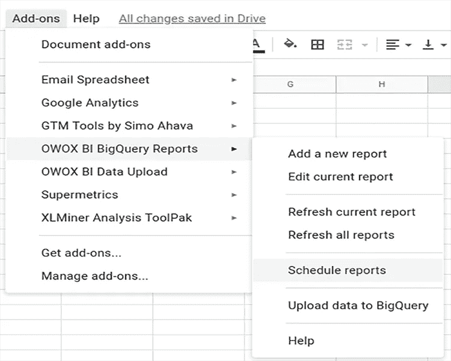

# Google 中的 BigQuery 数据结构:云存储入门

> 原文：<https://towardsdatascience.com/bigquery-data-structure-in-google-how-to-get-started-with-cloud-storage-b6146fcad1d1?source=collection_archive---------34----------------------->


来源:[沉积照片](https://ru.depositphotos.com/238574794/stock-photo-city-streets-dusk-seen-aerial.html)

## 了解如何开始使用云存储:创建数据集和表，设置与 Google BigQuery 之间的数据导入和导出

Google BigQuery 是一项云存储服务，允许您在一个系统中收集所有数据，并使用 SQL 查询轻松分析这些数据。为了便于处理数据，应该正确地组织数据。在本文中，我们将解释如何创建上传到 Google BigQuery 的表和数据集。

# 数据集:什么是数据集以及如何创建数据集

要使用 Google BigQuery，需要在 [Google 云平台(GCP)](https://cloud.google.com/free/) 中创建一个项目。注册后，您将在免费试用期内获得所有云平台产品，并在接下来的 12 个月内获得 300 美元用于购买这些产品。


在 Google 云平台中创建项目后，需要向 Google BigQuery 添加至少一个数据集。

数据集是用于组织和控制数据访问的顶级容器。简单地说，它是一种文件夹，你的信息以表格和视图的形式存储在其中。

在 GCP 打开您的项目，转到 **BigQuery** 选项卡，并点击**创建数据集**:


在打开的窗口中，指定数据集的名称和表的保存期限。如果希望自动删除包含数据的表，请指定具体的删除时间。或者保留默认的**永久选项**，以便只能手动删除表。


**加工地点**字段是可选的。默认情况下，它设置为 US multiregion。您可以在[帮助部分](https://cloud.google.com/bigquery/docs/locations?hl=en)找到更多关于存储数据区域的信息。

# 如何添加表以将数据加载到 Google BigQuery 中

创建数据集后，您需要添加一个将收集数据的表。表格是一组行。每一行都由列组成，这些列也称为字段。根据数据源的不同，有几种方法可以在 BigQuery 中创建表:

*   手动创建一个空表，并为其设置一个数据模式
*   使用以前计算的 SQL 查询的结果创建一个表
*   从您的计算机上传文件(CSV、AVRO、JSON、Parquet、ORC 或 Google Sheets 格式)
*   你可以创建一个引用外部数据源的表，而不是下载或流式传输数据: [Cloud Bigtable](https://cloud.google.com/bigquery/external-data-bigtable) 、[云存储](https://cloud.google.com/bigquery/external-data-cloud-storage)或 [Google Drive](https://cloud.google.com/bigquery/external-data-drive) 。

在本文中，我们将仔细研究第一种方法:手动创建一个表。

**第一步**。选择要添加表格的数据集，然后单击**创建表格**:


**第二步。**在源字段中选择**空表**，在**表类型**字段中选择目标对象原生格式的**表。**想出一个表名。

**重要信息**:数据集、表格和字段的名称必须是拉丁字符，并且只包含字母、数字和下划线。


第三步。指定表模式。该模式由四个部分组成:两个是强制性的(列名和数据类型)，两个是可选的(列模式和描述)。正确选择的类型和字段模式将有助于处理数据。

BigQuery 中的模式示例:


**列名**
在列名中，您需要指定每列负责的参数:日期、用户标识、产品等。标题只能包含拉丁字母、数字和下划线(最多 128 个字符)。不允许相同的字段名称，即使它们的大小写不同。
 **数据类型**
在 BigQuery 中创建表时，可以使用以下字段类型:

**模式**
BigQuery 支持以下表列模式:

**注意**:不需要填写模式字段。如果没有指定模式，默认列可为空。

**列描述**
如果您愿意，您可以为表格中的每一列添加一个简短的描述(不超过 1024 个字符),以便解释特定参数的含义。

在 BigQuery 中创建空表时，需要手动设置模式。这可以通过两种方式来实现:
1。点击**添加字段**按钮，填写每一列的名称、类型和模式。

2.使用**编辑为文本**开关，以 JSON 数组的形式输入表格模式。

此外，Google BigQuery 在从 CSV 和 JSON 文件加载数据时可以使用自动模式检测。

该选项的工作原理如下:BigQuery 从您指定的源中选择一个随机文件，扫描其中多达 100 行的数据，并将结果用作代表性样本。然后，它检查上传文件中的每个字段，并尝试根据示例中的值为其分配数据类型。

加载 Google 文件时，BigQuery 可以更改列名，使其与自己的 SQL 语法兼容。因此，我们建议您上传带有英文字段名的表格；例如，如果名称是俄语，系统会自动对其进行重命名。例如:


如果在加载数据时输入的列名不正确，或者您希望更改现有表中列的名称和类型，您可以手动执行此操作。我们会告诉你怎么做。

# 如何对表模式进行更改

将数据加载到 Google BigQuery 后，表的布局可能会与原来略有不同。例如，字段名可能因为 BigQuery 中不支持的字符而更改，或者字段类型可能是整数而不是字符串。在这种情况下，您可以手动调整模式。

## 如何更改列名

使用 SQL 查询，选择表中的所有列，并为要重命名的列指定一个新名称。在这种情况下，您可以覆盖现有的表或创建一个新表。请求示例:

```
#legacySQL
**Select**
date,
order_id,
order___________ **as** order_type, -- new field name
product_id
**from** [project_name:dataset_name.owoxbi_sessions_20190314]#standardSQL
**Select**
* **EXCEPT** (orotp, ddat),
orotp **as** order_id,
ddat **as** date
**from** `project_name.dataset_name.owoxbi_sessions_20190314`
```

## 如何更改模式中的数据类型

使用 SQL 查询，从一个表中选择所有数据，然后[将相应的列转换为不同的数据类型。您可以使用查询结果](https://cloud.google.com/bigquery/docs/reference/standard-sql/functions-and-operators#casting)[来覆盖现有的表](https://cloud.google.com/bigquery/docs/writing-results#permanent-table)或者创建一个新的表。请求示例:

```
#standardSQL
**Select**
**CAST** (order_id **as** **STRING**) **as** order_id,
**CAST** (date **as** **TIMESTAMP**) **as** date
**from** `project_name.dataset_name.owoxbi_sessions_20190314`
```

## 如何更改列模式

如[帮助文档](https://cloud.google.com/bigquery/docs/managing-table-schemas#relaxing_a_columns_mode)所述，您可以将列模式从必需更改为可空。第二个选项是将数据导出到云存储，并从那里以正确的模式将数据返回给 BigQuery。

## 如何从数据架构中删除列

使用 SELECT * EXCEPT 查询排除一列(或多列)，然后将查询结果写入旧表或创建一个新表。请求示例:

```
#standardSQL
**Select**
* **EXCEPT** (order_id)
**from** `project_name.dataset_name.owoxbi_sessions_20190314`
```

此外，还有第二种方法来更改模式，这种方法适用于上述所有任务:导出数据并将其加载到新表中。要重命名列，可以将数据从 BigQuery 上传到云存储，然后将其从云存储导出到新表中的 BigQuery，或者使用高级参数覆盖旧表中的数据:


你可以在[谷歌云平台帮助文档](https://cloud.google.com/bigquery/docs/manually-changing-schemas)中了解改变表格结构的其他方法。

# 从/向 Google BigQuery 导出和导入数据

您可以通过界面或 OWOX BI 的特殊[插件从 BigQuery 下载数据或向 big query 上传数据，而无需开发人员的帮助。让我们详细考虑每种方法。](https://www.owox.com/products/bi/pipeline/google-bigquery-to-google-sheets/)

## 通过 Google BigQuery 接口导入数据

要将必要的信息上传到存储，例如，关于用户和离线订单的数据，请打开数据集，单击创建表，然后选择数据源:云存储、您的计算机、Google Drive 或云 Bigtable。指定文件的路径、格式以及将加载数据的表的名称:


单击“创建表”后，数据集中会出现一个表。

## 通过 Google BigQuery 接口导出数据

还可以从 BigQuery 上传处理过的数据——例如，通过系统界面创建报告。为此，请打开包含数据的所需表格，然后单击导出按钮:


该系统将提供两种选择:在谷歌数据工作室查看数据或上传到谷歌云存储。如果您选择第一个选项，您将立即转到 Data Studio，在那里您可以保存报告。

选择导出到 Google 云存储会打开一个新窗口。在其中，您需要指定数据的保存位置和格式。

# 使用 OWOX BI 的插件导出和导入数据

[免费的 OWOX BI BigQuery Reports 插件](https://chrome.google.com/webstore/detail/owox-bi-bigquery-reports/fepofngogkjnejgcbdmmkddnpeojbbin?utm_source=owox_bi)允许你快速方便地将数据从 Google BigQuery 直接传输到 Google Sheets，反之亦然。因此，您不需要准备 CSV 文件或使用付费的第三方服务。

例如，假设您想要将离线订单数据上传到 BigQuery 来构建一个 ROPO 报告。为此，您需要:

1.  在浏览器中安装 BigQuery Reports 插件。
2.  在 Google Sheets 中打开您的数据文件，在标签 **Add-ons** 中，选择 **OWOX BI BigQuery Reports →将数据上传到 BigQuery。**
3.  在打开的窗口中，在 BigQuery 中选择项目和数据集，并为表输入所需的名称。此外，选择要加载其值的字段。默认情况下，所有字段的类型都是 STRING，但是我们建议根据上下文选择数据类型(例如，对于带有数字标识符的字段，选择 INTEGER 对于价格，浮动):


1.  点击开始上传按钮，你的数据将被加载到谷歌大查询

您还可以使用这个插件将数据从 BigQuery 导出到 Google Sheets——例如，可视化数据或与无权访问 BigQuery 的同事共享数据。为此:

1.  打开谷歌工作表。在**插件**选项卡中，选择 **OWOX BI BigQuery 报表→添加新报表:**


1.  然后在 Google BigQuery 中输入您的项目，并选择 Add new query。
2.  在新窗口中，插入 SQL 查询。这可能是一个将数据从表上传到 BigQuery 的查询，也可能是一个提取并计算必要数据的查询。
3.  通过单击“保存并运行”按钮，重命名查询，使其易于查找和启动。


要定期将数据从 BigQuery 上传到 Google Sheets，您可以启用计划的数据更新:

1.  在**插件**选项卡中，选择**OWOX BI big query Reports**→**Schedule report**:



1.  在打开的窗口中，设置报告更新的时间和频率，并点击**保存**:


# 为什么要在 Google BigQuery 中收集数据？

如果您还没有意识到 Google BigQuery 云存储的好处，我们建议您尝试一下。在 OWOX BI 的帮助下，您可以将来自您的网站、[广告源](https://www.owox.com/products/bi/pipeline/google-analytics-cost-data-import/)和内部 CRM 系统的数据整合到 BigQuery 中，以便:

*   [建立端到端分析](https://www.owox.com/blog/use-cases/end-to-end-analytics-implementation/)并找出您营销的实际回报，考虑线下订单、退货和购买过程中的所有用户步骤；
*   [创建带有任何参数和指标的完整未采样数据的报告](https://www.owox.com/blog/articles/gbq-reports/)；
*   [使用群组分析评估客户获取渠道](https://www.owox.com/blog/success-stories/boodmo/)；
*   找出你的[在线广告如何影响线下销售](https://www.owox.com/blog/articles/ropo-effect/)；
*   降低广告费用的份额，延长客户的生命周期，从整体上增加你的客户群的 LTV；
*   [根据顾客的活动](https://www.owox.com/blog/success-stories/butik/)对其进行细分，并与他们进行个性化交流。