# BigQuery、PII 和云数据丢失防护(DLP):通过数据目录将其提升到新的水平

> 原文：<https://towardsdatascience.com/bigquery-pii-and-cloud-data-loss-prevention-dlp-take-it-to-the-next-level-with-data-catalog-c47c31bcf677?source=collection_archive---------20----------------------->

## 如何通过使用云数据丢失防护检查所有 BigQuery 数据来创建数据目录标记。

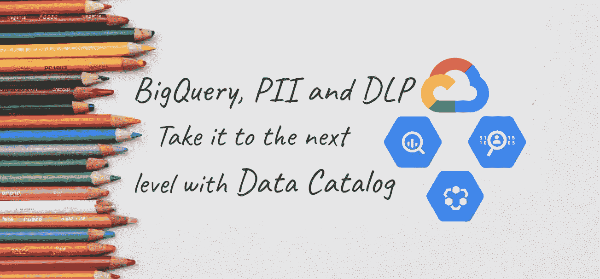

背景由 [Kelli Tungay](https://unsplash.com/@kellitungay?utm_source=unsplash&utm_medium=referral&utm_content=creditCopyText) 上 [Unsplash](https://unsplash.com/?utm_source=unsplash&utm_medium=referral&utm_content=creditCopyText)

你知道你的组织掌握着什么样的敏感数据吗？您是否跟踪应用于所有表和列的每个更改？你有信心回答审计员可能提出的关于数据法规的问题吗？


背景由 [Sandra Grünewald](https://unsplash.com/@elmuff?utm_source=unsplash&utm_medium=referral&utm_content=creditCopyText) 在 [Unsplash](https://unsplash.com/?utm_source=unsplash&utm_medium=referral&utm_content=creditCopyText)

让一个审计员来敲你的门并不是最可怕的事情，数据泄露才是最可怕的！从罚款到客户流失和法律后果，后果可能是残酷而持久的。

对您的敏感数据进行分类和管理是着手处理这一问题的好方法，但用手动方式来做不是办法。

有一点值得思考，谁想检查数千、数百万的数据资产，然后给每一个都贴上标签，说它们是敏感的还是不敏感的？如果表有令人困惑的列名怎么办？我不会开始讨论这有多容易出错，但你会明白…

我们需要以某种方式自动完成这项工作。

在本文中，我们将看到一个全自动的解决方案，通过使用 DLP 和数据目录来发现所有大型查询资产中的敏感数据(每当我提到 DLP 时，它都会支持[数据丢失预防】](https://cloud.google.com/dlp))。如果您不熟悉 DLP 和数据目录，您会对第一部分和第二部分感兴趣。

否则，如果您想了解 DLP 和数据目录的神奇之处，请直接跳到第三部分。

本文涵盖的主题有:

1.  **云数据防丢失概述**
2.  **数据目录概述**
3.  **DLP 到数据目录标签概述**
4.  **脚本执行演练**

事不宜迟，我们走吧！

> 我们将提供一个带有工作示例的 GitHub 存储库。

# 云数据丢失防护概述

DLP 是一项托管的 Google 云服务，旨在帮助您发现、分类和保护您最敏感的数据。

> [Cloud DLP 拥有 120 多种内置信息类型，让您能够从几乎任何地方扫描、发现、分类和报告数据。云 DLP 具有对云存储、BigQuery 和数据存储中的敏感数据进行扫描和分类的原生支持，以及支持附加数据源、自定义工作负载和应用程序的流内容 API。](https://cloud.google.com/dlp/)

## 特征

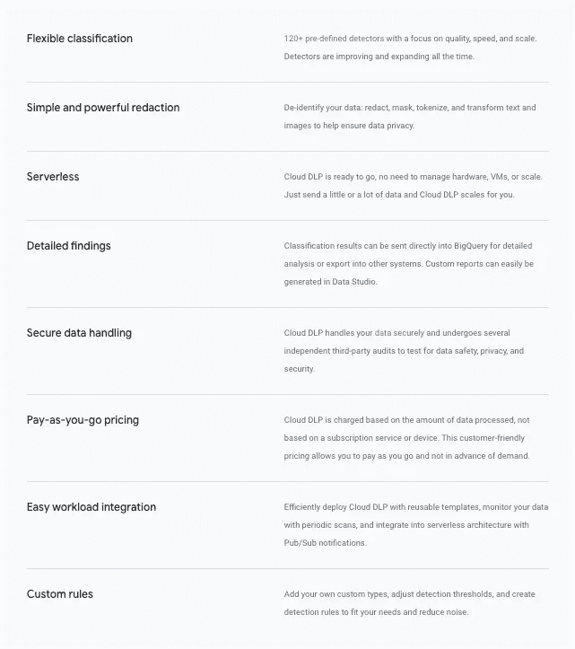

来自[官方文件](https://cloud.google.com/dlp/)的 DLP 特性

在本文中，我们将利用[流媒体内容 API](https://cloud.google.com/dlp/docs/reference/rest/v2/projects.content/inspect) 和[DLP 检查模板](https://cloud.google.com/dlp/docs/creating-templates-inspect)。

# 数据目录概述

数据目录是一种可管理和可扩展的元数据管理服务，使组织能够快速发现、了解和管理其所有数据。

> [Data Catalog 通过 Google Cloud 提供了一个更安全的中央数据目录，使组织能够对其所有数据资产有一个统一的视图。该服务自动吸收 BigQuery 和云发布/订阅的技术元数据，并允许客户通过标签、自定义 API 和 UI 以模式化格式捕获业务元数据，从而提供一种简单高效的方法来对其数据资产进行编目。](https://cloud.google.com/data-catalog)

## 特征

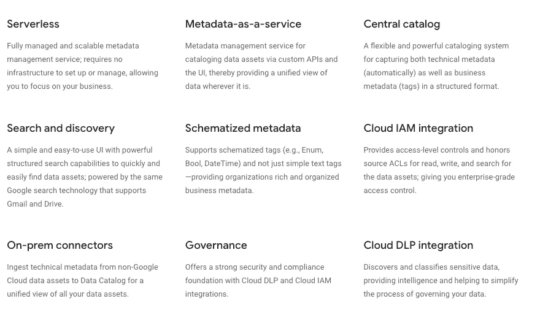

[正式文档](https://cloud.google.com/data-catalog)中的数据目录特性

在本文中，我们将利用标签模板**、**标签、**、**和进行数据目录搜索。

快速查看数据目录**标签**结构:

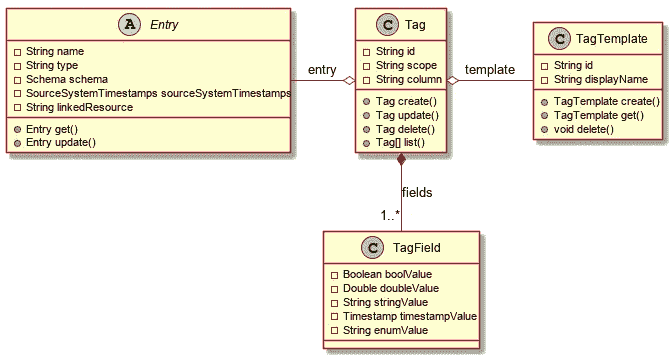

从[GCP-数据目录-图表](https://github.com/ricardolsmendes/gcp-datacatalog-diagrams)中标记心智模型

我们将在后面介绍更多细节，但是请记住，由于我们关注的是大型查询资产，每个大型查询表都代表数据目录中的一个条目，我们将创建**标记**来对敏感数据进行分类，标记模板将代表 [DLP 信息类型](https://cloud.google.com/dlp/docs/infotypes-reference)。

# DLP 到数据目录标记概述

现在，您已经熟悉了 DLP 和数据目录，让我们继续了解体系结构概述:

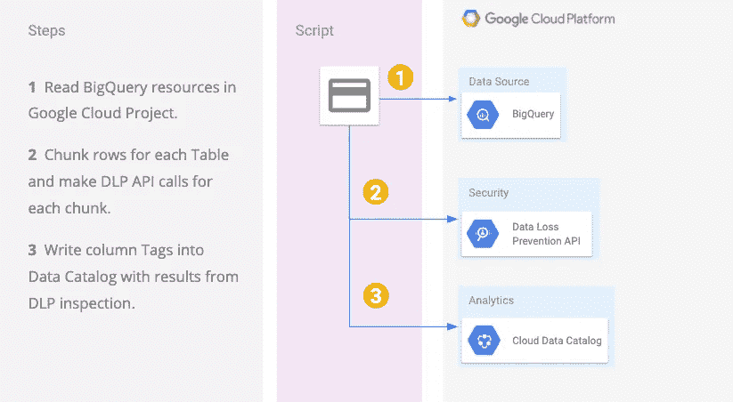

从 [dlp 到数据目录标签](https://cloud.google.com/community/tutorials/dlp-to-datacatalog-tags)的参考架构

该脚本使用`Java`工作负载，用户能够在他们的本地机器、云外壳或计算引擎虚拟机上执行它。

如果您对脚本执行的快速视频演示感兴趣，请查看:

来自 [dlp 到数据目录标签](https://cloud.google.com/community/tutorials/dlp-to-datacatalog-tags)的演示视频

## 阅读大查询资源

工作负载从读取来自 Google Cloud 项目的大查询资源开始，然后我们将大查询行分成许多块。我们需要这一点，因为 DLP 内容 API 有一个[使用限制](https://cloud.google.com/dlp/limits)，这也是奇迹发生的地方。

## 呼叫 DLP

对于 DLP 使用限制，我们可以将其分为两类:

*   **请求大小**

首先，我们需要确保请求大小不超过使用限制，在撰写本文时，我们得到了以下值:

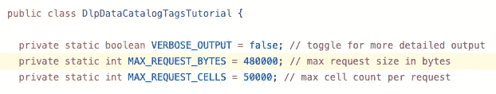

显示来自[DlpDataCatalogTagsTutorial.java](https://github.com/GoogleCloudPlatform/community/blob/3ab1721969929ea18735a77fa84bc3283153cc65/tutorials/dlp-to-datacatalog-tags/src/main/java/com/example/dlp/DlpDataCatalogTagsTutorial.java)的请求大小限制的代码

*   **每分钟请求数**

第二，每分钟有一个请求强制限制，所以我们添加了简单的睡眠和重试逻辑:

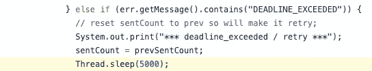

显示来自[DlpDataCatalogTagsTutorial.java](https://github.com/GoogleCloudPlatform/community/blob/3ab1721969929ea18735a77fa84bc3283153cc65/tutorials/dlp-to-datacatalog-tags/src/main/java/com/example/dlp/DlpDataCatalogTagsTutorial.java)的睡眠逻辑的代码

## DLP 检查模板

接下来，为了调用 DLP，我们将使用 [DLP Inspect 模板](https://cloud.google.com/dlp/docs/creating-templates-inspect)，它们对于解耦配置信息非常有用。在这个用例中，我们使用它来存储我们的`infoTypes`:

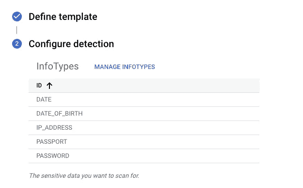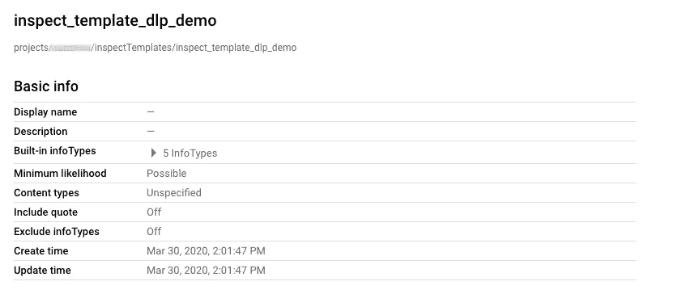

DLP 检查来自[DLP-to-data catalog-tags](https://cloud.google.com/community/tutorials/dlp-to-datacatalog-tags)的模板

> 云数据丢失防护(DLP)使用信息类型或`infoTypes`来定义它扫描的内容。`infoType`是一种敏感数据，如姓名、电子邮件地址、电话号码、身份证号或信用卡号。

最后，我们创建检查请求:

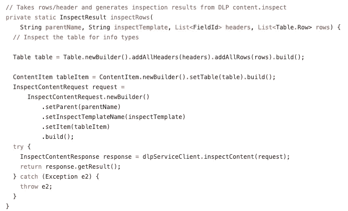

显示来自 DlpDataCatalogTagsTutorial.java[的检查内容逻辑的代码](https://github.com/GoogleCloudPlatform/community/blob/3ab1721969929ea18735a77fa84bc3283153cc65/tutorials/dlp-to-datacatalog-tags/src/main/java/com/example/dlp/DlpDataCatalogTagsTutorial.java)

## 写入数据目录列标记

一旦我们从 DLP 获得检查结果，我们需要将它们转换成数据目录标记，我们从检索列名开始:

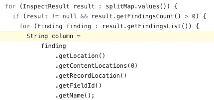

显示从 DlpDataCatalogTagsTutorial.java[检索列逻辑的代码](https://github.com/GoogleCloudPlatform/community/blob/3ab1721969929ea18735a77fa84bc3283153cc65/tutorials/dlp-to-datacatalog-tags/src/main/java/com/example/dlp/DlpDataCatalogTagsTutorial.java)

接下来，我们设置数据目录[标签模板](https://cloud.google.com/data-catalog/docs/quickstart-tagging#create_a_tag_template_and_attach_the_tag_to_your_table):

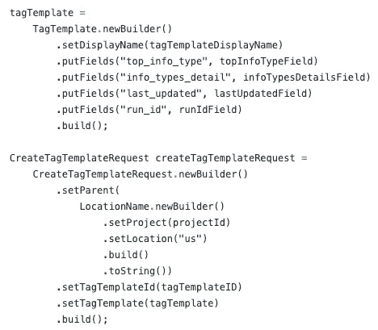

显示从[DlpDataCatalogTagsTutorial.java](https://github.com/GoogleCloudPlatform/community/blob/3ab1721969929ea18735a77fa84bc3283153cc65/tutorials/dlp-to-datacatalog-tags/src/main/java/com/example/dlp/DlpDataCatalogTagsTutorial.java)创建模板逻辑的代码

还记得我们在标签心智模型中看到的大查询条目吗？我们需要构建条目`linkedResource`:

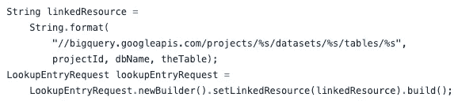

显示来自[DlpDataCatalogTagsTutorial.java](https://github.com/GoogleCloudPlatform/community/blob/3ab1721969929ea18735a77fa84bc3283153cc65/tutorials/dlp-to-datacatalog-tags/src/main/java/com/example/dlp/DlpDataCatalogTagsTutorial.java)的链接资源逻辑的代码

最后，我们创建标签请求:

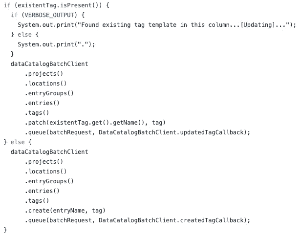

显示来自[DlpDataCatalogTagsTutorial.java](https://github.com/GoogleCloudPlatform/community/blob/3ab1721969929ea18735a77fa84bc3283153cc65/tutorials/dlp-to-datacatalog-tags/src/main/java/com/example/dlp/DlpDataCatalogTagsTutorial.java)的标签创建逻辑的代码

等一下！`datacatalogBatchClient`？请注意，以编程方式访问 Google Cloud APIs 的推荐方式是使用[客户端库](https://cloud.google.com/apis/docs/client-libraries-explained#google_cloud_client_libraries)，在我们的例子中，我们要处理大量的标签，因此为了提高性能，我们正在批处理这些 API 调用。

> 关于其工作的更多细节，请看一下 [DataCatalogBatchClient](https://github.com/GoogleCloudPlatform/community/blob/3ab1721969929ea18735a77fa84bc3283153cc65/tutorials/dlp-to-datacatalog-tags/src/main/java/com/example/dlp/DataCatalogBatchClient.java) 。

# 脚本执行演练

如果你已经到了这一步并且喜欢冒险，你可以执行运行[云壳教程](https://cloud.google.com/shell/docs/walkthroughs)的脚本，我已经自动完成了它的每一步，如果你想试试的话:

[](https://github.com/mesmacosta/dlp-to-datacatalog-tags-tutorial) [## mesma Costa/DLP-to-data catalog-tags-教程

### 它将指导您使用 DLP 结果创建数据目录标记。它比…的内容更广泛

github.com](https://github.com/mesmacosta/dlp-to-datacatalog-tags-tutorial) [](https://console.cloud.google.com/cloudshell/open?git_repo=https://github.com/mesmacosta/dlp-to-datacatalog-tags-tutorial&tutorial=TUTORIAL.md)

> 我将跳过**启用必需的 API**和**设置您的服务帐户**步骤，因为它们是常见的用例——完整的演练，请查看上面的 GitHub 库。

## 创建大型查询表

首先，我们用假的 [PII](https://en.wikipedia.org/wiki/Personal_data) 创建一些大的查询资源，以便稍后运行脚本。

```
# Install bq-fake-pii-table-creator using PIP
pip3 install bq-fake-pii-table-creator --user# Create the first table
bq-fake-pii-table-creator --project-id $PROJECT_ID --bq-dataset-name dlp_to_datacatalog_tutorial --num-rows 5000# Create a second table
bq-fake-pii-table-creator --project-id $PROJECT_ID --bq-dataset-name dlp_to_datacatalog_tutorial --num-rows 5000# Create a third table with obfuscated column names
bq-fake-pii-table-creator --project-id $PROJECT_ID --bq-dataset-name dlp_to_datacatalog_tutorial --num-rows 5000 --obfuscate-col-names true
```

## 创建检查模板

其次，我们创建检查模板:

```
# Generate your OAUTH 2.0 token with gcloud
TOKEN=$(gcloud auth activate-service-account --key-file=$HOME/credentials/dlp-to-datacatalog-tags-sa.json && gcloud auth print-access-token)# Call API using Curl
curl -X POST \  [https://dlp.googleapis.com/v2/projects/$PROJECT_ID/inspectTemplates](https://dlp.googleapis.com/v2/projects/$PROJECT_ID/inspectTemplates) \
  -H "Authorization: Bearer ${TOKEN}" \
  -H 'Content-Type: application/json' \
  -d '{
  "inspectTemplate":{
    "displayName":"DLP 2 Datacatalog inspection Template",
    "description":"Scans Sensitive Data on Data Sources",
    "inspectConfig":{
      "infoTypes":[
        {
          "name":"CREDIT_CARD_NUMBER"
        },
        {
          "name":"EMAIL_ADDRESS"
        },
        {
          "name":"FIRST_NAME"
        },
        {
          "name":"IP_ADDRESS"
        },
        {
          "name":"MAC_ADDRESS"
        },
        {
          "name":"PHONE_NUMBER"
        },
        {
          "name":"PASSPORT"
        }
      ],
      "minLikelihood":"POSSIBLE",
      "includeQuote":false
    }
  },
  "templateId": "dlp-to-datacatalog-template"
}'
```

> 在撰写本文时， [gcloud](https://cloud.google.com/sdk/gcloud) 不支持 create inspect template API 调用，所以我们使用的是 [Curl](https://curl.haxx.se/) 。

我们在 API 调用中设置了一个 DLP 信息类型的预定义列表，您可以使用作为参考:[内置信息类型](https://cloud.google.com/dlp/docs/infotypes-reference)或通过创建自定义类型来更改它或添加新类型。

# 执行脚本

关于 CLI 参数的完整细节，以及如何构建下面的脚本，请查看[社区教程](https://cloud.google.com/community/tutorials/dlp-to-datacatalog-tags)。

```
java -cp target/dlp-to-datacatalog-tags-0.1-jar-with-dependencies.jar com.example.dlp.DlpDataCatalogTagsTutorial \
-dbType "bigquery" \
-limitMax 1000 \
-dbName dlp_to_datacatalog_tutorial \
-projectId $PROJECT_ID \
-threadPoolSize 5 \
-inspectTemplate "projects/$PROJECT_ID/inspectTemplates/dlp-to-datacatalog-template" \
-minThreshold 100
```

在这次执行中，我们只扫描了`dlp_to_datacatalog_tutorial`数据集，用 5 个`threads`运行，并使用我们之前创建的`dlp-to-datacatalog-template`。

让我们运行它并检查结果:

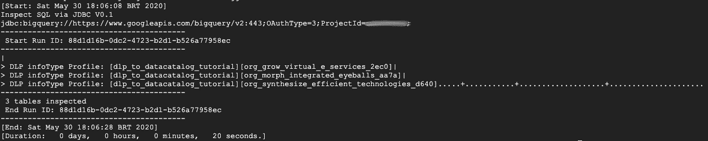

脚本执行

脚本完成后，我们可以去[数据目录](https://console.cloud.google.com/datacatalog)验证敏感数据:

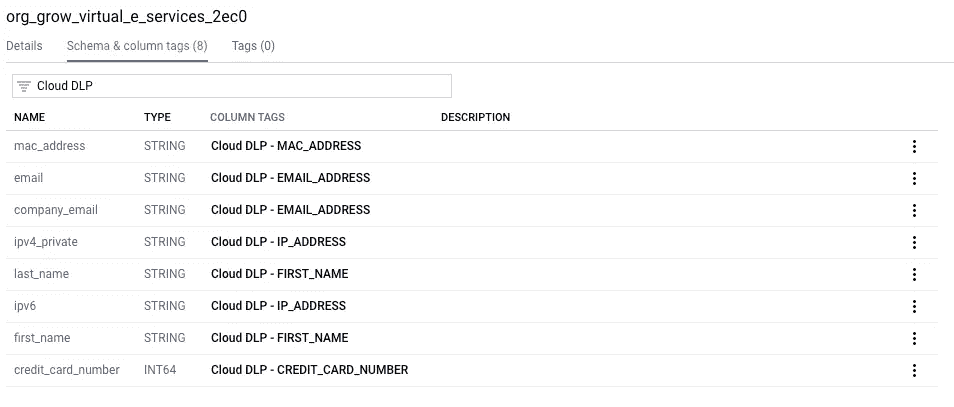

数据目录条目—模式和列标记

在第一个表中，通过查看列名，可以清楚地看到我们拥有哪种敏感数据。无论如何，通过标记这些列，我们能够轻松地搜索我们的敏感数据。

你还记得那个愤怒的审计员敲你的门吗？

现在，如果他来问我们，如果你存储任何 PII，如信用卡号码…我们只是在数据目录中做一个简单的查询！我们甚至可以使用 [IAM](https://cloud.google.com/iam) 并给他`Data Catalog Viewer`角色，这样他就可以自己看，省去了我们的拜访。

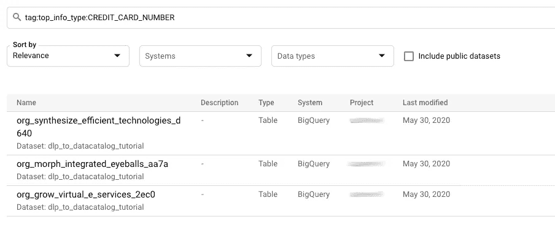

寻找信用卡号码的数据目录搜索

玩笑归玩笑，数据目录[搜索语法](https://cloud.google.com/data-catalog/docs/how-to/search-reference)真的很强大，由支持 Gmail 和 Drive 的谷歌搜索技术驱动。所以检查他们的文档，看看所有的可能性。

您还记得那个带有混乱的列名的表格吗:

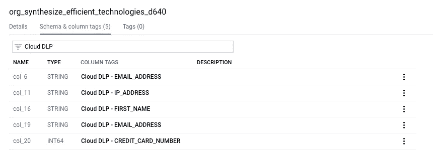

数据目录条目—模式和列标记

DLP 来救援了！我们可以看到，我们标记了一些列，通过展开标记详细信息:

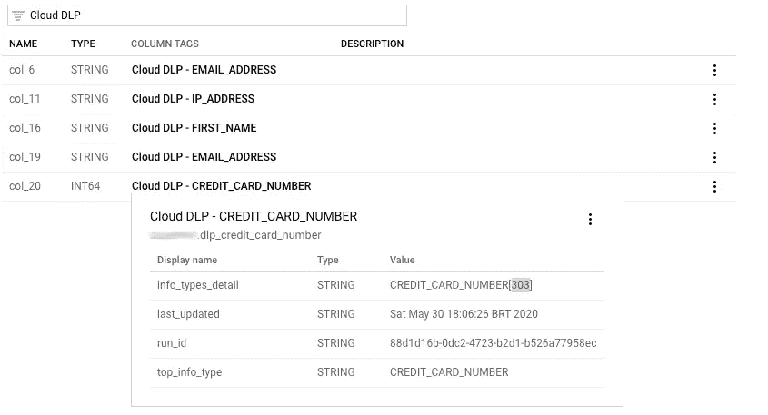

数据目录标签详细信息

我的天啊。DLP 在那个列上找到 303 `CREDIT_CARD_NUMBERS`，有 1000 行样本，**感谢 DLP** ！

# 结束语

在本文中，我们看到了如何结合数据目录和 DLP 来发现 Google Cloud 项目中的敏感数据。

随着 GPDR、CCPA 和其他监管法案成为现实，现在拥有一个结构化数据治理流程比以往任何时候都更加重要，该流程允许您了解您的公司存储了哪些数据、数据位于何处以及业务如何受到这些数据的影响。

在这个领域，总是有改进的空间，如果我们可以扩展这个脚本，在发现敏感数据时自动阻止对敏感数据的访问，会怎么样？这当然是可能的，通过使用数据目录[策略标签](https://cloud.google.com/bigquery/docs/column-level-security)，所以请继续关注新的帖子，讨论这个问题！干杯！

# 参考

*   **DLP 文件**:[https://cloud.google.com/dlp](https://cloud.google.com/dlp/)
*   **数据目录文档**:[https://cloud.google.com/data-catalog](https://cloud.google.com/data-catalog)
*   **DLP 转数据目录标签演练教程**:[https://github . com/mes macosta/DLP 转数据目录标签教程](https://github.com/mesmacosta/dlp-to-datacatalog-tags-tutorial)
*   **社区博客教程**:[https://cloud . Google . com/Community/tutorials/DLP-to-data catalog-tags](https://cloud.google.com/community/tutorials/dlp-to-datacatalog-tags)