# 双语数据科学家:Python 到 R(第 1 部分)

> 原文：<https://towardsdatascience.com/bilingual-data-scientist-python-to-r-part-1-70438fcdc155?source=collection_archive---------67----------------------->

## 与 Python 中的代码相比，使用 R 中的代码基础的简要总结和指南。

在学院和大学，Python 被广泛教授和应用于许多学科；数学、物理、工程等。因此，更多的编码初学者最初有 Python 背景，而不是 R 背景。我就是这些人中的一员。我在大学期间有使用 Python 的经验，我在熨斗学校再次使用 Python；我把它应用于数据科学。

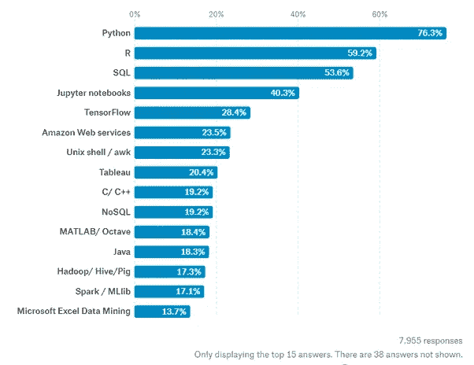

2019 年数据科学最需要的工具/语言来源:[https://www . kdnugges . com/2020/02/getting-started-r-programming . html](https://www.kdnuggets.com/2020/02/getting-started-r-programming.html)

关于最佳编程语言的争论一直存在，但当涉及到数据科学时，有两种语言肯定会登上领奖台，Python 和 R。了解到 R 作为一种编程语言是 2019 年数据科学第二大最受欢迎的工具/语言，占 59.2%，我想我还不如通过学习用 Python 和 R 编码来获得额外的优势。

我们开始吧！首先让我们回顾一下 Python。


来源:https://www.python.org/community/logos/

Python 自 20 世纪 80 年代末就出现了，由荷兰的古杜·范·罗森实现，作为另一种语言 ABC 的继承者。Python 是以电视节目《巨蟒剧团的飞行马戏团》命名的。

## 作为一种编程语言，Python 拥有哪些特性:

*   解释
*   面向对象
*   高级/动态

## 优势:

*   相对简单的语法(易于初学者学习编码)
*   百事通(用于 web 开发、科学/数字计算、游戏开发等。)
*   总体良好的社区支持(邮件列表、文档和堆栈流)
*   受深度学习的欢迎(广泛的库和框架选择)
*   对人工智能来说很棒

R 有什么不同？


来源:https://rveryday.wordpress.com/resources/

r 是 S 编程语言的现代实现，由统计学家 Ross Ihaka 和 Robert Gentlemen 在 90 年代创建。这个名字来自于两个创造者的名字的首字母，并发挥了 S 语言的名字。

## 作为一种编程语言，R 有什么特点:

*   统计计算环境
*   强大的图形功能

## 优势:

*   用于统计的内置数据分析(代码更少)
*   包含数据编辑器、调试支持和图形窗口的环境
*   总体良好的社区支持(邮件列表、文档和堆栈流)
*   非常适合图形绘图

r 是一种由统计学家和数据挖掘者开发的编程语言，通常用于分析数据、统计分析和图形。用于统计计算。

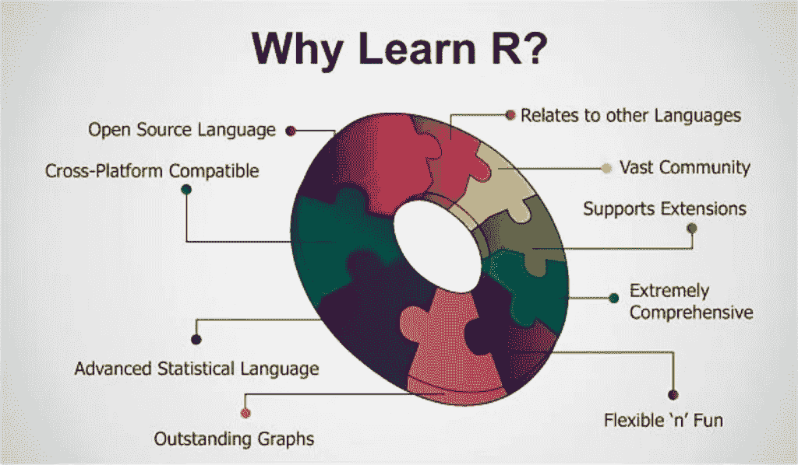

(来源:[https://hacker noon . com/5-free-r-programming-courses-for-data-scientists-and-ml-programmers-5732 CB 9e 10](https://hackernoon.com/5-free-r-programming-courses-for-data-scientists-and-ml-programmers-5732cb9e10))

Python 和 R 在不同方面都很棒。所以，我们开始用 R 吧！

## 安装

安装 R 和 RStudio。RStudio 是一个很好的使用 r 的 IDE，以下是两者的链接:

https://www.r-project.org/

https://rstudio.com/products/rstudio/download/

## RStudio 接口

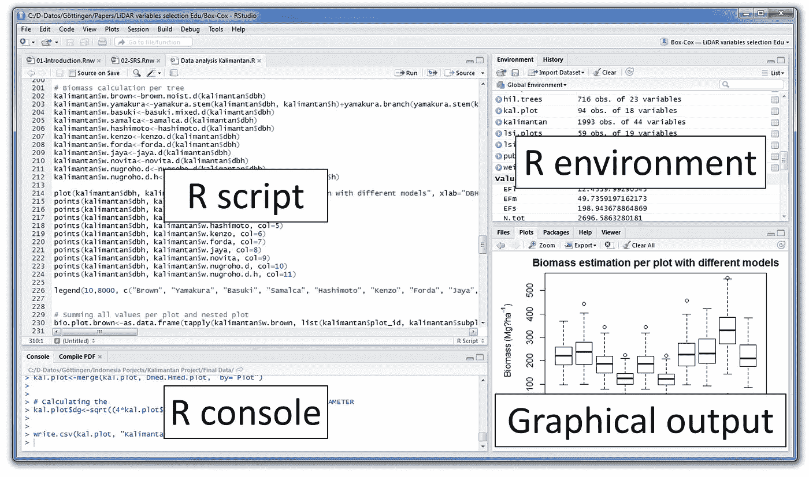

*   R 控制台:这个空间显示可以用来编写可执行代码的输出。
*   R Script: 这个空间是你写代码的地方，然后你选择你想要执行的代码，按 Control + Enter(或者 Mac 上的 Command + Enter)或者点击“运行”按钮。
*   R 环境:这个空间显示用名称、类型、长度、大小和值创建的变量。
*   **图形输出:**该空间显示图形/图表，可用于选择包装。

下面是 R 中使用的一些基本语法和操作:

**算术运算:**

算术与 python 几乎相同，除了寻找除法的余数，因为我们使用%%而不是%,并且必须在 Python 中为平方根导入“math”或“numpy”库。

```
**Addition/Subtraction/Multiplication/Division:****#Python**
1 + 2
2 - 1
2 * 3
6 / 2**#R**
1 + 2
2 - 1
2 * 3
6 / 2**Square/SquareRoot/Remainder From Division:****#Python**
3**2
math.sqrt(9)
10%3**#R**
3**2 or 3^2
sqrt(9)
10%%3
```

**数据类型:**

同样，R 的数据输入与 Python 非常相似，只是在数字后添加了一个“L”来区分 R 中的数值和整数值，并且 R 中的 TRUE/FALSE 也是大写的。

```
**String/Float/Integer/Boolean:****#Python**
"Hello" or 'Hi'
26.56 or 1/3
30 or -2
True or False**Character/Numeric/Integer/Logical:****#R**
"Hello" or 'Hi'
26.56 or 1/3
30L or -2L
TRUE or FALSE **Type of Data:****#Python**
#gives you the type of data of chosen objecttype('this is a string')
type(True)**Type of Class:****#R**
#gives you the class type of chosen objectclass("Goodbye")
class(1.23) 
```

**赋值运算符:**

R 语法中最独特的是赋值操作符的选择。Python 使用传统的' = '将右边的值赋给左边的变量，而 R 有几种不同的方法来处理赋值。

```
**#Python**
x = 1**#R**
#Leftwards Assignment
x <- 1
y <<- "i am a string"
z = True
#Rightwards Assignment3 -> a
"Hi" ->> welcome
```

**条件运算符:**

对于条件运算符，Python 和 R 是相同的。

```
**Greater/Less Than or Equal To and Equal to/Not Equal to:****#Python**
a > b
b < c
a >= b
b <= c
a == b
b != c**#R**
a > b
b < c
a >= b
b <= c
a == b
b != c
```

**If/Else 语句:**

当看更多的函数代码时，Python 和 R 之间的逻辑是相同的，但是区别在于语法和缩进。Python 缩进是关键，因为它标记了要执行的代码块。r 在缩进方面更加宽容，但是需要花括号来区分代码块。

```
**#Python**i = 6
if i > 8:
    print("larger than 8")
else:
    print("smaller than 8")**#R**i = 6
if (i>8){
  print("larger than 8")
} else {
  print ("smaller than 8")
}
```

**对于循环和 While 循环:**

for 和 while 循环都采用类似的方法，就像两种语言之间的 if/else 语句一样。缩进和花括号是两种语言语法的定义特征。另外，for 和 while 条件都包含在 R 的括号中，不像 Python 使用冒号来结束条件。

```
**#For Loops****#Python**for i in range(1,6):
    print(i)**#R**for (i in 1:5){
  print(i)
}**#While Loops****#Python**i = 1
while i < 5:
    print(i)
    i += 1**#R**i = 1
while(i < 5){
  print(i)
  i <- i + 1
}
```

**数据结构:**

在 Python 中，数据集合有不同的数据结构，比如列表和字典。r 也有数据结构，但是有一些不同的类型和相当不同的语法来表示它们。

```
**#Python****#Dictionary**
my_dict = {key:value}**#List** my_list = [a,b,c]
my_other_list = list(z,y,z)**#Array** from numpy import array
my_array = ([2,4,6])**#Tuple** my_tuple = (1,2,3)**#R****#Vector** my_vector <- c(1,2,3)**#List** my_list <- list(1,2,3)**#Array**
my_array <- array(c(vector_1,vector_2),dim = c(2,2,2)**#Matrix** my_matrix <- matrix(1:6, nrow=3, ncol=2)**#Dataframe** my_df <- data.frame(column_1 = c("a","b"), column_2 = c(1,2))
```

向量包含同一类的对象。如果您混合不同类的对象，这些对象会变成一个特定的类，这称为强制。

```
**#Python**input:
my_list[1]

output: 
2**#R**input:
my_list[1]output:
1
```

与 Python 不同，R 的索引不是从列表中的第 0 个元素开始，而是从第 1 个元素开始，因此数据在列表中的位置与用于从列表中调用它的索引号相同。

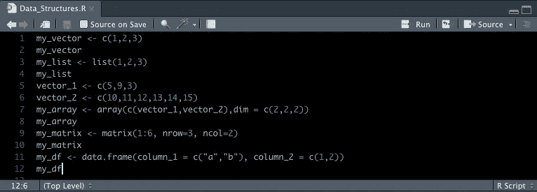

r 脚本

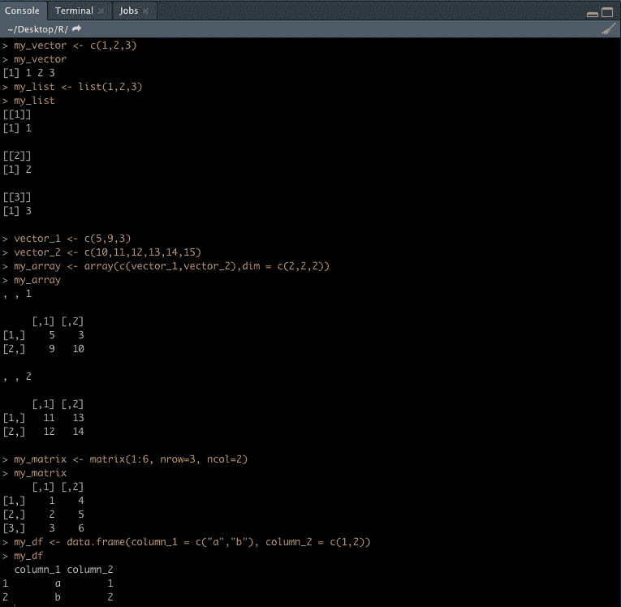

r 控制台

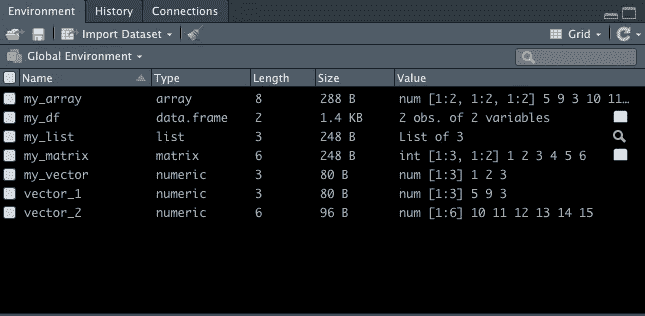

r 环境

## 分析学

R 的一些好处来自图形功能，所以我将详细介绍数据科学家如何使用 R 来创建一些数据可视化。

**导入和操作数据帧**:

在 R 中导入 csv 文件类似于 Python，但是您添加了另外两个参数:

*   判断正误:取决于 csv 的第一行是否是列名(如果是，则使用 TRUE)
*   文件中的数据使用什么类型的分隔？(在本例中为“，”逗号)

我在下面列出了几个 dataframe 函数。还有很多，但是我想用一些常见的例子来展示这些函数的语法的方法和简单性。

```
**#Python** name_of_df = pd.read_csv("name_of_csv_dataset.csv")name_of_df.head()
name_of_df["columns_name"]**#R
#import**
name_of_dataframe <- read.csv("name_of_csv_dataset.csv",TRUE,",")**#show head of dataframe**
head(name_of_df)**#shows variables and their observations (structure)** str(name_of_df) shows variables and their observations**#show shape of dataframe** dim(name_of_df)**#locate value for specific datapoint in dataframe** name_of_df[row_index,"column_name"**#show entire row as a dataframe**
name_of_df[row_index,]**#show entire column as a dataframe**
name_of_df[,"column_name"]**#show specific rows and columns as a dataframe**
name_of_df[c(row_a,row_b),c("column_name_1","column_name_2]**#sort values by a column as a dataframe**
name_of_df[order(name_of_df$column_to_sortby,decreasing=TRUE),]
```

**剧情:**

r 已经内置了绘图功能，而不需要使用做得很好的外部库，如果需要，还有更专业的图形软件包。我不会比较 Python 和 R 的直接代码，因为这两种语言都有各种各样的库和包可以用于绘图，也有各种各样的图形类型。

我将使用内置的 Iris 数据集来显示一个简单的箱线图和直方图。

```
plot(iris$Species,iris$Sepal.Length)
hist(iris$Sepal.Length)
```

当您在控制台中执行上述代码时，这些图形将出现在 RStudio 的图形环境块中。

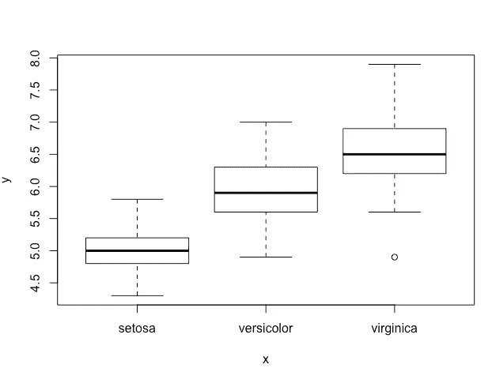

植物分类和萼片长度的基本箱线图

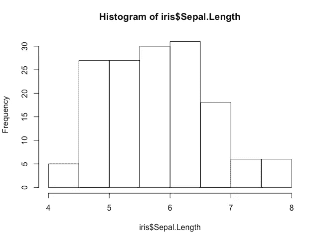

植物萼片长度的基本直方图

在 RStudio 的图形环境模块中，您可以检查您想要使用的包。我将在这里使用 ggplot2 包进行一些更高级的绘图。

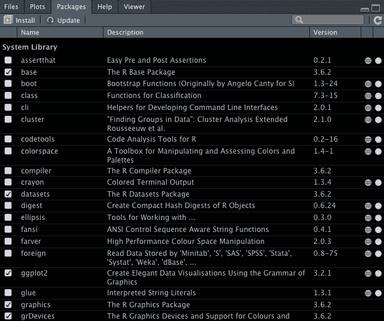

我将使用 ggplot2 包的内置数据集。

```
qplot(displ,hwy,data=mpg,facets=.~drv)
qplot(hwy,data=mpg,fill=drv)
```

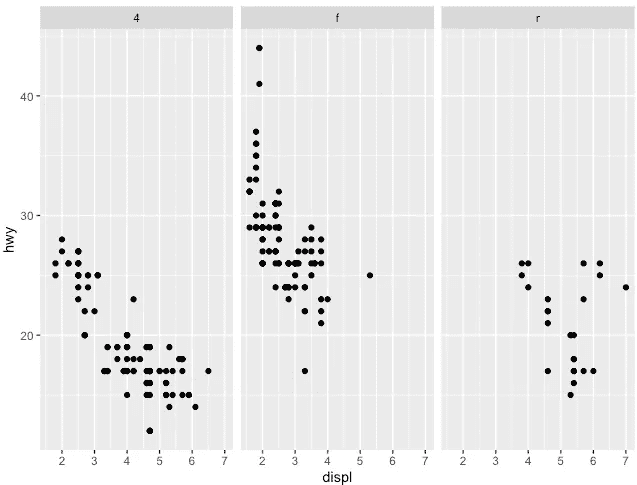

按车辆车轮驱动类型的发动机尺寸划分的公路里程散点图

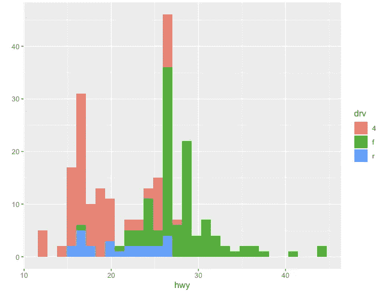

公路里程直方图，根据车辆的车轮驱动类型进行着色

我会把 R 指南分成多部分的系列，这样更容易消化…

# 下一集双语数据科学家:

*   数据操作:我将介绍 R 中使用的技术和方法，类似于您可能在 Python 中对 Pandas 使用的函数
*   统计:我将在 R 中探索各种各样的统计测试