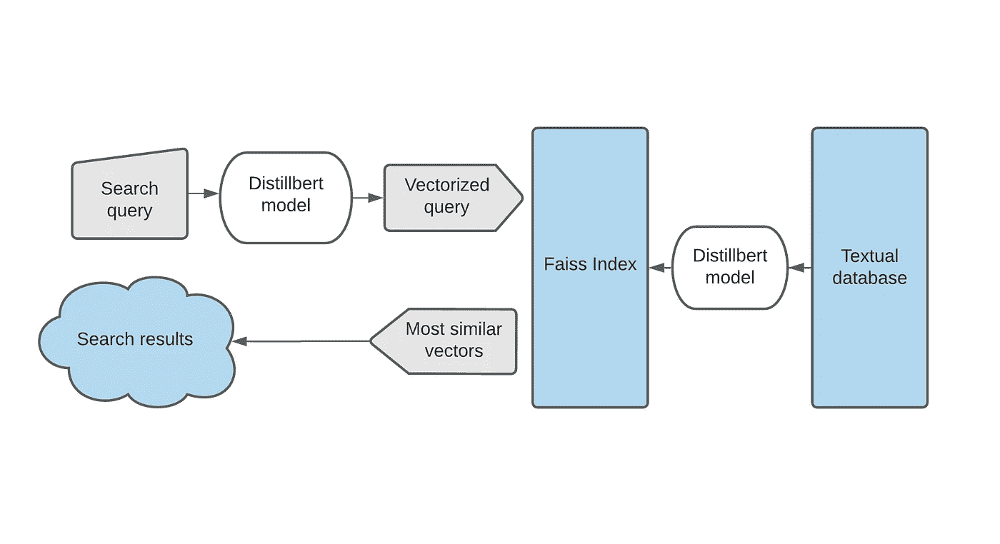
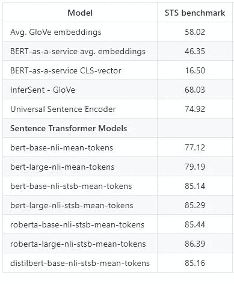
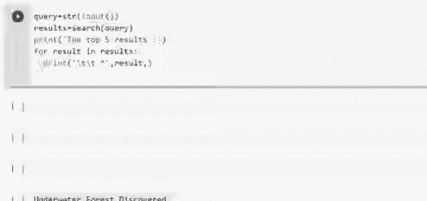

# 基于 FAISS+SBERT 的亿级语义相似性搜索

> 原文：<https://towardsdatascience.com/billion-scale-semantic-similarity-search-with-faiss-sbert-c845614962e2?source=collection_archive---------3----------------------->

## 构建智能搜索引擎的原型



作者图片

## 介绍

语义搜索是一种信息检索系统，它关注句子的含义，而不是传统的关键字匹配。尽管有许多文本嵌入可以用于此目的，但是很少有人讨论如何扩展它来构建可以从大量数据中获取数据的低延迟 API。在这篇文章中，我将讨论我们如何使用 SOTA 句子嵌入([句子转换器](https://arxiv.org/pdf/1908.10084.pdf)和 [FAISS](https://github.com/facebookresearch/faiss) )来实现一个最小语义搜索引擎。

## 句子变形金刚

它是一个框架或一组模型，给出句子或段落的密集向量表示。这些模型是变压器网络(BERT、RoBERTa 等。)进行了微调，特别是针对语义文本相似性的任务，因为 BERT 对于这些任务的开箱即用表现不佳。下面给出了不同型号在 STS 基准测试中的性能



图片来源:[句子变形金刚](https://github.com/UKPLab/sentence-transformers)

我们可以看到，句子转换模型远远优于其他模型。

但是如果你看一下排行榜上有代码为和[胶水](https://gluebenchmark.com/leaderboard)的[论文，你会看到很多 90 以上的模型。那么我们为什么需要句子变形金刚呢？。](https://paperswithcode.com/sota/semantic-textual-similarity-on-sts-benchmark)

在这些模型中，语义文本相似度被认为是一项回归任务。这意味着每当我们需要计算两个句子之间的相似性得分时，我们需要将它们一起传递到模型中，模型输出它们之间的数值得分。虽然这对于基准测试很有效，但是对于现实生活中的用例来说，它的伸缩性很差，原因如下。

1.  当您需要搜索 10 k 个文档时，您将需要执行 10k 个独立的推理计算，这是不可能单独计算嵌入和仅计算余弦相似性的。见作者[解释](https://github.com/UKPLab/sentence-transformers/issues/405#issuecomment-689397806)。
2.  最大序列长度(模型在一次传递中可以采用的单词/标记的总数)在两个文档之间共享，这导致表示由于分块而被稀释

## 费斯

Faiss 是一个基于 C++的库，由脸书·艾创建，带有一个完整的 python 包装器，用于索引矢量化数据并对其进行有效搜索。Faiss 根据以下因素提供不同的指数

*   搜索时间
*   搜索质量
*   每个索引向量使用的内存
*   训练时间
*   无监督训练需要外部数据

因此，选择正确的指数将是这些因素之间的权衡。

## 加载模型并对数据集执行推理

首先，让我们安装并加载所需的库

```
!pip install faiss-cpu
!pip install -U sentence-transformersimport numpy as np
import torch
import os
import pandas as pd
import faiss
import time
from sentence_transformers import SentenceTransformer
```

加载带有**百万个数据点**的数据集

我使用了一个来自 Kaggle 的数据集，其中包含了 17 年间发布的新闻标题。

```
df=pd.read_csv("abcnews-date-text.csv")
data=df.headline_text.to_list()
```

加载预训练模型并执行推理

```
model = SentenceTransformer('distilbert-base-nli-mean-tokens')encoded_data = model.encode(data)
```

## 索引数据集

通过参考[指南](https://github.com/facebookresearch/faiss/wiki/Guidelines-to-choose-an-index)，我们可以根据我们的用例选择不同的索引选项。

让我们定义索引并向其中添加数据

```
index = faiss.IndexIDMap(faiss.IndexFlatIP(768))index.add_with_ids(encoded_data, np.array(range(0, len(data))))
```

序列化索引

```
faiss.write_index(index, 'abc_news')
```

串行化的索引然后可以被导出到用于托管搜索引擎的任何机器中

反序列化索引

```
index = faiss.read_index('abc_news')
```

## 执行语义相似性搜索

让我们首先为搜索构建一个包装器函数

```
def search(query):
   t=time.time()
   query_vector = model.encode([query])
   k = 5
   top_k = index.search(query_vector, k)
   print('totaltime: {}'.format(time.time()-t))
   return [data[_id] for _id in top_k[1].tolist()[0]]
```

执行搜索

```
query=str(input())
results=search(query)
print('results :')
for result in results:
   print('\t',result)
```

# CPU 上的结果

现在让我们看看搜索结果和响应时间



作者 GIF

**仅用 **CPU 后端**对一个包含**百万**文本文档的数据集执行智能的基于含义的搜索只需要 1.5 秒**。

# GPU 上的结果

首先，我们卸载 Faiss 的 CPU 版本，重装 GPU 版本

```
!pip uninstall faiss-cpu
!pip install faiss-gpu
```

然后按照相同的过程，但在最后将索引移动到 GPU。

```
res = faiss.StandardGpuResources()
gpu_index = faiss.index_cpu_to_gpu(res, 0, index)
```

现在让我们把它放在搜索函数中，用 GPU 执行搜索。


作者 GIF

没错，使用比 CPU 后端快 75 倍的 GPU (本实验中使用的是特斯拉 T4)**可以在 **0.02 秒内得到结果****

## 但是，如果我可以等待几秒钟，为什么我不能序列化编码数据的 NumPy 数组而不是索引它们并使用余弦相似性呢？

因为 NumPy 没有自带的序列化函数，所以唯一的方法是将其转换成 JSON，然后保存 JSON 对象，但是这样一来，大小会增加五倍。例如，用普通索引编码成 768 维向量空间的 100 万个数据点大约是 3GB，将其转换成 JSON 将是 15GB，这是普通机器的 RAM 所不能容纳的。因此，每次执行搜索时，我们都必须运行一百万次计算推断，这是不实际的。

# 最后的想法

这是一个基本的实现，在语言模型部分和索引部分还有很多工作要做。有不同的索引选项，应根据使用情形、数据大小和可用的计算能力选择正确的选项。此外，这里使用的句子嵌入只是在一些公共数据集上进行微调，在特定领域的数据集上进行微调将改善嵌入，从而改善搜索结果。

# 参考

*[1]尼尔斯·雷默斯和伊琳娜·古雷维奇。* [*制作单语句子嵌入多语使用知识蒸馏*](https://arxiv.org/pdf/2004.09813.pdf) *。”arXiv (2020): 2004.09813。*

[2]约翰逊，杰夫和杜泽，马特希斯和 J{\'e}gou，赫夫{\'e} *。* [用 GPU 进行亿级相似性搜索](https://arxiv.org/abs/1702.08734)*arXiv 预印本 arXiv:1702.08734 *。**