# BIM 和人工智能相结合。用例。

> 原文：<https://towardsdatascience.com/bim-and-artificial-intelligence-combined-use-case-778dad72f64c?source=collection_archive---------21----------------------->

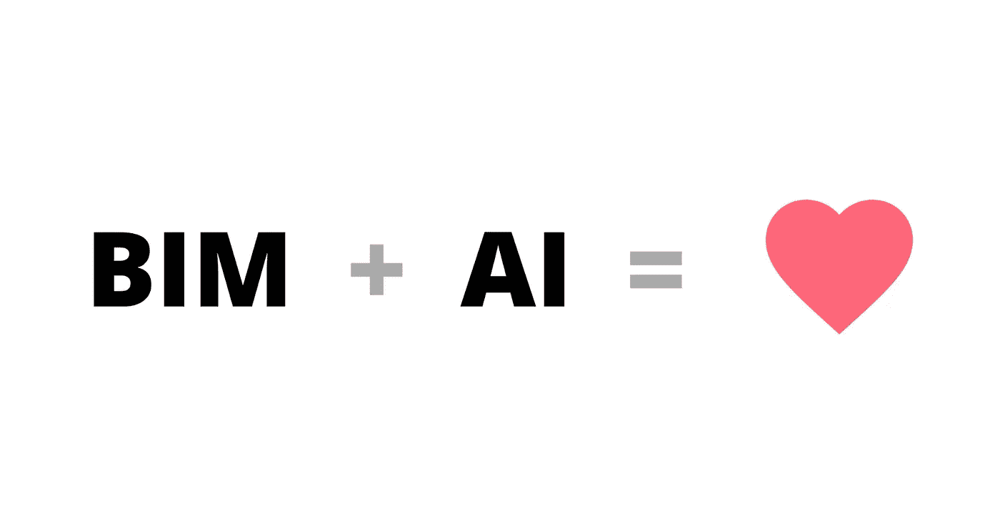

## ***利用深度神经网络优化 BIM 模型能源性能***

相对而言，最近 AEC(建筑、工程、施工)行业遇到了一项名为 BIM 的新技术。建筑信息建模允许在实际施工开始之前虚拟地建造一座建筑；这带来了许多有形和无形的好处:减少成本超支，更有效的协调，授权决策等。对于一些公司来说，采用 BIM 是一个很大的障碍，许多公司仍在挣扎。但现在我们看到行业中出现了另一个新趋势:人工智能。我们不要害怕，仔细看看。这比你想象的要简单！

在本文中，我将展示我的硕士论文 ***使用深度神经网络*** *优化 BIM 模型能源性能。*

## **提出问题**

许多不同的估计[表明](https://www.buildersassociation.com//docs/Education/Estimating%20Academy/Mark%20Gardner%20Total%20Cost%20of%20Ownership.pdf)大约 70–80%的设施成本是运营成本。

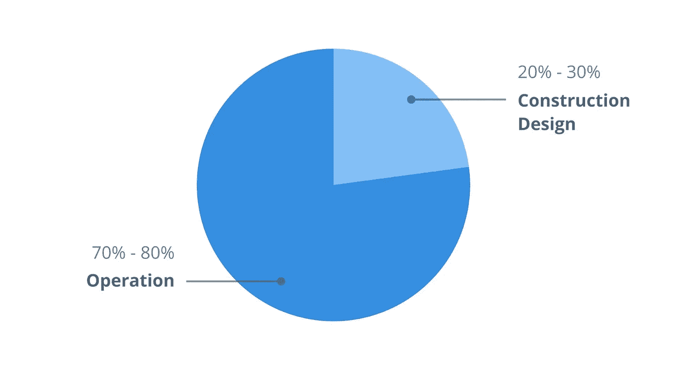

设施成本分配。作者图片

这些当然也是因为保养；但请记住，建筑业有时被称为“40%的产业”，因为它占据了世界自然资源和二氧化碳排放量的 40%。我们应该更好地保护自然！

我将尝试提出一个优化建筑能耗的框架，它被称为 EUI，或能源使用强度，以 MJ(或 kWh)/m/年为单位。能源分析将由绿色建筑工作室执行，该工作室使用 DOE-2 引擎和从 Revit 导出的 gbXML 文件。

## **获取数据**

首先，我们需要做一些假设。让我们为我将要测试的每个模型保持相同的 HVAC 系统(即，Revit 提供的用于单户住宅的标准 HVAC 模型将用于每个 Revit 模型)。事实上，在真实的设施中，随着时间的推移，它可以被更高效的装置和系统所取代，否则我们可能不会那么早就知道 HVAC 的类型。

相反，让我们把注意力集中在建筑物更持久的特征上，比如地板、墙壁和屋顶的热传导率；窗墙比；计划中的旋转。这些都是我将要研究的特性。

另一个假设是，我们的 Revit 模型将是一个普通的盒子，里面只有一个房间，没有隔墙和窗户(窗墙比将在后面指定)。这是为了简化分析。

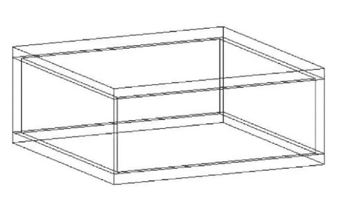

首个 Revit 模型。作者图片

因此，让我们尝试以下参数范围的所有组合:

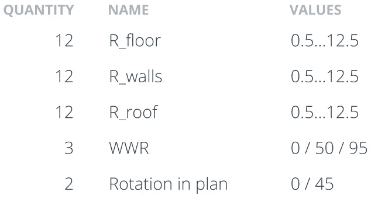

设计参数。作者图片

10368 种组合太多了，但 Revit API 会有所帮助。Green Building Studio 使用 Revit 可以导出的 gbXML 文件。[该脚本](https://github.com/Mikhail1Demianenko/eui-optimization/blob/master/Creating%20models%20via%20Revit%20API.ipynb)将热阻值和平面旋转的组合应用于模型，并将每个组合模型导出为 gbXML 格式。通过改变热资产的热导率来获得不同的热阻值。改变厚度会在分析中引入另一个因素:分析表面始终位于元素的中间，因此总面积会随着壁厚而变化。

在解析 gbXML 目录以获得所有文件的路径之后，我们准备将我们的 3456 (12*12*12*2) gbXML 文件上传到 Green Building Studio。使用发电机包[对发电机](http://core.thorntontomasetti.com/energy-analysis-for-dynamo/#:~:text=EnergyAnalysisForDynamo%20is%20parametric%20interface%20for,in%20Dynamo%200.8%20and%20Revit.&text=Sample%20files%3A%20Sample%20files%20come%20with%20the%20package.)进行能量分析。

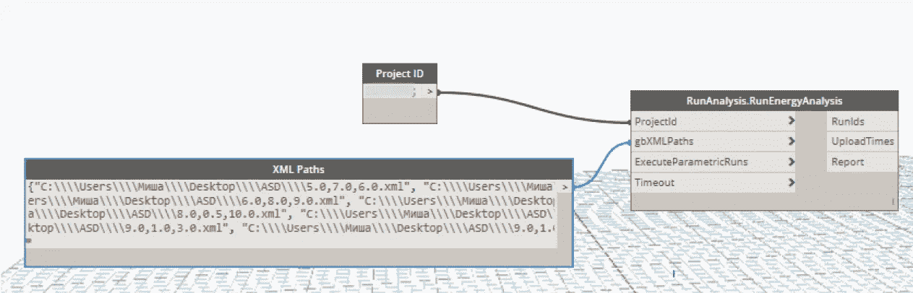

[发电机](http://core.thorntontomasetti.com/energy-analysis-for-dynamo/#:~:text=EnergyAnalysisForDynamo%20is%20parametric%20interface%20for,in%20Dynamo%200.8%20and%20Revit.&text=Sample%20files%3A%20Sample%20files%20come%20with%20the%20package.)节点能量分析。作者图片

分析完成后，我们可以开始在 Green Building Studio 中指定窗墙比。不幸的是，Dynamo 包没有这个功能，GBS API 只对开发者开放，所以我不得不求助于浏览器自动化来分配 wwr。然而，这只需要做一次，我们稍后会看到为什么。当能量分析完成后，我们可以解析 GBS 的数据并彻底检查它。

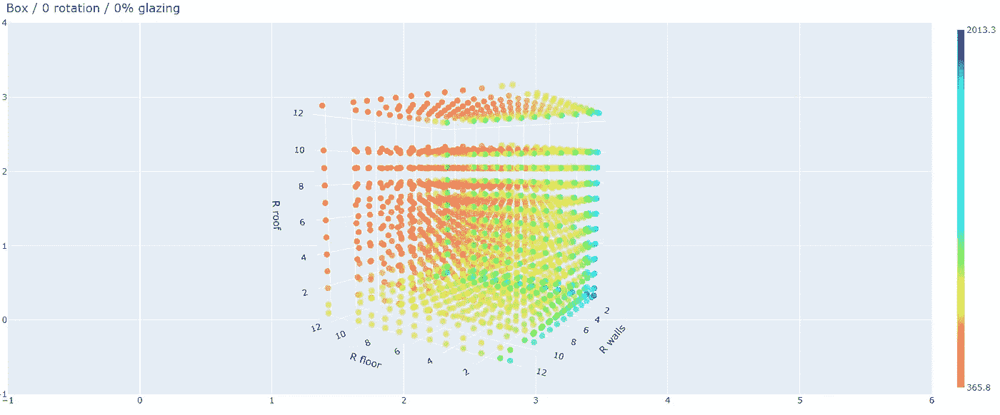

用[密谋](https://plotly.com/python/)密谋。作者图片

现在，让我们用另一个简单但不同的 Revit 模型重复上述所有步骤。

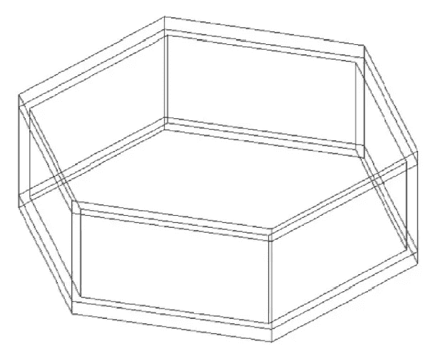

第二个 Revit 模型。作者图片

我们需要这些数据供以后使用。

## **训练神经网络**

对于每个机器学习项目，数据检查和准备是必须的。但是在这种情况下，我们没有缺失数据或异常值:我们的数据是人工创建的。因此我们可以安全地跳过许多检查步骤。我将在另一篇文章中更详细地描述神经网络。有兴趣的话，这里有[剧本](https://github.com/Mikhail1Demianenko/eui-optimization)。但长话短说，给定大量数据，神经网络能够推导出管理数据的规则。与传统编程相比，我们给出规则和数据来获得答案。

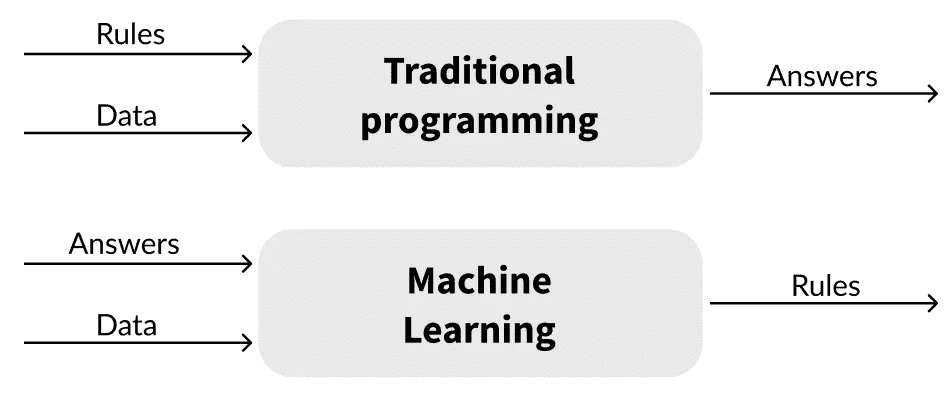

图片作者。灵感来自 [DataLya](https://datalya.com/blog/machine-learning/machine-learning-vs-traditional-programming-paradigm)

当规则难以编码时，神经网络就派上了用场:人脸或语音识别、自然语言处理、翻译、情感分析等。

我设计的网络有这样的架构:

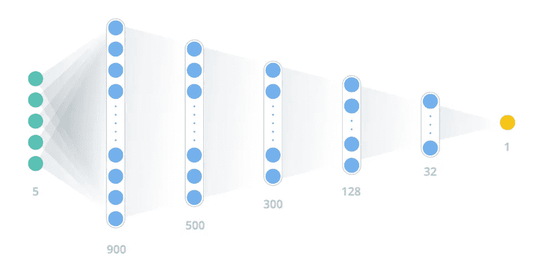

原始神经网络。作者图片

输入层(绿色)有 5 个单元。这些是我们的参数:WWR，平面旋转和三个热阻值。反过来，输出图层(黄色)是 EUI 值。将这个网络(蓝色层)视为一个巨大的矩阵，在第一步中只包含随机数。为了训练网络，我们的输入层(向量)乘以一系列矩阵，以获得 EUI 值的预测。然后将预测值与实际 EUI 值进行比较，并更新网络中的数字以更好地预测输出。这个循环一直重复，直到我们对表现满意为止。

现在是时候根据第一个盒子模型的数据点来训练我们的网络了。其中 94%将用于训练我们的网络，6%用于验证网络并调整影响网络的一些参数以获得更好的性能。

训练之后，我们使用网络来预测 10368 个 EUI 值:

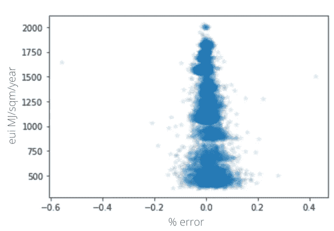

网络的预测。作者图片

误差保持在 0.2%以内，还不错。除此之外，网络把我们的数据从离散变成了连续。换句话说，我们现在可以获得以前无法获得的参数的 EUI 值；例如 21% WWR 或 R=2.45。

好了，这让我们进入下一步。

## **转移学习**

还记得我们在第一步中制作的第二个 Revit 模型吗？我们现在将把它与一种叫做“迁移学习”的技术结合起来使用。让我们将前一步中训练好的网络设置为不可训练的前四层:

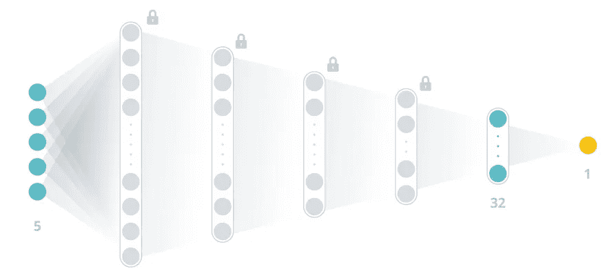

冻结网络。作者图片

或者，换句话说，让我们只关注最后两层。

此时，网络“知道”主要模式和趋势以及每个参数如何影响 EUI。但仅适用于第一个 Revit 模型。

现在，让我们通过使用新数据重新训练最后两层，将新的 Revit 模型“引入”我们的网络。但是有一个重要的区别:这次只有 6%的数据用于训练，94%用于验证。不执行超参数调整。我们在训练后得到这样的结果:

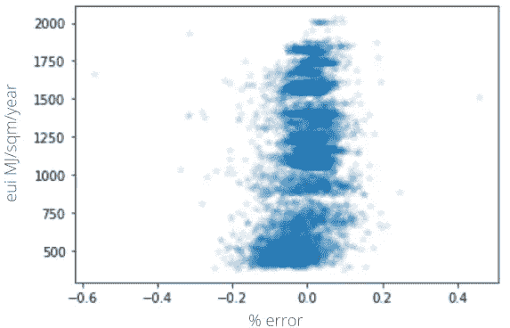

再训练网络的预测。作者图片

*注意:与第一个 box Revit 模型的 2-3 小时相比，训练花费的时间大约为 1 或 2 分钟，预测几乎一样准确。*

## **一个小实验**

为什么坚持 6%的培训-验证比例？让我们再尝试一些，看看效果如何。

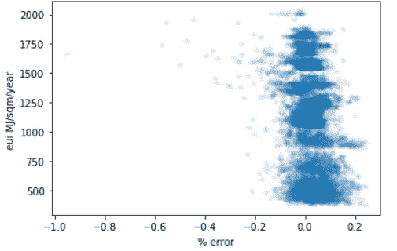

4%的训练数据。作者图片

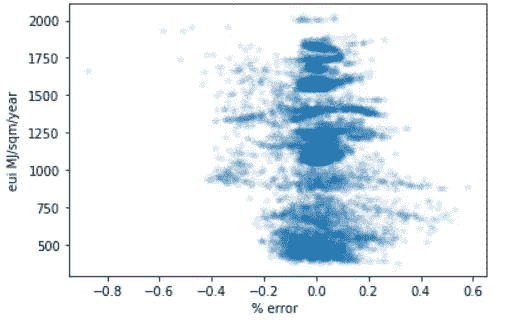

1%的训练数据。作者图片

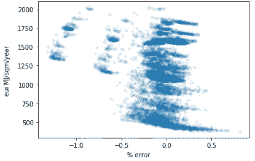

0.25%训练数据。作者图片

事实证明，在大约 1-2%的训练-验证分裂时，性能开始显著下降。

请注意，在功能丧失达到稳定水平后，训练停止

## **结果和比较**

恭喜你！现在，我们有了一个训练有素的网络，可以用少量的数据预测 Revit 模型在大范围参数下的能耗。该模型甚至可能没有任何窗口。我们做的最后一步展示了它:通过从我们想要分析的模型中引入一些数据点，我们得到了一个非常准确的估计，误差很小。

为了强调迁移学习效应，让我们以刚刚训练的网络为例，预测两个模型的 EUI。

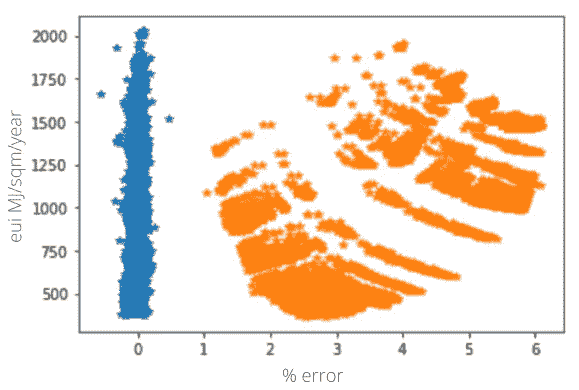

一个网络-两个 Revit 模型预测。作者图片

这就是说，我们不能采取随机神经网络，并期望它与我们的模型一起工作:应该做一点点能量分析。然而，它可以像第一部分一样自动完成。

## **未来工作**

现在，我们已经有了一个神经网络来建立一个准确的能耗预测，除了用复杂的 Revit 模型进行测试之外，还必须向实际优化迈出一步。为了找到参数的最优组合，需要建立一个成本模型。成本模型应包括材料成本、人工成本、可能的维护成本、能源成本，并应考虑建筑的生命周期、建筑和物理限制。

这将产生一个现实的框架，只需很少的努力就可以在项目的概念阶段选择最佳的参数组合。

谢谢你读到这里！

*我总是乐于参与讨论或收到反馈。给我留言*[*LinkedIn*](https://www.linkedin.com/in/mikhail1dem/)*或电子邮件:mikhail1dem@gmail.com*