# 二进制和多类文本分类(模型测试管道中的自动检测)

> 原文：<https://towardsdatascience.com/binary-and-multiclass-text-classification-auto-detection-in-a-model-test-pipeline-938158854943?source=collection_archive---------18----------------------->


来源:作者图片

# 介绍

在我之前的文章([文本分类中的模型选择](/model-selection-in-text-classification-ac13eedf6146))中，我针对二进制文本分类问题，提出了一种通过比较经典机器学习和深度学习来选择模型的方法。

笔记本的结构是自动运行，交叉验证所有算法，并显示不同指标的结果，让用户根据自己的需要自由选择算法。

在这里，[笔记本](https://github.com/Christophe-pere/Text-classification)被创建来显示二元或多类问题的不同度量和学习曲线。笔记本将自动定义数据集的配置。

> 笔记本和脚本可以在这里找到: [GitHub](https://github.com/Christophe-pere/Text-classification)

# 信息

目标是使用不同的模型，并在**训练**和**测试**期间观察它们的行为。当可能时，算法执行**提前停止**以**避免过拟合**。对于深度学习，可以在训练期间使用**预训练模型**来减少训练时间。

开头有两件事很重要:
-**文本列名**归类
-**标签列名**

> 创建流水线是为了考虑到**二进制分类或多类分类，而无需人工参与**。管道提取标签的数量，并确定它是二元问题还是多类问题。所有算法和指标将自动从一个切换到另一个。

笔记本以用于测试您想要的模型的参数列表开始。下面的 ***要诀*** 显示了这个列表。 ***Lang*** 决定笔记本是否需要从 *Google* 调用[*Translator()*](https://pypi.org/project/googletrans/)API 来检测数据集的语言(默认为英语)。

相应的 python 函数:

# I —数据清理、文本处理

在这篇文章中使用的数据与上一篇文章相同，IMDB 数据集(因为它是一个开源数据集，更多详细信息[在此](/model-selection-in-text-classification-ac13eedf6146))。

数据集不是完全干净的，在自然语言处理任务中，你需要为你的问题清理你的数据。这一步将影响算法的性能。

关于 IMDB 数据集，我做了什么？

*   去掉一个单词的所有大写字母**,只保留第一个字母(这对 NER 提取很重要)**
*   移除**网址**(如果有)
*   移除 **html** 应答器
*   删除**表情符号**
*   用*有*有代替**有*有***
*   用*而非* 替换*n*的缩写

# II —极性

使用库 [**TextBlob**](https://textblob.readthedocs.io/en/dev/) 估计文本的极性，并绘制成图表(在 5000 raws 的样本上制作)。

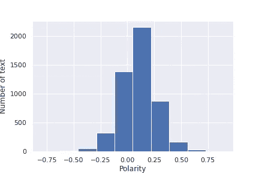

# III —文本信息

所有的评论都没有相同的长度，相同的字数。研究这些信息很有趣:

*   提取字数
*   提取字符数
*   计算密度(字符数/字数)
*   提取首字母大写的单词数

我们可以很容易地用图表标出 char 的数量:

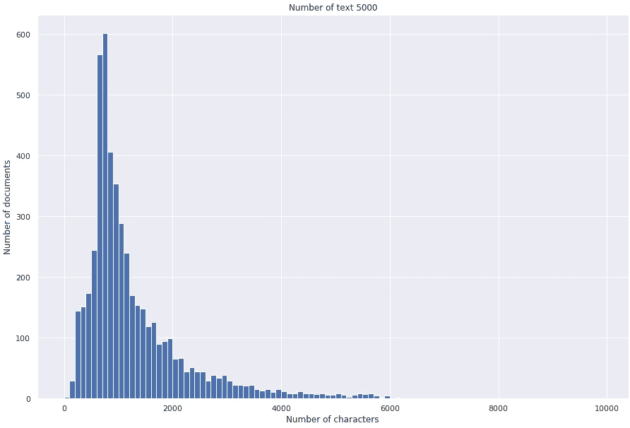

评论大多由 550-600 个字符组成。

看类(标签)的分布也很有意思。

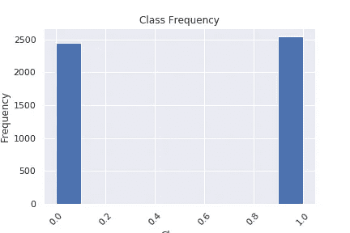

标签

数据集是平衡的，大约有 2500 个标签类别的评论(二进制)。

# 六元语法

N-grams 是一种将句子分割成 n 个单词的技术，例如:

*我学机器学习是为了成为一名数据科学家*

*   **Unigram** :【我，学习，机器，学习，到，成为，a，数据，科学家】
*   **二元模型** : [(我学习)，(学习机)，(机器学习)，(学习到)，(成为)，(成为一个)，(一个数据)，(数据科学家)]
*   **三元组** : [(我学习机器)，(学习机器学习)，(机器学习到)，(学习成为)，(成为一个)，(成为一个数据)，(一个数据科学家)]
*   …

我是 n 元语法的粉丝，因为我可以通过它们展示预处理是否正确。在笔记本上，你会发现单词重要性对于单个词、两个词、有和没有停用词的三个词(一个没有重要性的单词)以及对 5 个词的测试。

对于带停用词的三元模型:

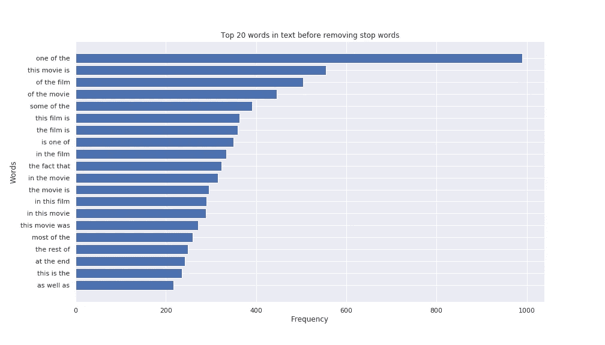

没有停止词:

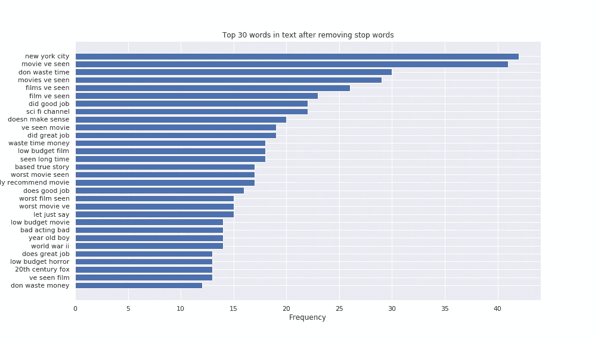

这种差异非常重要。一般来说，文本包含许多停用词，这对于像 ***TF-IDF*** 或 ***单词嵌入*** 这样的方法并不重要，但是对于 ***One-Hot 编码*** 来说却是如此，因为每个单词在一个句子中具有相同的重要性。

# 我们使用什么模型和指标？

管道被配置为使用不同的模型。表 1 给出了机器学习和深度学习算法以及使用的指标。

# 看起来怎么样

我给大家看两个例子，第一个， ***随机梯度推进*** 和 ***浅层神经网络*** 。

训练经典分类器代码如下:

该函数输入分类器和数据以拟合模型。

对于指标，已经创建了相同类型的函数:

该函数将显示不同的曲线(精确召回率、真假阳性率、ROC AUC)、混淆矩阵、Cohen's Kappa(模型之间的比较以及两个标注器将如何做)和准确度。

***随机梯度推进:***

用 TF-IDF 方法获得了 SGD 算法(函数 1)的最佳结果。

```
if sgd: # does the computation if sgd = True
    print("\nStochastic Gradient Descent with early stopping for TF-IDF\n")
    print("Early Stopping : 10 iterations without change")
    metrics_ML(SGDClassifier(loss='modified_huber', max_iter=1000, tol=1e-3,   n_iter_no_change=10, early_stopping=True, n_jobs=-1 ),xtrain_tfidf, train_y, xvalid_tfidf, valid_y, gb=True)
```

metrics_ML()函数将调用 classifier_model()函数来训练模型并计算指标。训练分类器和指标的最简单方法。

结果是:

```
Stochastic Gradient Descent with early stopping for TF-IDF

Early Stopping : 10 iterations without change
Execution time : 0.060 s
Score : 84.7 %

Classification Report

              precision    recall  f1-score   support

    negative       0.87      0.81      0.84       490
    positive       0.83      0.88      0.85       510

    accuracy                           0.85      1000
   macro avg       0.85      0.85      0.85      1000
weighted avg       0.85      0.85      0.85      1000
```

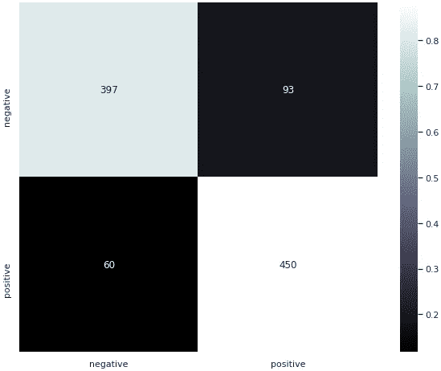

混淆矩阵

```
Model: f1-score=0.855 AUC=0.923
```

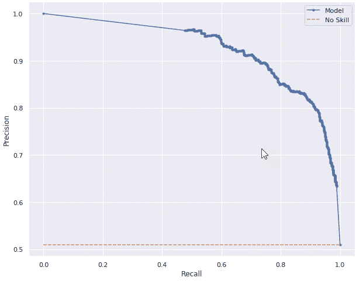

精确召回曲线

```
ROC AUC=0.919
```


真假阳性率

还不错，84.7%的分数。现在我们能做得更好吗？

***浅层神经网络:***

浅层神经网络的代码已在上一篇文章中介绍过。这里再说一遍:

每个深度学习算法都以相同的方式实现。所有的代码都可以在笔记本和对应的 GitHub 中找到。

如何使用它:

```
es = tf.keras.callbacks.EarlyStopping(monitor='val_loss', mode='auto', patience=3)
if shallow_network:
    model_shallow = shallow_neural_networks(word_index, pre_trained=pre_trained)
    history = model_shallow.fit(train_seq_x, train_y,
                    epochs=1000, callbacks=[es],
                    validation_split=0.2, verbose=True)
    results = model_shallow.evaluate(valid_seq_x, valid_y)
```

输出:

```
Train on 3200 samples, validate on 800 samples
Epoch 1/1000
3200/3200 [==============================] - 2s 578us/sample - loss: 0.7117 - accuracy: 0.4837 - val_loss: 0.7212 - val_accuracy: 0.5175
...
Epoch 98/1000
3200/3200 [==============================] - 1s 407us/sample - loss: 0.4991 - accuracy: 0.9991 - val_loss: 0.5808 - val_accuracy: 0.88501000/1000 [==============================] - 0s 383us/sample - loss: 0.5748 - accuracy: 0.8590
```

指标:

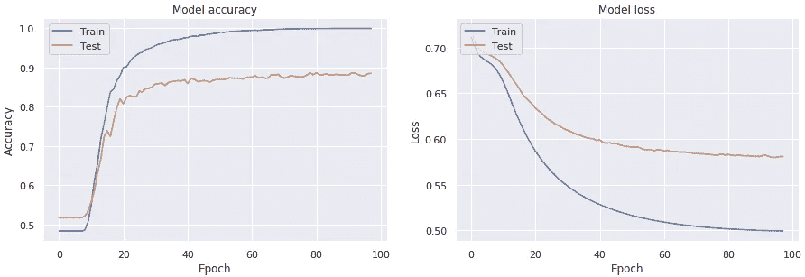

浅层神经网络的历史

```
 precision    recall  f1-score   support

    negative       0.86      0.85      0.86       490
    positive       0.86      0.87      0.86       510

    accuracy                           0.86      1000
   macro avg       0.86      0.86      0.86      1000
weighted avg       0.86      0.86      0.86      1000

The balanced accuracy is : 85.88%

The Zero-one Loss is : 14.1%

Explained variance score: 0.436

ROC AUC=0.931
```

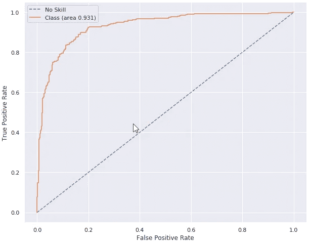

```
Model: f1-score=0.863 AUC=0.932
```

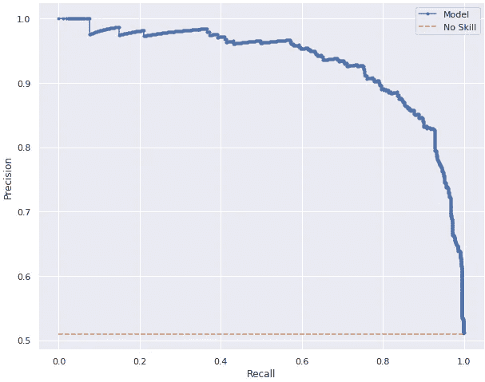

```
Cohen's kappa: 71.78%
```

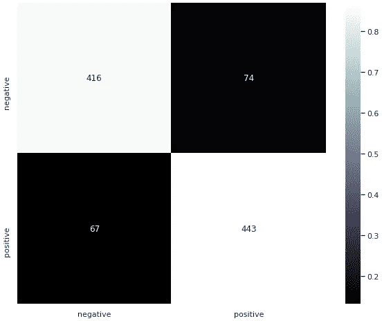

所以，神经网络的结果更好。但是，不能对每种方法的单次运行进行比较。要正确选择模型，必须使用交叉验证等评估方法(参见:[文本分类中的模型选择](/model-selection-in-text-classification-ac13eedf6146))。

# 结论

**流水线是自动的**，你只需要在开始时配置**参数**，**选择你想要测试的不同算法**并等待结果。

目标是**通过算法和方法(One-Hot encoding、TF-IDF、TF-IDF n-grams、TF-IDF char n-grams 和单词嵌入)显示不同的指标**,并**选择您希望用于解决问题的一类算法**。下一步将是调整超参数并享受结果。

这项工作有助于在不了解类的情况下，针对**文本分类**、**二元或多元类**快速**测试 NLP 用例**。管道可以接受**法语文本或者**英语文本。

笔记本和课程可在 [GitHub](https://github.com/Christophe-pere/Text-classification) 上获得。

# 后续步骤

*   实现不平衡的方法来自动平衡数据集
*   实现变压器分类模型
*   实施预先培训的变压器
*   用强化学习测试 NLP
*   知识图谱
*   使用分布式深度学习
*   使用 TensorNetwork 加速神经网络
*   用正确的方法选择一类模型并进行超参数调整
*   使用量子 NLP (QNLP)