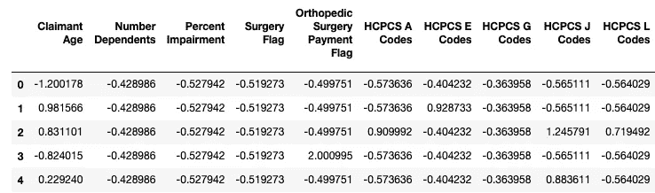
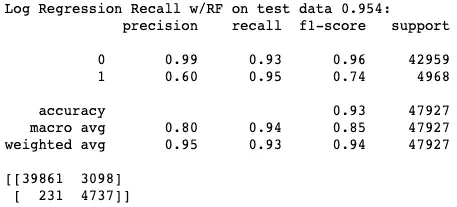

# 二元分类示例

> 原文：<https://towardsdatascience.com/binary-classification-example-4190fcfe4a3c?source=collection_archive---------16----------------------->

## 预测阿片类药物的使用


里卡多·罗查在 [Unsplash](https://unsplash.com?utm_source=medium&utm_medium=referral) 上的照片

这场全球危机以这样或那样的方式影响了我们所有人的生活，但这是一个磨练你的手艺的绝佳机会。我碰巧更新了我的 Coursera 账户，专门尝试网络分析。加密货币/区块链媒介文章已经成为我日常生活的一部分。最后，我想发布一个 ML 分类的例子来帮助那些寻找一个详细的“从开始到结束”的用例的人，并从整个社区中寻求建设性的反馈。这将是一个漫长而详细的旅程，我希望你已经准备好了。

我们将利用一个保险数据集，该数据集概述了一系列以患者为中心的特征，最终目标是正确预测阿片类药物滥用是否已经发生。

# 功能定义

**ClaimID Unique:** Identifier for a claim
**Accident DateID:** Number of days since the accident occurred from an arbitrary date
**Claim Setup DateID:** Number of days since the Resolution Manager sets up the claim from an arbitrary date
**Report To DateID:** Number of days since the employer notifies insurance of a claim from an arbitrary date
**Employer Notification DateID:** Number of days since the claimant notifies employer of an injury from an arbitrary date
**Benefits State:** The jurisdiction whose benefits are applied to a claim
**Accident State:** State in which the accident occurred
**Industry ID:** Broad industry classification categories
**Claimant Age:** Age of the injured worker
**Claimant Sex:** Sex of the injured worker
**Claimant State:** State in which the claimant resides
**Claimant Marital Status:** Marital status of the injured worker
**Number Dependents:** Number of dependents the claimant has
**Weekly Wage:** An average of the claimant’s weekly wages as of the injury date.
**Employment Status Flag:**
F — Regular full-time employee
P — Part-time employee
U — Unemployed
S — On strike
D — Disabled
R — Retired
O — Other
L — Seasonal worker
V — Volunteer worker
A — Apprenticeship full-time
B — Apprenticeship part-time
C — Piece worker
**RTW Restriction Flag:** A Y/N flag, used to indicate whether the employees responsibilities upon returning to work were limited as a result of his/her illness or injury.
**Max Medical Improvement DateID:** DateID of Maximum Medical Improvement, after which further recovery from or lasting improvements to an injury or disease can no longer be anticipated based on reasonable medical probability.
**Percent Impairment:** Indicates the percentage of anatomic or functional abnormality or loss, for the body as a whole, which resulted from the injury and exists after the date of maximum medical improvement
**Post Injury Weekly Wage:** The weekly wage of the claimant after returning to work, post-injury, and/or the claim is closed.
**NCCI Job Code:** A code that is established to identify and categorize jobs for workers’ compensation.
**Surgery Flag:** Indicates if the claimant’s injury will require or did require surgery
**Disability Status:**
— Temporary Total Disability (TTD)
— Temporary Partial Disability (TPD)
— Permanent Partial Disability (PPD)
— Permanent Total Disability (PTD)
**SIC Group:** Standard Industry Classification group for the client
**NCCI BINatureOfLossDescription**: Description of the end result of the bodily injury (BI) loss occurrence
**Accident Source Code:** A code identifying the object or source which inflicted the injury or damage.
**Accident Type Group:** A code identifying the general action which occurred resulting in the loss
**Neurology Payment Flag:** Indicates if there were any payments made for diagnosis and treatment of disorders of the nervous system without surgical intervention
**Neurosurgery Payment Flag:** Indicates if there were any payments made for services by physicians specializing in the diagnosis and treatment of disorders of the nervous system, including surgical intervention if needed
**Dentist Payment Flag:** Indicates if there were any payments made for prevention, diagnosis, and treatment of diseases of the teeth and gums
**Orthopedic Surgery Payment Flag:** Indicates if there were any payments made for surgery dealing with the skeletal system and preservation and restoration of its articulations and structures.
**Psychiatry Payment Flag:** Indicates if there were any payments made for treatment of mental, emotional, or behavioral disorders.
**Hand Surgery Payment Flag:** Indicates if there were any payments made for surgery only addressing one or both hands.
**Optometrist Payment Flag:** Indicates if there were any payments made to specialists who examine the eye for defects and faults of refraction and prescribe correctional lenses or exercises but not drugs or surgery
**Podiatry Payment Flag:** Indicates if there were any payments made for services from a specialist concerned with the care of the foot, including its anatomy, medical and surgical treatment, and its diseases.
**HCPCS A Codes — HCPCS Z Codes:** Count of the number of HCPCS codes that appear on the claim within each respective code group
**ICD Group 1 — ICD Group 21:** Count of the number of ICD codes that appear on the claim w/in each respective code group
**Count of the number of codes on the claim**
— CPT Category — Anesthesia
— CPT Category — Eval_Mgmt
— CPT Category — Medicine
— CPT Category — Path_Lab
— CPT Category — Radiology
— CPT Category — Surgery
**Count of the number of NDC codes on the claim within each respective code class**
— NDC Class — Benzo
— NDC Class — Misc (Zolpidem)
— NDC Class — Muscle Relaxants
— NDC Class — Stimulants
**Opioids Used:** A True (1) or False (0) indicator for whether or not the claimant abused an opioid

# 探索性数据分析

让我们从导入所有需要的库和数据集开始。

```
from math import sqrt
import pandas as pd
import numpy as np
import scipy.stats as stats
import matplotlib.pyplot as plt
import seaborn as sns
from IPython.display import displayfrom sklearn.model_selection import train_test_split
from sklearn.pipeline import Pipelinefrom feature_engine import missing_data_imputers as mdi
from feature_engine import categorical_encoders as ce
from sklearn.preprocessing import RobustScaler
from imblearn.over_sampling import SMOTEfrom sklearn.model_selection import cross_val_score
from sklearn.metrics import roc_auc_score
from sklearn.metrics import roc_curve
from sklearn.metrics import recall_score
from sklearn.metrics import classification_report
from sklearn.metrics import confusion_matrix
from sklearn.model_selection import GridSearchCVfrom sklearn.ensemble import GradientBoostingClassifier
from sklearn.linear_model import LogisticRegression
from sklearn.ensemble import RandomForestClassifier
from sklearn.neighbors import KNeighborsClassifier
from sklearn.naive_bayes import GaussianNB
from sklearn import svm%matplotlib inline
pd.pandas.set_option('display.max_columns', None)with open('opioid_use_data.csv') as f:
    df = pd.read_csv(f)
f.close()SEED = 42df.shape
df.head(10)
df.info()
```


我们的数据集包含刚刚超过 16，000 个观察值以及 92 个特征，包括目标(即使用的阿片类药物)。我们还有各种各样的特征类型，包括整数、浮点、字符串、布尔和混合类型。

## 删除初始特征

在我们处理缺失数据、离群值或基数之前，让我们看看是否可以快速删除任何功能以简化我们的进一步分析。

```
for var in df.columns:
    print(var, df[var].nunique(), len(df))df.drop('ClaimID', axis=1, inplace=True)
```


当我们滚动输出时，可以看到每个要素的唯一值的数量以及整个数据集的总长度。具有与数据帧总长度相似数量的唯一值的特征可以被移除，因为它们不提供太多的预测能力(即方差)。“ClaimID”是唯一符合此标准的功能，可以删除。

```
df_copy = df.copy()
corr_matrix = df_copy.corr().abs()
upper = corr_matrix.where(np.triu(np.ones(corr_matrix.shape), k=1).astype(np.bool))upper
```


```
to_drop = [var for var in upper.columns if any(upper[var] > .90)]
to_drop
```


```
df.drop(df[to_drop], axis=1, inplace=True)
```

接下来，我们可以检查数字特征之间的相关性，并删除相关性非常高的特征。由您决定什么被认为是“高度相关”,但在这种情况下，我们将选择 90 及以上的相关性。请注意，在代码中，我们构建了一个相关矩阵，并将相关性转换为绝对值，以便处理负相关性。可以删除索赔设置日期标识、报告日期标识、雇主通知日期标识和最大医疗改善日期标识。

```
for var in df.columns:
    print(var, 'percent of missing values', df[var].isnull().mean().round(3))
```


我们可以检查剩余要素的缺失值百分比，并移除任何缺失数据过多的要素。一个特性“事故源代码”有超过 50%的缺失值，但这不足以保证删除。

```
states = pd.DataFrame(df[['Claimant State', 'Accident State', 'Benefits State']])states
```


```
df.drop(['Claimant State', 'Accident State'], axis=1, inplace=True)
```

考察“索赔国”、“事故国”和“福利国”，我们发现绝大多数值是相同的。我们将保留“福利状态”,因为它包含最少的缺失值。

```
for var in df.columns:
    print(var, df[var].unique(), '\n')
```


```
# Converting nulls to np.nan
for var in df.columns:
    df[var].replace(to_replace='  ', value=np.nan, inplace=True)# Converting values of "X" to np.nan
for var in df.columns:
    df[var].replace(to_replace='X', value=np.nan, inplace=True)# Splitting out "Accident Type Group" (ie. mixed type feature) into separate features
df['Accident Type Group num'] = df['Accident Type Group'].str.extract('(\d+)')
df['Accident Type Group str'] = df['Accident Type Group'].str[0:5]
df.drop(['Accident Type Group'], axis=1, inplace=True)
```

当我们检查每个特性的唯一值时，我们可以开始看到一些需要我们注意的差异。首先，我们注意到未转换为 Np.nan 的空白值或空值。接下来，我们看到许多要素的“X”值，这似乎是记录差异，记录数据的个人记录了带有“X”的缺失值。最后，名为“事故类型组”的特征是我们所说的混合类型，因为它包含字符串和数值。让我们将字符串和数值分离成各自的特征，并删除原来的“事故类型组”特征。

```
for var in df.columns:
    print(var,'\n', df[var].value_counts()/len(df))
```


```
df.drop(['Neurology Payment Flag', 'Neurosurgery Payment Flag', 'Dentist Payment Flag',
         'Psychiatry Payment Flag', 'Hand Surgery Payment Flag', 'Optometrist Payment Flag',
         'Podiatry Payment Flag', 'Accident Type Group str', 'Post Injury Weekly Wage'], axis=1, inplace=True)df.drop(['HCPCS B Codes','HCPCS C Codes', 'HCPCS D Codes', 'HCPCS F Codes', 'HCPCS H Codes', 'HCPCS I Codes',
'HCPCS K Codes', 'HCPCS M Codes', 'HCPCS N Codes', 'HCPCS O Codes', 'HCPCS P Codes',
'HCPCS Q Codes', 'HCPCS R Codes', 'HCPCS S Codes', 'HCPCS T Codes', 'HCPCS U Codes', 
'HCPCS V Codes', 'HCPCS X Codes', 'HCPCS Y Codes', 'HCPCS Z Codes', 'ICD Group 1',
'ICD Group 2', 'ICD Group 3', 'ICD Group 4', 'ICD Group 5', 'ICD Group 7', 'ICD Group 8', 
'ICD Group 9', 'ICD Group 10', 'ICD Group 11', 'ICD Group 12', 'ICD Group 14', 'ICD Group 15', 
'ICD Group 16', 'ICD Group 17', 'ICD Group 20', 'NDC Class - Benzo', 'NDC Class - Misc (Zolpidem)',
'NDC Class - Stimulants'], axis=1, inplace=True)
```

现在让我们把注意力转向基数或每个特性的唯一值/类别的数量。像“周工资”这样的连续特征无疑会有数百甚至数千个独特的类别。标称和离散特征(即性别和受抚养人人数)的种类数量要少得多。本练习的目标是确定是否有任何类别拥有大多数(90%+)的值。如果一个特性包含一个或两个包含 90%以上值的类别，那么数据中就没有足够的可变性来保留该特性。最终由你来决定截止值，但我们认为 90%或更高是一个安全的假设。

# 特征特性

现在，我们已经成功地消除了许多由于高度相关性、重复值和缺乏可变性而导致的特征，我们可以专注于检查特征特性并决定如何解决每个问题。

*你会注意到，在这一部分，我们只是简单地识别问题并做一个心理记录。我们将不会实际应用讨论的变化，直到笔记本结束到一个功能工程管道。*

```
categorical = ['Benefits State', 'Industry ID', 'Claimant Sex', 'Claimant Marital Status', 'Employment Status Flag', 'RTW Restriction Flag', 'NCCI Job Code', 
'Surgery Flag', 'Disability Status', 'SIC Group', 'NCCI BINatureOfLossDescription', 'Accident Source Code',
'Orthopedic Surgery Payment Flag','Accident Type Group num']discrete = ['Claimant Age', 'Number Dependents', 'Percent Impairment', 'HCPCS A Codes',
'HCPCS E Codes', 'HCPCS G Codes', 'HCPCS J Codes','HCPCS L Codes', 'HCPCS W Codes', 
'ICD Group 6', 'ICD Group 13','ICD Group 18', 'ICD Group 19', 'ICD Group 21', 
'CPT Category - Anesthesia', 'CPT Category - Eval_Mgmt', 'CPT Category - Medicine', 
'CPT Category - Path_Lab', 'CPT Category - Radiology', 'CPT Category - Surgery', 
'NDC Class - Muscle Relaxants']continuous = ['Accident DateID', 'Weekly Wage']df.columns,'Number of Features:',len(df.columns)
```


## 缺少值

```
for var in df.columns:
    if df[var].isnull().sum() > 0:
        print(var, df[var].isnull().mean())
```


根据我们之前对缺失值的观察，我们发现只有一个要素包含超过 50%的缺失值，而绝大多数要素不包含任何缺失数据。也就是说，我们确实有一些包含缺失数据的要素，我们需要确定如何处理这个问题，因为许多 ML 算法需要完全干净的数据集。这是一个广泛的话题，我们不希望在这个博客中涵盖错综复杂的内容，但读者应该熟悉这个话题。首先，人们必须适应各种类型的缺失数据，如“完全随机缺失”、“随机缺失”和“非随机缺失”。这些主题有助于确定应该如何以及何时处理丢失的数据。此外，进一步解读插补技术，如均值/中值/众数、任意值插补、添加缺失数据指标、随机样本插补、最大似然插补等。将提供一个很好的概述。

我们有 9 个缺失数据的特征。对于缺失值少于 5%的特征(即申请人性别、申请人婚姻状况、就业状况标志、环球旅行限制标志)我们将用其分布模式替换缺失值。由于缺失值的百分比较低，模式插补不会对分布造成太大的改变。“事故日期”是我们唯一具有缺失数据的连续特征，我们将使用任意数字-99999 来估算缺失值。所有其他特征本质上都是分类的，由于它们有超过 5%的缺失值，我们将用字符串“missing”来估算缺失值。这最终不会改变发行版，只会给他们的发行版增加一个新的类别。

事故日期 ID:连续 w/ -99999
索赔人性别:分类 w/模式
索赔人婚姻状况:分类 w/模式
就业状况标志:分类 w/模式
RTW 限制标志:分类 w/模式
残疾状况:分类 w/‘失踪’
NCCI binatureofloss 描述:分类 w/‘失踪’
事故来源代码:分类 w/‘失踪’
事故类型组号:分类 w/‘失踪’

## 分类和离散特征的基数

```
for var in categorical:
    print(var, 'has', df[var].nunique(), 'unique categories')
```


```
for var in discrete:
    print(var, 'has', df[var].nunique(), 'unique categories')
```


```
for var in categorical:
    print(df[var].nunique(),(df.groupby(var)[var].count()/len(df)))
```


```
for var in discrete:
    print(var, 'has', df[var].nunique(), 'unique categories')
```


在上一节中，我们查看了基数，以便删除可变性低的特性(即具有包含大部分数据的类别的特征)。我们需要更深入地检查基数，并识别“稀有”类别。换句话说，哪些类别只包含非常小百分比的数据(=<1%)。我们将把所有的类别聚合成一个“稀有”的类别，从而减少每个特性的基数，简化模型。当我们讨论编码分类和离散特征时，这种方法将非常有用。

例如，功能“就业状态标志”目前有 13 个类别(包括 np.nan ),但正如您所见,“F =全职”和“P =兼职”类别几乎占了数据的 96%。所有其他类别仅出现 0.5%的时间，它们都将被汇总为“罕见”类别。任何类别出现次数少于 1%的分类或离散特征都将这些类别编码为“稀有”。

## 分布和异常值

该数据集仅包含两个连续特征“事故日期”和“周工资”。我们需要确定这些特征是否包含偏斜分布，以及它们是否包含任何异常值。

```
for var in continuous:
    plt.figure(figsize=(10,5))
    plt.subplot(1,2,1)
    fig = df.boxplot(column=var)
    fig.set_title('outliers')
    fig.set_ylabel(var)

    plt.subplot(1,2,2)
    fig = df[var].hist(bins=20)
    fig.set_ylabel('number of cases')
    fig.set_xlabel(var)

    plt.show()
```


这两个特征当然保持了偏态分布，但只有“周工资”包含任何异常值。最大似然算法对数据有某些假设，我们需要遵循这些假设来增加它们的预测能力。例如，线性回归假设预测值和目标值之间的关系是线性的(线性)。它还假设数据中没有异常值。对于高度相关的要素(多重共线性)，这尤其困难。最后，它假设您的要素呈正态分布。

正态分布的要素遵循高斯分布，您可能还记得高中统计课程中的类似钟形的分布。如你所见,“事故日期”和“周工资”都不是正态分布的。有几种常用的方法来修复偏斜分布，如对数、倒数、平方根、box-cox 和 yeo-johnson 变换。

```
df_copy = df.copy()df_copy['Accident DateID'].skew(skipna = True)df_copy['Accident DateID_log'] = df_copy['Accident DateID'].map(lambda x: np.log(x))df_copy['Accident DateID_rec'] = df_copy['Accident DateID'].map(lambda x: np.reciprocal(x))df_copy['Accident DateID_sqrt'] = df_copy['Accident DateID'].map(lambda x: np.sqrt(x))df_copy['Accident DateID_log'].skew(skipna = True)
df_copy['Accident DateID_rec'].skew(skipna = True)
df_copy['Accident DateID_sqrt'].skew(skipna = True)df['Accident DateID_rec'] = df['Accident DateID'].map(lambda x: np.reciprocal(x))df.drop(['Accident DateID'], axis=1, inplace=True)
```

“事故日期”的校正偏差如下:

事故日期:0.137

事故日期 _ 日志:0.111

事故日期 _ 记录:0.00

事故日期 ID_sqrt: 0.124

我们可以看到“事故日期”的初始偏差为 0.137，从技术上讲，这并不是很大的偏差，因为正态分布的偏差为零(0)。也就是说，应用倒数变换将我们的偏斜调整为零(0)。

```
def diagnostic_plot(df, variable):
    plt.figure(figsize=(16, 4))
    sns.distplot(df[variable], bins=30)
    plt.title('Histogram')diagnostic_plot(df_copy, 'Accident DateID_rec')
```


```
df_copy['Weekly Wage'].skew(skipna = True)df_copy['Weekly Wage_log'] = df_copy['Weekly Wage'].map(lambda x: np.log(x) if x > 0 else 0)df_copy['Weekly Wage_rec'] = df_copy['Weekly Wage'].map(lambda x: np.reciprocal(x) if x > 0 else 0)df_copy['Weekly Wage_sqrt'] = df_copy['Weekly Wage'].map(lambda x: np.sqrt(x))
df_copy['Weekly Wage_log'].skew(skipna = True)
df_copy['Weekly Wage_rec'].skew(skipna = True)
df_copy['Weekly Wage_sqrt'].skew(skipna = True)df['Weekly Wage_sqrt'] = df['Weekly Wage'].map(lambda x: np.sqrt(x))df.drop(['Weekly Wage'], axis=1, inplace=True)
```

修正后的“周工资”偏差如下:

周工资:2.57 英镑

周工资 _ 日志:-3.74

周工资 _ 收入:54.37 英镑

周工资 _sqrt: 0.407

“周工资”的初始偏差要大得多，为 2.56，但平方根变换使偏差显著下降(0.40)。


现在我们已经修复了偏斜度，让我们来解决位于“Weekly Wage_sqrt”中的异常值，因为我们已经放弃了原来的特性。由于“周工资 _sqrt”呈正态分布，我们可以使用“平均值的 3 倍标准差”规则来识别异常值。如果您的分布是偏态的，您最好先计算分位数，然后计算 IQR 来确定您的上下边界。

值得注意的是，连续特征，如“事故日期”和“每周工资 _sqrt”通常可以从离散化或宁滨中受益。离散化需要将特征值分成组或箱。这种方法也是处理异常值的有效方法，因为它们通常更接近分布的平均值。这将最终将特征从连续变为离散，因为最终结果将是每个箱中的观察数量(即 0–1000、1000–2000、2000–5000 等。).

```
def find_boundaries(df, variable):# calculate the boundaries anything outside the upper and lower boundaries is an outlier
    upper_boundary = df[variable].mean() + 3 * df[variable].std()
    lower_boundary = df[variable].mean() - 3 * df[variable].std()return upper_boundary, lower_boundaryupper_boundary, lower_boundary = find_boundaries(df, 'Weekly Wage_sqrt')upper_boundary, lower_boundary
```

上限为 51.146，下限为-0.763。换句话说，任何超出这些边界的值都将被视为异常值。请注意，我们使用三(3)标准偏差规则来确定异常值。我们可以将该值更改为 2，我们的边界会缩小，从而导致更多的异常值。

```
print('We have {} upper boundary outliers:'.format(len(df[df['Weekly Wage_sqrt'] > upper_boundary])))print('We have {} lower boundary outliers:'.format(len(df[df['Weekly Wage_sqrt'] < lower_boundary])))
```


```
# Identify the outliers in 'weekly wage_sqrt'
outliers_weekly_wage = np.where(df['Weekly Wage_sqrt'] > upper_boundary, True, np.where(df['Weekly Wage_sqrt'] < lower_boundary, True, False))# trim the df of the outliers
df = df.loc[~(outliers_weekly_wage)]
```

## 不平衡的目标分布

```
df['Opiods Used'].value_counts()/len(df)
```


我们的目标是“使用过的 Opiods ”,和大多数分类问题一样，就纯粹的数量而言，错误类往往占大多数。正如你在上面看到的，几乎 90%的案例都是假的或者没有滥用阿片类药物。一些最大似然算法如决策树倾向于使它们的预测偏向多数类(即在我们的情况下为假)。有许多技术可以用来解决这个问题。过采样是一种尝试将少数类的随机副本添加到数据集直到不平衡消除的技术。欠采样与过采样相反，因为它需要移除多数类观测值。主要的缺点是删除数据的想法会导致模型的欠拟合。最后但同样重要的是，合成少数过采样技术(SMOTE)使用 KNN 算法生成新的观测值来消除不平衡。我们将在这个用例中使用 SMOTE 技术来生成新的(合成的)观察结果。

> 需要注意的是，所使用的任何技术都应该仅用于生成或消除训练集中的观察值。

# 预处理流水线

我们需要将我们的数据分成训练和测试数据集，但首先让我们将我们的特征转换成适当的格式，以便符合我们管道的要求。

```
df[discrete] = df[discrete].astype('O')
df['Industry ID'] = df['Industry ID'].astype('O')
df['Surgery Flag'] = df['Surgery Flag'].astype('O')
df['Accident Source Code'] = df['Accident Source Code'].astype('O')
df['Orthopedic Surgery Payment Flag'] = df['Orthopedic Surgery Payment Flag'].astype('O')
df['Orthopedic Surgery Payment Flag'] *= 1
df['Opiods Used'] *= 1X_train, X_test, y_train, y_test = train_test_split(
    df.drop('Opiods Used', axis=1),
    df['Opiods Used'],
    test_size=0.3,
    random_state=SEED)
```

为了简化缺失数据、稀有值、基数和编码的数据处理任务，我们将利用 Scikit-Learn 的 make_pipeline 库。管道允许我们将多个进程应用到一段代码中，这段代码将依次运行每个进程。使用管道使我们的代码更容易理解，可重复性更好。

```
**# Imputing missing values for continuous features with more than 5% missing data with -99999.**
feature_transform = make_pipeline(mdi.ArbitraryNumberImputer(arbitrary_number = -99999, variables='Accident DateID_rec'),

**# Imputing categorical (object) features w/ more than 5% of nulls as 'missing'** mdi.CategoricalVariableImputer(variables=['Disability Status',
'NCCI BINatureOfLossDescription','Accident Source Code','Accident Type Group num'], imputation_method='missing'),

**# Imputing categorical features w/less than 5% of missing values with the mode** mdi.CategoricalVariableImputer(variables=['Claimant Sex', 'Claimant Marital Status','Employment Status Flag','RTW Restriction Flag'],
imputation_method='frequent'),

**# Encoding rare categories for categorical and discrete features (Less than 1% is rare)** ce.RareLabelCategoricalEncoder(tol=0.01, n_categories=6, 
variables=['Benefits State', 'Industry ID', 'NCCI Job Code','Employment Status Flag', 'SIC Group', 'NCCI BINatureOfLossDescription','Accident Type Group num', 'Claimant Age', 'Number Dependents', 'Percent Impairment', 'HCPCS A Codes', 'HCPCS E Codes', 'HCPCS G Codes', 'HCPCS J Codes', 'HCPCS L Codes','HCPCS W Codes', 'ICD Group 6', 'ICD Group 13','ICD Group 18', 'ICD Group 19', 'ICD Group 21','CPT Category - Anesthesia', 'CPT Category - Eval_Mgmt','CPT Category - Medicine', 'CPT Category - Path_Lab','CPT Category - Radiology', 'CPT Category - Surgery', 
'NDC Class - Muscle Relaxants']),

**# We will use one_hot_encoding for categorical features**
ce.OneHotCategoricalEncoder(variables=['Benefits State', 'Industry ID', 'Claimant Sex','Claimant Marital Status','Employment Status Flag','RTW Restriction Flag','Disability Status','SIC Group','NCCI Job Code','NCCI BINatureOfLossDescription','Accident Source Code','Accident Type Group num'],drop_last=True),

**# We are going to use ordinal encoding according to the target mean to the target feature** ce.OrdinalCategoricalEncoder(encoding_method='ordered',variables=['Claimant Age','Number Dependents','Percent Impairment','HCPCS A Codes', 'HCPCS E Codes','HCPCS G Codes','HCPCS J Codes', 'HCPCS L Codes', 'HCPCS W Codes','ICD Group 6', 'ICD Group 13', 'ICD Group 18', 'ICD Group 19','ICD Group 21', 'CPT Category - Anesthesia', 
'CPT Category - Eval_Mgmt','CPT Category - Medicine','CPT Category - Path_Lab','CPT Category - Radiology','CPT Category - Surgery','NDC Class - Muscle Relaxants']))
```

我们的数据处理管道广泛使用了“特征引擎”库。我们可以使用 Scikit-Learn 来完成这些任务，但是我们想指出的是，feature-engine 具有某些优势。首先，基于 scikit-learn、pandas、numpy 和 SciPy 构建的 feature-engine 能够返回 pandas 数据帧，而不是像 scikit-learn 那样返回 Numpy 数组。其次，特征引擎转换器能够学习和存储训练参数，并使用存储的参数转换您的测试数据。

关于特征引擎已经说得够多了，让我们更详细地讨论一下管道。理解流水线中的步骤是连续运行的，从顶部的变压器开始，这一点很重要。学生通常会犯这样的错误，即应用第一步最终会改变数据的结构或第二步无法识别的特征的名称。

第一个转换器“ArbitraryNumberImputer”使用值-99999 对丢失数据超过 5%的连续要素进行估算。第二个转换器“CategoricalVariableImputer”使用字符串值“missing”对缺失数据超过 5%的分类数据进行估算。第三个转换器“FrequentCategoryImputer”用特征的模式估算缺失数据少于 5%的分类数据。第四个转换器“RareLabelCategoricalEncoder”将出现时间不到 1%的分类和离散特征观察值编码到一个名为“稀有”的新类别中。

第五个转换器“OneHotCategoricalEncoder”将每个分类要素的每个唯一值转换为存储在新要素中的二进制形式。比如“性别”有“M”、“F”、“U”的值。一个热编码将产生三个(或两个“k-1”取决于您的设置)新功能(即性别 _M，性别 _F，性别 _U)。如果在原始“性别”特征下观察值为“M ”,则“性别 _M”的值为 1,“性别 _F”和“性别 _U”的值为 0。由于这种方法极大地扩展了特征空间，现在您理解了为什么将稀有观察值(< 1%)归类为“稀有”非常重要。

最终的转换器“OridinalCategoricalEncoder”专门用于对离散特征进行编码，以保持它们与目标特征的有序关系。利用该编码器将会为测试集中存在的、没有在训练集中编码的类别生成缺失值或抛出错误。这也是在编码序数/离散特征之前处理稀有值的另一个原因。为了更好地理解这个顺序编码器，让我们检查一下“申请人年龄”特性。我们有三个潜在值“F”，“M”和“U”。让我们假设“F”的阿片类药物滥用率平均为 10%，“M”为 25%，“U”为 5%。编码器将根据他们平均阿片类药物滥用的程度将“M”编码为 1，“F”编码为 2，“U”编码为 3。

*注意扩展到 155 个特征的特征空间*

```
feat_transform.fit(X_train, y_train)
X_train_clean = feat_transform.transform(X_train)
X_test_clean = feat_transform.transform(X_test)X_train_clean.head()
```

接下来，将管道安装到 X_train 和 y_train 上，并转换 X_train 和 X_test。请注意，我们的特征空间已经大大增加到 155 个特征，这是由于我们对分类特征使用了一次性编码器。


# 特征缩放


最后，我们必须缩放特征，以使它们的所有值都在相同的范围或量级上。这个步骤必须完成，因为一些 ML 分类器使用欧几里德距离，并且具有更高幅度或范围的特征将对预测有更大的影响。例如温度，32 华氏度等于 273.15 开尔文，如果我们在模型中使用这两个特征，开尔文将具有更大的权重或影响预测。

```
scaler = StandardScaler()
scaler.fit(X_train_clean)X_train_std = scaler.transform(X_train_clean)
X_test_std = scaler.transform(X_test_clean)
```


```
X_train_std_df = pd.DataFrame(X_train_std, columns=col_names)
X_test_std_df = pd.DataFrame(X_test_std, columns=col_names)
```



# 基线模型

```
models = []
models.append(('log_reg', LogisticRegression(max_iter=10000, random_state=42)))
models.append(('rf_classifer', RandomForestClassifier(random_state=42)))
models.append(('bayes', GaussianNB()))
models.append(('gbc', GradientBoostingClassifier()))base_model_train = []
base_model_test = []for name, classifier in models:
    scores = cross_val_score(classifier, X_train_std_df, y_train, cv=5, scoring='recall')
    base_model_train.append(scores.mean().round(4))
    print(scores)
    print('{}: Avg CV recall using all features on training data: {}'.format(name, scores.mean().round(4)))

    classifier.fit(X_train_std_df, y_train)
    y_preds = classifier.predict(X_test_std_df)
    test_recall = recall_score(y_test, y_preds, average='binary')
    test_class = classification_report(y_test, y_preds)
    cnf_matrix = confusion_matrix(y_test, y_preds)
    base_model_test.append(test_recall.round(4))
    print('{}: Recall w/all features on test data {}:'.format(name, test_recall.round(4)))
    print(test_class)
    print(cnf_matrix)
    print('-------------------------------------------------------')
```


我们将比较四个不同分类器的相对召回分数。我们使用召回是因为我们想尽量减少假阴性(即滥用阿片类药物但预测不会滥用)。首先，我们希望建立一个基线，可以与分类器的额外迭代进行比较，以确定相对的改进。基线模型包括具有不平衡目标的整个特征空间。为了正确评估我们的分类器，我们将使用仅应用于训练数据集的 5 重分层交叉验证，从而大大减少数据泄漏。换句话说，每个分类器将在训练数据的五个唯一分割上被训练和测试 5 次。将为每个分类器计算五个独特的召回分数，并一起平均以产生最终召回分数。分类器在训练期间不会“看到”任何测试数据。最后，每个分类器将在保留的测试数据集上进行测试，以确定可推广性和过度拟合。

逻辑回归、随机森林和梯度推进分类器已经实现了很高的整体准确性。然而，朴素贝叶斯设法实现了最高的召回率，因为它只有 331 个假阴性预测。

> ***如果您希望阅读有关分类指标的更多信息(*** [***链接***](https://medium.com/@kamilmysiak/classification-metrics-thresholds-explained-caff18ad2747)***)***

# 模型 1:完整的功能集和平衡的 SMOTE

```
sm = SMOTE(sampling_strategy='auto', k_neighbors=5, random_state=42)
X_train_std_sm, y_train_sm = sm.fit_resample(X_train_std_df, y_train)model1_train = []
model1_test = []for name, classifier in models:
    pipeline = make_pipeline(sm, classifier)
    scores = cross_val_score(pipeline, X_train_std_df, y_train, cv=5, scoring='recall')
    model1_train.append(scores.mean().round(4))
    print(scores)
    print('{}: Avg CV Recall w/All Reatures: {}'.format(name, scores.mean().round(4)))

    classifier.fit(X_train_std_sm, y_train_sm)
    y_preds = classifier.predict(X_test_std_df)
    test_recall = recall_score(y_test, y_preds)
    test_class = classification_report(y_test, y_preds)
    cnf_matrix = confusion_matrix(y_test, y_preds)
    model1_test.append(test_recall.round(4))
    print('{}: Recall w/All Features on test data {}:'.format(name, test_recall.round(4)))
    print(test_class)
    print(cnf_matrix)
    print('-------------------------------------------------------')
```


不平衡的目标给我们的预测强加了偏见。正如预期的那样，逻辑回归得到了很大的改进，因为该算法在平衡目标的情况下表现得更好。

谈 SMOTE 及其方法论。如果你还记得我们最初对数据集的检查，目标变量是不平衡的。与导致阿片类药物滥用的观察结果(10%)相比，我们有更多未导致阿片类药物滥用的观察结果(89%)。我们还决定使用 SMOTE 方法，因为它创建了少数类的新的合成观测值，而不是复制现有的观测值。SMOTE 使用 KNN(通常 k=5 ),其中从少数类中选择一个随机观察值，并找到最近邻居的 *k* 。然后，随机选择 k 个邻居中的一个，并且从原始观察和随机选择的邻居之间的随机选择的点构建合成样本。

# 特征选择

## 随机森林特征重要性

自然语言处理和物联网等领域的现代数据集通常是高度多维的。看到数千甚至数百万个特征并不罕见。知道如何将特征缩小到选定的几个，不仅增加了我们找到可概括模型的机会，还减少了我们对昂贵的计算能力的依赖。通过精确减少数据中的特征/维度数量，我们最终从数据中去除了不必要的噪声。

值得注意的是，特征选择不仅包括特征空间的缩减，还包括特征创建。了解如何发现数据集中的趋势和要素之间的关系(即多项式特征)需要多年的实践，但在预测能力方面有很大的好处。有整个大学的课程致力于特性选择/工程，但那些对这个主题更感兴趣的人请研究过滤器、包装器和嵌入式方法作为介绍。

Scikit-Learn 的 RandomForestClassifier 具有“feature_importances_”属性，该属性用于确定数据集中每个要素的相对重要性。由于随机森林在平衡目标下往往表现更好，我们将使用 SMOTE 平衡 X_train_std_sm 和 y_train_sm 数据集。

```
rf_selector = RandomForestClassifier(n_estimators=100, random_state=SEED, n_jobs=-1)rf_selector.fit(X_train_std_sm, y_train_sm)feature_imp = pd.Series(rf_selector.feature_importances_, index=X_train_std_df.columns).sort_values(ascending=False)feature_imp[:30]
```


30 大特性

```
sum(feature_imp[0:30]
```


我们能够将大多数原始特性减少到 30 个，这占了性能差异的 91 **%** 。任何额外的特征只会增加非常小的额外预测能力。

```
X_train_rf = X_train_std_df[feature_imp[:30].index]
X_test_rf = X_test_std_df[feature_imp[:30].index]plt.figure(figsize=(12,8))
sns.barplot(x=feature_imp[0:30], y=feature_imp.index[0:30])
plt.xlabel('Feature Importance Score')
plt.ylabel('Features')
plt.title("Visualizing Important Features")
plt.grid(b=False, which='major', color='#666666', linestyle='-', alpha=0.2)
plt.show()
```


# 模型 2:射频特征和不平衡目标

```
models = []
models.append(('log_reg', LogisticRegression(max_iter=10000, random_state=42)))
models.append(('rf_classifer', RandomForestClassifier(random_state=42)))
models.append(('bayes', GaussianNB()))
models.append(('gbc', GradientBoostingClassifier()))model2_train = []
model2_test = []for name, classifier in models:
    scores = cross_val_score(classifier, X_train_rf, y_train, cv=5, scoring='recall')
    model2_train.append(scores.mean().round(3))
    print(scores)
    print('{}: Avg CV Recall on RF Features: {}'.format(name, scores.mean().round(3)))

    classifier.fit(X_train_rf, y_train)
    y_preds = classifier.predict(X_test_rf)
    test_recall = recall_score(y_test, y_preds, average='binary')
    test_class = classification_report(y_test, y_preds)
    cnf_matrix = confusion_matrix(y_test, y_preds)
    model2_test.append(test_recall.round(3))
    print('{}: Recall w/RF features on test data {}:'.format(name, test_recall.round(3)))
    print(test_class)
    print(cnf_matrix)
    print('-------------------------------------------------------')
```


# 模型 3: RF 特性和平衡 w/SMOTE

```
X_train_rf_sm, y_train_sm = sm.fit_resample(X_train_rf, y_train)models = []
models.append(('log_reg', LogisticRegression(max_iter=10000, random_state=42)))
models.append(('rf_classifer', RandomForestClassifier(random_state=42)))
models.append(('bayes', GaussianNB()))
models.append(('gbc', GradientBoostingClassifier()))sm = SMOTE(sampling_strategy='auto', k_neighbors=5, random_state=42)
skf = StratifiedKFold(n_splits=5)model3_train = []
model3_test = []for name, classifier in models:
    pipeline = make_pipeline(sm, classifier)
    scores = cross_val_score(pipeline, X_train_rf, y_train, cv=skf, scoring='recall')
    model3_train.append(scores.mean().round(3))
    print(scores)
    print('{}: Avg CV Recall w/RF Reatures: {}'.format(name, scores.mean().round(3)))

    classifier.fit(X_train_rf_sm, y_train_sm)
    y_preds = classifier.predict(X_test_rf)
    test_recall = recall_score(y_test, y_preds, average='binary')
    test_class = classification_report(y_test, y_preds)
    cnf_matrix = confusion_matrix(y_test, y_preds)
    model3_test.append(test_recall.round(3))
    print('{}: Recall w/RF on test data {}:'.format(name, test_recall.round(3)))
    print(test_class)
    print(cnf_matrix)
    print('-------------------------------------------------------')
```


# 摘要

```
classifiers = ['Log_Regression', 'Random_Forest', 'Naive_Bayes', 'Gradient_Boosting_clf']idx = ['All_Feat_Imbalance_Train', 'All_Feat_Imbalance_Test','All_Feat_Smote_Train',
'All_Feat_Smote_Test','RF_Imbalance_Train', 
'RF_Imbalance_Test','RF_Smote_Train','RF_Smote_Test']combined_results = pd.DataFrame([base_model_train,base_model_test,
model1_train, model1_test, model2_train,
model2_test, model3_train, model3_test],
columns=classifiers, index=idx)test_results = pd.DataFrame([base_model_test, model1_test, model2_test, model3_test], columns=classifiers, index=idx[1:8:2])print(test_results)
```


```
plt.figure(figsize=(15,10))
sns.lineplot(data=test_results[['Log_Regression', 'Random_Forest',
                             'Naive_Bayes', 'Gradient_Boosting_clf']])
plt.xlabel('Iterations', fontsize=17, labelpad=15)             
plt.ylabel('Recall Scores', fontsize=17, labelpad=15)
plt.title('Classifier Recall Scores on Test Data',fontsize=25, pad=15)
plt.show()
```


特征的减少导致召回性能的轻微下降。这是意料之中的，因为仅使用 30 个特性就造成了 91%的性能差异。增加功能的数量肯定会提高召回率。只有朴素贝叶斯没有受到特征减少的影响。其次，我们数据集中的不平衡也影响了分类器的召回性能。一般来说，一旦不平衡得到纠正，大多数分类器都会提高它们的性能。逻辑回归受不平衡的影响最大。

就整体分类器性能而言，必须说所有分类器在特征减少以及目标平衡的情况下表现最佳。当然，有人可能会认为朴素贝叶斯表现最好，因为它设法实现了最好的测试召回率(0.949)，但我会认为是逻辑回归胜过了领域。它实现了非常相似的召回率 0.945，相比之下，朴素贝叶斯的召回率为 0.949，而朴素贝叶斯仅解释了 14%的假阴性增加。更令人印象深刻的是，与朴素贝叶斯相比，它多了 2276 个正确的真阴性预测。在下一节中，我们将尝试超参数调优，看看我们能否提高逻辑回归模型的分类召回率。


具有 RF 特征和 SMOTE 的逻辑回归

# 超参数调谐

## 什么是超参数？

认为超参数是“调谐”旋钮。想象你正在编辑一张图片，以达到某种效果。您可以使用曝光、高光、阴影、对比度、亮度、饱和度、温暖度、色调等“旋钮”来调节画面。好吧，超参数是相同类型的“旋钮”,但用于分类器。

除了求解器、惩罚和 c 之外，逻辑回归没有太多的超参数需要调整。

**解算器**试图优化参数权重或θ，这将引出最小误差或成本函数。Sklearn 自带了几个解算器:newton-cg，lbfgs，liblinear。

**惩罚**参数也被称为“正则化”，其目的是帮助模型避免过度拟合训练数据，从而产生更通用的模型。它通过“惩罚”被认为是噪声或对模型贡献很小的特征来做到这一点。

*   **L1 惩罚或套索:**将惩罚的绝对幅度或特征的权重之和添加到成本函数中。L1 将噪声特征减少到零，从而简化了模型。
*   **L2 惩罚或岭:**将惩罚的平方幅度或特征权重的平方和添加到成本函数中。L2 也降低了噪声特征的影响，但是它们的权重或θ非常接近于零，但并不完全是零。

最后，**“C”参数**决定正则化惩罚的强度。C 参数越大，正则化程度越低，模型变得越复杂，过拟合增加。C 参数越小，应用的正则化越多，欠拟合增加。

```
clf_lr = LogisticRegression(max_iter=10000, random_state=SEED)penalty = ['l1','l2']
C = [0.001,0.002,0.003,0.005,1,10,100,1000]skf = StratifiedKFold(n_splits=5)
pipeline = make_pipeline(sm, clf_lr)
param_grid = dict(logisticregression__penalty=penalty,
                  logisticregression__C=C)grid = GridSearchCV(pipeline, 
                    param_grid=param_grid,
                    scoring='recall', 
                    verbose=1, cv=skf)grid_results = grid.fit(X_train_rf, y_train) 
print('Best Score: ', grid_results.best_score_)
print('Best Params: ', grid_results.best_params_)
```


```
X_train_rf_sm, y_train_sm = sm.fit_resample(X_train_rf, y_train)
clf_lr = LogisticRegression(max_iter=10000, penalty='l2', C=0.0001, random_state=42)clf_lr.fit(X_train_rf_sm, y_train_sm)
y_preds = clf_lr.predict(X_test_rf)
test_recall = recall_score(y_test, y_preds).round(3)
test_class = classification_report(y_test, y_preds)
cm = confusion_matrix(y_test, y_preds)print('Log Regression Recall w/RF on test data {}:'.format(test_recall.round(3)))
print(test_class)
print(cm)
```



为了减少训练时间和警告数量，我们将重点调整“惩罚”和“C”参数。不仅要了解每个超参数的作用，还要了解参数之间如何相互作用，这对它们的调整至关重要。此外，调整过程通常是迭代的，因为我们从每个参数的宽范围开始，然后开始缩小范围，直到选择特定的参数值。

GridSearchCV 应用了一种穷举方法，因为它考虑了所提供参数的所有组合。由于平衡目标在分类器评估期间产生了最佳的召回，我们选择将其与传递到 gridsearchcv 的对数回归分类器一起包含到我们的管道中。这样，每个交叉验证训练/测试分割仅与其数据平衡。换句话说，在交叉验证期间，SMOTE 和分类器都没有遭受数据泄漏。

不幸的是，我们没有增加我们的训练召回率，但是我们能够将我们的测试召回率从 0.945(对数回归 w/RF 特征和 SMOTE)增加到 0.954。此外，我们将假阴性计数减少了 42。我们的假阳性计数增加了 269，但是再一次，当你实际上没有使用阿片类药物时，预测使用阿片类药物更好。

# 结论

作为一名数据科学家，理解数据科学分类问题的全部本质是你走向成熟的关键。我希望你发现这个教程信息丰富，容易理解。我欢迎任何反馈和建议，因为我们都只是在磨练我们的手艺。

所有代码都可以在我的 GitHub 上找到。[链接](https://github.com/Kmysiak/Opioid_Classification)