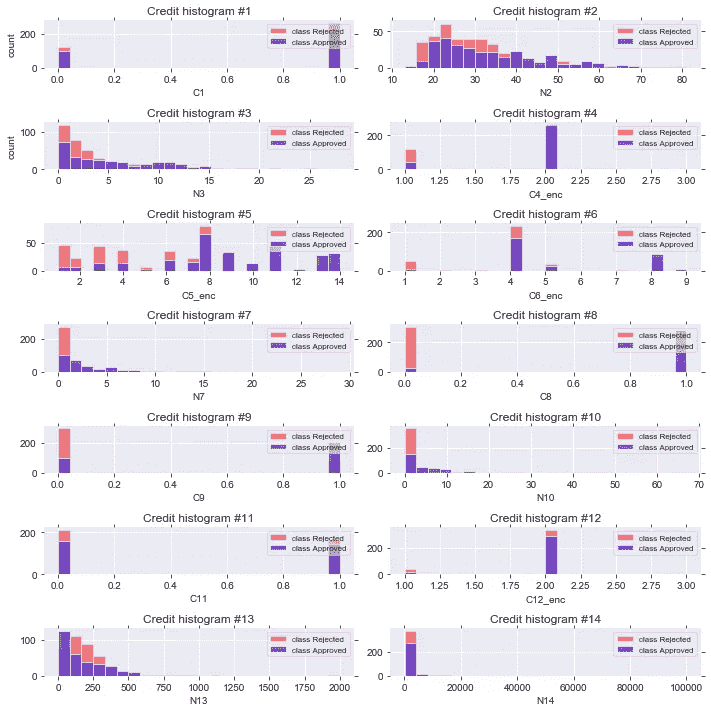
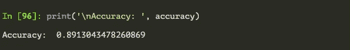
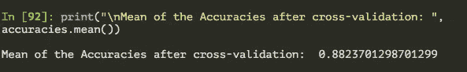
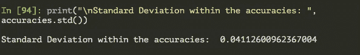
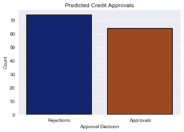

# 二元分类模型:澳大利亚信贷审批

> 原文：<https://towardsdatascience.com/binary-classification-model-australian-credit-approval-977ad7738411?source=collection_archive---------43----------------------->

## 预测信贷决策的二元分类器的 Python 实现。

作为我不断提高数据科学技能的努力的一部分，我在 UCI 机器学习知识库的[](https://medium.com/@shraddha.anala/randomized-link-generator-for-datasets-f46342b5033)**随机数据集上建立机器学习模型。你可以在这里查看我以前的车型 [**。**](https://medium.com/@shraddha.anala)**

****

**纽约公共图书馆在 [Unsplash](https://unsplash.com?utm_source=medium&utm_medium=referral) 拍摄的照片**

**在这个挑战中，要解决的随机数据集是 [**澳大利亚信贷审批数据集。**](https://archive.ics.uci.edu/ml/datasets/Statlog+%28Australian+Credit+Approval%29) 如果你想跟随或者自己尝试数据集，你可以 [**下载**](https://github.com/shraddha-an/cleansed-datasets/blob/master/credit_approval.csv) 我已经清理过的 CSV 版本。**

> **这些随机挑战的额外任务之一是将原始数据格式化为有用的 CSV 格式。因此，我将在我的 GitHub 上留下清理过的数据集的链接。**

## **关于数据集:**

**数据集由 14 个特征变量和 1 个量化批准决定的类别标签组成。为了保密和便于处理统计算法，对 14 个特征本身知之甚少。**

**这意味着甚至特征名称都不存在，但是它们是连续的还是分类的是已知的。我同样标记了哪些列是连续的(N)、分类的(C)以及它们是否需要在数据集中进一步编码(C_enc)。**

**构建二元分类模型来预测信贷是被批准给特定客户还是被拒绝是非常简单的。**

**它包括:**

> *****数据预处理:一次热编码&标准化*****

> *****构建分类器+评估模型性能:*****

> *****查看每列直方图的类可分性:*****

****

**下面的代码用每个独立变量和类标签绘制了一个直方图。这是为了辨别每个单独的变量在多大程度上可以解释类别的分离。**

**可以看出，几乎所有变量本身都不能解释批准决定。这意味着目标变量依赖于所有变量的非线性组合。下面是实现相同功能的代码。**

> *****度量&决定剧情:*****

**以下是在测试集上评估时模型的精确度、10 倍交叉验证精确度的平均值和标准偏差。**

****

**模型精度**

****

**10 倍交叉验证后的准确度平均值**

****

**10 倍交叉验证后准确度范围内的标准偏差**

**此外，以下是如何用 seaborn 绘制决策计数图。该图有助于直观地显示已经提交了多少拒绝和批准。首先，您必须为绘图构建一个单独的数据框。**

```
pred = list()
reject_count = approved_count = 0for i in range(len(y_pred)):
    if y_pred[i] == 0:
        pred.append('Rejections')
    else:
        pred.append('Approvals')pred = pd.DataFrame(pred)
pred.columns = ['Decisions']# Visualization of Decision Counts
plt.Figure(figsize = (8, 8))
sb.set_style('darkgrid')sb.countplot(pred['Decisions'], data = pred, edgecolor = 'black', linewidth=1.5, palette = 'dark')plt.title('Predicted Credit Approvals')
plt.xlabel('Approval Decision')
plt.ylabel('Count')
plt.show()
```

****

**批准决定的计数图**

**原来如此。虽然这是一个简单的算法，模型的准确率高达 89%，但你可以看到变量之间的相关性是高度非线性的。**

**如果你有关于改进模型的建议，或者你可能会用不同的方式来处理它，请在下面的评论中留下。**

**感谢您的阅读，祝您愉快，我们会再见的。**