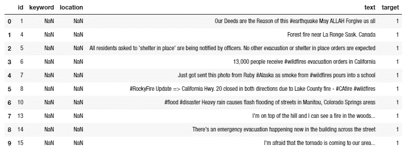
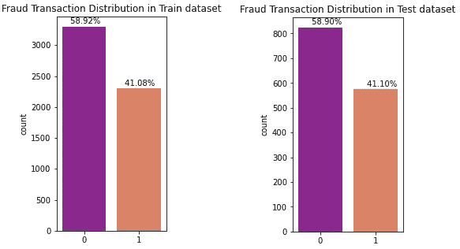
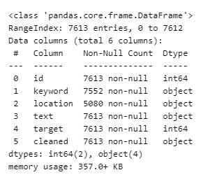
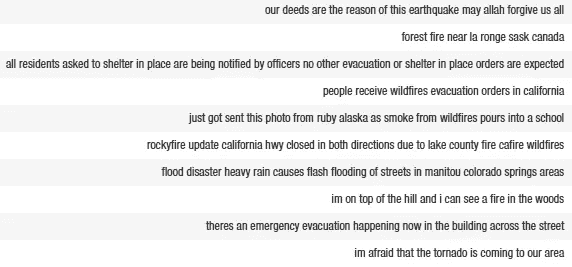
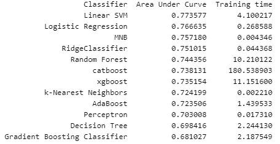

# 灾难微博的二元分类

> 原文：<https://towardsdatascience.com/binary-classification-of-disaster-tweets-73efc6744712?source=collection_archive---------39----------------------->

## 预测哪些推文是关于真实灾难的，哪些不是。


照片由 [Yosh Ginsu](https://unsplash.com/@yoshginsu?utm_source=unsplash&utm_medium=referral&utm_content=creditCopyText) 在 [Unsplash](/s/photos/disaster?utm_source=unsplash&utm_medium=referral&utm_content=creditCopyText) 上拍摄

近年来，社交媒体因其在时空事件中的潜在用途而受到广泛关注。Twitter 是其中之一，它已经成为不同情况下的重要沟通渠道，例如在紧急情况下。智能手机使人们能够实时宣布他们看到的紧急情况。正因为如此，越来越多的机构对监控 Twitter 感兴趣(例如，救灾组织)。这项工作背后的想法是，我们可以从大量的推文中提取有用的摘要，这在灾难情况下可能是有用的。

数据集可以从[这里](https://www.kaggle.com/c/nlp-getting-started/data)下载。我们有 7613 条观察结果，我们正在预测一条给定的推文是否是关于一场真正的灾难。如果是，预测一个 1。如果没有，预测 0。功能及其描述如下所述。

`id` -每条推文的标识符

*   `text` -推文的文本
*   `location`——推文发出的地点(可能是南)
*   `keyword` -推文中的特定关键词(可能是 NaN)
*   `target`——判断一条推文是否是关于一场真正的灾难(`1`)的输出结果(`0`)

但是我们如何分析这类问题呢？

# 数据

让我们看看数据集中包含的要素:

```
There are 7613 observations and 5 features in this dataset.
```

如图所示，该数据集由 7613 条评论组成。在这个数据集中有五种不同的特性，但是我们只分别使用“文本”和“目标”列作为输入/输出。现在，让我们看看数据集中包含的要素:



在关键字和位置列中有许多丢失的值，但是我们不需要担心它们。为了使我们的生活更容易，我们需要清除文本特征中的噪声。我们将在下面的部分中讨论它。

# 数据探索

如果我们将灾难性推文的数量与非灾难性推文的数量对比如下，很明显数据集是不平衡的。



为了解决这个问题，我们将使用分层抽样，其中数据集被划分为称为地层的同质子组，并且从每个地层中抽样正确数量的实例，以保证测试集能够代表总体。我们可以看到，训练和测试数据集都有近 41%的灾难推文。分层抽样的代码如下。

训练和测试数据集不平衡。但是有几种方法可以处理不平衡的数据集，如过采样和欠采样。幸运的是，这里的许多应用算法可以为您解决这个问题。有一个名为“ **class_weight** ”的超参数使用目标的值来自动调整与数据集中的类频率成反比的权重。

让我们看看熊猫的每个特征的类型。info()函数，它也可以让您对特性有一个大致的了解。了解每一列是否有任何缺失值会很有帮助，这样您将能够有效地处理它。

```
train.info()
```



由于我们只处理两列，即(“文本”和“目标”)，并且没有缺失值，因此我们不需要移除任何观察值或使用插补转换器来完成缺失值。

# 文本表示

下面显示了几条推文。请记住，我们将使用它们来预测是否有灾难推文。究竟什么能帮助我们去掉多余的单词、数字等。不会给文本增加任何价值，例如，标签、https、数字。因此，我们将删除干扰我们的文本分析的字符数字和文本片段。


使用下面的代码，我删除了数字、非 ASCII 字符、标点符号和 https，并将所有文本改为小写。

下面，你可以看到几个干净的文本，我们将用于文本分析。



我们的目标是找到输入和输出之间的关系。我使用“已清理”特征作为输入，使用“目标”作为输出。所以我的第一步是把推文转换成矢量。

我们需要将 tweets 转换为令牌计数矩阵，以便从文本内容中提取数字特征。这样，计数的稀疏表示就产生了。这是非常有益的，因为你可以想象独特的映射词到向量创建一个矩阵的巨大规模。CountVectorizer 用于此目的，它可以按如下方式导入。

```
**from** **sklearn.feature_extraction.text** **import** CountVectorizer
```

有许多像“the”、“them”、“are”这样的词对上下文的意思没有任何影响，这些词被称为停用词。它们不提供信息，可以通过选择 step_words='english '作为 CountVectorizer 函数中的超参数来删除。

下一步是使用 tf-idf 表示来规范化计数矩阵。标准化频率而不是使用原始频率的主要原因是为了减少在文本中出现几次的标记的影响，并且没有出现几次的标记信息量大。例如，单词“document”在给定的语料库中出现一千次，而“awesome”出现两次。tf-idf 在这种情况下工作，就像预处理数据，将原始特征向量变成更适合机器学习算法的表示。

```
**from** **sklearn.feature_extraction.text** **import** TfidfTransformer
```

# 管道

我使用管道功能来完成所有步骤。顺序应用变换列表和最终估计器。因此，它开始询问 CountVectorizer 和 Tfidf。您可以拥有管道工作所需的任意数量的变压器。

我只在“cleaned”特性上应用了管道，因为目标是二进制的。

# 模型评估

我使用了 20%的数据进行测试，其余的用于训练。这里涉及到很多超参数。因此，你的工作就像一个建筑师，寻找最佳的价值，以最大限度地提高准确性。一些技术是有益的，包括 Hyperopt、GridSearchCV 和 RandomizedSearchCV。在这个问题中，我随机选取了超参数。

我使用了下面代码片段中提到的十二种不同的监督算法。曲线下面积(AUC)分数和训练时间用于比较。

一个接一个地，每个监督算法都在训练数据集上训练，然后在测试数据集上推广。最后，根据 AUC 值对结果进行排序。还显示了每种方法的培训时间。我已经用这个[内核](https://www.kaggle.com/janiobachmann/bank-marketing-campaign-opening-a-term-deposit)写下了下面的分类代码。



我们可以看到，线性支持向量机有一个最大的 AUC 分数，但没有最小的训练时间。由于我们没有优化超参数，您可以更改它们来平衡精度和速度。

# 结论

SVM 没有在最快的时间内训练出来。尽管超参数没有被优化，文本清理可以减少文本数据集中的非索引词、标点符号和数字等形式的噪声。在现实世界的问题中，速度比准确性更重要。因此，随着数据量的增加，我们可能需要关注速度。深度学习也可以用于比较。一些算法也使用像 Lightgbm 这样的 GPU，所以如果你有大量的数据，你可以考虑使用这种方法。

本文使用的所有代码都可以从我的 [**GitHub**](https://github.com/shosseini811/Binary-Classification-of-Disaster-Tweets-TWS/blob/master/binary-classification-of-disaster-tweets.ipynb) 中访问。我期待听到反馈或问题。