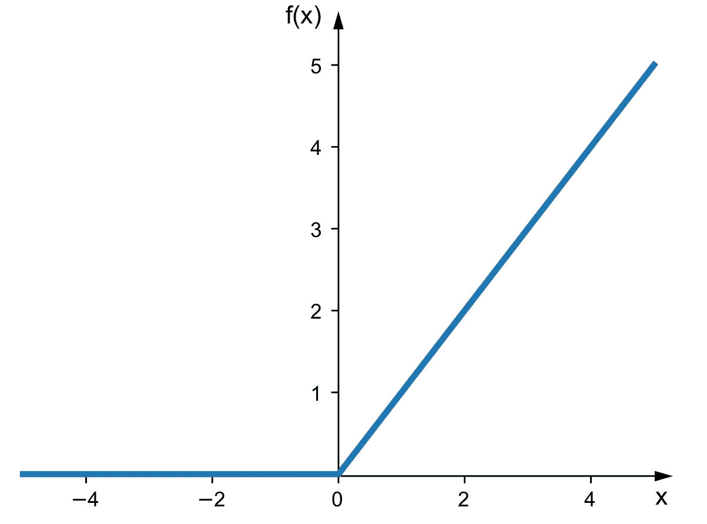

# IMDB 电影评论的二元分类

> 原文：<https://towardsdatascience.com/binary-classification-of-imdb-movie-reviews-648342bc70dd?source=collection_archive---------9----------------------->

## 使用 Keras 根据情感对评论进行分类。

二元分类是指将样本分为两类。

在这个例子中，我们将设计一个神经网络来执行来自 IMDB 电影评论数据集的评论的两类分类，或*二元分类*，以确定评论是正面的还是负面的。我们将使用 Python 库 Keras。


IMDB 电影评论分类。(来源:GitHub)

如果您正在寻找一个更基本的问题，请查看解决 MNIST 数据集。接下来的内容主要建立在解决 MNIST 问题上，即“你好，世界！深度学习。

[](/solve-the-mnist-image-classification-problem-9a2865bcf52a) [## 解决 MNIST 图像分类问题

### “你好，世界！”深度学习和 Keras

towardsdatascience.com](/solve-the-mnist-image-classification-problem-9a2865bcf52a) 

# IMDB 数据集

IMDB 数据集是一组来自互联网电影数据库的 50，000 条高度极化的评论。它们被分成 25000 条评论，每条评论用于训练和测试。每组包含相同数量(50%)的正面和负面评论。

IMDB 数据集与 Keras 打包在一起。它由评论及其对应的标签组成(0 代表*负面*，1 代表*正面*评论)。评论是一个单词序列。它们被预处理成整数序列，每个整数代表字典中的一个特定单词。

IMDB 数据集可以直接从 Keras 加载，通常会在您的机器上下载大约 80 MB。

# 加载数据

让我们从 Keras 加载预打包的数据。我们将只包括 10，000 个最频繁出现的单词。

加载和分析输入数据

为了好玩，我们来解码第一篇评论。

解读一篇评论

# 准备数据

我们无法将整数列表输入到我们的深层神经网络中。我们需要把它们转换成张量。

为了准备我们的数据，我们将对我们的列表进行一次性编码，并将其转换为 0 和 1 的向量。这将把我们的所有序列放大为 10，000 维向量，在对应于该序列中存在的整数的所有索引处包含 1。这个向量在所有索引处都有元素 0，这在整数序列中是不存在的。

简单来说，每个评论对应的 10000 维向量会有

*   每个索引对应一个单词
*   每一个值为 1 的索引都是评论中出现的一个词，用它的整数对应物来表示。
*   每一个包含 0 的索引都是评论中没有的词。

我们将手动矢量化我们的数据，以获得最大的清晰度。这将产生一个形状张量(25000，10000)。

预处理输入数据

# 构建神经网络

我们的输入数据是需要映射到定标器标签(0 和 1)的向量。这是最简单的设置之一，一个简单的*全连接、密集的*层与 *relu* 激活的堆栈表现相当好。

## 隐藏层

在这个网络中，我们将利用*隐藏层*。我们将这样定义我们的层。

```
Dense(16, activation**=**'relu')
```

传递给每个`Dense`层的参数`(16)`是一层的*隐藏单元*的数量。

在一系列*张量*运算之后，生成了激活了 *relu* 的*密集*层的输出。这个操作链实现为

```
output = relu(dot(W, input) + b)
```

其中，`W`是*权重矩阵*，`b`是偏差(张量)。

具有 16 个*隐藏单元*意味着矩阵 W 将具有(*输入 _ 尺寸*、 *16* )的形状。在这种情况下，输入向量的维数是 10，000，权重矩阵的形状将是(10000，16)。如果你把这个网络用图表来表示，你会在这个隐藏层看到 16 个神经元。

> 通俗地说，这一层会有 16 个球。

这些球或*隐藏单元*中的每一个都是层的表示空间中的一个维度。表示空间是数据的所有可行表示的集合。由它的*隐藏单元*组成的每一个*隐藏层*的目的是从数据中学习一个特定的数据变换或一个特征/模式。

DeepAI.org 有一篇关于隐藏层的非常翔实的报道。

> 简单地说，隐藏层是数学函数的层，每一层都被设计成产生特定于预期结果的输出。
> 
> 隐藏层允许将神经网络的功能分解为特定的数据转换。每个隐藏层函数都专门用于产生定义的输出。例如，用于识别人的眼睛和耳朵的隐藏层函数可以与后续层结合使用，以识别图像中的面部。虽然单独识别眼睛的功能不足以独立识别物体，但它们可以在神经网络中共同发挥作用。



ReLU 激活功能。这是最常用的激活功能之一。

## 模型架构

对于我们的模型，我们将使用

1.  两个中间层，每个中间层有 16 个隐藏单元
2.  将输出标量情感预测的第三层
3.  中间层将使用 *relu* 激活功能。 *relu* 或整流线性单位函数将负值清零。
4.  最终层或*输出层*的 Sigmoid 激活。sigmoid 函数"*将"*任意值压缩到[0，1]范围内。


乙状结肠激活函数。(来源:维基百科，Qef)

在选择模型的架构属性时，有正式的原则指导我们的方法。这些不包括在本案例研究中。

定义模型架构

# 编译模型

在这一步，我们将选择一个*优化器*、一个*损失函数*和*指标*进行观察。我们将继续前进

*   *二元 _ 交叉熵*损失函数，常用于二元分类
*   *rmsprop* 优化器和
*   *准确性*作为绩效的衡量标准

我们可以将我们对优化器、损失函数和指标的选择作为*字符串*传递给`compile`函数，因为`rmsprop`、`binary_crossentropy`和`accuracy`是与 Keras 打包在一起的。

```
model.complie(optimizer**=**'rmsprop',
              loss **=** 'binary_crossentropy',
              metrics **=** ['accuracy'])
```

人们可以通过将定制的*类实例*作为参数传递给`loss`、`optimizer`或`mertics`字段来使用定制的损失函数或优化器。

在这个例子中，我们将实现我们的默认选择，但是我们将通过传递类实例来实现。如果我们有定制的参数，这正是我们要做的。

编译模型

# 设置验证

我们将留出一部分训练数据，用于在训练时验证模型的准确性。一个*验证集*使我们能够监控我们的模型在训练期间经历历元时在以前看不到的数据上的进展。

验证步骤帮助我们微调`model.fit`函数的训练参数，以避免数据的过拟合和欠拟合。

为模型定型设置验证集

# 训练我们的模型

最初，我们将在 512 个样本的小批量中为 20 个时期训练我们的模型。我们还将把我们的*验证集*传递给`fit`方法。

调用`fit`方法返回一个`History`对象。该对象包含一个成员`history`,它存储了训练过程的所有数据，包括随着时间的推移可观察到的或监控到的量的值。我们将保存该对象，以确定更好地应用于训练步骤的微调。

训练模型。Google Colab GPU 对应的时间。在 CPU、i7 上通常需要大约 20 秒

在训练结束时，我们达到了 99.85%的训练准确率和 86.57%的验证准确率

现在我们已经训练了我们的网络，我们将观察存储在`History`对象中的性能指标。

调用`fit`方法返回一个`History`对象。这个对象有一个属性`history`,这是一个包含四个条目的字典:每个被监控的指标一个条目。

培训过程的历史。

`history_dict`包含以下值

*   培训损失
*   训练准确性
*   验证损失
*   验证准确性

在每个时期结束时。

让我们使用 Matplotlib 并排绘制训练和验证损失以及训练和验证准确性。

从训练历史中得到的损失和准确性数据的分析。这些数据告诉我们我们的训练策略的表现。

我们观察到*最小验证损失*和*最大验证准确度*在大约 3-5 个时期达到。之后，我们观察到两个趋势:

*   验证损失增加，培训损失减少
*   验证准确性降低，培训准确性提高

这意味着该模型在对训练数据的情绪进行分类方面越来越好，但当它遇到新的、以前从未见过的数据时，总是做出更差的预测。这是过度拟合的标志。在第 5 个时期之后，模型开始太接近训练数据。

为了解决过度拟合的问题，我们将把历元的数量减少到 3 到 5 之间。这些结果可能会因您的机器而异，并且由于不同型号之间随机分配重量的本质可能会有所不同。

在我们的情况下，我们将在 3 个纪元后停止训练。

# 重新训练我们的神经网络

我们重新训练我们的神经网络的基础上，我们的研究结果，从历史的损失和准确性的变化。这次我们运行它 3 个时期，以避免在训练数据上过度拟合。

从头开始再培训

最终，我们实现了 99%的*训练准确率*和 86%的*验证准确率*。这很好，考虑到我们正在使用一种非常*幼稚的*方法。通过使用更好的训练算法可以获得更高的准确度。

# 评估模型性能

我们将使用训练好的模型对测试数据进行预测。输出是一个浮点整数数组，表示评论为正面的概率。正如你所看到的，在某些情况下，网络是绝对肯定的审查是积极的。在其他情况下——没那么多！

做预测

你可以试着通过使用像*均方差这样的度量来找到一些错误分类的情感数量的误差度量，就像我在这里做的*。但是这样做就太傻了！对结果的分析不是我们在这里要讨论的内容。然而，我将解释为什么在这种情况下使用`mse`是无用的。

来自我们模型的结果是模型感知评论的积极程度的度量。该模型不是告诉我们样本的绝对类别，而是告诉我们它认为情绪在多大程度上偏向一边或另一边。MSE 是一个过于简单的衡量标准，不能反映解决方案的复杂性。

我没有想象这个神经网络。我会的，但这是一个耗时的过程。我确实想象过我用来解决 MNIST 问题的神经网络。如果你想的话，你可以看看这个 GitHub 项目来可视化人工神经网络

[](https://github.com/Prodicode/ann-visualizer) [## Prodicode/ann-visualizer

### 一个很棒的可视化 python 库曾经与 Keras 一起工作。它使用 python 的 Graphviz 库来创建一个可展示的…

github.com](https://github.com/Prodicode/ann-visualizer) 

# 结论

因此，我们成功地对 IMDB 上的评论进行了分类。我猜这需要重新观看矩阵或 IMDB 建议的任何东西！

我建议你配合这篇文章。您可以使用类似的策略解决大多数二元分类问题。如果你解决了这个问题，试着修改网络及其层的设计和参数。这将帮助您更好地理解您所选择的模型架构的完整性。

我在每篇文章中都详细讨论了一个话题。在这一篇中，我们深入研究了一些隐藏的图层。对任何特定主题的详尽解释都不在我的文章范围之内；然而，你会发现大量的快速旁白。

我假设读者对诸如优化器、分类编码、损失函数和度量标准之类的技术细节有着实用的理解。你可以在这里找到我关于这些概念的练习笔记。

更多内容，请查看 Francois Chollet 的《用 Python 进行深度学习的 T2》一书。

请随意查看本文的[实现](https://github.com/rakshitraj/fchollet)以及我在 [GitHub](https://github.com/rakshitraj/) 上的更多工作。

感谢阅读！