# 二元交叉熵和逻辑回归

> 原文：<https://towardsdatascience.com/binary-cross-entropy-and-logistic-regression-bf7098e75559?source=collection_archive---------14----------------------->

## 有没有想过我们为什么使用它，它来自哪里，如何有效地优化它？这里有一个解释(包括代码)。

尽管逻辑回归源于统计学，但它是解决机器学习中二元分类问题的一种相当标准的方法。它实际上是如此标准，以至于在所有主要的数据分析软件(如 Excel、 [SPSS](https://www.ibm.com/analytics/spss-statistics-software) ，或其开源替代软件[【PSPP】](https://www.gnu.org/software/pspp/))和库(如 [scikit-learn](https://scikit-learn.org/stable/modules/generated/sklearn.linear_model.LogisticRegression.html) 、 [statsmodels](https://www.statsmodels.org/stable/generated/statsmodels.discrete.discrete_model.Logit.html) 等)中都有实现。即使你只是稍微熟悉逻辑回归，你也可能知道它依赖于所谓的**二元交叉熵**的最小化

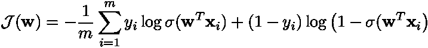

其中 *m* 为样本数， ***x*** *ᵢ* 为第 I 个训练样本， *yᵢ* 为其类(即 0 或 1)， *σ(z)* 为逻辑函数， ***w*** 为模型的参数向量。你可能也知道，对于逻辑回归，它是一个凸函数。因此，任何最小值都是全局最小值。但是你有没有想过我们为什么要使用它，它实际上是从哪里来的，或者你如何能比简单梯度下降更有效地找到这个最小值？我们将在下面解决这些问题，并提供简单的 Python 实现。但首先，让我们快速回顾一下物流功能！

# (非常)快速回顾一下物流职能

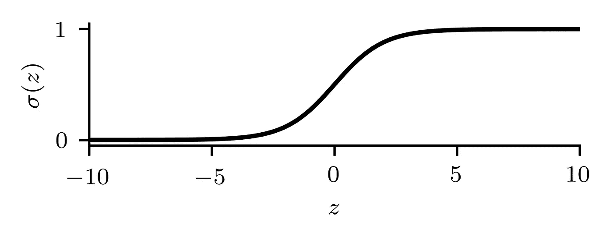

逻辑函数图。

逻辑函数 *σ(z)* 是一条 S 形曲线，定义为

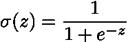

它有时也被称为*到期*功能或*s 形函数*。它是单调的，并且在 0 和 1 之间有界，因此它被广泛用作概率模型。此外，我们还有

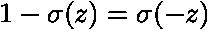

最后，你可以很容易地证明它对 z 的导数由下式给出

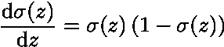

关于这个函数，这差不多就是你需要知道的全部了(至少对于这篇文章来说)。所以，事不宜迟，让我们开始吧！

# 逻辑回归的二元交叉熵推导

让我们考虑一个预测器 ***x*** 和一个二元(或伯努利)变量 *y* 。假设在 ***x*** 和 *y* 之间存在某种关系，理想的模型会预测

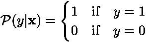

通过使用逻辑回归，这个未知的概率函数被建模为

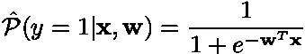

因此，我们的目标是找到参数 ***w*** ，使得模拟的概率函数尽可能接近真实的概率函数。

## 从伯努利分布到二元交叉熵

评估我们的模型做得有多好的一个方法是计算所谓的*可能性函数*。给定 *m* 个例子，这个似然函数被定义为

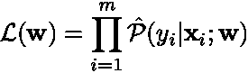

理想情况下，我们因此希望找到使****w**)*最大化的参数 ***w*** 。然而，在实践中，为了简单起见，人们通常不直接使用这个函数，而是使用它的负对数***

*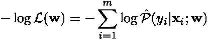*

*因为对数是严格单调的函数，最小化负对数似然性将导致与直接最大化似然性函数时相同的参数。但是如何计算 *P(y|* ***x，w*** *)* 当我们的 logistic 回归只建模 *P(1|* ***x，w*** *)* ？鉴于*

*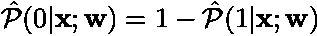*

*可以使用简单的求幂技巧来编写*

*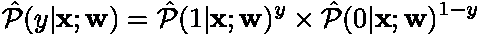*

*将该表达式插入负对数似然函数中(并通过实例数量归一化)，我们最终获得期望的归一化二进制交叉熵*

*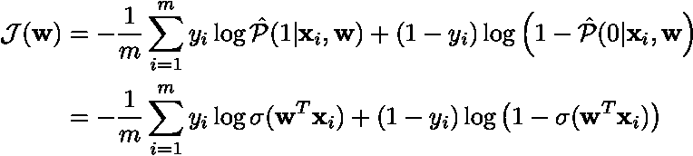*

*因此，找到最小化二元交叉熵的权重 ***w*** 相当于找到最大化似然函数的权重，从而评估我们的逻辑回归模型在逼近我们的伯努利变量的真实概率分布方面做得有多好！*

## *证明它是凸函数*

*如上所述，我们的目标是找到最小化二进制交叉熵的权重 ***w*** 。然而，在最一般的情况下，一个函数可能有多个极小值，寻找全局极小值被认为是一个困难的问题。尽管如此，可以表明最小化逻辑回归的二元交叉熵是一个凸问题，因此，任何最小值都是全局的。让我们快速证明这确实是一个凸问题！*

*有几种方法可以用来证明函数是凸的。然而，一个充分条件是其 Hessian 矩阵(即其二阶导数矩阵)对于 ***w*** 的所有可能值都是半正定的。为了便于我们的推导和后续实现，让我们考虑二进制交叉熵的矢量化版本，即*

*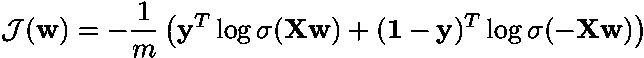*

*其中， **X** 的每一行都是我们的一个训练示例，我们利用了逻辑函数中引入的一些恒等式。使用矩阵微积分的一些元素(如果你不熟悉的话，查看这里的[),可以显示我们的损失函数相对于 ***w*** 的梯度由下式给出](https://en.wikipedia.org/wiki/Matrix_calculus)*

*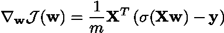*

*类似地，黑森矩阵写道*

**

*随着*

*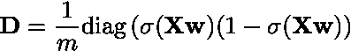*

*从这一点，人们可以很容易地表明*

*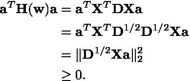*

*因此，Hessian 矩阵对于每个可能的*是正半定的，并且二元交叉熵(对于逻辑回归)是凸函数。既然我们知道我们的优化问题是行为良好的，让我们把注意力转向如何解决它！**

# **如何高效地找到这个最小值？**

**与线性回归不同，逻辑回归没有封闭形式的解。在当前情况下，二元交叉熵是一个凸函数，但是任何来自凸优化的技术都保证找到全局最小值。下面我们将使用两种这样的技术来说明这一点，即具有最佳学习速率的*梯度下降*和*牛顿-拉夫森方法*。**

## **最优学习率梯度下降**

**在机器学习中，梯度下降的变化是模型训练的主力。在该框架中，权重 ***w*** 按照简单规则迭代更新**

**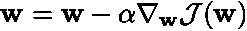**

**直到达到收敛。这里，α被称为*学习速率*或步长。使用恒定的学习速率是很常见的，但是如何选择呢？通过计算各种损失函数的 Lipschitz 常数的表达式， [Yedida & Saha](https://arxiv.org/abs/1902.07399) 最近表明，对于逻辑回归，最佳学习速率由下式给出**

**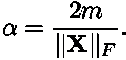**

**下面是相应算法的简单 Python 实现。假设您已经熟悉 Python，代码应该是不言自明的。**

**为了清晰和易用，我在我的每一篇文章中都尽量坚持使用 scikit-learn API。**

## **牛顿-拉夫森方法**

**基于梯度下降的技术也被称为一阶方法，因为它们仅利用编码损失函数的局部斜率的一阶导数。当证明逻辑回归的二元交叉熵是凸函数时，我们也计算了 Hessian 矩阵的表达式，所以让我们使用它！**

**能够访问 Hessian 矩阵使我们能够使用二阶优化方法。这种技术使用关于由该 Hessian 矩阵编码的损失函数的局部曲率的附加信息，以在训练过程中自适应地估计每个方向上的最佳步长，从而实现更快的收敛(尽管计算成本更大)。最著名的二阶技术是[牛顿-拉夫森方法](https://en.wikipedia.org/wiki/Newton%27s_method)，以杰出的[艾萨克·牛顿爵士](https://en.wikipedia.org/wiki/Isaac_Newton)和不太出名的英国数学家[约瑟夫·拉弗森](https://en.wikipedia.org/wiki/Joseph_Raphson)的名字命名。使用这种方法，权重 ***w*** 的更新规则现在由下式给出**

**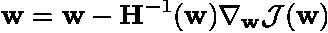**

**其中***H****(****w****)*是对当前*进行求值的黑森矩阵。注意，Hessian 矩阵的条目明确地依赖于当前的 ***w*** 。因此，它需要在每次迭代时更新，并对其进行逆重新计算。尽管牛顿法比普通梯度下降法收敛得更快，但它的计算量更大，占用的内存也更多。对于小规模到中等规模的问题，它可能仍然比梯度下降法收敛得更快(在挂钟时间内)。对于更大的问题，人们可以看看被称为*拟牛顿*的方法，其中最著名的是 BFGS 方法。和以前一样，下面提供了相应算法的简单 Python 实现。***

# **超越传统的逻辑回归**

**逻辑回归为分类任务提供了一个相当灵活的框架。因此，多年来已经提出了许多变体来克服它的一些限制。**

## **处理非线性可分离的类**

**通过构造，逻辑回归是一个线性分类器。正如线性回归可以扩展到建模非线性关系，逻辑回归也可以扩展到分类点，否则非线性可分。然而，这样做可能需要专业知识、对数据属性的良好理解以及特征工程(与其说是精确的科学，不如说是一门手艺)。**

## **不平衡的阶级分布**

**当使用普通逻辑回归时，我们隐含地假设样本中两个类别的流行率大致相同(例如，预测一个人是男性还是女性)。然而，现实生活中有许多情况并非如此。在医学科学中尤其如此，在医学科学中，人们可能希望根据他/她的病历来预测病人在手术后是否会死亡。有希望的是，大多数已经接受治疗的患者已经存活，因此我们的训练数据集只包含相对较少的死亡患者的例子。这就是所谓的*阶级不平衡。***

**已经提出了不同的方法来处理这种类不平衡问题，例如对少数类进行上采样或者对多数类进行下采样。另一种方法是使用对成本敏感的培训。为了说明后者，让我们考虑以下情况:我们有 90 个样本属于比方说类别 *y = 0* (例如，患者存活)，只有 10 个样本属于类别 *y = 1* (例如，患者死亡)*。*如果我们的模型一直预测 *y = 0* (即患者将存活)，它将具有 90%的惊人准确性，但在预测给定患者是否可能死亡方面毫无用处。然而，提高模型的有用性和预测能力的简单技巧是如下修改二元交叉熵损失**

**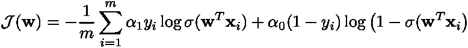**

**权重α₀和α₁通常被选择作为训练集中每个类的逆频率。回到我们上面的小例子，α₀将被选为**

**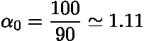**

**而α₁将被设定为**

**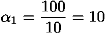**

**这样做，当该模型将可能死亡的患者错误分类为存活的患者时，该模型受到更严重的惩罚(大约 10 倍以上)。它只需要对前面提出的算法进行微小的修改。尽管这种方法可能增加假阳性的数量(即，将存活的患者被错误地分类为可能死亡的患者)，但是它减少了假阴性的数量(即，将死亡的患者被错误地分类为可能存活的患者)。这样，医生就可以把注意力集中在真正需要治疗的病人身上，尽管他们中的一些人本来是可以活下来的。**

## **多项式分类**

**尽管二进制分类问题在现实生活中普遍存在，但一些问题可能需要多类方法，例如手写数字识别。**

**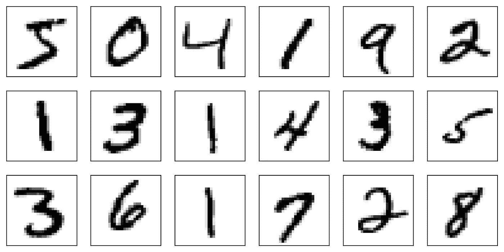**

**在这个问题中，人们试图分配一个标签(从 0 到 9)来表征图像中出现的数字。即使逻辑回归是通过设计二元分类模型，它也可以使用一对其余方法来解决这个任务。十个不同的逻辑回归模型被独立训练:**

*   **模型 1:预测数字是零还是不是零。**
*   **模型 2:预测数字是 1 还是不是 1。**
*   **…**
*   **模式 10:预测数字是不是 9。**

**在部署阶段，分配给新图像的标签基于这些模型中哪个模型对其预测最有信心。然而，这种一对多的方法并不是没有限制，主要的三个限制是:**

*   **不确定性量化:对该模型总体预测的置信度进行估计并不简单。虽然量化预测中的不确定性对于类似 Kaggle 的竞争可能并不重要，但在工业应用中却至关重要。**
*   **不可判定性:当其中两个模型对它们的预测同样有信心时，如何处理这种情况？**
*   **不平衡学习:每个模型使用不平衡数据集学习。假设我们对每个数字都有大致相同数量的例子，一个给定的模型只有 10%的这个特定数字的训练例子和 90%的非这个特定数字的训练例子。**

**尽管有这些限制，一对多逻辑回归模型仍然是处理多类问题时使用的一个很好的基线，我鼓励你这样做作为一个起点。一个更合适的方法，称为 *softmax 回归*，将在接下来的帖子中考虑。**

## **正则化逻辑回归**

**在机器学习中，处理以大量特征为特征的数据是相当常见的。然而，并非所有这些特征都可以为预测目的提供信息，因此可以瞄准*稀疏逻辑回归模型*。为此，例如可以使用模型权重的ℓ₁-norm 正则化。修正的损失函数由下式给出**

**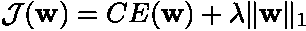**

**其中*CE(****w****)*是二进制交叉熵的简写符号。现在众所周知，使用损失函数的这种正则化促进了参数向量 ***w*** 稀疏。然后，超参数λ控制模型的稀疏程度和最小化交叉熵的重要性之间的权衡。虽然超参数优化本身是机器学习的一个专门领域，远远超出了本文的范围，但我们最后要提到的是，scikit-learn 提供了一种基于网格搜索和交叉验证的简单启发式方法来找到λ的好值。**

# **结论**

**从数学和计算的角度来看，逻辑回归的简单性和灵活性使其成为现实应用中二元分类最常用的技术。如果你是机器学习的新手，我希望你现在对它所依赖的数学以及如何在实践中使用它有更好的理解。请注意，有很多内容我们没有涉及，例如:**

*   **根据优势比(或对数优势)对模型的统计解释，**
*   **如何使用各种指标和 ROC 或精确召回曲线来量化预测的准确性(除了我们最小化训练集的交叉熵这一事实)。**

**然而，这些应该是在你掌握了基础知识之后的第二步。此外，网上有很多资源可以解决这些额外的问题。为了获得更好的见解，请不要犹豫！不要犹豫，也要自己推导这里给出的所有数学结果，并使用提供的代码！请告诉我这些内容是否对您有用，或者您是否发现了任何错别字:]**

**在接下来的几篇文章中，我们将讨论以下主题:**

*   **为什么你应该总是正则化逻辑回归！**
*   **多类问题和 softmax 回归。**
*   **贝叶斯逻辑回归。**

## **其他在线资源**

*   **Aurélien Géron ( [此处为](https://www.youtube.com/watch?v=ErfnhcEV1O8))的精彩视频从信息论的角度解释了为什么使用交叉熵进行分类是有意义的。**

> ***想看更多这方面的内容？*查看我其他关于[低秩结构和数据驱动建模](https://loiseau-jc.medium.com/list/lowrank-structure-and-datadriven-modeling-8f39635a90ea) *的文章或者干脆我的* [*机器学习基础知识*](https://loiseau-jc.medium.com/list/machine-learning-basics-0baf10d8f8b5) ！**

** [## 罗森布拉特的感知机，第一个神经网络

### 深度学习快速入门。

towardsdatascience.com](/rosenblatts-perceptron-the-very-first-neural-network-37a3ec09038a)**