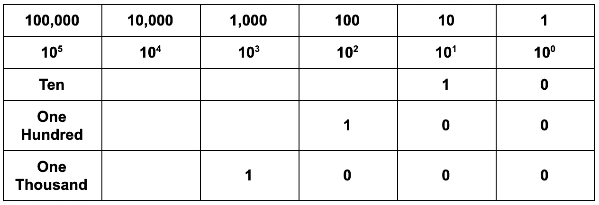
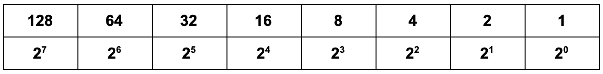
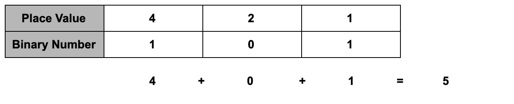
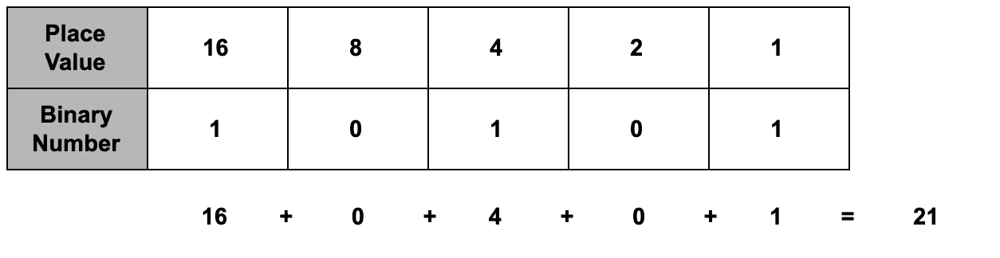
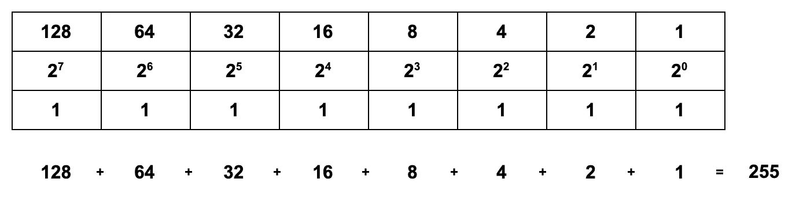

# Python 中的二进制、十六进制和八进制

> 原文：<https://towardsdatascience.com/binary-hex-and-octal-in-python-20222488cee1?source=collection_archive---------2----------------------->

## 十进制系统之外的漫步


由 [Alexander Sinn](https://unsplash.com/@swimstaralex?utm_source=medium&utm_medium=referral) 在 [Unsplash](https://unsplash.com?utm_source=medium&utm_medium=referral) 上拍摄的照片

在数学方面，Python 以强大和易于使用而闻名。它的本机功能和资源丰富的库，如 NumPy、Pandas 或 Scikit-learn，为开发人员提供了处理繁重数字的必要工具。但有时我们需要跳出十进制世界，使用其他常见的基数之一。

基数是计数系统用来表示数值的位数。最普遍的数字系统是十进制，也称为十进制。在十进制中，数字 0、1、2、3、4、5、6、7、8 和 9 代表每一个可能的值。但是计算机和软件开发人员经常需要使用其他基础。

[](/how-to-implement-a-successful-data-cleaning-process-701e565e6575) [## 如何实施成功的数据清理流程

### 因为你不能测量脏数据

towardsdatascience.com](/how-to-implement-a-successful-data-cleaning-process-701e565e6575) 

在所有十进制系统中，十进制系统最受二进制、十六进制和八进制系统的欢迎。其他人属于你和朋友在一起时会避开的那种特殊的表亲。然而，如果你计划使用二进制、十六进制或八进制，你可能需要温习一下 Python。在 Python 中，它们不像 base 10 那样简洁易用。

# 二进制的

二进制只使用数字 0 和 1。从这两个，它可以说明每一个可能的值，同样的十进制系统。你还记得小学时的位置值吗？这就是它的工作原理。在十进制中，每个位置增加十的倍数，但在二进制中，每个位置增加二的倍数。



以 10 为基数的数位值，例如数字 10、100 和 1000



基数 2 位值

例如，101 表示值 5。



而 10101 将代表值 21。



想知道为什么您的网络子网掩码看起来像 255.255.255.0 吗？因为每一个用句点分隔的数字都是由八位二进制数 11111111 组成的。



我们可以这样开始这一部分:“二进制只使用 10 位数。”如果你不明白这个笑话，请再读一遍二进制是如何工作的解释。

在 Python 中，使用二进制数比使用十进制数要多几个步骤。当你输入一个二进制数时，以前缀“0b”开始(即一个零后面跟着一个小 b)。

`0b11`与二进制 11 相同，等同于十进制 3。不难，但这是额外的工作。每当你想在一个变量中存储一个二进制值，它会为你转换成十进制。

`number1 = 0b11`

这导致变量`number1`存储值 3。它只是存储这个值，并不表示你想用二进制来表示它。所以，当你检索它的时候，你会得到一个十进制值 3。事实上，Python 独立于 base 处理所有的数学运算符，但是它总是以十进制返回给你。

"但是如果我想让我的数字以二进制返回给我呢？"

很高兴你问了。

如果您希望代码中的数字严格保持二进制，这里有一个解决方案。

```
>>> num1 = "0b100"
>>> num2 = "0b110"
>>> mysum = int(num1, 2) + int(num2, 2)
>>> print(bin(mysum))
0b1010
```

在上面的代码片段中，我们首先将字符串“0b100”赋给变量`num1`。接下来，我们将字符串“0b110”赋给变量`num2`。所以我们有两个 string 类型的变量，分别存储 4 和 6 的二进制表示。

接下来，我们将这两个数字相加。但是当我们这样做的时候，我们使用函数 int()将每一个转换为基数为 10 的整数。通常 int()会抛出一个包含字母的字符串错误。通过指定第二个参数 2，我们指示 int()将字符串解释为二进制数。所以，它保持快乐。

您可以使用第二个参数来指定 2 到 36 之间的任何基数。基数 2 和 36 包括在该范围内。

[](/the-illusion-of-making-data-driven-decisions-bf54a2e594c4) [## 做出数据驱动决策的错觉

### 如何让数据真正驱动您的决策

towardsdatascience.com](/the-illusion-of-making-data-driven-decisions-bf54a2e594c4) 

在我们将两个数字相加并将结果存储在`mysum`中之后，我们打印出总和。但它是独立于基地存放的。当我们回忆它的时候，它还是想用十进制呈现给我们。所以我们必须告诉 Python 我们想要二进制数。在将值打印到屏幕上之前，使用 bin()函数将值转换为二进制。

上面的代码给了你一个清晰的 Python 二进制表示。然而，你也可以使用一个更简短的版本，就像这样。

```
>>> num1 = 0b100
>>> num2 = 0b110
>>> mysum = num1 + num2
>>> print(bin(mysum))
```

你会得到同样的结果。唯一的区别是你如何在变量`num1`和`num2`中存储数字。如果你在第一个例子中把任何一个变量打印到屏幕上，你会看到它是二进制的，尽管从技术上讲它是一个字符串。在第二个示例中，您将看到一个小数，除非您使用 bin()来转换它。

```
>>> num1 = "0b100"
>>> print(num1)
"0b100">>> num1 = 0b100
>>> print(num1)
4
>>> print(bin(num1))
0b100
```

# 十六进制的

十进制用十位，二进制用两位，十六进制用十六位。因为我们只有十进制系统中的十位数可以使用，所以我们用字母代替数字 9 以上的所有数字。所以十六进制的数字是 0，1，2，3，4，5，6，7，8，9，A，B，C，D，E，F，它们代表从零到九，那么 A 值十，B 值十一，C 值十二，D 值十三，E 值十四，F 值十五。所以，十六进制有十六个数字。如果你用十六进制写，你可以说，“十六进制有 10 个数字。”

等等？我们以前没见过吗？是的。老实说，如果你在相应的数字系统中写数字，10 总是代表任何基数的总位数。但是只有二进制才有意思。

在 Python 中表示十六进制数时，在数字前加上前缀“0x”。此外，使用 hex()函数将值转换为十六进制格式以便显示。

我们的两个十六进制代码样本类似于我们用于二进制代码的样本。

```
>>> hnum1 = "0x10"
>>> hnum2 = "0x10"
>>> myhsum = int(hnum1, 16) + int(hnum2, 16)
>>> print(hnum1)
"0x10"
>>> print(myhsum)
32
>>> print(hex(myhsum))
0x20>>> hnum1 = 0x10
>>> hnum2 = 0x10
>>> myhsum = hnum1 + hnum2
>>> print(hnum1)
16
>>> print(myhsum))
32
>>> print(hex(myhsum))
0x20
```

# 八进制的

最后，这同样适用于八进制。任何关于八进制数字系统中有多少位数的猜测？八进制代表八。对，八进制包含八位数。在 Python 中，我们使用 oct()将数字转换为八进制，而不是 bin()或 hex()。我们在八进制数字前加一个零，后面跟着一个小写的 o，比如“0o”。

八进制的八位数是 0，1，2，3，4，5，6，7。

让我们在这里使用相同的代码示例，但是我们将为八进制代码使用正确的符号和转换函数。

```
>>> onum1 = "0o10"
>>> onum2 = "0o10"
>>> myosum = int(onum1, 8) + int(onum2, 8)
>>> print(onum1)
"0o10"
>>> print(myosum)
16
>>> print(oct(myosum))
0o20>>> onum1 = 0o10
>>> onum2 = 0o10
>>> myosum = onum1 + onum2
>>> print(onum1)
8
>>> print(myosum))
16
>>> print(oct(myosum))
0o20
```

# 结论

Python 的伟大之处在于，除了洗衣服，它几乎可以做任何事情。我正在努力。

要点很简单:

*   二进制使用 bin()和“0b”。
*   十六进制使用十六进制()和“0x”。
*   八进制使用 oct()和' 0o '。
*   通过更改第二个参数，可以使用 int()函数将数字从 2 到 36 之间的任何基数转换为基数为 10 的整数。*例如 int(number，30)*

即使在我们喜爱的十进制系统之外使用基数需要更多的努力，Python 很容易适应并使我们能够进入十进制以前没有去过的地方——进入其他基数的最终边界。

***杆蓖麻*** *帮助公司获得正确的分析！他帮助国际组织和小型企业改善他们的数据分析、数据科学、技术战略和技术领导力。除了咨询，Rod 还喜欢公开演讲、教学和写作。你可以在 rodcastor.com**和通过他的* [*邮件列表*](https://rodcastor.com/newsletter/) *了解更多关于 Rod 和他的工作。*