# Python 中的二分搜索法——更快吗？

> 原文：<https://towardsdatascience.com/binary-search-in-python-is-it-faster-b960c74c3d11?source=collection_archive---------36----------------------->

## 二进制与线性搜索—实现和性能测试


照片由[约书亚·苏考夫](https://unsplash.com/@joshuas?utm_source=medium&utm_medium=referral)在 [Unsplash](https://unsplash.com?utm_source=medium&utm_medium=referral) 上拍摄

这是一周的时间！你决定深入一个话题，今天我们来看看二分搜索法。

和往常一样，解决同一个问题有很多方法。当你想检查一个元素是否在一个列表中，你可以用线性搜索和二分搜索法来完成，但是猜猜哪个更快。

# 为什么？

如果你最近在 Youtube 上看过编程工作面试，你就会知道二分搜索法是最受欢迎的。

你为什么要花时间去了解二分搜索法呢？你的 C++编程朋友可能已经告诉你了。Python 很慢。你要确保你的程序不会比需要的速度慢。

当您学习 Python 时，您将学习进行线性搜索来检查元素是否在列表中。当你学习编码时，这没问题，但是当你在一个列表中有 60.000.000 个元素时会发生什么呢？

如果你在一个有 11 个元素的列表中进行线性搜索，你必须遍历所有的 11 个元素。如果你使用二分搜索法，根据你要找的东西，你可能最终只有 2 次迭代。见下图。

哪种方法更快应该是显而易见的。

当您开始学习 Python 时，您很可能已经处理过上百次列表了。检查值是否在列表中是一项正常的任务，您以前已经看到过这种情况:

```
my_list = [1,2,3,3,5,11,12]if 11 in my_list:
    return Truereturn False
```

或者这个:

```
my_list = [1,2,3,3,5,11,12]for each in list:
    if each==11:
        return Truereturn False
```

让我们开始看看如何实现二分搜索法。

# **如何？**

让我们想象一下二分搜索法是如何工作的。

首先，我们需要确保列表已经排序。你可以用`.sort()`或者`sorted()`来排序你的列表，我用`.sort()`来改变列表的位置。如果你出于某种原因需要一个新的列表或者不想修改原来的列表，使用`sorted()`

这是我们的测试材料:

```
bin_list = [1,2,3,5,6,9,11,12,15,20,22]
search_value_a = 15
```

我们将寻找值 **15** 。

*   我们的起点。具有最小值和最大值的列表:

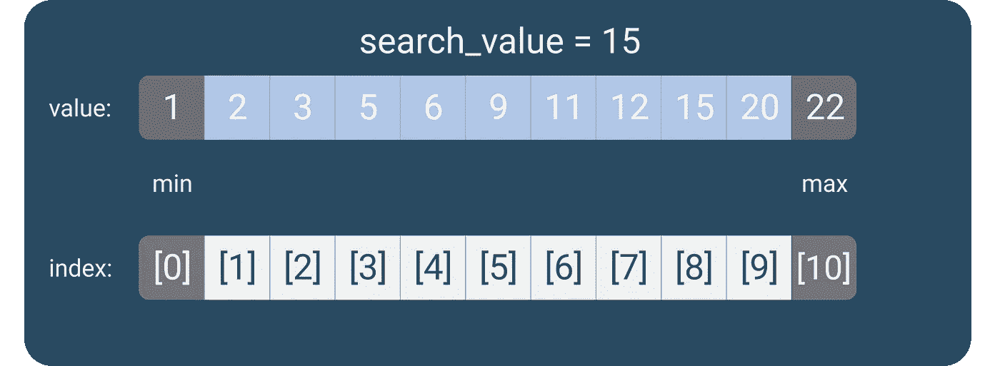

作者图片

*   当我们做二分搜索法时，我们从寻找列表中的中间元素开始:

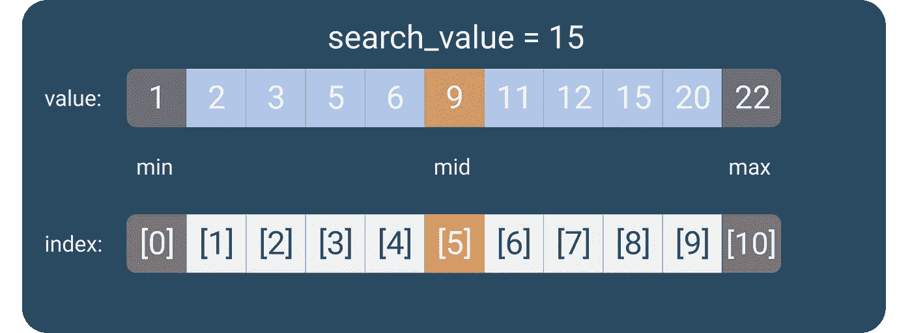

作者图片

*   中间索引为`**5**`，值为`**9**`。我们想知道的第一件事是`**9**`是否是我们要找的号码。记住，我们找的是`**15**`。如果不是，我们检查它是更低还是更高。在我们的例子中，`**9**`小于 15，所以我们需要设置一个新的最小点。我们知道我们不再需要担心名单的下半部分。新的最小点将被设置为列表上部的第一个可能项目。

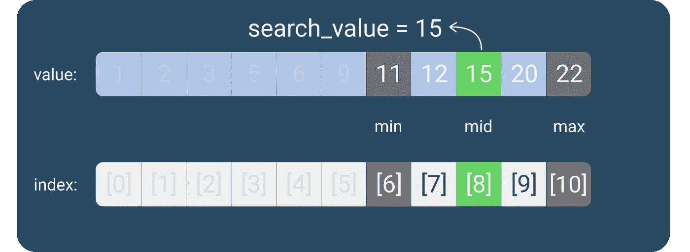

作者图片

*   有了新的中点，我们检查这是否是我们正在寻找的数字。在这种情况下，它是。

如果我们在寻找`**2**`，并且我们的第一个中间值是`**9**`，你认为算法会如何表现？你说得对。最大指数将会移动。

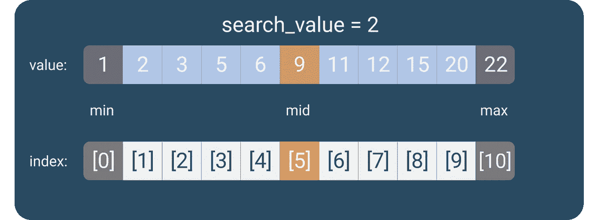

作者图片

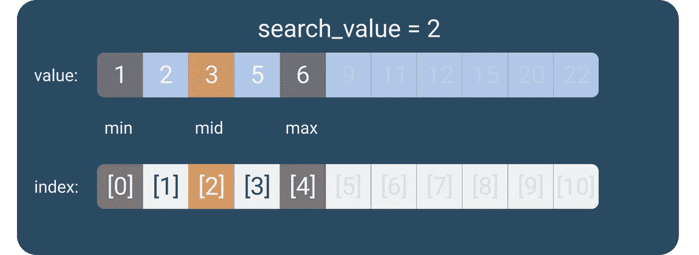

作者图片

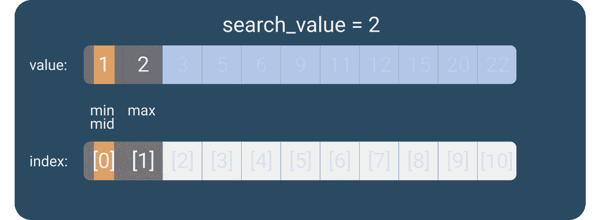

作者图片

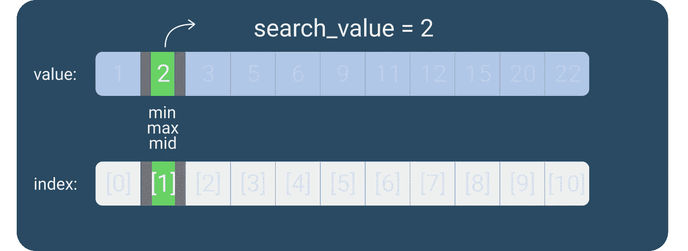

作者图片

# 代码

好吧，我知道你是来编码的。让我们开始吧。

伪代码将如下所示:

```
# create function with list and target as parameters.# make sure the list is sorted.# get length of list minus 1 as max and 0 as start.# a loop will: # get the new middle value
    # check if the middle value is higher or lower than the target. 
    # move the min or max to the middle after the check. 
    # if middle == target, return True
    # if we reach the end of the list, the target is not in the list
```

## 代码的作用:

我们已经创建了一个带有两个参数的函数。一个`list`和一个`target value`。目标值是我们正在寻找的数字。列表是我们迭代的列表，寻找数字。

```
def binary_search(input_list , target_value):
```

如果我们找到目标值，我们将返回`True`。如果没有，我们就返回`False`。

我们做的第一件事是对列表进行排序，并定义列表的最小索引和最大索引。

```
input_list.sort()
min_index = 0
max_index = len(input_list) -1
```

我们使用`len(list)-1`的原因是 Python 从`0`开始索引。测试列表的长度为`11`，但最后一个索引为`[10]`。

**现在，让我们来看看大脑的功能，这个循环:**

```
while max_index >= min_index:
    mid_index =(max_index+min_index)//2
    if input_list[mid_index] == target_value:
        return True
    elif input_list[mid_index] < target_value:
        min_index = mid_index+1
    else:
        max_index = mid_index-1
```

只要最大指数不高于最小指数，我们就继续前进。如果循环停止，这意味着我们已经折叠了列表，所以 max 小于 min。此时，搜索值没有意义，因为没有更多的列表。

*   `mid`设置为`max`和`min`的平均值。注意我们如何使用基数除法/整数除法，例如`7//2`将是`3`而不是`3.5`。这样我们总能为我们的索引得到一个干净的整数。
*   如果带有 mid 索引的列表项的值等于我们的目标值，我们成功了！返回`True`回家。
*   如果该值小于目标值，我们知道必须将最小索引提高到该点。新的`min`因此是`mid+1`
*   如果该值不等于或小于目标值，则该值较大。这意味着我们可以删除列表的顶部，并降低 max 指数。`max`设置为`mid-1`

如果您发现很难理解，您可以在代码中添加一个`print()`来获得索引跳转的可视化表示。

在 while 循环中的`mid_index =(max_index+min_index)//2`之后添加:

```
print (f'min: {min_index} , mid: {mid_index} , max: {max_index}')
```

**main()**

我们的主过程包含测试数据和一些断言，以检查一切是否按预期工作。

请注意，如果您想查看搜索失败的示例，我添加了另一种方法来构建列表。

```
#bin_list = list(range(6,501))
```

# 但是这样更快吗？

这个函数的时间复杂度是 O(n ),其中 n 是列表的长度。为了检查哪种搜索更快，我们可以用线性搜索来计算二分搜索法的时间。


来自 [Pexels](https://www.pexels.com/photo/portrait-photo-of-woman-holding-up-a-magnifying-glass-over-her-eye-3771107/?utm_content=attributionCopyText&utm_medium=referral&utm_source=pexels) 的 [Andrea Piacquadio](https://www.pexels.com/@olly?utm_content=attributionCopyText&utm_medium=referral&utm_source=pexels) 的照片

首先，我们需要编写一个线性搜索函数:

```
def linear_search(input_list, target_value):
    for each in input_list:
        if each==target_value:
            return True
    return False
```

然后，我们需要编写性能测试，一个针对二进制，一个针对线性:

## 陷阱

如果你运行上面的代码(与原代码合并)，你会看到线性搜索比*快*。这是什么魔法？

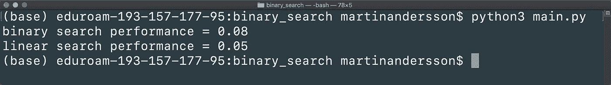

list = [6…500]，target = 15，跑了 10.000 次。

有几个问题给二进制带来了困难。

*   整理
*   列表长度
*   低目标值

以上所有因素，给了线性一个良好的开端。现在，让我们继续在那里排序，首先改变列表长度:

```
bin_list = list(range(1,10000))
lin_list = list(range(1,10000))
```

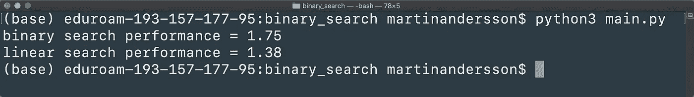

列表= [1…10.000]，目标= 15，运行了 10.000 次

线性搜索还是占了上风。让我们从函数中取出排序，在将列表传递给函数之前对其进行排序。(这对线性搜索不公平，因为线性搜索不依赖于排序列表)。我们所要做的就是注释掉它，因为我们的列表已经排序了。

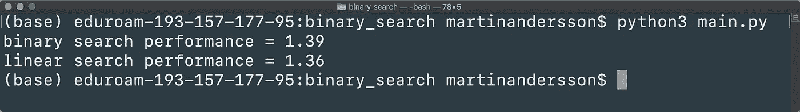

list = [1…10.000]，target = 15，运行了 10.000 次，正在排序

越来越近了。

如果我们把目标值移到 7.500 呢？现在，我们的偏见是闪亮的，因为我们真的希望二进制更快。

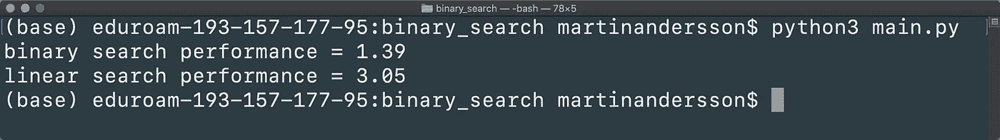

list = [1…10.000]，target=7500，运行了 10.000 次，正在排序

这一次的差异是极端的。下面的最后一个例子将会使所有的事情变得公平。

让我们用随机目标创建一个随机长度的随机列表。然后我们将对这两个函数运行 100.000 次。

由于他们不能分享列表，我们将相信[蒙特卡洛模拟](https://en.wikipedia.org/wiki/Monte_Carlo_method)(同时祈祷 Macbook 不会着火……)

```
test_list = list(range(1,random.randint(2,50000)))
test_number = random.randint(2,50000)
binary_search(test_list,test_number)
```

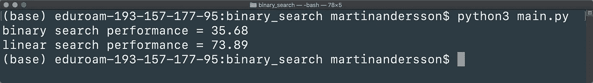

list = rand[1…50.000]，target = rand，运行了 100.000 次，正在排序

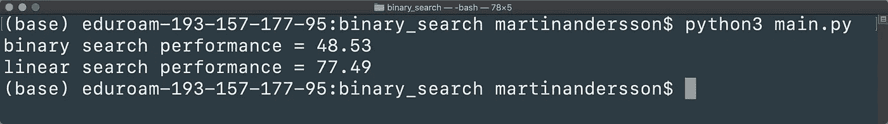

list = rand[1…50.000]，target = rand，运行 100.000 次，排序依据

现在让我们运行 6000 万次！开玩笑，我相信这些结果。MacBooks 很贵。

# 最后

二进制比线性快吗？是的，但是它看情况。

当有人告诉你二分搜索法更快，那是因为它*通常*是。

像往常一样，你必须看设置，不要每次都选择单一的解决方案，因为它“是最好的”。

我们从实验中看到，这取决于你在做什么。如果您有一个简短的列表，或者如果您正在查找列表下部的元素，那么执行线性搜索可能会更好。

这也是编程的妙处。你不应该在不知道*为什么*要做某事的情况下使用一种方式。如果你还不知道二分搜索法，现在你又有了一个搜索工具。当你发现它的用处时，就用它。

不过，我希望我们能在一件事上达成一致。二分搜索法非常酷！