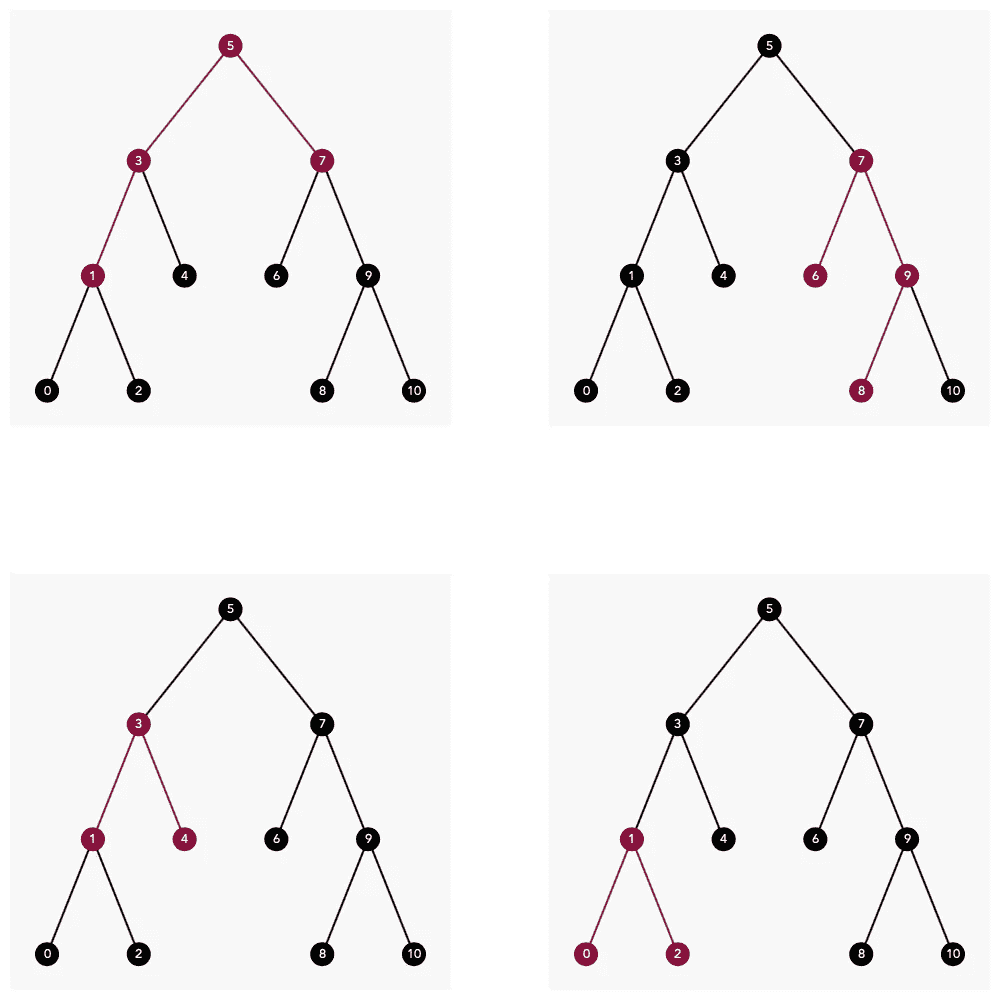
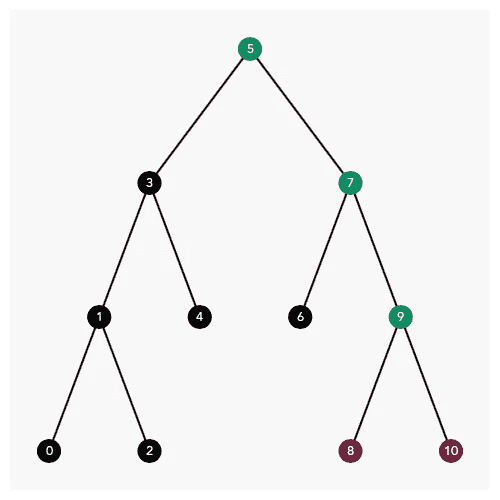
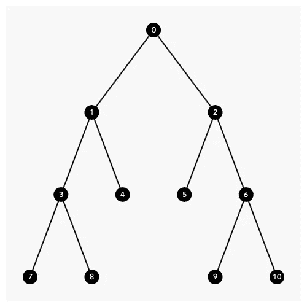
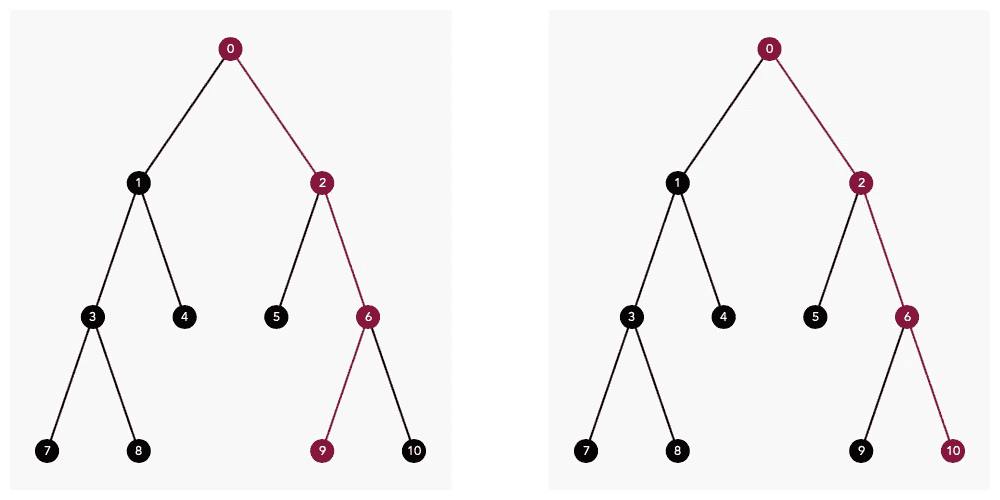
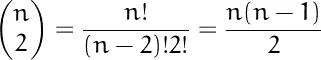

# 二叉树和最低共同祖先

> 原文：<https://towardsdatascience.com/binary-tree-and-lowest-common-ancestor-58eddd433ac?source=collection_archive---------21----------------------->

## 二叉树中两个节点的最低公共祖先以及寻找它的算法。



作者图片

## 什么是“最低共同祖先(LCA)”。

它是树中两个节点共享的最低级别的父节点。

让我们来看一个例子:


作者图片

在上面的二叉树中，节点 8 和 10 被突出显示。他们共有的父母是什么？



作者图片

共享的父母是 5，7，9 是相当明显的。

但最底层的共享父代是 9，称为**最低共同祖先(LCA)** 。

## 二叉查找树中最低的共同祖先

让我们用二叉查找树热身。

二叉查找树是二叉树的一个特例，左子树只包含较小的节点，而右子树只包含较大的节点。

我们上面的例子是一个二叉查找树。如您所见，在节点 3，左子树(0，1，2)中的所有节点都小于 3，而右子树中的所有节点都大于 4。

那么，我们如何着手寻找二叉查找树中的 LCA，例如节点 8 和 10？

实际上，二叉查找树让搜索变得非常简单。仔细看看节点 9，它和节点 7 有什么不同？我能想到一件事:

*节点 9 介于 8 和 10 之间，而对于节点 7，节点 8 和 10 都更大。*

这实际上是足够信息来确定节点 9 是二叉查找树中节点 8 和 10 的 LCA，这要归功于它的巨大属性。

下面是它的一个实现:

```
from collections import deque

class Node:
    def __init__(self, value, left=None, right=None):
        self.value = value
        self.left = left
        self.right = right

def create_bt(value_queue):
    *"""create binary tree"""* if len(value_queue) <= 0:
        return None, None

    root = Node(value_queue.popleft())

    current_queue = deque()
    current_queue.append(root)

    while len(current_queue) > 0 and len(value_queue) > 0:

        current_node = current_queue.popleft()

        left = value_queue.popleft()
        if left is not None:
            current_node.left = Node(left)
            current_queue.append(current_node.left)

        right = value_queue.popleft()
        if right is not None:
            current_node.right = Node(right)
            current_queue.append(current_node.right)

    return root

def create_bt_fls(value_list):
    *"""create binary create from list"""* return create_bt(deque(value_list))

def lca_bst(bst, v1, v2):
    *"""lowest common ancestor of two nodes
       in a binary search tree"""* if v1 <= bst.value <= v2 or v1 >= bst.value >= v2:
        return bst
    elif bst.value > v1 and bst.value > v2:
        return lca_bst(bst.left, v1, v2)
    else:
        return lca_bst(bst.right, v1, v2)

bt1 = create_bt_fls([5, 3, 7, 1, 4, 6, 9, 0, 2, None, None, None, None, 8, 10])

lca = lca_bst(bt1, 8, 10)
print(lca.value)
'''
output:
9
'''
```

在这个实现中，我们首先从一个值列表中创建一个二叉树数据结构，然后调用 LCA 算法来查找节点 8 和 10 的 LCA，它返回正确的值 9。

让我们暂停一下，稍微思考一下这个算法的复杂性。该算法从根节点开始，在每个节点将节点的值与两个输入节点进行比较，如果值在两个节点之间，则返回该节点作为答案，否则，如果值大于两个输入节点，则向左移动，如果值小于两个输入节点，则向右移动。

所以在每次递归迭代过程中，搜索空间被切成两半(树的一半)，这意味着如果树中的节点总数为 n，则需要的迭代次数为 log(n)(以 2 为底)，所以复杂度为 O(log(n))。不算太坏。

## 二叉树中的 LCA(非 BST)

这是一个很好的热身，现在让我们把事情变得稍微复杂一些。

现在假设这棵树不是二叉查找树，而是一棵没有特定结构的随机节点值的树。我们如何找到树中两个节点的 LCA？



二叉树，作者图片

如果你试图在上面的树上运行二叉查找树 LCA 算法，它将悲惨地失败:

```
ls1 = [0, 1, 2, 3, 4, 5, 6, 7, 8, None, None, None, None, 9, 10]
bt1, node_dict = create_bt_fls(ls1)

lca = lca_bst(bt1, 9, 10)
print(lca.value)
'''
output:
10 WRONG!!
'''
```

我们得想别的办法。

一种直观的方法是从下面的观察中得来的:



9 的路径:[0，2，6，9]，10 的路径:[0，2，6，10]，按作者排序的图像

从上图中可以看出，到节点 9 的路径是 0，2，6，9，到节点 10 的路径是 0，2，6，10。一旦我们有了到每个节点的路径，我们需要做的就是在两条路径中找到最后一个匹配的节点，这也是我们的 LCA！

下面是一个实现:

```
def find_path(tree, value):
    *"""find path from root to value"""* if tree is None:
        return None
    elif tree.value == value:
        return [tree]

    res = find_path(tree.left, value)
    if res is not None:
        return [tree] + res

    res = find_path(tree.right, value)
    if res is not None:
        return [tree] + res

    return None

def lca_fp(tree, v1, v2):
    *"""find lca of two nodes using find_path"""* path1 = find_path(tree, v1)
    path2 = find_path(tree, v2)

    cur_idx = 0
    while len(path1) > cur_idx and \
          len(path2) > cur_idx and \
          path1[cur_idx].value == path2[cur_idx].value:
        cur_idx = cur_idx + 1

    return path1[cur_idx - 1] lca = lca_fp(bt1, 9, 10)
print(lca.value)
'''
output:
6
'''
```

作品。

上面的算法足够简单，只需要注意一点，Find Path 算法搜索整个树寻找到目标节点的路径，所以它的复杂度是 O(n)，因此使用 find_path 的 LCA 算法也是 O(n)。因为没有将树构造为二叉查找树而牺牲了性能。

# 寻路算法的优化

查找路径算法的复杂性并不令人担心，但是如果您需要重复执行搜索该怎么办呢？请记住，在一个大小为 n 的树中，有 n 选择 2 个唯一的节点对，即:



作者图片

节点对的数量，如果我们使用查找路径算法得到所有节点对的 LCA，那么将是 O(n n)或 O(n)。也许我们应该试着加快一点。

加快查找路径计算速度的一种方法是在节点中存储一个父指针，这样当我们试图查找到一个节点的路径时，我们需要做的就是沿着父指针一直到根，而不是在整个树中搜索路径。

下面是对树的这种增强的实现:

```
class Node:
    def __init__(self, value, **parent=None**, left=None, right=None):
        self.value = value
        **self.parent = parent**
        self.left = left
        self.right = right

    **def add_to_dict(self, node_dict):

        node_dict[self.value] = self**

def create_bt(value_queue):
    *"""create binary tree"""* if len(value_queue) <= 0:
        return None, None

    **node_dict = {}**

    root = Node(value_queue.popleft())

    **root.add_to_dict(node_dict)**

    current_queue = deque()

    current_queue.append(root)

    while len(current_queue) > 0 and len(value_queue) > 0:

        current_node = current_queue.popleft()

        left = value_queue.popleft()
        if left is not None:
            current_node.left = Node(left, **parent=current_node**)
            **current_node.left.add_to_dict(node_dict)**
            current_queue.append(current_node.left)

        right = value_queue.popleft()
        if right is not None:
            current_node.right = Node(right, **parent=current_node**)
            **current_node.right.add_to_dict(node_dict)**
            current_queue.append(current_node.right)

    return root, **node_dict**

def create_bt_fls(value_list):
    *"""create binary create from list"""* return create_bt(deque(value_list))
```

在树的这个新实现中，我们在节点中存储了一个额外的字段 parent 来存储父节点。

我们还为节点创建了一个值字典，这样我们就可以很容易地找到对应于某个值的节点。

有了这两个增强，我们可以实现一个新 LCA 算法:

```
def lca(node1, node2):

    parents = set()

    cur_parent = node1
    while cur_parent is not None:
        parents.add(cur_parent)
        cur_parent = cur_parent.parent

    cur_parent = node2
    while cur_parent is not None:
        if cur_parent in parents:
            return cur_parent
        cur_parent = cur_parent.parent

    return None ls1 = [0, 1, 2, 3, 4, 5, 6, 7, 8, None, None, None, None, 9, 10]
bt1, node_dict = create_bt_fls(ls1)
lca1 = lca(node_dict[9], node_dict[10])
print(lca1.value)
'''
output:
6
'''
```

又管用了。

通过这种增强，我们牺牲了多一点的内存空间 O(n)来存储父指针，但是由于从节点到根父节点的跟踪是 O(log(n))，所以算法的复杂度降低到 O(log(n))。在所有节点对上运行现在需要 O(n log(n))内存来提高速度。

**未完待续……**

这是我们能做的最好的吗？绝对不是，有很多方法可以优化算法。特别是 Tarjan 的离线最低共同祖先算法，可以将性能复杂度降低到常数！但是因为它涉及一个全新的数据结构(不相交集)，我们将在另一个故事中讨论它。