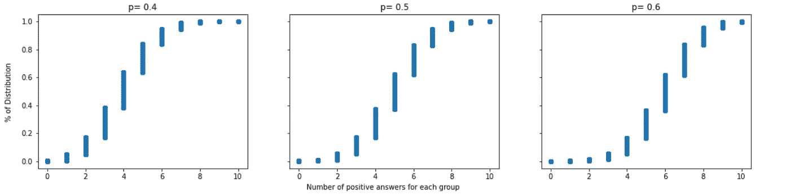

# 数据科学家二项分布教程

> 原文：<https://towardsdatascience.com/binomial-distribution-tutorial-for-data-scientists-10921de753c8?source=collection_archive---------24----------------------->

## 使用简单的 python 代码提高您的统计技能！


没有这些骰子，统计也很有趣！[来源](https://unsplash.com/photos/CyMd0vOYFfU)

在学习数据科学时，我们经常听到正确研究统计数据的重要性，特别是对概率的关注，在运行机器学习模型和验证测试时，没有办法否认这种知识的重要性。然而，如果你是统计学新手，或者你在高中时历史比数学好，你可能很难理解它。

在本教程中，我将通过一个示例来指导您如何在 python 中运行二项分布模拟，并在最后绘制经验累积分布函数图。我在这里不涉及这个主题的基础概念，所以如果你不熟悉二项分布，你可以先看看[这篇优秀的文章](/fun-with-the-binomial-distribution-96a5ecabf65b)。也就是说，让我们开始吧！

哦，但在此之前，欢迎你点击[这里](https://github.com/lucasmoratof/tutorials/blob/master/Tutorial_Binomial_Distribution.ipynb)下载我正在使用的所有代码的笔记本。

## 首先:定义一个问题

统计的例子可以很抽象，毕竟什么是“成功案例”，还有**为什么那些人痴迷于抛硬币和掷骰子？我认为学习东西的最好方法是在你容易理解的问题/情境中。**

比方说，我们正在做一个选举池。我们将随机询问 10 个人，他们是否会在 2020 年投票选举特朗普为总统。我们将与另一组 10 个人反复重复这条线索，直到我们得到 10 万组的答案。我们的目标是发现每组中有 6 人或更多人回答“是”的概率。

但是等等，与其拿着你的纸和笔跑到外面去骚扰街上的人，不如让我们用 python 的能力来模拟一下。

我们首先检查我们是否拥有二项分布情形的所有元素:

*   **是或否问题**(因此是“二项式”部分):问题是他们是否会投票给特朗普，所以我们很好。
*   **独立结果**:一个人的答案不影响下一个答案。
*   **氮、磷和大小。**我们有了试验次数(n)，10 个人，每个人回答是(p)的概率，我们用 50%，我们实验的规模，10 万组。

太好了，那我们先做什么？模拟答案！我们可以使用[*NP . random . random()*](https://docs.scipy.org/doc/numpy-1.15.0/reference/generated/numpy.random.random.html)函数来实现。它会生成一个介于 0 和 1 之间的随机数，所以我们会将所有**低于 0.5 的数字视为否**，等于或高于 0.5 的数字**会被视为是**。让我们想象一下如何为 10 人小组得出答案:

```
> [0.9600173  0.69951205 0.99986729 0.2200673  0.36105635 0.73984099  0.99645573 0.31634698 0.13654458 0.38398001] > [ True  True  True False False  True  True False False False] > Total number of positive answers for this group: 5
```

所以从我们的第一组 10 个人中，有 5 个人回答说他们会投票给特朗普。现在我们只需要将同样的逻辑重现十万次！为此，我们需要做一个循环并使用函数 [np.random.binomial()](https://docs.scipy.org/doc/numpy-1.15.0/reference/generated/numpy.random.binomial.html) ，它需要参数: *n(试验次数，或者在我们的例子中，每组的人数)*， *p(肯定答案的概率)*和 *size(我们想要运行它多少次)*:

```
> There's a probability of 37.69% of Trump getting 6 or more supporters in a group.
```

## 那是什么意思？

理解如何解释这一结果很重要，因为这不是关于特朗普是否会当选，而是显示了在随机选择 10 人的情况下，6 人或更多人对“你会投票支持特朗普竞选总统吗？”这一问题的回答是肯定的可能性有多大。。

鉴于美国复杂的选举系统，这种模拟可以用于不同的选区，初始概率各不相同。我们假设有 50%的机会回答是或不是，但如果你在佛罗里达或加利福尼亚，这种情况就会改变，对吗？通过改变得到肯定答案的概率(p ),看看结果变化有多大:

*   对于 **p=0.4 : 16.76%** 获得 6 个以上支持者的几率；
*   对于 **p=0.6 : 63.27%** 获得 6 个以上支持者的几率。

## 经验累积分布函数(ECDF)

可视化二项分布最酷的方法之一是绘制 ECDF 来检查肯定答案的分布。这可以通过一个简单的 [plt.scatter()](https://matplotlib.org/3.2.1/api/_as_gen/matplotlib.pyplot.scatter.html) 来完成，在 y 轴上输入分布的密度，范围从 0 到 1 (100%的样本)，在 x 轴上输入我们在每组中得到的肯定答案的数量:



n= 0.4、0.5 和 0.6 时的 ECDF 曲线。注意曲线是如何变化的。

## 如何解读 ECDF 的情节？

将 x 轴上的值 6 作为参考。在左边的第一个图中，p=0.4，数字 6 略高于 0.8，这意味着超过 80%的分布低于该值，不到 20%的分布高于该值。这与我们的计算 p=0.4 或 16.76%完全匹配，对于其他两个图也是如此。

花几分钟时间比较这些图和值。一旦你有了这个想法，你会注意到理解 ECDF 情节是多么的强大和简单。

## 结论

在这个实践教程中，我想把你带出我们在学习二项式分布时遇到的所有同类例子，并向你展示如何使用不同的 *p 值*进行第一次模拟，以及如何用 ECDF 图可视化结果。我希望这篇文章能帮助你提高你的统计技能，也欢迎在评论中分享你的想法。