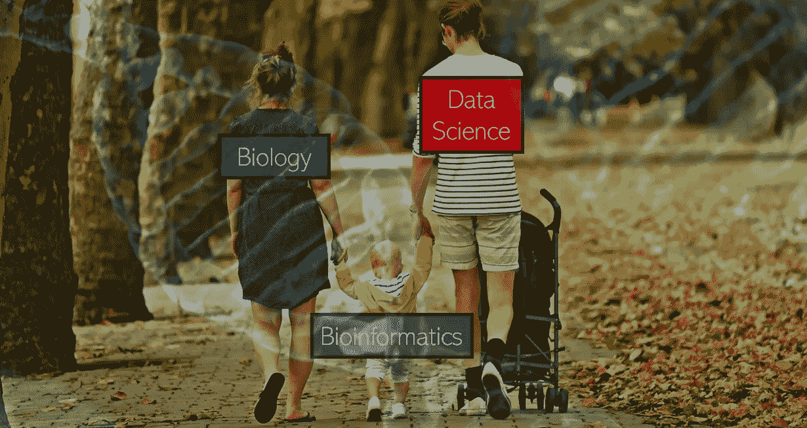
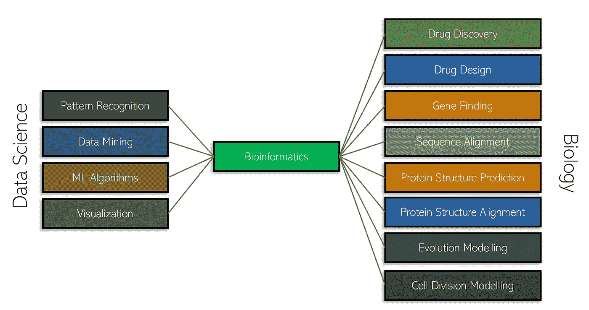
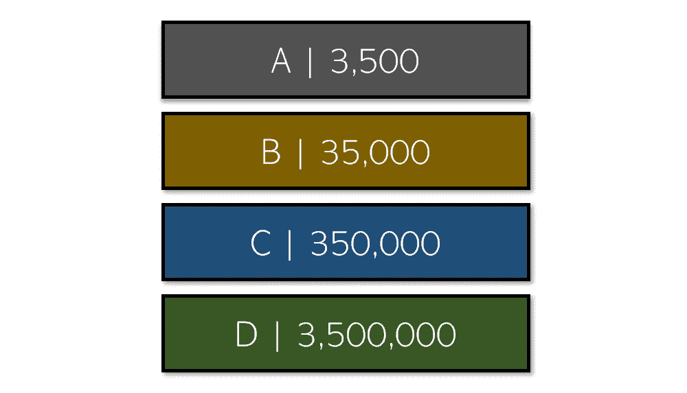
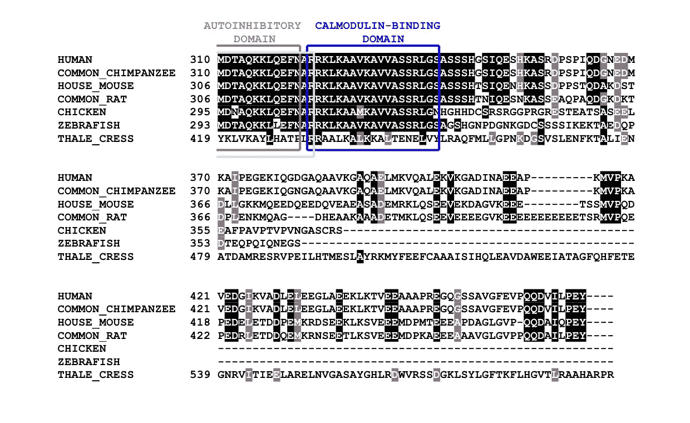
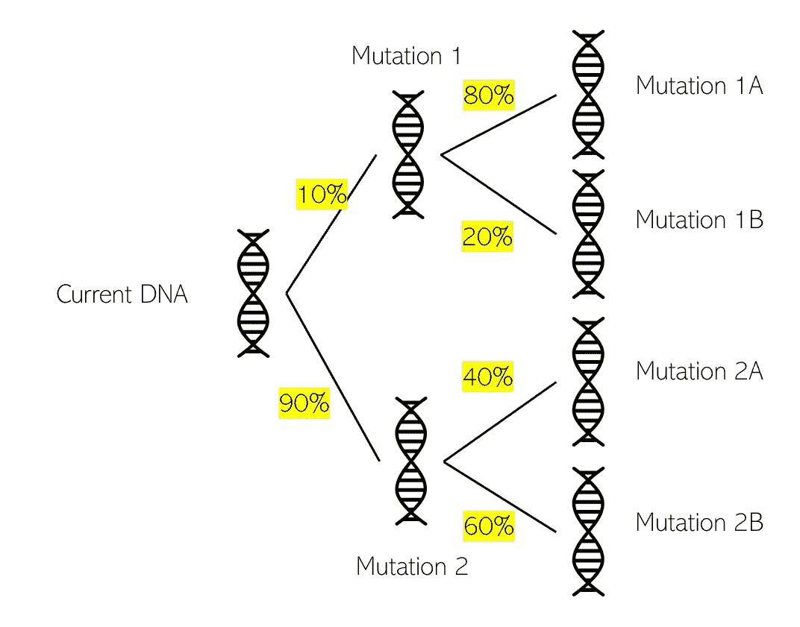
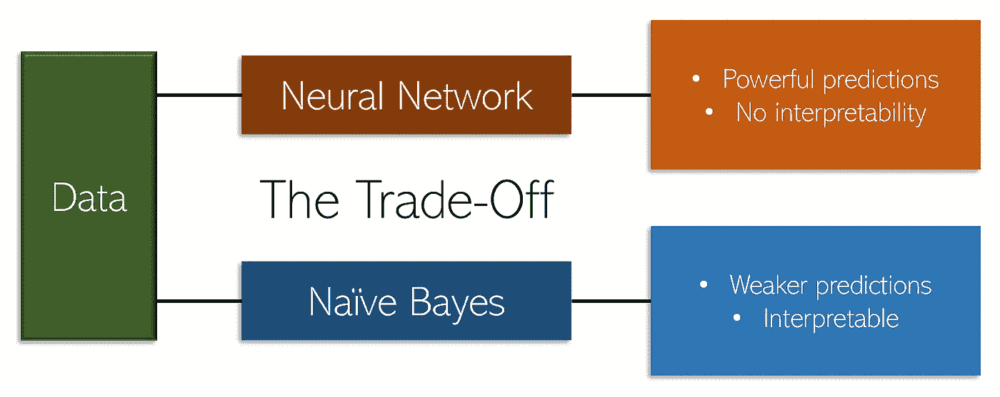
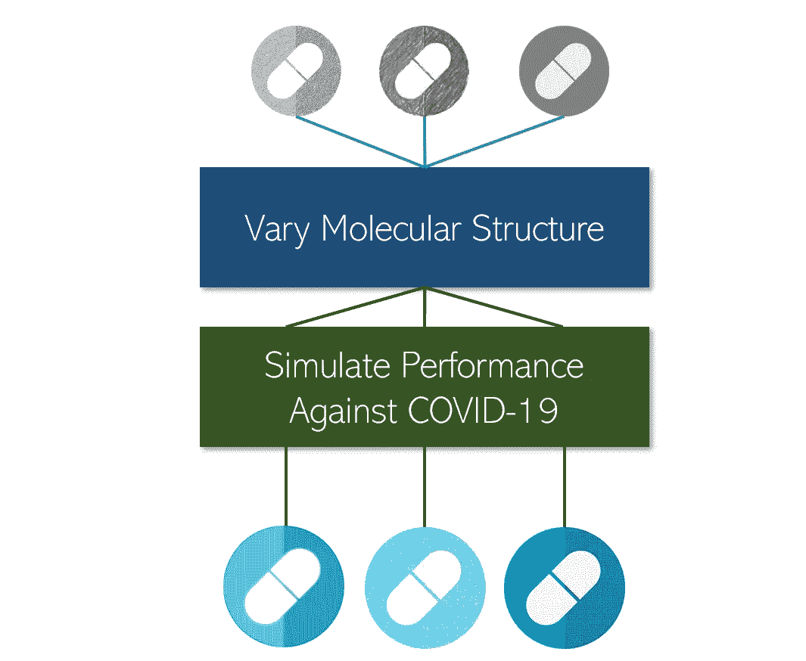
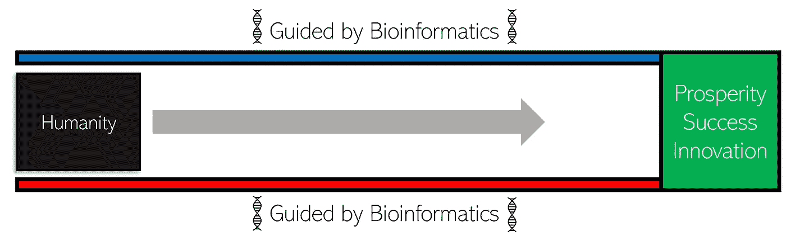

# 生物信息学:人工智能如何为生命研究做出贡献

> 原文：<https://towardsdatascience.com/bioinformatics-how-ai-can-contribute-to-the-study-of-life-7a67f3d62a9f?source=collection_archive---------14----------------------->

来自 Pixabay 的背景和封面图片

## 它是什么，最近的发展和未来

生物学是对生命的研究——可能是科学最迷人的方面之一。更重要的是，它的很大一部分在小的水平上研究生命——DNA 链，有机化学，所有的一切。在大千世界里，研究小物品意味着海量数据；因此，哪里是数据科学大放异彩的更好领域？

生物信息学结合了生物学和数据科学，赋予了机器学习和人工智能方法一个真实而重要的目的。

生物信息学的主要目标是利用机器学习和数据科学的力量来探索太复杂而无法用手探索的生物系统和过程。它将数据科学方法与生物学任务联系起来。例如，一个显著的例子是药物发现和设计——世界上最强大的超级计算机 IBM Summit 花了 1 到 2 天时间搜索可以对抗冠状病毒的化合物的分子结构。它使用生物信息学代码进行模拟。

通常，复杂的生物学现象涉及许多生物学方面，因此不能用一种数据类型来解释。出于这个原因，生物信息学涉及对几种不同数据类型的相互联系的分析，应该对复杂的生物现象有一个整体的理解。

机器学习已经在生物信息学中用于预测和发现——随着高可用性和各种组学(分子水平)数据的兴起，机器学习——尤其是深度学习——变得更加频繁。

由于数据量巨大，生物信息学是数据科学的一个丰富分支。一个人类基因组中大约有多少个核苷酸(“片段”)？

答案是:D，仅在一个人类基因组中就有 350 万个核苷酸。拥有所有这些数据，再结合像序列比对这样的生物信息学方法，可以为美国医院和诊所提供一种更经济实用的诊断工具。

序列比对是指将不同的序列进行比对，以便比较相似性和差异性。这是生物信息学中的一个常见任务。[来源](https://www.ucl.ac.uk/~zcbtg1b/MSA%20Final%202.jpg)。

机器学习的一个机会领域是基因组特征的预测，它描述了任何具有某种注释功能的基因组区域，如基因。

机器学习也可以用来预测 DNA 和 RNA 链的序列。像聚类这样的无监督方法可以用来寻找类似的 [DNA 突变](/machine-learning-for-biology-how-will-covid-19-mutate-next-4df93cfaf544?source=---------28------------------)，像主成分分析这样的降维技术可以帮助降低高维数据的维度。

生物信息学在解决群体和进化遗传学问题方面也有巨大的潜力。进化，尤其是在人类或其他拥有大量种群的生物中，可能是一个极其困难和复杂的系统来建模。因为生物信息学能够利用机器学习的预测能力，生物学家可以窥视未来，看看最有可能的群体结果是什么，或者某个群体的 DNA 进化成特定版本的概率是多少。

生物信息学中的一个挑战是高级人工智能算法缺乏可解释性(“黑盒性质”)。虽然已经开发了几种方法来解释这些模型，例如，用于解释卷积神经网络的基于梯度的方法，但是对生物信息学中常见的复杂情况的解释是具有挑战性的，并且通常是遥不可及的。因为生物学家通常不仅关注模型的结果，还关注模型如何得出结论，强大的神经网络可能需要被更容易解释的模型所取代，如朴素贝叶斯或逻辑回归。

生物数据和高分辨率/高维度(维数灾难——稀疏性、多重共线性、过拟合)数据的噪声特性带来了额外的挑战。

数据错误，如基因位置不正确、污染序列、序列变异或差异、拼写错误和注释错误困扰着数据库。

尽管改进的机器学习方法和越来越多的数据显示出增加人类对生物现象的理解的巨大潜力，但由于缺乏对隐藏的生物因素(如样本中的群体结构或基因之间的进化关系)的了解，适当的机器学习模型仍然受到阻碍。如果没有适当考虑这些因素，模型可能会过度拟合，导致假阳性发现。

就像机器学习中的免费午餐定理一样，生物信息学中的任何问题都没有确定的方法。不同的机器学习方法将对应于对数据的不同基础假设。

生物信息学在新冠肺炎备受关注。生物信息学家进行的第一次生物信息学突破是在新冠状病毒的生物序列上。

几所中国大学和研究机构已经对新冠肺炎的基因组和晶体结构进行了测序和阐释，这是开发药物、诊断工具和疫苗的起点。

生物信息学家还开发了使用逆转录聚合酶链反应(RT-PCR)的诊断工具。这是使用生物信息学序列比对方法创建的。

通过使用化合物库和药物库，像橡树岭国家实验室的生物信息学家正在使用基于机器学习的计算方法来改变和试验候选药物。

这是通过利用现有的生物信息学化学工具修改现有冠状病毒药物的化学结构，然后进行大规模分子模拟来实现的。

生物信息学的前景非常光明。随着人工智能热潮推动生物信息学的发展，DNA 分析、人造器官和不可想象的新药、药物和疫苗正在迅速发展。

生物信息学是有效的，因为它使用计算机的能力和机器学习的效率来模拟和观察人类需要太长时间才能到达或从未想过要去的地方，并作为人类的导轨。

