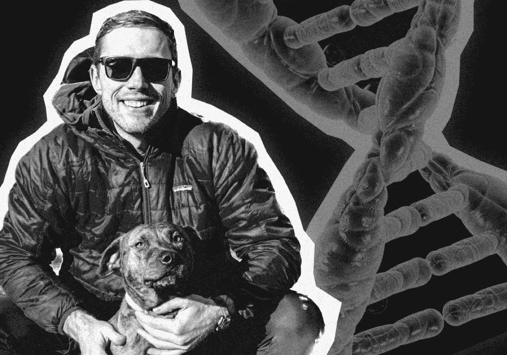

# 生物学家和数据科学家:文化鸿沟

> 原文：<https://towardsdatascience.com/biologists-and-data-scientists-the-cultural-divide-4f03f092e81e?source=collection_archive---------30----------------------->

## 亚历山大·提图斯的见解

来源:作者

生物学和数据科学领域有很多共同点。数据科学家和生物学家都分析数据集，试图理解这个世界。如今，数据科学对生物学越来越重要，因为生物学家越来越多地将机器学习和人工智能用于药物发现、医疗诊断和自动化重复任务。

尽管如此，这两个领域之间仍然存在巨大的文化差异。数据科学家和生物学家经常从非常不同的角度，使用不同的方法和不同的术语来处理同一个问题。

我们采访了高级再生制造研究所(ARMI)首席战略官兼《生物经济》主编 Alexander Titus。XYZ 。亚历山大最初是一名生物学家，后来获得了数据科学博士学位，现在正致力于弥合这两个领域之间的差距。

# 亚历山大的背景

亚历山大最初在大学学习生物化学和生物学，但在最后一个学期开始接触计算机科学。正如他所说的，

> *“我爱上了计算机科学，并意识到我一直在研究错误的东西。”*
> 
> *“我搬到了硅谷，想在科技领域的初创公司找份工作。但是我没有任何软件技能，所以我在做与编程无关的事情。然后，在真正的硅谷风格中，我把所有的时间都花在了地下室的黑客工作上:学习如何编码。学习统计学。最终学习机器学习。我考得足够好，可以去拿博士学位了。”*

现在，作为一名战略执行官，亚历山大充当了数据科学家和生物学家之间的桥梁。他帮助 ARMI 做出正确的宏观决策，让再生制造成为现实。

【在 [LinkedIn](https://www.linkedin.com/in/alexandertitus) 、 [Twitter](http://twitter.com/1alexandertitus) 、[他的播客 Titus Talks](http://anchor.fm/1alexandertitus) 、他的出版物 [Bioeconomy.xyz](https://medium.com/bioeconomy-xyz) 或[alexandertitus.com](https://alexandertitus.com)了解更多关于 Alexander 的信息。]

# 生物学家应该学数据科学，还是数据科学家应该学生物学？

亚历山大已经看到人们在两个方向上拓宽了他们的技能，但他认为生物学家获得数据科学技能比反之更容易。他说:

> “与我交谈过的创始人发现，让生物学家来教他们数学和编程，比让那些在数学和科学领域(而不是生物学领域)有着悠久历史的人来试图让他们了解他们错过的多年事实和信息要容易得多。”

但这两个方向都具有挑战性，Alexander 表示，数据科学基础的坚实基础对任何想要跟上不断变化的人都是有用的:

> *“编程变化真快。Python 很庞大，后来集成了 R。然后是所有的统计数据，然后是 TensorFlow，然后是 Keras。它只是不断变化。任何一套技能都会在几个月内过时。但学习这些技能的潜在能力是巨大的。”*

事实上，亚历山大认为“学会学习”是大学教给人们的最重要的事情:

> *“我在大学里有一个教授，他总是告诉我，‘大学教你的唯一一件事就是如何在一个漫长的周末里学习任何东西。’这才是我真正需要的人们的心态。它是什么并不重要，因为有人将发明一些新的反向传播算法，或者一些我们将不得不使用的新框架。我们总是要去适应。”*

# “可解释性的文化差异”

数据科学家和生物学家从不同的角度看待同一个问题。来源:作者

每周了解更多关于在生物技术中应用数据科学的信息— [注册我们的每周简讯](https://datarevenue.com/signup)

生物学家和数据科学家处理问题的最大区别在于他们处理数据和假设检验的方式。

# 假设检验与机器学习

传统上，科学家会查看一个**结果**(患者 A 患了癌症，但患者 B 没有)，做出一个**假设**(也许我们可以用这个特定的生物标记来诊断这个癌症)，然后使用**数据**来测试这个假设(在两组患者中寻找那个生物标记:患癌症的患者和没有患癌症的患者)。

虽然使用机器学习的数据科学家也受到这种方法的指导，但侧重点不同。他们看着结果，做出一个更宽松或更宽泛的假设，比如:“也许这个结果可以用我在这个数据集中的一些变量来解释。”他们将数据输入机器学习算法，该算法可能会查看数十亿种可能的解释，然后自动锁定那些最能解释结果的模式。

这种使用更广泛的假设的过程对于许多生物学家来说是陌生的，并且常常让他们感到不舒服。正如亚历山大所说:

> “在传统的生物学和化学中，你有一个非常具体的假设，你设计了一套非常具体的实验来测试它。一旦你到了那里，你就有了答案。这只是几个简单的数据点，表明你证明了这一点。
> 
> *但是在数据科学中，你通常没有假设。你有一个宽松的假设，但你正在进行数据驱动的分析，以获得答案。”*

# 生物学的狂热者:好的科学还是老式的方法？

这不仅仅是习惯的不同。这是人们非常强烈的观点——近乎狂热的信仰。亚历山大用宗教术语说:

> *“对于生物学家来说，没有假设是亵渎神明的。这与作为生物学家的训练和精神气质是如此的背道而驰。这几乎就像让人们质疑他们的科学宗教。生物学家会说，‘好吧，你是个没有假设的白痴。“你为什么没有一个假设，””*

但是随着新的工具和技术允许我们更有效地探索数据，机器学习正变得越来越被接受。亚历山大说:

> “有很多证据表明基于机器学习的分析有多好，有多有用。”

# 机器学习可以在数据中找到更复杂的关系

没有算法的帮助，科学家们只能进行有限的数据分析。传统上，生物学家在任何给定的实验中只考虑很少的变量，在数据中寻找简单的关系，他们只进行少数实验。

因此，难怪他们有时会发现很难理解机器学习为他们的领域提供的潜力。亚历山大赞同这种观点:

> 大多数来自生物和化学领域的科学家做少量的实验。他们使用一些简单的图表进行基本的 Excel 分析，以了解正在发生的事情。他们通常认为机器学习只是将更多的数据点打包到条形图的相同条中的一种情况；他们不太理解 ***维度*** *和* ***复杂性*** *带来了更多的数据和更多的变量。”*

人类往往很难理解高维。Geoffrey Hinton 简洁地解释道:“要处理 14 维空间中的超平面，想象一个 3 维空间，大声对自己说‘14’。大家都这么干。”

但是机器并不局限于此。随着计算能力的提高和更先进的算法，机器学习不仅加快了传统分析的速度，还可以进行仅使用手动方法永远不可能进行的分析。机器经常可以找到几十个变量之间的相关性，而人类科学家通常一次只能看到一两个。

# 技术让我们能够收集更多的数据并进行更广泛的分析

从历史上看，严格的假设检验是有意义的。收集数据是昂贵的，所以生物学家接受培训，以确保他们只收集他们需要的东西，并专注于一个非常具体的问题。亚历山大承认这种狭隘观点背后的原因:

> “以前，生物学家必须开发一个框架才能让实验成功。没有电脑。没有高维数据。没有深度学习。你只有足够的时间和金钱来收集非常具体的东西来证明你的假设。
> 
> *但是现在收集数据太便宜了。第一个全基因组序列花费了 100 亿美元，而同样的东西现在只需要 800 美元。”*

生成数据突然变得如此便宜和容易，这一事实产生了两种相互冲突的思想流派:一些科学家仍然更加保守，而另一些科学家则渴望充分利用更新的技术。正如亚历山大解释的那样:

> *“基本上，两种心态是:‘当你不知道你是否需要时，为什么要收集所有你能收集的数据？’与“为什么不呢？因为有一天你会需要它。”*

# 新毕业生正在引领这种观点的转变

亚历山大认为，如果我们要弥合生物学和数据科学之间的文化鸿沟，我们仍然需要大的变革，但他乐观地认为，这种转变已经在进行中。当新毕业生进入实验室时，他们带来了关于如何更有效地做事的强烈意见。正如亚历山大所说:

> *“研究生们会问，‘为什么我们还在手工做这个？“为什么我们没有机器人来自动完成这项工作，也没有数据科学来分析它，””*

并且有可能训练人们看到对方的观点。亚历山大亲身经历了这种转变:

> *“这一切都与取景有关。以我作为生物学家的经验来看，一旦你在数据科学方面接受过培训并有了经验，你就可以从两个角度来看待它。”*

# 我们需要发展假设检验，而不是抛弃它

亚历山大提醒我们，机器学习并不完全取代假设检验。相反，科学实践需要发展和适应，这样我们才能释放久经考验的科学方法与机器学习潜力相结合的优势。

Alexander 认为这种混合方法遵循一个“轻”假设:被你的假设引导但不被限制。正如他所说:

> *“微生物测序就是一个很好的例子。我不是对我在停车场找到的每一种微生物进行测序，而是在我感兴趣的领域寻找微生物。如果我想寻找擅长处理黄金的微生物，那么我会去金矿而不是农民的地里收集微生物。这是一个假设。你还是不乱做事。但是你平衡一下，这是有用的。”*

# 这不全是关于人才:专有格式和合法性的挑战

尽管找到理解数据科学的生物学家仍然是一个挑战，反之亦然，但亚历山大表示，该领域受到其他因素的影响更大:

> *“数据科学很少受到技术人才的阻碍。”*

# 专有数据格式是数据科学家生存的祸根

数据文件可以用不同的方式格式化。许多文件类型(如 PDF 文件)都有开放的标准:任何人都可以实现软件来处理 PDF 文件，并访问其内部流程的细节。

相比之下，生物技术数据通常使用专有或封闭的数据格式，这使得理解和使用这些数据更具挑战性。亚历山大指出:

> *“我们正在努力避免使用任何以专有格式存储数据的东西。这是我的数据科学存在的祸根:当有一些文件类型我不能用任何旧电脑打开时。它让我发疯。规范化、标准化和获取原始数据非常困难。”*

# 专有软件混淆了内部处理

不仅仅是访问数据；这也是为了准确理解数据已经经过了哪些预处理步骤。亚历山大描述了有时发现这一点所必需的侦探工作:

> *“这尤其具有挑战性，因为我们经常无法访问。软件都是专有的，我们不知道数据是如何在内部处理的——从原始数据到输出。我们不仅需要标准化一堆不同机器的输出，而且我们还必须弄清楚在数据到达那个阶段之前它们对数据做了什么。那很辛苦。”*

# 软件供应商使用模糊的法律来获得数据的所有权

为了帮助驾驭这种专有软件和数据格式的局面，许多团队向专业软件供应商寻求帮助。亚历山大也尝试过这个，但是他没有好的经历。他描述了无意中签署合同会如何导致失去数据本身的所有权:

> *“我们采访并评估了许多软件供应商。我们询问他们将如何为此提供解决方案，以确保我们可以访问数据，并确保他们不会因为将数据存储在他们的系统中而最终拥有这些数据。围绕它有许多法律术语。”*

# 你正在努力寻找人才还是驾驭技术？

我们喜欢听到不同的团队如何将机器学习与生物技术结合使用。如果您需要帮助或只是想聊天，[直接联系我们的首席执行官](https://datarevenue.com/en-contact)。