# 生物≠技术

> 原文：<https://towardsdatascience.com/biology-technology-e3e2c3a86e97?source=collection_archive---------74----------------------->

## 理解神经网络的一种稍微不同的方法

由 [Unsplash](https://unsplash.com?utm_source=medium&utm_medium=referral) 上的 [chuttersnap](https://unsplash.com/@chuttersnap?utm_source=medium&utm_medium=referral) 拍摄

每当我阅读一本关于神经网络的教科书时，介绍总是非常相似:它们大多以源自生物学的动机开始。这一直让我有点困扰。我绝不是生物学家，但在我看来，生物神经网络和人工神经网络之间存在相当大的差异:

1.  神经网络(通常)具有确定的拓扑结构，并且通过修改权重来进行学习。另一方面，天然神经元不断改变它们的结构来学习。
2.  生物神经元有一个“全有或全无”的策略:要么刺激通过，要么不通过，而人工神经元具有平滑的激活功能。
3.  生物神经元有更高的容错能力。

因此，因为这些事情，我从来没有真正弄清楚为什么生物学概念的抽象数学表达在实践中如此有效。在这篇文章中，我想从一个不同的角度来探讨这个话题，即从统计学而不是生物学的角度。

# 逻辑回归:简介

为了接近神经网络，我们首先回到“经典机器学习”，特别是逻辑回归。让我们从一个简单的二元分类问题开始，即我们想要区分两个不同的类别。我们举一个简单的例子(见下图)。基于两个特征(任意命名为特征 1 和特征 2 ),我们想要确定给定数据点属于哪个类。

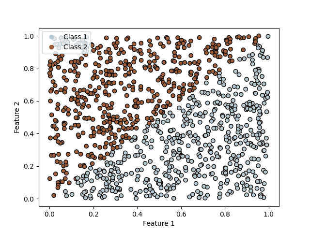

图 1:有两个类的简单分类问题

因此，为了更精确地描述我们的问题，我们需要一个模型来给出一个数据点属于类 1 的概率，给定特征 1 和特征 2:

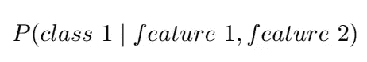

一级方程式

为了使书写简单一点，我们将从现在开始用 y 表示我们的类，用 x1，x2 = x 表示我们的特征，即上面的表达式变成

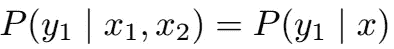

公式 2

**重要提示**:记住我们只有两个类别，所以如果我们已经计算了一个数据点属于类别 1 的概率，我们就可以很容易地计算出该数据点属于类别 2 的概率:

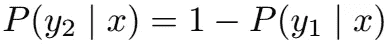

公式 3

[贝叶斯统计](https://en.wikipedia.org/wiki/Bayes%27_theorem)为我们提供了一条如何重构公式 1 的规则:

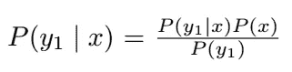

等式 1

[边缘化](/probability-concepts-explained-marginalisation-2296846344fc)允许我们将等式 1 改写为

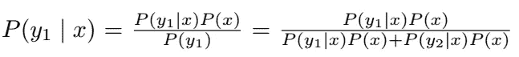

等式 2

现在我们将分母和分子都除以 P(y1|x) P(x ),这样我们得到

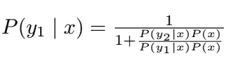

等式 3

现在我们做最后一步，再次重写等式 3。

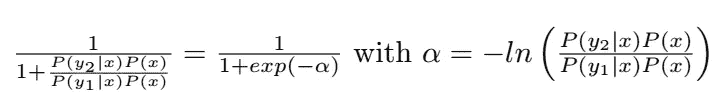

等式 4

我们基本上只是用一个指数函数代替分母中的方程。请记住，自然对数和指数函数相互抵消。

下一步真的很重要，因为它说明了为什么我们称这种**分类**技术为逻辑**回归**。逻辑回归的核心是我们搜索特征的权重，使它们接近我们的α:

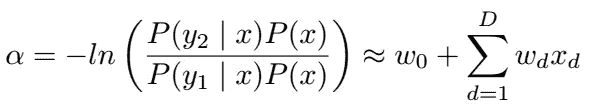

等式 5

在我们的例子中，D 是 2，因为我们只有两个类。w0 是我们也加入的一个偏差。因此，为了完成区分这两个类别的任务，我们需要学习三个权重 w0、w1 和 w2。

# 逻辑回归:应用

我不想回顾这些参数的实际学习过程，因为已经有很多关于这个主题的[优秀文章](https://medium.com/@danielyates1234/logistic-regression-with-maximum-likelihood-estimation-d0ad622b42be)。因此，我们现在将直接跳到模型的应用！让我们用逻辑回归分析上面的数据(图 1)。经过 500 次训练后，我们得到了以下结果:

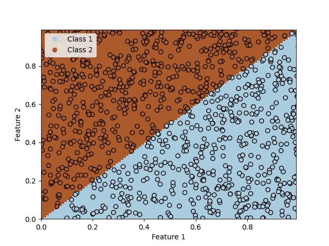

图 2:500 个时期后经过训练的逻辑回归

哇，看起来不错！我们的模型几乎可以完美地区分这两个类别。让我们尝试另一个数据集，看看模型的表现如何。

图 3:新的数据集

根据图 3 中的数据，我们得到了以下结果:

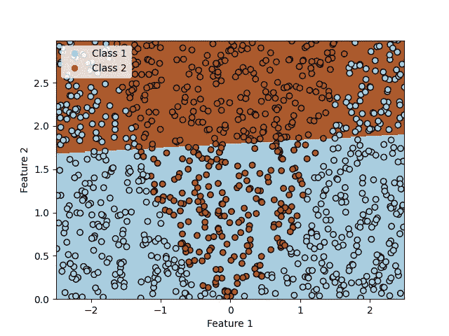

图 4:500 个时期后经过训练的逻辑回归

嗯，这个型号一点也不好用。它看起来更像是一条穿过数据的随机直线。这是什么原因呢？要得到答案，我们必须回头看看等式 5。我们在这里看到的是，逻辑回归将特征乘以一个权重，然后将它们相加。所以我们这里有一个线性模型。Logistic 回归只能学会对线性可分的数据进行分类，或者通俗地说，可以用一条直线明确划分的数据。我们这里的数据显然不是线性可分的，因为两个类别之间的边界呈抛物线形状。但是我们可以相当容易地克服这个问题。到目前为止，我们刚刚在模型中输入了两个值:特性 1 和特性 2。现在我们只添加第三个特性(特性 1)。所以我们只要平方特征 1 的值。再次对相同的数据进行训练，我们得到了图 5 中的结果。

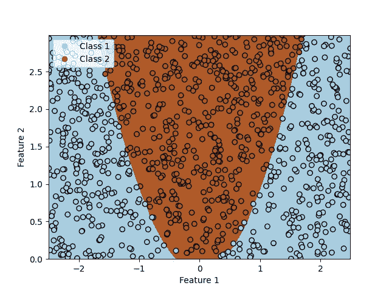

图 5

有了这个额外的特性，我们的模型几乎完美地拟合了数据。但这真的是可行的解决方案吗？我们希望我们的模型尽可能通用，这样我们就可以适应尽可能多的不同数据分布。还有大量的非线性函数。因此，如果我们想要对除了平方值之外的许多数据集很好地执行逻辑回归，我们将必须添加输入要素的立方、正弦、平方根和所有其他种类的非线性函数。我们可以构建一个修改的逻辑回归，其中我们不直接将特征输入模型。取而代之的是，我们定义某种黑盒，它采用原始特征并应用各种线性和非线性变换。

不像以前那样处理数学方程，让我们用图表来说明标准逻辑回归(图 6)和我们的修改版本(图 7)。

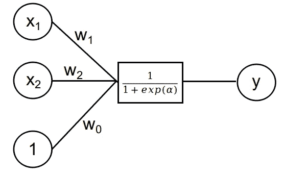

图 6:标准逻辑回归图

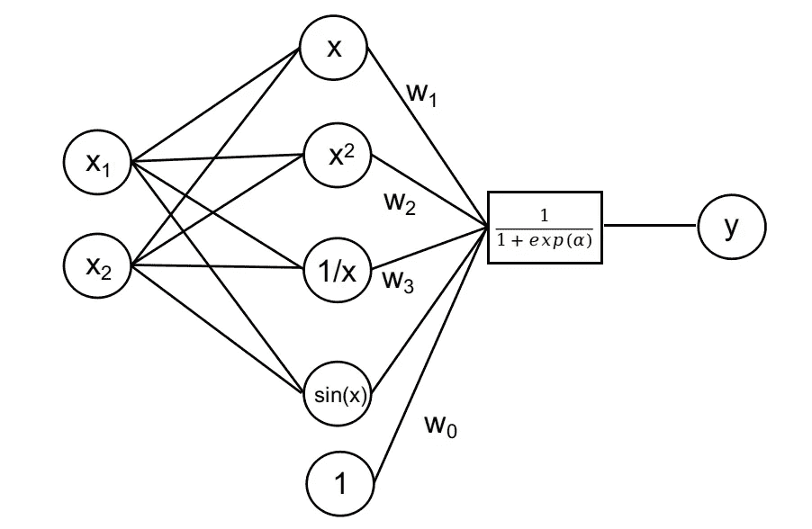

图 7:修改后的逻辑回归图

这两张图片看起来奇怪地类似于神经网络——因为它们就是！让我们暂时记住这一点:标准的逻辑回归只不过是一个没有隐藏层的神经网络。我们的修改版本确实是一个带有隐藏层的神经网络。主要区别在于，在真实的神经网络中，我们不需要像在这里一样手工设计隐藏层中的函数。

# 神经网络分类

现在让我们将逻辑回归获得的结果与实际的神经网络进行比较。首先，我们尝试一个没有隐含层的神经网络(图 8)。

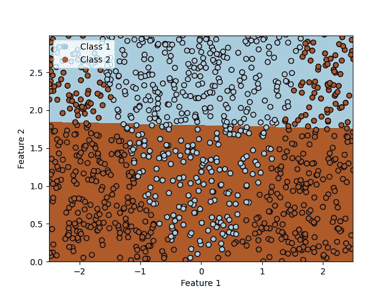

图 8:没有隐藏层的神经网络

毫不奇怪，这种神经网络的性能与标准的逻辑回归一样差。只有当我们开始添加具有非线性激活函数的隐藏层时，我们才能学习非线性关系。所以让我们尝试不同数量的隐藏神经元。

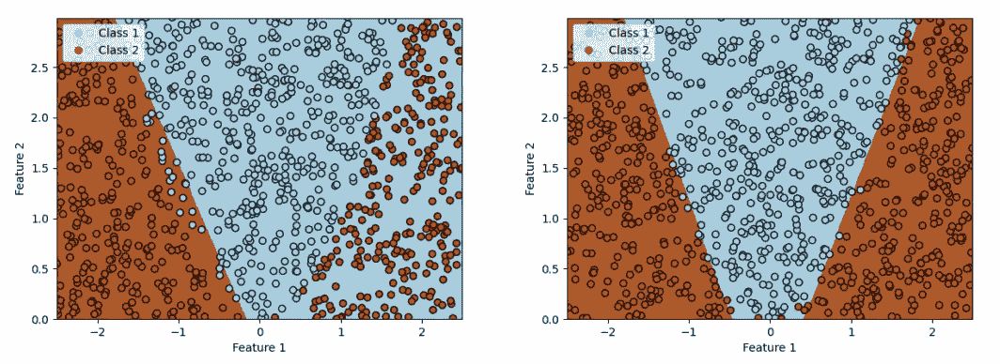

图 9:左:带有一个隐藏神经元的神经网络。右图:具有两个隐藏神经元的神经网络

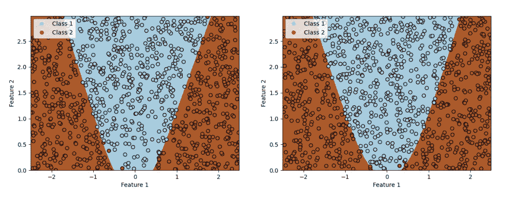

图 10:左图:有 12 个隐藏神经元的神经网络。右图:有 50 个隐藏神经元的神经网络

正如我们在上面的图片中看到的，只有一个隐藏神经元的网络表现很差，而两个神经元似乎已经足以进行良好的分类。看起来网络能够在两边找到两个直线决策边界。但是我们添加的隐藏神经元越多，边界就越平滑。这在底部中心尤其明显。

现在让我们来看看我们网络的内部运作。我在这个项目中使用的 Keras 库使得查看隐藏层的输出变得相当容易。

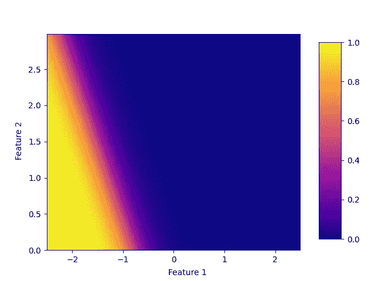

图 11:具有一个神经元的隐藏层的输出

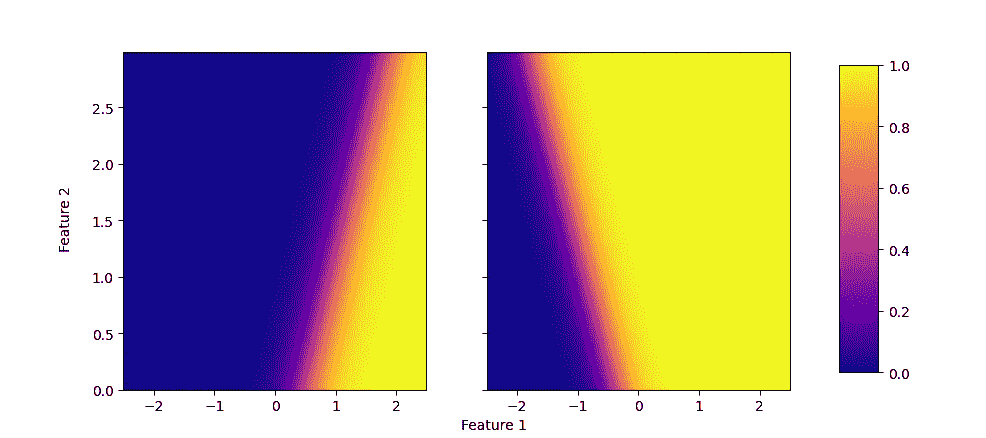

图 12:具有两个神经元的隐藏层的输出

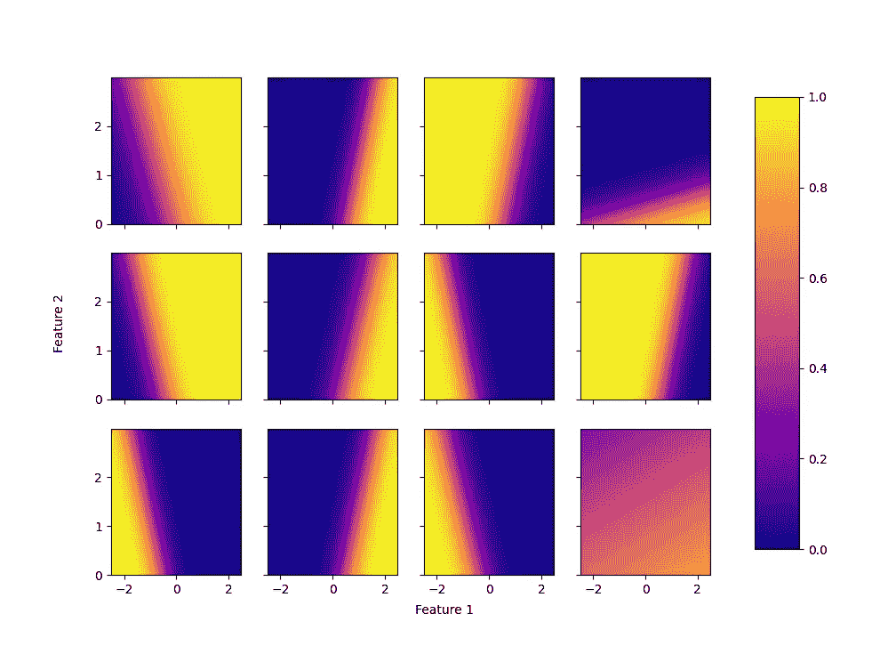

图 13:具有 12 个神经元的隐藏层的输出

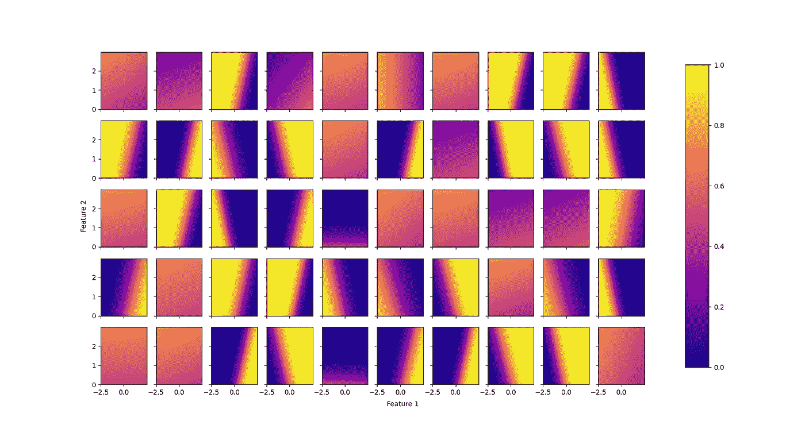

图 14:具有 50 个神经元的隐藏层的输出

具有一个和两个神经元的隐藏层的输出并不令人惊讶。用一个神经元，我们可以检测一个边界，但不能检测另一个，而用两个神经元，我们已经可以获得相当好的结果。查看具有 12 个和 50 个隐藏神经元的网络的输出，我们可以做出两个观察:

1.  相当多的神经元的输出看起来非常相似。所以这可能是一个暗示，我们实际上不需要这么多隐藏的神经元，因为它们中的许多并没有增加任何额外的信息。
2.  在前两个网络中，我们看到的不仅仅是近乎线性、非常清晰的边界，而是相当多的输出值在非常窄的范围内，没有形成清晰的边界。因此，这些输出可能有助于使整体分类更加平滑。

总的来说，我们对结果很满意。我们的网络只需要几个隐藏的神经元和几秒钟的训练，就能实现良好的转换，而不是像逻辑回归那样，必须对我们的输入特征进行良好的转换。

# 结论

我希望这篇文章能让你对神经网络有一个有趣的新看法，并让你更清楚地了解神经网络的想法来自哪里，以及它们为什么工作得这么好。所以，也许下次你遇到神经网络时，不要把它们仅仅视为生物神经元的抽象模型，而是非线性特征转换器(隐藏层)与逻辑回归(输出层)的结合——这是一个相当简单的概念，不是什么神奇的东西，也不是“一个可以工作的黑盒”！