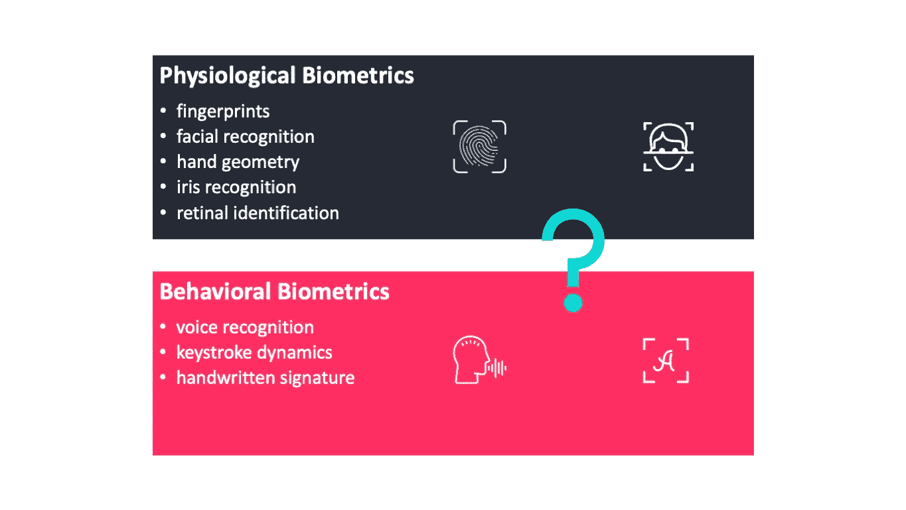
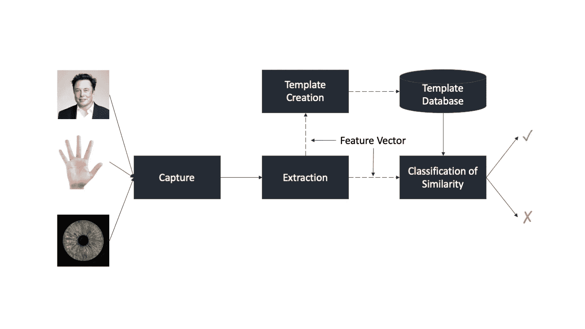
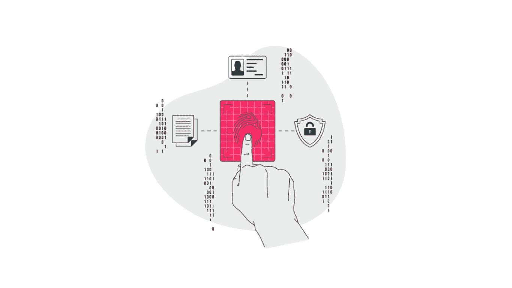
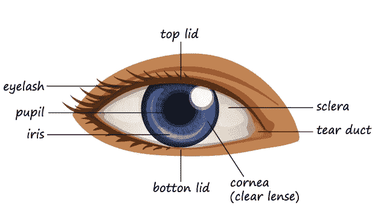
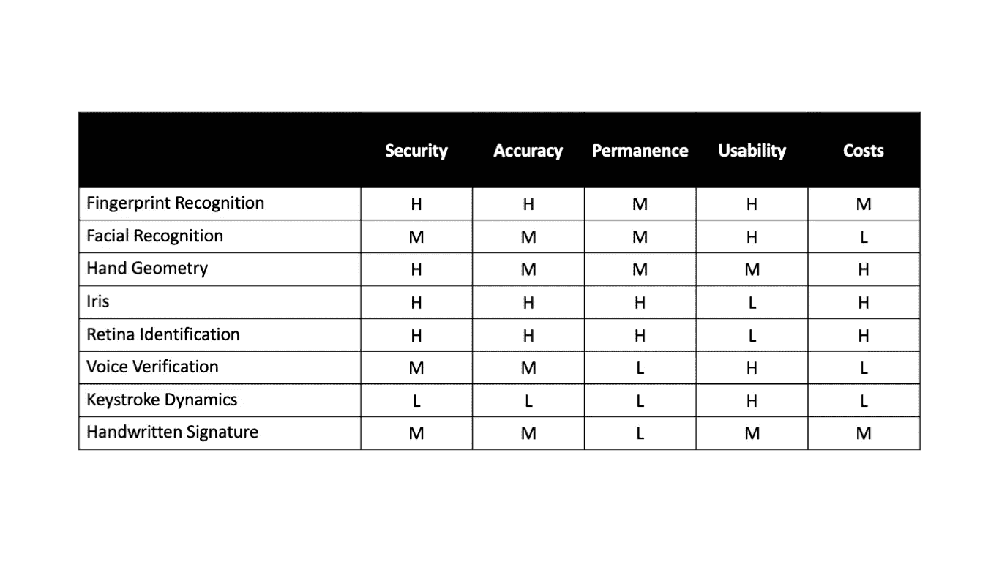
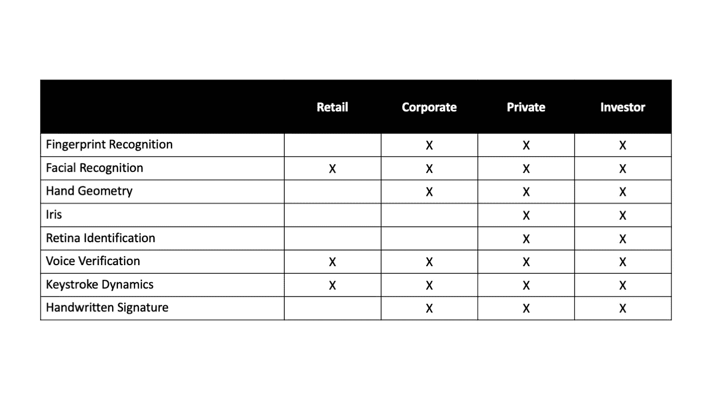

# 生物认证方法

> 原文：<https://towardsdatascience.com/biometric-authentication-methods-61c96666883a?source=collection_archive---------10----------------------->

## 指纹、面部识别、手形、虹膜识别、视网膜识别、语音识别、击键动力学和手写签名

作者图片

长期以来，生物识别一直是未来身份认证的目标，预计生物识别身份认证将在很大程度上取代我们当前身份认证和访问控制的其他方式。生物识别系统可用于以下两种不同的模式。

*   ***【1–1】***:确定一个人是否是他所声称的那个人。在验证模式下，系统通过将捕获的生物特征数据与存储在数据库中的模板进行比较来验证个人的身份。
*   ***【1-n】***:确定人是谁。在识别模式中，系统通过在数据库中搜索所有用户的模板进行匹配来识别该人。

生物识别系统首先通过 ***从个人处获取*** 生物识别数据，然后 ***从数据中提取*** 特征集，最后 ***将*** 特征集与数据库中的模板进行比较，如下图所示。

作者图片

# 什么是生物识别技术？

生物特征的使用，或者具体地说是独特的人类特征，已经以一种或另一种形式存在了数百年，无论是对一个人的身体描述，还是最近的一张照片。生物特征认证技术根据评估的特征类型进行分类:生理属性或行为异常。

## 生理生物统计学

生理生物识别是基于根据作为人体的一部分获得的数据(如指纹、面部或眼睛虹膜)对一个人进行分类。

**指纹识别**

迄今为止最流行的生物特征识别，指纹识别，可以利用多种分类方法，基于细节，这些细节是在手指和拇指的手掌侧、手掌和脚底发现的表皮摩擦皮脊的再现。我们可以使用它们进行身份验证，因为基本原理如下。

*   指纹在一个人的一生中不会改变。
*   指纹有一般的脊线图案，可以对它们进行系统分类。
*   指纹是一种个人特征，因为还没有发现两个手指具有相同的纹线特征。

作者图片

**手的几何形状**

第二个最广泛使用的生物特征是手形。我们使用手的几何特征，例如手指的长度和手的宽度来识别个人。

**面部识别**

该系统通过数码摄像机记录面部图像，然后分析面部特征，如眼睛、鼻子、嘴巴和下巴边缘之间的距离。

**虹膜识别**

下图显示了人类眼睛的一部分。

作者图片

虹膜是眼睛瞳孔周围的有色组织，由具有许多沟和脊的复杂图案组成。

**视网膜识别**

基于视网膜的身份识别被认为是最安全的身份认证方法。视网膜识别通过获取内部身体图像，即必须以难以伪造的方式合作的自愿者的视网膜/脉络膜，来提供对个人的真实识别

## 行为生物测定学

它由从用户动作中获得的测量值组成，其中一些是从人体中间接测量的。

**语音验证**

声音验证系统不同于声音识别系统，尽管两者经常被混淆。语音识别是识别一个人说什么的过程，而语音验证是识别说话的人。

**击键动力学**

该系统测量和比较特定的定时事件，也称为“打字签名”。人们在键盘上打字的方式展示了一些独特的特性。

**手写签名**

签名识别系统试图根据人们的手写签名来认证他们

# 生物认证方法的比较

我们根据安全性、准确性、持久性、可用性、充分性和成本这六个特征对生物认证方法进行了比较，分为三个级别，分别是**高**、**中**和**低**。

下表提供了本帖中生物特征类型的快速比较。

生物认证方法的比较

## 安全性

这是系统在覆盖风险方面的优势，以及在考虑潜在攻击所代表的风险及其复杂性的基础上抵御潜在攻击的效率。

*   ***高安全性*** :指纹、手形、虹膜、视网膜。
*   ***中等安全*** :面部、声音、手写签名。
*   ***低安全*** :击键动力学。

## 准确(性)

由于收集数据的环境不同，或者生物识别中使用的阅读器不同，不可能达到 100%的准确性。因此，必须定义某些性能阈值，以考虑可靠的生物识别技术。用于评估生物识别性能的两个常规指标是 FAR 和 FRR。

*   ***高精度*** :指纹、虹膜、视网膜。
*   ***中等准确度*** :面部、手部几何、手写签名、语音。
*   ***低精度*** :击键力度。

## 持久

这是生物特征不应该随着时间而改变的条件。

*   ***高持久性*** :指纹、面部、手形。
*   ***中持久性*** :虹膜、视网膜。
*   ***低持久性*** :语音、击键力度、手写签名。

## 可用性

方便用户和更贴近用户需求和要求的品质

*   高可用性:指纹、面部、按键力度和语音。
*   中等可用性:手形和手写签名。
*   可用性低:虹膜和视网膜。

## 费用

技术在整个认证系统中的经济影响，如实施成本、维护等。

*   高成本:手形、虹膜、视网膜、手写签名。
*   中等成本:指纹。
*   低成本:面部，语音和按键动力学。

## 适当

能够满足特定用户群(如零售、公司、私人和投资者客户)的需求和期望的质量。

生物认证技术的用户部分

# 生物识别是如何被黑的？

## 重放攻击

在重放攻击中，入侵者能够记录涉及生物识别系统或设备的成功登录会话，然后试图通过重放捕获的数据自行执行身份验证。

例如，在语音验证系统中，黑客能够截取并记录包括用户语音在内的数据。他稍后可能试图访问同一系统，并将回放先前捕获的记录数据。

## 伪造的证件

一些生物识别系统可能容易受到使用伪造凭证的攻击。例如，如果生物识别系统依赖于面部识别，黑客可以通过在摄像头前拿着用户的真人大小的照片来欺骗这样的系统。

## 被盗凭据

一些生物识别系统比其他系统更容易受到被盗凭证的攻击。但是一想到被偷的眼睛，我们就毛骨悚然。然而，我们认为如果你的生物识别系统是基于声音的，你是相当安全的，因为我们还没有听说一个被盗的喉被用来成功骗过生物识别系统。

# 结论

如今，生物特征数据提取可以很容易地实现，而不需要特定的传感器；因此，当利用现代技术时，例如配备有用于面部识别或指纹的嵌入式相机的移动设备，其实现可以是低成本的。

生物认证方法的类型

## 指纹

由于成本低、易于使用和部署，它们是部署最广泛的技术，甚至不包括警察指纹识别。

但是有许多方法可以击败生物指纹扫描技术，例如假乳胶手指，一种表面蚀刻有指纹的木头。我们可以通过强迫使用多个手指来解决这些问题。

## 面部识别

由于其成本，面部识别受益于高用户接受度，但尽管如此，它们在非标准环境中的性能较低。

除此之外，这种方法也很脆弱，允许使用不难获得的“自拍”进行认证。因此，它必须伴有额外的方法，如活性检测机制。

## 语音验证

语音验证受益于高接受率，因为它的高可用性和成本。

与面部识别类似，结果表明在非标准环境中表现不佳。因此，语音认证技术不能被认为是足够成熟的，同样，它们必须伴随或结合其他机制。

此外，语音识别算法必须能够容忍噪音，并且不应受到喉咙痛或感冒产生的声音变化的影响。

## 击键动力学

由于不需要特殊设备，这种方法几乎不需要成本；它的可用性和可接受性被认为是高的，因为在大多数情况下，它可以对用户透明地执行。

然而，这种技术的主要缺点是其在训练阶段的低准确性和低安全性；因此，它适合于实现连续认证。

简单对吗？