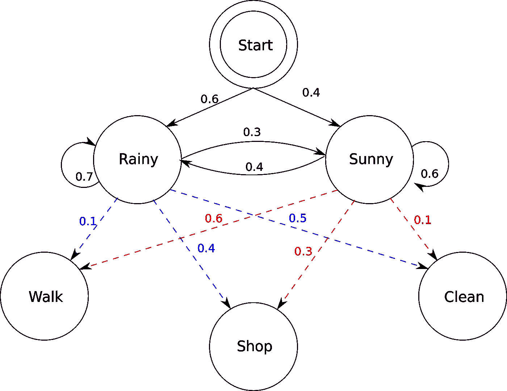
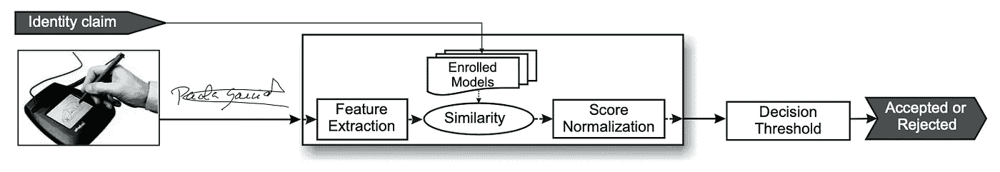
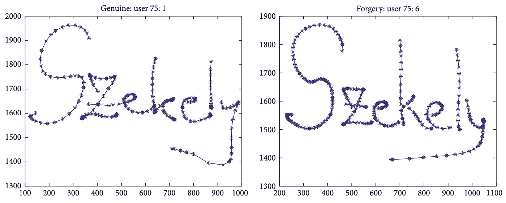
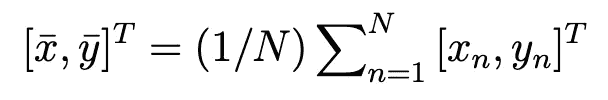
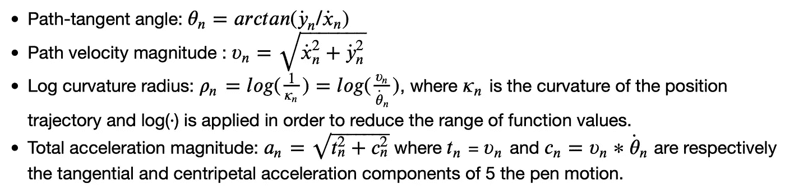
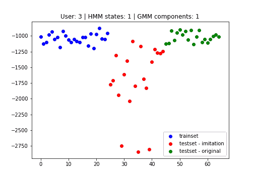
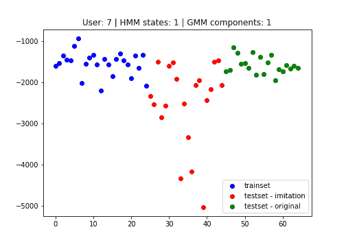
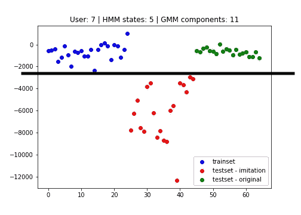

# 基于隐马尔可夫模型的笔迹生物特征识别

> 原文：<https://towardsdatascience.com/biometric-signal-verification-of-handwriting-with-hmms-8808cbd05699?source=collection_archive---------24----------------------->

## 使用 hmmlearn 在 Python 中实现


[数码师](https://pixabay.com/de/users/thedigitalartist-202249/)在 [Pixabay](http://www.pixabay.com) 拍摄的照片

数字签名正在兴起。由于我们中的许多人现在在家工作，许多机密的公司电子邮件需要在线签名。
伊恩古德费罗斯(Ian Goodfellows)发明的生成对抗网络(GAN)展示了如今在数据集上生成虚假数字是多么容易。这实际上只是一小步，也能够生成模仿任何人的笔迹风格的签名。但是那不是很危险吗？

我们能用机器学习来区分原始签名和人工制作的签名吗？我们确实可以！我们甚至不需要那些花哨的神经网络方法，我们可以用**隐马尔可夫模型(HMM)** 完全经典。在这篇文章中，我将展示我们如何结合 HMM 来分类签名是原始的还是模仿的。

这个项目的灵感大致来自朱利安·菲尔兹等人的论文。艾尔。发表于 2007 年，名为:[基于 HMM 的在线签名验证](https://www.sciencedirect.com/science/article/abs/pii/S0167865507002395)。

# 介绍

即使隐马尔可夫模型不是最先进的，正如上面论文的出版日期“2007”已经表明的，它们仍然是每个数据科学家至少应该听说过的基本概念。当你想了解更近期的技术如递归神经网络时，理解 HMM 的工作方式会有启发，因为许多技术都是从 HMM 的基本思想发展而来的。

## **隐马尔可夫模型**

隐马尔可夫模型可以在它们的计算中包括时间相关性。在下面的图 1 中，我们可以看到，从每个状态(雨天、晴天)我们可以来回转换到雨天或晴天，每个状态都有一定的概率在每个时间步长发出三种可能的输出状态(步行、购物、清洁)。总是需要提供开始概率(雨天 60%，晴天 40%)来开始计算链。



图 1 来自[维基百科](https://en.wikipedia.org/wiki/Hidden_Markov_model#/media/File:HMMGraph.svg):隐马尔可夫模型

在我们的情况下，这意味着签名是从左到右，一个字母接一个字母地写。所以时间依赖关系包括笔移动形成一个字母的速度，压力和坐标。所有这些信息都可以考虑在内，以估计签名是由原作者书写还是伪造的可能性有多大。

图 1 表明我们需要预先了解:

*   开始概率(雨天 60%或晴天 40%) **向量**
*   过渡(例如从多雨到多雨 70%) **矩阵**，
*   排放(从雨天到步行 10%、购物 40%或清洁 50%) **矩阵**

请注意，开始概率总计为 100%，对于矩阵转换和发射，每行总计为 100%。

## 高斯混合模型(GMM)

我们需要依赖于时间的数据并从中计算特征，然后我们可以拟合 GMM 来找到我们的 HMM 的参数。当我们有了 HMM 的参数，我们可以计算原始签名和模仿签名的分数。根据分数，我们可以对签名的真实性进行分类评估。

为什么我们首先要使用高斯混合模型来训练 HMM 参数？嗯，基本上 *hmmlearn* 为我们提供了三种选择:

*   GMM-嗯
*   高斯 HMM
*   多项式 HMM

GMM 效果最好，因为估计我们特征的密度很可能不仅仅是单个高斯或单个分布，而是地面实况看起来更像一个山谷，可以通过 GMM 更好地近似。

我们可以利用 GMM 的所谓 EM(期望最大化)算法，让我们自动计算那些隐藏参数。EM 算法期望什么来计算隐藏参数？

> 答案是:**特色**。

GMM 使用 **EM** 算法计算其参数:

*   步骤 e:使用 GMM 参数(均值、方差)的当前估计值计算组件占用概率 P(M|x)
*   步骤 m:使用组件占用概率的当前估计值计算 GMM 参数。

我们必须选择 GMM 的超参数，它们是:

*   m:高斯混合分量
*   学生:嗯，状态(晴天，雨天)

实际上，我们无法知道最佳的超参数集是什么，但是我们可以使用 K-Fold 交叉验证来找出答案。

*等等什么，超参数，HMM 参数？*

> *好的，超参数是我们人类需要选择的值。这也叫模式选择问题。模型参数是 GMM 和 EM 算法为我们计算的参数。*

# 资料组

用于测量这些类型的特征(压力、速度等。)，我们需要一个类似于下图最左侧所示的设备:



图 1 by [1]:提出的在线签名验证系统的体系结构。

我用的是 [*mobisig*](https://ms.sapientia.ro/~manyi/mobisig.html) 数据集。它总共包含 83 个条目(49 个男性，34 个女性)，我们稍后将把它们分成训练集、测试集和模拟集。签名是由 Margit Antal 等人收集的。艾尔。并于 2017 年发表在他们的研究论文中:[**mobi SIG 指画签名语料库上的在线签名验证**](https://www.hindawi.com/journals/misy/2018/3127042/) 。

本文提供了一个签名示例。



图 2 by [2]:来自数据库的伪签名。第一列包含真实签名，第二列包含伪造签名。

可以看出，伪造签名包含了更密集连接的*压力*点。这篇论文解释了伪造是如何产生的。如果你愿意，你可以阅读它，但这篇文章的重点是我们如何检测这种伪造，而不是它是如何产生的。

# 包导入

我将使用 python 的[*HMM learn*](https://hmmlearn.readthedocs.io/en/latest/)*包，这样我就不用从头开始构建 HMM 了。*

*让我们从导入这个项目的默认包开始。我设置了随机种子，所以你会有和我完全一样的情节。*

*文件加载*

*此外，我们希望确保正确地加载数据集，如上面的代码片段所示。数据存储在字典中，每个人有两个条目(“原始”和“模仿”)，每个条目被进一步分成多个签名。此外，所有签名都有几百或几千行带有时间戳 id(以毫秒为单位)。*

# *特征抽出*

*回头看图 1，第一步是特征提取。如果数据点以零为中心并且具有标准化的标准偏差，则拟合高斯，尤其是混合高斯会更加有效和高效。从文献[1]中，我们可以得到以下归一化步骤:*

**

*图 3: 1。步骤:位置标准化*

*接下来，我们在归一化步骤之后提取四个特征。公式(2。步骤)从[3]中获得:*

**

*2.步骤:特征提取*

*规范化步骤 1 显示在代码的函数(第 1–2 行)中。图 3 中的公式只是对所有 x 和 y 求和，然后除以出现次数 n，因此只需取平均值。此外，增加了ε(e =*NP . finfo*)来防止*除以零*的错误。*

*第 2 步中的四个特征非常容易计算。x 和 y 上的点表示使用我们刚刚计算的赋范 x 和 y。除此之外，theta can 的计算与代码第 24 行中的公式完全一样。第 27 行用同样的方法计算路径速度。它只是平方根！*

*特别要注意的是*对数曲率半径*，因为如果你仔细观察，你会发现作者希望θ也被归一化。因此，在计算**ρ**(ρ)**的第 30 行，我们也调用**θ**(θ)上的范数函数。***

***我在代码中把最后一个特性称为 alpha，因为它听起来比 a 更好。它和代码第 33 行中的其他特性一样容易计算。***

*****我将所有的特征添加到它们相应的列表中，因为我们需要将这些特征输入到隐马尔可夫学习函数中。*****

***因此，我们完成了特征提取步骤。现在让我们建立模型。
**哦不！** 我们需要将数据分成训练、测试和模拟数据集。从提到的条目中，我使用前 25 个人作为训练示例，这是防止过度拟合的最小数量，其中一个条目对应于一个人的多个签名。所以列车组包含 25 个不同的人，他们有许多真实和伪造的签名。测试集包含另外 20 个不同的人，验证集(X_val)包含所有模仿的签名。***

```
***X_train: (3940, 8)
X_test: (3140, 8)
X_val: (10338, 8)***
```

***因为我说过所有签名的行长度是不同的，所以我总是需要跟踪当前长度，并将其附加到新的数据帧中。正确编程是相当困难的。在第 51 行，我将特性重命名为特性提取步骤中的名称。***

> ***需要注意的是，我在第 47–49 行调用了特征提取函数来计算特征。***

# ***建立 GMM-HMM 模型***

***为了训练 GMM HMM，我们需要看一下来自 [hmmlearn](https://hmmlearn.readthedocs.io/en/latest/api.html#hmmlearn.hmm.GMMHMM) 的文档。***

***我们需要两个基本变量:***

*   ***transmat(转换矩阵)(雨天，晴天)***
*   ***startprob(开始的初始概率矩阵)(60% 40% —根据 S 的数量( *HMM 状态*))***

***转移矩阵将被参数化，使得它以 50%的概率(0.5)对角填充，除了第一个和最后一个条目。这是 hmmlearn 在文档中建议的。startprob 矩阵也是如此，我从 hmmlearn 中选择了默认的初始化。***

***特征变量 **X_train** 现在包含一个时间戳和每行七个特征:***

*   ***x 和 Y 位置***
*   ***压力***
*   ***四个提取的特征***

***现在我们可以在下面代码的第 20 行创建模型。成分的数量和混合的数量在模拟签名的估计有多好方面起着重要的作用，但是正如已经说过的，我们无法知道最佳值是什么。因此，我尝试了不同的组合。让我们来看看这两个超参数是如何相互对抗的。***

***第 35、39 和 43 行中的 score 函数计算三个不同集合的分数。这些分数由 GMM 的目标函数计算得出，即**负对数似然**。***

***好了，让我们用不同的分量值和 GMM 值调用 fit_hmm 函数:***

***绘制 gif 图***

> ***当我们拥有一组分数不同于或低于原始签名(蓝色或绿色)的模仿签名时，我们称之为成功。***

******

***由我用 Matplotlib 创建:用户 3***

******

***由我用 Matplotlib 创建:用户 7***

***我们可以看到，HMM 状态的数量对分数的影响最大。我们希望分数尽可能将红点(模仿)与原始蓝点和绿点分开。七个或更少的 HMM 状态似乎很好地将红点从其余的中分离出来，并且 GMM 分量显然对输出的影响很小。***

# ***估价***

***如果我们在彩色点之间画一条线性分类线，***

******

***如果签名是假的，请分类***

***我们可以看到 HMM 能够多好地检测签名是否是伪造的。例如，我们将阈值设置为-2200，然后对新的签名进行评分。如果分数的值小于-2200，我们认为它是假的，如果分数大于-2200，我们认为它是原始签名。***

## ***延长***

***我们现在可以做的是保存分数，并训练例如逻辑回归来预测概率(0-100%)，基于签名是否是原始的分数**。**这个逻辑回归可以用 *sklearn* 的准确度分数进一步扩展，以估计模型的不确定性。***

# ***结论***

***成功！我们可以成功地区分模仿签名和原始签名。一些也映射时间约束的最新方法是递归神经网络。但是现在，我们看到这也可以用非常经典的方法实现，比如 HMM。***

***要了解更多信息，你可以访问我的[网站](https://timloehr.me/)，并在我链接的社交媒体中添加我。如果你在这篇博文上给我鼓掌，我会很高兴的:)。***

# ***参考***

***[1] Julian Fierrez 等人。艾尔。、 [HMM-based 在线签名验证:特征提取和签名建模](https://www.sciencedirect.com/science/article/abs/pii/S0167865507002395) (2007)、[科学直接](http://www.sciencedirect.com)
【2】马吉特·安塔尔、拉斯洛·佐尔特·绍博和图·NDE·托尔戴**、** [在 MOBISIG 手指绘制签名语料库上的在线签名验证](https://www.hindawi.com/journals/misy/2018/3127042/) (2017)、[欣达维](http://www.hindawi.com)
【3】朱利安·菲尔雷兹等。艾尔。，[基于局部和全局信息融合的在线签名验证系统](https://link.springer.com/chapter/10.1007/11527923_54) (2005)， [Springer](https://link.springer.com/)***

***这篇博文基于从弗里德里希·亚历山大大学埃尔兰根-纽伦堡的课程模式分析中获得的知识。我使用了 Christian Riess 博士演讲的部分内容来说明这篇文章的例子。所以所有权利归克里斯汀·里斯博士所有。***