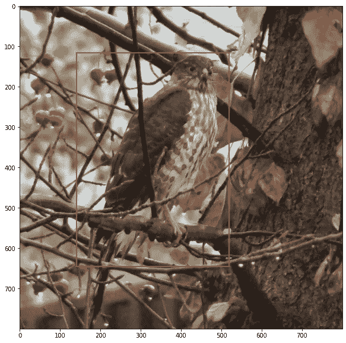
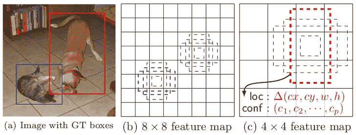
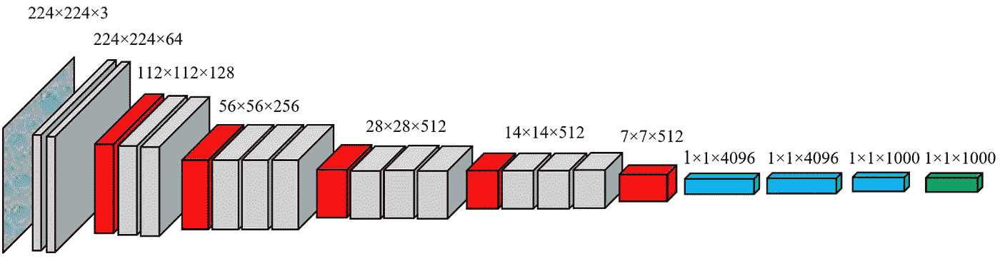
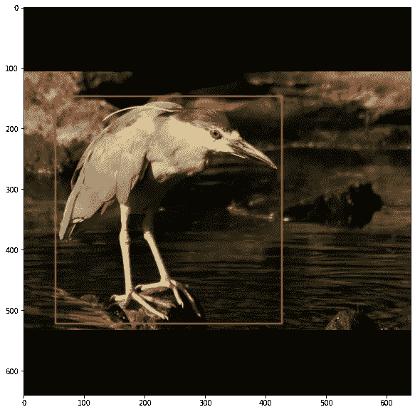
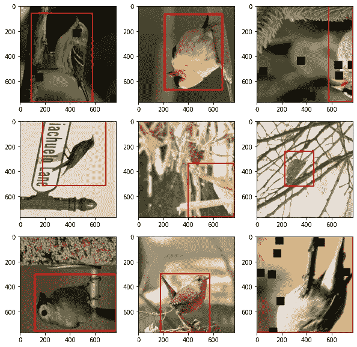
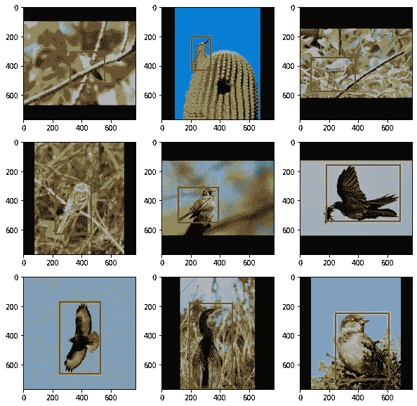
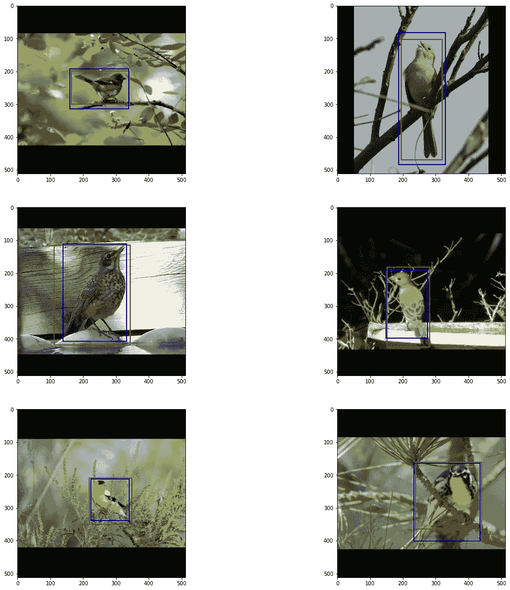
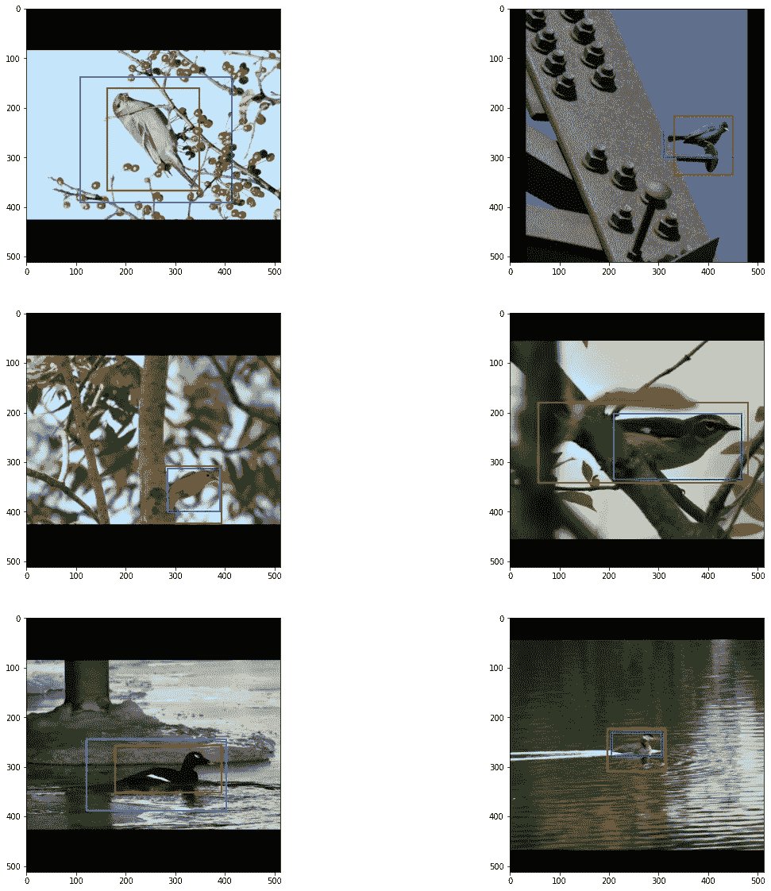
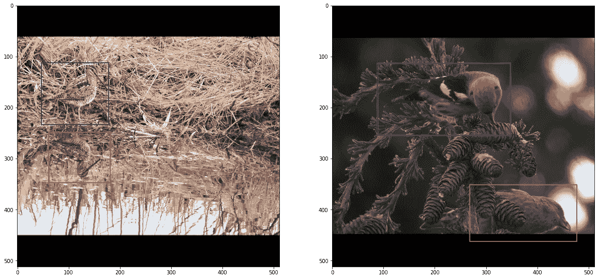

# 鸟箱

> 原文：<https://towardsdatascience.com/bird-box-1d31bad4c9c7?source=collection_archive---------33----------------------->

## 用康奈尔大学的 NABirds 数据预测包围盒。

这是我上一篇关于使用由[康奈尔鸟类学实验室](https://www.birds.cornell.edu/home)提供的[鸟](https://dl.allaboutbirds.org/nabirds)数据集进行图像分类的[文章的续篇。在本文中，我超越了简单的分类，考虑**对象检测**，这可能更好地称为图像或对象定位。我不仅试图确定某个对象是否在给定的图片中，即检测组件中，而且还试图找出该对象在图像中的位置。](/this-model-is-for-the-birds-6d55060d9074)

尽管我有自己的观点，但物体检测是文献中普遍使用的术语，我将遵循惯例。

关于 NABirds 数据的详细讨论可以在前面的文章中找到；我在这里仅仅回顾一下重点。有 48562 张图片，大致均匀地分布在 404 种鸟类的训练集和验证集之间。除了图像之外，还有大量的元数据，包括男性/女性、青少年/成人和其他适当颜色变化的几个分类和注释级别。最终结果是最细的 555 个类别。在最粗略的层次上，有 22 个类别，这在这里会更有意思。在任何层面上，数据都远未达到平衡；有些种类很常见，有些极其罕见。

这个项目的目标是双重的。首先，我只想预测图像中包含一只鸟的边界框。只有一个检测类 bird，模型必须找到鸟在图片中的位置。第二个任务是定位这只鸟，并预测它属于 22 个顶级类别中的哪一个，这大致对应于分类学中的**目**。下面列出了按常用名称描述字母顺序排列的类别以及图像数量。请注意，占所有鸟类一半以上的栖息鸟类是迄今为止最大的群体。敏锐的博物学家也会注意到，鸻形目(即滨鸟)被分成几个类别。

# **边界框**

每个图像只有一个带标签的鸟和一个包含它的边界框。边界框是一个小矩形，包含模型正在搜索的图像中的对象以及尽可能少的其他内容。有三种方法来标记边界框，都涉及四个坐标。最简单的就是用盒子的左上角和右下角的坐标。(按照惯例，图像的左上角是(0，0)，右上角是(宽度，高度))。或者，右下角可以替换为框的高度和宽度。第三种，也是数值上更稳定的，系统使用高度和宽度，但是用盒子的中心替换左上角。所有这三种方法都被对象检测网络用作输入，但是在训练神经网络时，大多数都转换为第三种系统。

带边框的闪亮鹰。从纳伯德的数据集中。

上图就是一个很好的例子。包围盒完全包围了这只闪亮的鹰，除了它的部分尾巴(尾巴在包围动物时很棘手)。盒子几乎尽可能的紧，同时仍然封闭整个动物。在我们的三种符号方案中，盒子将被编码如下:

1.  左上，右下= (141，115)，(519，646)。
2.  左上，宽度，高度= (141，115)，378，531。
3.  中心，宽度，高度= (330，380.5)，378，531。

在实践中，坐标通常被缩放为宽度和高度的百分比(即在 0 和 1 之间)。还通常使用盒子高度和宽度的对数标度变换，因为预测大盒子尺寸的小误差没有预测小盒子尺寸的小误差严重。

原则上，图像可以包含任意数量的包围盒，包围任意数量的不同类别的对象。我很幸运，NABirds 中的每个图像只有一个盒子。这对训练几乎没有影响，但是会使模型的评估稍微简单一些。

# **物体探测网络**

用于对象检测的神经网络建立在用于图像分类的神经网络的基本架构上。图像分类网络由卷积层、跳过连接、初始层(一种层内分形层架构)、池层、批量标准化、丢弃和挤压激励组件的惊人复杂组合组成，但最终层很简单。全局平均池(GAP)层将最终张量折叠为单个特征向量，可选的批量归一化和丢弃层提供正则化，最终的密集层通常激活 softmax，提供最终分类。可以说，用于图像分类的神经网络只是一个复杂的特征提取器，然后是逻辑回归，间隙层标志着转变点。大多数对象检测网络的工作方式是从间隙层开始移除网络的顶部，并用更复杂的东西来替换它。

这涉及到锚盒。这些框中的每一个都以图像中的某个点为中心，并且具有图像的某个分数的高度和宽度。通常，有一个给定大小的锚框网格覆盖整个图像。全套锚盒是不同分辨率网格的集合；方框越大，网格点越少。如果锚定框与给定类的输入边界框的重叠足够大，则锚定框是该类的正锚定框。如果重叠过小，锚点就是负锚点，这些边界之间的任何内容都将被忽略。这种重叠的典型度量是 IoU(交集除以并集，听起来就是这样:两个框的重叠面积除以它们的组合面积)。典型的界限是正的 IoU > 0.7，负的 IoU < 0.3。

在执行 GAP 之前，最终的输出张量可以被视为特征向量的网格，每个特征向量预测图像的一小部分中对象的存在。一个非常简单(有点太简单)的对象检测模型可以只将一个分类层附加到网格中的每个向量，以及输出四个框坐标的第二个层。然后，可以使用损失函数来训练模型，该损失函数是 softmax 分类器和盒子坐标(通常是中心、宽度和高度，以保证数值稳定性)上的 MSE 回归损失之和。

如我所说，这有点太简单了，但也不算太简单。上述模型将对应于锚盒的最粗糙级别，因为 GAP 之前的最终张量具有比原始图像小得多的宽度和高度。在旧的 VGG16 网络的情况下，224x224 图像在最终处理之前离开 7x7x512 盒。我只能检测到 49 个可能的边界框，每个框对应一个 32×32 的子图像，这些子图像是通过将原始图像分割成 7×7 的网格而得到的。在实践中，我需要能够以多种分辨率搜索数千个可能的盒子中心。

维基共享资源

我可以通过使用网络的早期层来引入更好的分辨率。在这种情况下，我有 14x14 和 28x28 个网格可用。由于这些要素在网络中处于较早的位置，因此包含的信息较少，但我可以通过对较晚的要素进行向上采样并将结果添加回来来解决这个问题。每一层都对应于一个锚盒网格。对于现代对象检测模型来说，这仍然有点太简单了，现代对象检测模型学习各种分辨率层之间的复杂关系。在神经网络的最佳传统中，组合分辨率层的层本身可以堆叠在一起，以形成更丰富的特征。

可堆叠在一起的要素池图层示例。(谭明星、庞若明、郭诉乐)

在我有一个好的物体检测网络之前，有三个更重要的，虽然简单得多的改变必须被做。首先，softmax 必须在所有分类点被 sigmoid 替换。Softmax 并不真正处理任何对象的缺失，这将是大多数锚点最常见的输出，因此必须独立预测每个类的存在或缺失。第二，分类和回归损失在不同的尺度上；必须添加一个加权因子，以便两个响应都得到很好的训练。根据型号不同，class_loss + 10 * box_loss 或者 class_loss + 50 * box_loss 效果会很好。第三个，也可能是最简单的，是让每个锚定框中心对应于不同纵横比的多个锚定框。

# 效率检测

EfficientNet 系列网络的基本前提是，三个主要网络参数(层数、图像分辨率和每层过滤器)之间的简单关系可用于轻松生成一系列不同大小的图像分类模型，从适用于智能手机的小型模型到最先进精度所需的大型模型。EfficientDet 将相同的原理扩展到对象检测模型。基本高效网络主干以上述方式用作特征提取器。不同的分辨率级别由一系列双向特征金字塔网络(BiFPN)进一步处理，而不是在末端有一个间隙层。BiFPN 层的数量以及每层的信道数量随着主干网络的规模而增加。最后是几个卷积层，然后是分类和盒预测。

由于我在之前的项目中使用了 EfficientNet，EfficientDet 似乎是这个项目的自然选择。这带来了一些挑战。当我开始工作时，用 Colab 运行 EfficientDet 的唯一可行的选择是基于 PyTorch 的。(Tensorflow 已经发布了他们自己的实现)。到目前为止，我所有的工作都是在 Tensorflow 中完成的。学习在新环境中工作总是一个挑战，但我不介意。在 PyTorch 工作的真正缺点是我不能在 Colab 上使用 TPU。由于只能求助于 GPU，我被迫缩减了我可以比较的不同型号的数量。到目前为止，我只运行了 D0 到 D2，每个都有默认的输入大小。对象检测通常使用比简单分类更大的图像，这意味着批量大小必须更小，因此学习率必须更小。我只能对模型使用 4 的批量大小。初始学习率被设置为 0.0002，并且在验证损失没有改善的每个时期之后下降一半。我给了模型最多 100 个历元的训练选项，但通常发现我可以在 50 个历元时停止。

# 预处理

与所有图像处理神经网络一样，对象检测非常依赖于良好的图像预处理。大多数重要的预处理操作都涉及到变换，如移动和缩放，它们对边界框的影响和对图像的影响一样大。幸运的是，有一个软件包[albuminations](https://albumentations.ai/docs/)可以处理这个问题。我不知道 albumentations 应该是什么(如果有的话)(看起来拼写检查器也同样被难住了),但这个包包含的函数可以确保在图像分割问题的情况下，应用于图像的任何变换也可以应用于相关的边界框和/或图像遮罩。

NABirds 图像有各种大小，其高度和宽度的上限为 1024。大约一半的人一边的长度是 1024，另一边的长度在 600 到 900 之间。批处理需要固定的输入大小。这对于训练数据来说很容易，因为我从图像中随机截取了一个正方形，但是对于验证来说有点复杂。因为我不想因为裁剪验证图像而丢失任何信息，所以我改为重新调整尺寸，使较长的尺寸与输入尺寸相匹配，然后填充较小的尺寸，直到图像变成正方形。

D1 网络的示例验证图像。较长的维度已被重新调整为 640，较小的维度已被填充。Albumentations 已经调整了边界框坐标，以便它仍然覆盖鸟。原始数据来自纳伯德数据集

下面列出了我对训练数据使用的一组转换。

第一个操作是从原始图像中随机选取一个矩形裁剪，其大小介于完整图像和 10%之间，长宽比介于 4:3 和 3:4 之间，并将其重新调整为适当大小的正方形。我总是使用我正在使用的 EfficientDet 网络的默认输入大小。

第二阶段改变色调或亮度，但不是两者都改变，有 90%的可能性(即，十次中有一次它什么也不做)。第三阶段将图像转换为 1%的灰度。接下来的三个操作是沿垂直轴、水平轴和对角线轴翻转，每个操作有 50%的概率。抠图会用零替换图像中的一些小方块；它的功能类似于后续层的辍学。下面是由这些转换产生的训练图像的示例。

NABirds 数据集的原始数据

眼尖的读者会注意到，所有这些图像都包含边界框，尽管在一种情况下，框现在是完整的图像。如果随机裁剪根本不包含盒子会怎么样？很简单，我再试一次。预处理代码进行了多达 100 次尝试，以产生一个带有边界框的裁剪，然后返回到一个更简单的缺省值，该值仅在整个图像上执行调整大小操作。

我的验证转换如下。

所有这一切都是用零填充图像，直到我得到一个正方形，然后调整大小以适应模型。它的杰作如下。

NABirds 数据集的原始数据

# 培养

PyTorch 没有 Tensorflow 可用的 Keras 前端，这意味着训练模型需要更多的手动工作。关键的想法仍然相当简单。对于每批训练数据，向前传播以获得当前预测，然后向后传播以更新参数。我使用的完整的`Fitter`类对于本文来说有太多的样板代码，但是我可以分享训练一个纪元的循环。

在每个训练时期之后，类似的循环执行验证。如果新参数是一个改进，则保存该模型。

# 确认

对象检测验证不是一件简单的事情。与为每个类别生成一个概率的图像分类不同，对象检测为输出中的每个类别和锚定框生成一个单独的概率和边界框。这是一个很大的数字。其中大部分可以简单地通过阈值处理而被容易地丢弃，即，如果某个锚中某个类别的分数足够低，我们可以毫不犹豫地丢弃它。实际上，大多数锚定框中的所有类别以及所有锚定框中的大多数类别都是这种情况。这仍然存在多个边界框被标记为正 id 的可能性。如果肯定的类别与真实的类别不匹配，那么就存在明显的错误分类，但是如果类别匹配，那么也有必要考虑边界框的准确性。

如上所述，对象检测模型依赖于锚盒。在模型被训练之后，这些锚点中的每一个都有一个输出。大多数都可以被忽略，因为它们的置信度很低。也有可能两个(或更多)相邻的锚会为同一个类产生正输出。在这种情况下，边界框将非常相似，并且只需要保存一个，即具有最高置信度得分的那个。**非最大抑制**是去除冗余包围盒的标准算法。

直到现在，我才能着手将模型的输出与地面事实进行比较。我有一些优势，因为我知道每张图片只有一个边界框；我可以通过仅考虑具有最高置信度的预测边界框来进行评估。用于测量准确性的指标专门处理精度和召回，因此我必须定义对象检测的真阳性、假阳性和假阴性。

1.  True Positive —预测的类别与实际相符，并且 IoU 大于某个阈值。
2.  假阳性—预测的类别与实际相符，但 IoU 低于阈值。
3.  假阴性-预测的类别与实际情况不符，或者没有预测到任何类别。

精确度是真阳性与所有预测阳性的比率，而召回率是真阳性与真实结果的比率。通俗地说，精确度是准确的真实预测的百分比，召回是被识别的肯定类别的百分比。

通过计算各种 IoU 阈值(0.5 和 0.75 是常见的)下的精度，并在 IoU 阈值范围(通常为 0.5 至 0.95，增量为 0.05)内平均精度(看似多余的命名为平均精度)，来评估对象检测模型。)可以为召回计算类似的度量。

**单类检测**

我的两个问题中比较简单的一个就是找到图像中哪里有一只鸟，并返回包含它的盒子。我尝试了三种不同的模型，在 EfficientDet 系列中从 D0 到 D2，使用具有最高置信度得分的边界框作为预测。我只允许 0.5 以上的信心分；一些图像足以混淆模型，没有边界框满足该阈值，因此有一些假阴性。

假阳性更有意思。作为一个衡量标准，IoU 必须戴几顶不同的帽子。它说预测框必须覆盖一定量的基本事实框，而且基本事实框必须覆盖一定量的预测框。低 IoU 可能意味着模型在图像的错误部分检测到了鸟，但也可能意味着模型找到了鸟，但不够精确(即，盒子太大。)通常，假阳性将是检测到鸟的情况，并且将在边界框中，但是预测的坐标不够好。

直觉上，0.5 的借据分数似乎有点低。值得看一些例子，看看不同的 IoU 阈值是什么样的。记住，图像是二维的。当不止一个维度同时发生变化时，我们的大脑很难识别面积或体积何时会翻倍。让我们看看 IoU=0.8 在现实生活中意味着什么。

六幅图像，带有实际值(蓝色)和预测值(红色)边界框，IoU 约为 0.8。NABirds 数据集的原始数据

任何看到这些图片的人可能会猜测重叠度超过 90%，但实际上在所有情况下都略低于 80%。这表明 0.8，对于许多度量标准来说被认为是一个平庸的值，对于边界框来说并不是那么糟糕。同样值得注意的是，预测的盒子往往比“地面真相”更好人类注释者有其局限性。

即使欠条只有区区 0.5 英镑，在这些人看来也没什么问题。

about 0.5 左右。蓝色表示地面真相，红色表示预测。NABirds 数据集的原始数据

这两个示例都使用了来自 EfficientDetD0 的预测。随着我从 D0 增加到 D2，精度略有提高。

使用 0.5 的 IoU 作为阈值，模型具有近乎完美的精度。只有在少数情况下，预测的边界框不会与地面真实充分重叠。即使在 0.75 的较高阈值下，预测和地面实况至少十之八九匹配。平均精度是指 IoU 阈值在 0.5 至 0.95 之间时的平均精度，它略低，因为 IoU=0.9 以上的精度急剧下降。

平均召回率也接近完美，因为只有几百张图像没有任何置信度得分至少为 0.5 的边界框。

仅从指标来看，这些模型似乎表现良好。随着模型大小的增加，精确度会适度但持续地增加。从产出来看，我认为模型甚至可能比数字显示的更好。在许多情况下，预测的边界框明显优于人类标注的地面真实。在其他情况下，预测的盒子太大，只是因为模型假设鸟在树枝后面延伸，这是一种很常见的情况。在一个滑稽的例子中，预测的边界框没有覆盖地面真相，因为它捕捉到了鸟的反射(回想起来，在训练中允许垂直翻转可能是不明智的)。在另一个例子中，预测框找到了注释者遗漏的第二只鸟。我认为，如果地面真相标签更干净一点，模型的表现会更好。

检测到鸟反射(左)和第二只鸟(右)。NABirds 数据集的原始数据

**多类检测**

在康奈尔大学数据集中有 22 个顶级类别，每个类别对应于鸟类的一个目或科，每个类别都有共同的名称。添加类别检测使对象检测模型的分类(是什么)组件变得复杂，但是对单独的定位(在哪里)组件影响较小。因为我已经将肯定类的数量从 1 增加到 22，所以我需要降低我认为预测分数是肯定匹配的阈值。除了最高分(每张图片一个边界框)之外，我仍然放弃所有东西，所以我可以将相对较低的 0.1 分作为正面预测。

我怎么挑了 0.1？随机猜测会给我不到 0.05；我把它翻了一倍，认为两次随机的信心得分不会偶然发生。结果很好，所以我坚持了下来。

不足为奇的是，不同类别之间的准确度或多或少地与类别中图像的数量成正比。因为我在训练中没有试图均衡数据，所以图像总数为两位数的六个班级在它们之间的三个模型中得到了两个正 id。同时，栖息鸟类占 97–98%。一个令人满意的结果是，在 300 到 1000 张图片的订单中，增加模型大小可能会产生巨大的影响。真正的阳性率可能上升 10-20%(军舰鸟的阳性率更高)。全部真阳性结果如下。

多类对象检测问题中的标准过程是通过对所有类的精度进行平均来计算平均精度。鉴于类别不平衡的程度，我认为计算整个数据集的“未加权”平均精度是有益的。这当然会给我比标准加权精度更大的数字。我认为这两个数据点都有一定的价值。

请记住，当预测的顺序与基础事实相匹配，但预测和基础事实框的 IoU 太低时，就会出现误报。

正如所料，精度比单类检测器的精度低，并且随着模型的增加而缓慢增加，这也是所料。加权(即标准)平均精度要低得多，但也比未加权的度量以更快的速度增加。这反映了这样一个事实，即对于中等规模的班级来说，准确率显著提高。两组模型的 IoU 值分布非常相似；几乎所有精度的下降都反映了该模型现在必须区分 22 个订单。

**进一步的工作**

任何好的实验都为新问题打开了大门。在这种情况下，我可以想到几个。假设我可以保持足够高的批量大小(即找到使用 TPU 的方法),增加模型大小超过 D2 会如何影响准确性？我用 D3 做了一个实验，但是被迫将已经很小的批量减少了一半。最终结果是较低的召回和精度分数回落到 D0 水平。由于我没有做其他的改变，看起来这完全是因为批量的原因。

我一直怀疑较大的模型需要较低的学习率。D3 和更高版本在学习率更低的情况下会更好吗？

如果我使用全部 404 个物种，甚至全部 555 个类别，而不是 22 个类别，会发生什么？我所看到的关于物体检测的一切都表明，它不能轻松处理像图像分类那样多的类别。反正还没有。

也许对上述算法最有用的测试是在一些其他的鸟类数据集上进行，比如在各种非自然主义者的数据集中的鸟类。

## 参考

[1]格兰特·范·霍恩、史蒂夫·布兰森、瑞安·法雷尔、斯科特·哈伯、杰西·巴里、帕诺斯·伊皮罗蒂斯、彼得罗·佩罗娜和塞尔日·贝-朗吉。与公民科学家一起构建鸟类识别应用程序和大规模数据集:细粒度数据集集合中的小字。2015 年 *CVPR* 。

[2]谭明星、庞若明和郭诉乐。EfficientDet:可扩展且高效的对象检测。2020 年 IEEE 计算机视觉和模式识别会议录。