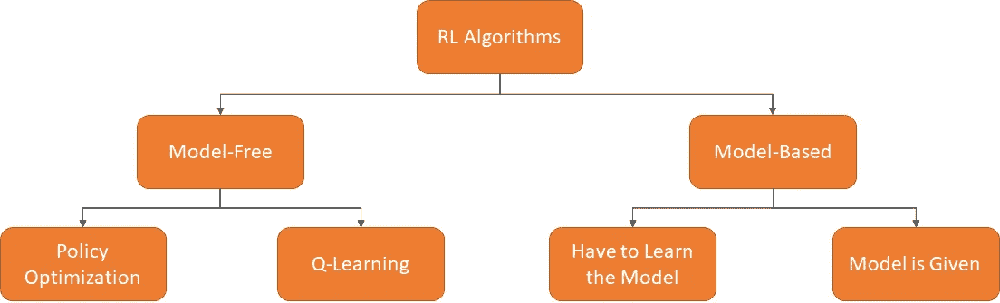
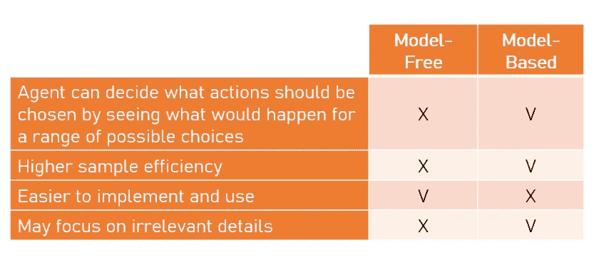
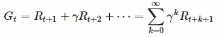
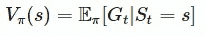
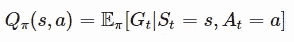
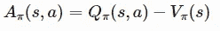
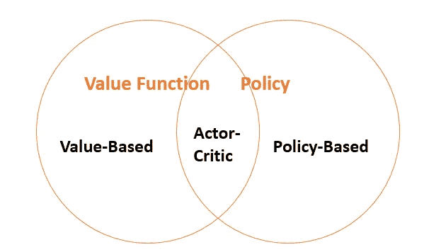
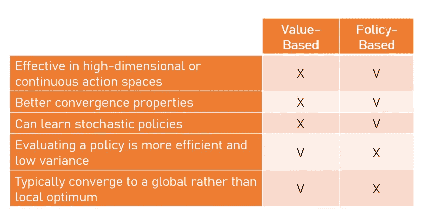
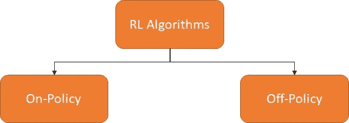

# 强化学习算法分类的鸟瞰图

> 原文：<https://towardsdatascience.com/birds-eye-view-of-reinforcement-learning-algorithms-landscape-2aba7840211c?source=collection_archive---------28----------------------->

## “邀请所有有志 RL 从业者”系列第 3 集

在 [Unsplash](https://unsplash.com?utm_source=medium&utm_medium=referral) 上由[伊尼基·德尔·奥尔莫](https://unsplash.com/@inakihxz?utm_source=medium&utm_medium=referral)拍摄的照片

在本系列的[第一部分中，我们已经了解了强化学习(RL)中的一些重要术语和概念。在第二部](/invitation-to-all-aspiring-reinforcement-learning-practitioner-5f87384cee67)的[中，我们还学习了 RL 是如何应用在自主赛车上的。](/reinforcement-learning-in-autonomous-race-car-c25822def9f8)

> 在本文中，我们将了解强化学习算法的分类。我们不仅会学习一个分类法，还会从许多不同的角度学习几个分类法。

在我们熟悉了分类法之后，我们将在以后的章节中学习更多关于每个分支的知识。不浪费更多的时间，让我们深呼吸，做一杯巧克力，我邀请你和我一起学习 RL 算法分类的鸟瞰图！

照片由[美国传统巧克力](https://unsplash.com/@americanheritagechocolate?utm_source=medium&utm_medium=referral)在 [Unsplash](https://unsplash.com?utm_source=medium&utm_medium=referral) 上拍摄

# 无模型与基于模型

无模型分类法与基于模型分类法。[图片由作者提供，转载自 OpenAI Spinning Up]

对 RL 算法进行分类的一种方式是询问代理是否可以访问环境的模型。换句话说，通过询问我们是否能确切地知道环境将如何对我们的代理人的行动作出反应。

基于这个观点，我们有两个 RL 算法分支:无模型的和基于模型的:

*   **基于模型的**是 RL 算法的一个分支，它试图根据学习到的环境模型来选择最佳策略。
*   在**无模型**算法中，基于代理经历的试错法选择最优策略。

无模型算法和基于模型的算法都有各自的优缺点，如下表所示。

无模型算法和基于模型算法的优缺点。[图片由作者提供]

> 事实:无模型方法比基于模型的方法更受欢迎。

# 基于价值与基于政策

对 RL 算法进行分类的另一种方式是通过考虑算法优化了什么组件——值函数还是策略。

> 在我们深入探讨之前，让我们先了解一下政策和价值函数。

## 政策

策略π是从状态 *s* 到动作 *a，*的映射，其中π( *a|s* )是当处于状态 *s.* 时采取动作 *a* 的概率。策略可以是确定性的，也可以是随机的。

马库斯·沃利斯在 [Unsplash](https://unsplash.com?utm_source=medium&utm_medium=referral) 上拍摄的照片

让我们想象一下，我和你在玩石头剪刀布的游戏。如果你不知道这个游戏是什么，这是一个非常简单的游戏，两个人通过同时执行三个动作(石头/布/剪刀)中的一个向对方竞争。规则很简单:

*   剪刀打败了布
*   石头打败剪刀
*   纸打败了石头

考虑*迭代*石头剪子布的策略

*   确定性策略很容易被利用——如果你选择“石头”的频率高于其他选择，并且我意识到了你的行为，那么我就可以利用这一点，这样我就有更大的概率获胜。
*   一致随机策略是最优的——如果你的行为完全是随机的，那么我不知道应该采取什么行动才能打败你。

## 价值函数

价值函数是一个基于对未来回报的预测或称为**回报**来衡量一个状态有多好的函数。基本上，回报(Gt)是从时间 t 开始的“贴现”回报的总和。

，其中 *γ* ∈ [0，1]为折现因子。贴现因子旨在惩罚未来的奖励，原因有几个:

1.  在数学方面很方便
2.  打破状态转换图中的无限循环
3.  未来回报的不确定性更高(即股票价格变动)
4.  未来的回报不会带来直接的好处(也就是说，人们倾向于在今天而不是 10 年后享受快乐)

我们现在知道什么是回报了。我们来定义一下价值函数的数学形式！

价值函数有两种形式:

*   **状态-价值函数**(通常称为价值函数)是一个状态在时间 *t:* 的期望收益

*   **状态-行为价值函数**(通常称为 Q 值)是一个状态-行为对在时间 *t:* 的期望收益

Q 值与值函数的区别是动作**优势**函数(通常称为 A 值):

好了，我们已经学习了什么是价值函数和行为状态价值函数。现在，我们准备学习更多关于 RL 算法的另一个分支，该分支专注于算法优化的组件。

基于值和基于策略的算法。[图片由作者提供，转载自大卫·西尔弗的 RL 课程]

*   **基于价值的** RL 旨在学习价值/动作-价值函数，以便生成最佳策略(即，最佳策略是隐式生成的)。
*   **基于策略** RL 旨在使用参数化函数直接学习策略。
*   **演员兼评论家** RL 旨在学习价值函数和政策。

下表列出了基于价值和基于策略的方法的优缺点。

基于值和基于策略的算法的优缺点。[图片由作者提供]

1.  **基于值的**算法必须挑选*最大化*动作-状态值函数的动作，如果动作空间非常高维甚至是连续的，代价会很大，而**基于策略的**算法通过直接调整策略的参数来工作，不需要做*最大化*计算。
2.  **基于值的**算法如果以“错误的方式”做事，可能会振荡/颤动/发散(更差的收敛特性/不太稳定)，而**基于策略的**算法更稳定，具有更好的收敛特性，因为它们只对策略梯度做很小的增量改变。
3.  **基于策略的**算法可以学习确定性和随机性策略，而**基于值的**算法只能学习确定性策略。
4.  与基于值的算法相比，简单的基于策略的算法可能更慢，并且方差更大。**基于值的方法**试图挑选*最大化*动作-状态值函数的动作，该动作-状态值函数将朝着最佳策略(更快和更低的方差)的方向改进策略，而基于策略的方法只是迈出一小步，并朝着更稳定的方向平滑更新，但同时效率较低，有时会导致更高的方差。
5.  基于策略的方法通常收敛于局部最优，而不是全局最优。

# 符合政策与不符合政策

还有另一种分类 RL 算法的方法。这次分类是基于策略的来源。

策略内与策略外算法。[图片由作者提供]

我们可以说被归类为 **on-policy** 的算法是在工作中学习的*。*“换句话说，算法试图从π采样的经验中学习策略π。

而被归类为**非策略**的算法是通过*监视某人来工作的算法。*“换句话说，算法试图从μ采样的经验中学习策略π。例如，机器人通过观察另一个人的行为来学习如何操作。

# 最后的话

乔丹·沃兹尼亚克在 [Unsplash](https://unsplash.com?utm_source=medium&utm_medium=referral) 上的照片

恭喜你坚持到这一步！！

阅读完本文后，您应该已经知道 RL 算法是如何基于几种观点进行分类的。在未来的几集里，我们会学到更多关于基于值和基于策略的算法。

请记住，我们的 RL 之旅仍处于早期阶段！我还有很多材料要和大家分享。所以，如果你喜欢这些内容，并想在接下来的两个月里继续和我一起学习，请关注我的媒体账号，以获得关于我未来帖子的通知！

# 关于作者

Louis Owen 是一名数据科学爱好者，他总是渴望获得新知识。他获得了最后一年的全额奖学金，在印尼顶尖大学 [*万隆技术学院*](https://www.itb.ac.id/) 攻读数学专业。最近，2020 年 7 月，他刚刚以优异的成绩毕业。

Louis 曾在多个行业领域担任分析/机器学习实习生，包括 OTA ( [*Traveloka*](https://www.linkedin.com/company/traveloka-com/) )、电子商务( [*Tokopedia*](https://www.linkedin.com/company/pt--tokopedia/) )、fin tech([*Do-it*](https://www.linkedin.com/company/doitglotech/))、智慧城市 App ( [*Qlue 智慧城市*](https://www.linkedin.com/company/qluesmartcity/) )，目前在 [*世界银行*](https://www.linkedin.com/company/the-world-bank/) 担任数据科学顾问

查看路易斯的网站，了解更多关于他的信息！最后，如果您有任何疑问或任何要讨论的话题，请通过 [LinkedIn](https://www.linkedin.com/in/louisowen/) 联系路易斯。

# 参考

[https://donnie . id/posts/on-policies-in-reinforcement-learning-algorithms-and-AWS-deepracer/](https://donnie.id/posts/on-policies-in-reinforcement-learning-algorithms-and-aws-deepracer/)

[https://spinningup.openai.com/en/latest/spinningup/rl_intro2.html](https://spinningup.openai.com/en/latest/spinningup/rl_intro2.html)

[https://www.davidsilver.uk/wp-content/uploads/2020/03/pg.pdf](https://www.davidsilver.uk/wp-content/uploads/2020/03/pg.pdf)

[https://www.youtube.com/watch?v=bRfUxQs6xIM & list=PLqYmG7hTraZBKeNJ-JE_eyJHZ7XgBoAyb & index=6](https://www.youtube.com/watch?v=bRfUxQs6xIM&list=PLqYmG7hTraZBKeNJ-JE_eyJHZ7XgBoAyb&index=6)