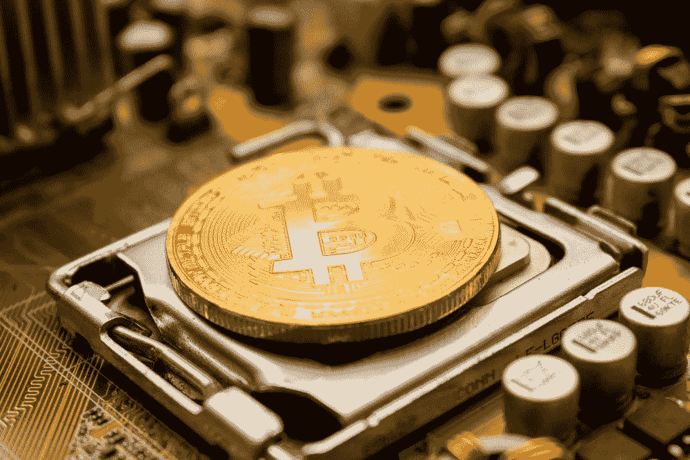

# 比特币减半是一个毫无意义的里程碑

> 原文：<https://towardsdatascience.com/bitcoins-halving-is-a-meaningless-milestone-b94c616e138b?source=collection_archive---------40----------------------->

## 不要相信吹捧不存在的“供应减少”的专家

照片:[德米特里·德米季科](https://unsplash.com/@wildbook)

比特币期待已久的减半于今天早些时候发生，其背景是加密货币的忠实追随者们真正的狂喜。有[倒计时](https://www.bitcoinblockhalf.com/)、[直播视频事件](https://www.youtube.com/watch?v=oO58m_38oII)和“[当月亮](https://www.reddit.com/r/Bitcoin/comments/ghjh8s/itcoin_halving_rocket_party_site_says_itll_be/)时”的圣歌它破解了[主流新闻](https://www.bbc.com/news/business-52628034)，被视为[密码](https://www.coindesk.com/what-to-watch-at-consensus-distributed-bitcoin-halving)中最大的事件。减半使得地球上几乎每一个比特币拥有者都热情地进行价格预测，并在网上发布。

所有这一切绝对是疯狂的。更糟糕的是，它建立在一个谎言之上，或者至少是比特币的主要支持者有目的的误导，他们应该更清楚这一点。

> 如今的比特币数量(18，375，000)与减半前的昨天一样多

让我们回忆一下减半实际上做了什么。很简单:它将比特币矿工的大宗奖励减半，从 12.5 新 BTC 降至 6.25。这极大地改变了采矿业的经济状况，降低了采矿业的利润。一些矿工[可能会完全停止](https://cointelegraph.com/news/btc-miners-expect-bitcoin-price-to-surpass-12k-after-reward-halving)，损害比特币的[散列率](https://www.buybitcoinworldwide.com/mining/hash-rate/)。

仅此而已。这就是减半所做的一切。它降低了新 BTC 产生的速度。这绝对无助于改变加密货币的实际供应量。不幸的是，大多数专家和比特币支持者都在宣扬相反的观点。让我们一点一点解构这种误导。

# 减半并没有减少 BTC 的供应量

比特币减半的典型故事是这样的:

*   每隔四年，比特币的供应量就会减半
*   供给减少，但需求不变，比特币的价格只能暴涨；因为相同数量的购买者购买更少数量的硬币
*   价格怎么可能*不*暴涨？毕竟，这是继比特币历史上的每一次减半之后的又一次。

希望这种叙述中明显的误导现在已经很清楚了。“供给”一词有多种含义，比特币社区中有太多的人在暗示*绝对*供给——即流通中的比特币数量——正在下降。这不是真的。如今的比特币数量(18，375，000)与减半前的昨天一样多。实际上，这个数字还在继续增加。它只是以较慢的速度这样做。

对“供应”的普遍误解对加密货币社区关于减半的想法产生了巨大的影响。真正的后果是我在上面列出的:矿工经济学、杂凑利率——相对来说是技术性的，很难看好比特币的价格。这是一个非常无聊的故事。

相反，比特币社区更喜欢事件的扭曲版本，即减半以某种方式改变了加密货币的基本供求。考虑到 BTC 的供应量不会发生任何变化，这就需要一种巨大的精神体操。然而，许多比特币“有影响力的人”正在完成一项可疑的任务，试图证明炒作的合理性:

拥有比特币社区最大追随者的 Pomp，真的通过屠杀经济在这里以身作则。

Pomp 把*新的*比特币日供应量(每天开采的极小数量的比特币)与比特币的绝对日供应量(即在任何一天有多少人希望卖出 BTC)混为一谈。如果你与比特币的日常需求(即，在任何一天有多少买家希望购买比特币)进行比较，后一个定义是唯一有意义的定义，但 Pomp 将两者完全混淆了。

上面的白色趋势线跟踪了一个非常流行的完全假设的“股票到流量”模型，该模型跟踪了 BTC 明显不可避免的涨到 100 万美元。正如你所看到的，这个模型的关键特征是比特币价格如何在减半时每四年“跳”一次。

神秘的是，BTC 价格并没有遵循这位理论家精心编造的霓虹绿趋势线，也没有在“明天这个时候”突破 10000 美元。

# 当需求增加时，价格就会上涨

这并不是说减半没有影响。真的会影响比特币矿工的底线。但很奇怪的是，这被视为一个看涨事件或加密货币的里程碑——如果有什么不同的话，矿工因缺乏利润而停止运营的风险可能会威胁到比特币的[工作证明安全性](https://medium.com/@nic__carter/its-the-settlement-assurances-stupid-5dcd1c3f4e41)。任何兜售减半将导致 BTC 价格飙升的“经济”证据的人，都应该受到高度怀疑。

> 减半无非是一个预先设定好的事件，让采矿变得更加困难

另一方面，围绕减半的纯粹数量和炒作也有可能产生自己的影响。所有狂热的预期和报道(包括主流新闻来源，这是罕见的)可能会驱使新一代买家购买闪亮的加密货币钱包，寻求在比特币火箭船预定的起飞前成为其中一员。这些买家是在不成熟的理论和不可靠的经济背景下被引进的，但最终 BTC 需求的任何显著增长都会提高其价格。

然而，尽管这种增长无疑可以归因于减半的数学魔力及其不存在的供应冲击，但真正的答案恰恰相反。比特币的供应量将保持不变，而推高价格的是不断增加的*需求*。

对于比特币来说，这是一个可悲又无趣的事实。尽管如此多的人通过减少供应来寻求“不可避免的”价格上涨的安全性，但这实际上并没有反映比特币的工作方式或 Satoshi 的设想。

减半只不过是一个预先设定好的事件，目的是让开采变得更加困难，并使比特币产量曲线变平。如果 BTC 最终真的“无所事事”，那将是因为对该资产的需求激增，而非矿业利润减少。

如果你对加密和区块链的影响感兴趣，你会喜欢我的新出版物[技术统治](https://technocracy.substack.com/)。我会定期写一些关于技术如何改变社会的文章，比如我最近的一篇关于冠状病毒如何让大规模监控成为我们的新常态的文章。