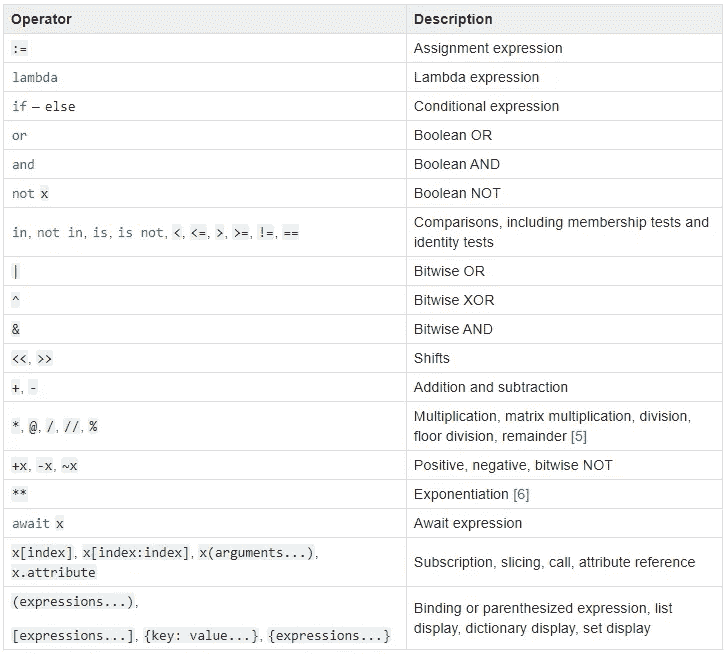

# Pandas 中的按位运算符和链接比较

> 原文：<https://towardsdatascience.com/bitwise-operators-and-chaining-comparisons-in-pandas-d3a559487525?source=collection_archive---------18----------------------->

## Pandas 中的比较链接和运算符优先级的重要性

在学习熊猫的时候，很自然会有使用 Python 的布尔运算符(`and`、`or`等)的倾向。)来链接条件，因为在 Python 中就是这样做的。然而，这些不是我们应该在 Pandas(或 NumPy)中使用的操作符。让我解释一下为什么…


图片来自 [Unsplash](https://unsplash.com/photos/xrVDYZRGdw4)

在 Python 中，链接比较非常简单:

```
x = 4
x==4 and x%2==0
True
```

这里我们只是检查`x`是否等于`4`*以及是否为偶数。同样，我们可以将多个条件链接在一起，如下所示:*

```
*b = 'random string'
x==4 and x%2==0 and b.endswith('ing')
True*
```

*这是因为我们正在比较布尔值(`True`或`False`)或[true/falsy](https://docs.python.org/3/library/stdtypes.html#truth-value-testing)*值(计算为`True`或`False`的值)，对于上面的例子，这些值产生了一个表达式`True and True and True`。**

## **比较布尔数组**

**然而，一个常见的错误是认为这同样适用于布尔值数组，这是应用一些比较的结果。例如:**

```
**x = np.array([2,4,6])
x%2==0 and x!=3
ValueError: The truth value of an array with more than one element is ambiguous. Use a.any() or a.all()**
```

**正如你所看到的，上面产生了一个`ValueError`。这种情况下发生了什么变化？不同之处在于，我们不再比较布尔值，因为`x%2==0`产生:**

```
**array([ True, True, True])**
```

**这显然既不是`True`也不是`False`。Python 通过错误告诉我们，我们需要对结果应用聚合函数来消除歧义，`a.any()`或`a.all()`。这样做会将数组缩减为一个值:**

```
**(x%2==0).any()
True**
```

**现在可以将其与另一个布尔值进行比较。**

## **按位运算符**

**当我们处理一个数组或一个 Pandas DataFrame 列，并希望**基于一个以上的比较**进行过滤时，我们将需要计算基于元素的操作，在本例中，**基于逻辑元素的** **操作**。**

**我们已经讨论了 python 的布尔操作符为什么不是我们想要的，因为它们要求被比较的项可以被评估为`True`或`False`。对于基于逻辑元素的操作，我们应该使用 python 的按位操作符[](https://wiki.python.org/moin/BitwiseOperators)****<<****>>****&****|****~**和 **^.******

****您可以将 python 的按位运算符视为布尔运算符，但它是基于元素应用的(在布尔数组上):****

```
****x%2==0
array([ True, True, True])x==4
array([False, True, False])(x%2==0) & (x==4)
array([False, True, False])****
```

****所以在这里，我们在两个结果布尔向量之间应用了一个**按位 AND**(**&**)**，这产生了另一个形状相同的数组，该数组是通过对其元素应用逐元素操作而得到的。******

******Python 对于所有布尔运算符以及下面列出的其他运算符都有一个等价的按位运算符:******

*   ******`x & y`做一个“按位`AND`”。如果`x`和`y`的对应位为`1`，则输出的每一位为`1`，否则为`0`。******
*   ******`x | y` 做一个“按位`OR`”。如果`x`和`y`的对应位为 0，则输出的每一位为`0`，否则为`1`。******
*   ******`~x`返回`x` ( `NOT`)的补码——通过切换每个`1`得到一个`0`，每个`0`得到一个`1`。这个和`-x-1`一样。******
*   ******`x ^ y`做“按位异或”(`XOR`)。如果`y`中的位是`0`，则输出的每一位与 x 中对应的位相同，如果`y`中的位是`1`，则输出的每一位是`x`中位的补码。******

******我们还有按位移位操作符`>>`和`<<`(见这里的)。******

## ******运算符优先级******

******回到上面的例子，需要考虑的一个重要方面是，使用按位运算符**时，括号很重要！********

******这是因为按位运算符**比比较运算符**具有更高的优先级，这意味着按位运算将在比较运算的之前**。********

******在 Python 文档的*表达式*部分，在 [*运算符优先级*](https://docs.python.org/3/reference/expressions.html#operator-precedence) *，*下，我们将找到一个包含所有 Python 运算符优先级的表格，从最低优先级(最少绑定)到最高优先级(最多绑定):******

************

******图片来自 [python 文档](https://docs.python.org/3/reference/expressions.html#operator-precedence)******

******为了更清楚地理解上述内容，假设我们有一个包含乘法运算符( ***** )和幂运算符( ****** )的表达式:******

```
******3*2**2
12******
```

******由于取幂运算符的优先级更高(看它是如何出现在表中较低位置的)，python 会先对`2**2`求值，也就是`4`，然后是`3*4=12`。如果我们想给乘法一个更高的优先级，我们必须把表达式括起来:******

```
******(3*2)**2
36******
```

******在这种情况下，我们如何写数学表达式。******

******现在，这同样适用于按位运算符。由于`==`的优先级比`&`低，我们需要用括号括起比较表达式，以便首先对它们求值:******

```
******(x%2==0) & (x==4)******
```

## ******链式运算符比较******

******另一个常见的错误，是试图将连锁运营商视为:******

```
******x = np.array([2,4,6])1<x<10
ValueError: The truth value of an array with more than one element is ambiguous. Use a.any() or a.all()******
```

******NumPy(或 Pandas)不支持这一点，它会产生一个`ValueError`。这里的问题是，Python 在内部将上述内容转化为:******

```
******(1 < x) and (x > 10)******
```

******这又把我们带到了与上例相同的错误:`and`隐式调用`bool`，而`NumPy`只允许隐式强制为单个元素的布尔值(不是带有`size>1`的数组)，因为带有许多值的布尔数组既不计算`True`也不计算`False`。******

******实际上在 PEP 535 中已经提出要实现这一点，尽管它仍然被推迟了。******

******在接下来的帖子中，我将讨论熊猫中更高级的比较操作，并回顾一些需要记住的有用提示。******

******非常感谢你花时间阅读这篇文章，希望你喜欢:)******