# 黑狗黑猫综合症——神话还是现实？

> 原文：<https://towardsdatascience.com/black-dog-and-black-cat-syndrome-myth-or-reality-819dc4e616f1?source=collection_archive---------15----------------------->

## 收容所被收养的猫和狗的颜色统计。为什么黑色动物会被收养者忽视

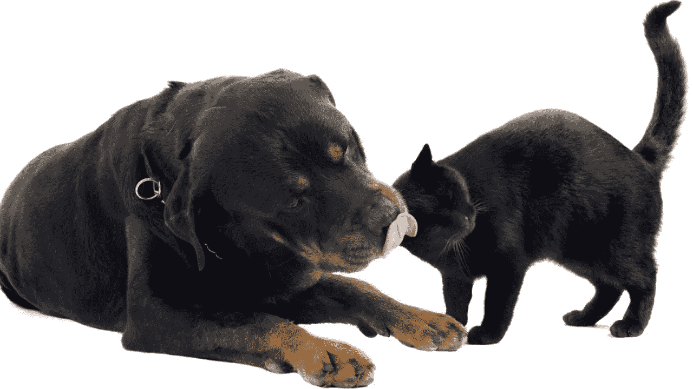

黑狗和黑猫

## 介绍

黑猫和黑狗综合症是由美国防止虐待动物协会(ASPCA)在 21 世纪初建立的。这被描述为一种现象，深色皮毛的宠物大部分时间被收养者忽视，而喜欢浅色皮毛的动物。它的发生通常是由于人们的信仰、迷信和联想。黑狗，尤其是大狗，通常在电影、书籍和其他媒体中被描绘成令人恐惧和好斗的形象。黑猫还被一种不同的迷信所包围，并与巫术联系在一起。总的来说，社会将黑色与邪恶和厄运联系在一起。

## 主要问题:黑猫和狗会被动物收容所忽视吗？

## 数据

这两个数据集:[动物摄入量](https://data.austintexas.gov/Health-and-Community-Services/Austin-Animal-Center-Intakes/wter-evkm)和[动物结果](https://data.austintexas.gov/Health-and-Community-Services/Austin-Animal-Center-Outcomes/9t4d-g238)取自 data.austintexas.gov[奥斯丁动物收容所网站](https://data.austintexas.gov/)

动物摄入量数据集有 115，612 个条目和 12 个特征

动物结果数据集有 115，778 个条目和 12 个特征

我开始清理数据，删除对我的观察不重要的特征。我还从数据集中排除了其他动物类型。在探索性分析过程中，我筛选出了猫狗中最受欢迎的 24 种毛色，以便进一步探索和比较。

我把我的发现绘制在一个反图上，以观察进入收容所和被收容所收养的猫和狗的数量和百分比。

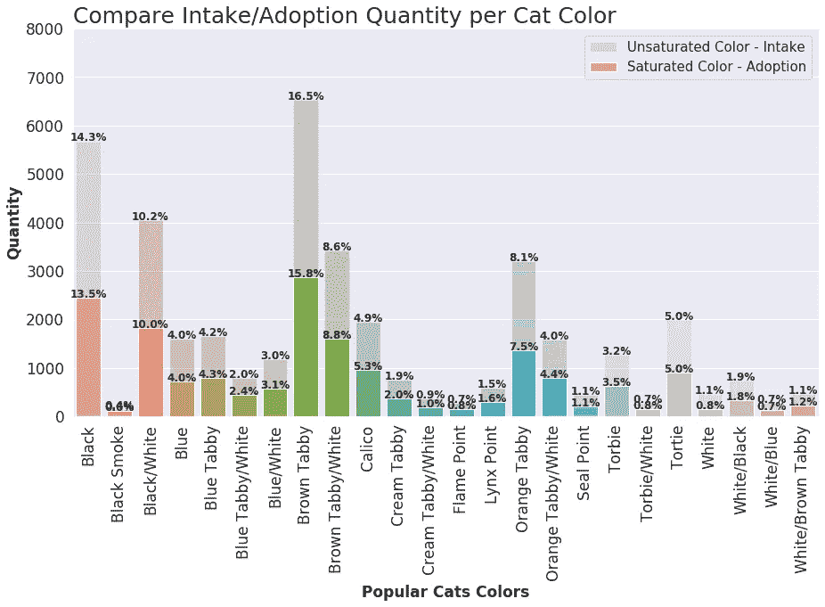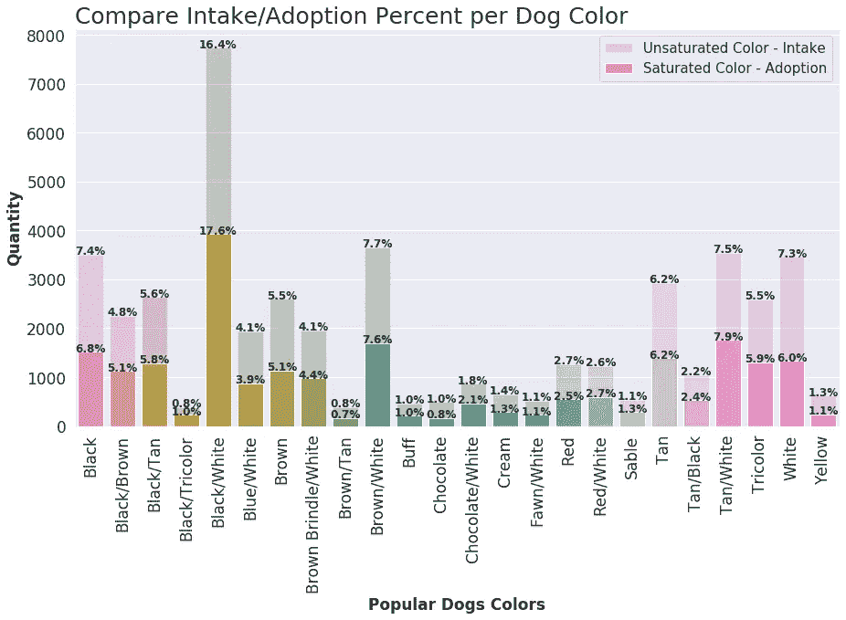

计数图，按颜色比较摄入和收养动物的百分比

正如预期的那样，在两种情况下都显示动物摄入多于产出。此外，最常见的猫颜色摄入是棕色平纹和黑色，最常见的狗颜色摄入是黑色/白色和棕色/白色。黑色的狗以 20%的摄入量排在第四位.

## 颜色重要吗？

为了了解收养是否真的取决于动物的颜色，我进行了卡方检验。p 值接近于零的极低测试表明，收养猫和狗非常依赖于皮毛颜色。

下一步是通过颜色找出平均被收养的猫和狗的百分比。

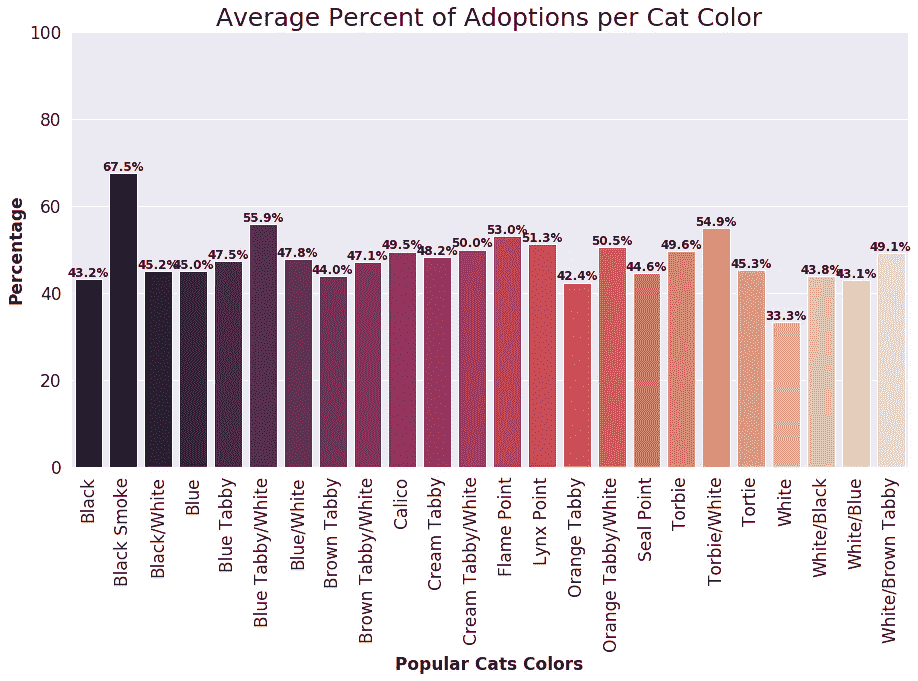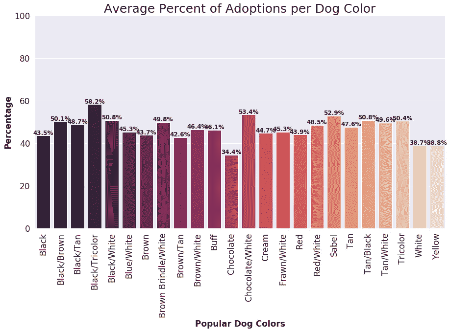

条形图显示每种动物颜色的收养百分比

上面的柱状图表明，黑猫和狗分别被平均 43.2%和 43.5%的人收养。对黑色动物来说还不错，考虑到这一比例高于其他一些动物的颜色，如猫的白色(33.3%)和狗的巧克力色(34.4%)

## 黑狗黑猫欣赏日

黑猫和黑狗赞赏日创办于 2013–2014 年，它们背后都有不同的令人心碎的故事。主要想法是突出和欣赏黑色的动物，并鼓励人们收养它们。美国的大多数收容所和动物中心开始通过收取收养费和给收养者提供一些福利来推广黑色宠物。为了增加对黑色宠物的收养，促销活动在 7 月至 8 月举行，因为黑猫的欣赏日是在 8 月 17 日，黑狗的欣赏日是在 10 月，因为黑狗的欣赏日是 10 月 1 日。

## 推广黑宠物真的增加了黑宠物被收养的数量吗？

对于这个观察，我只过滤了黑色的动物，并使用棒棒糖图来可视化每月的收养数量。

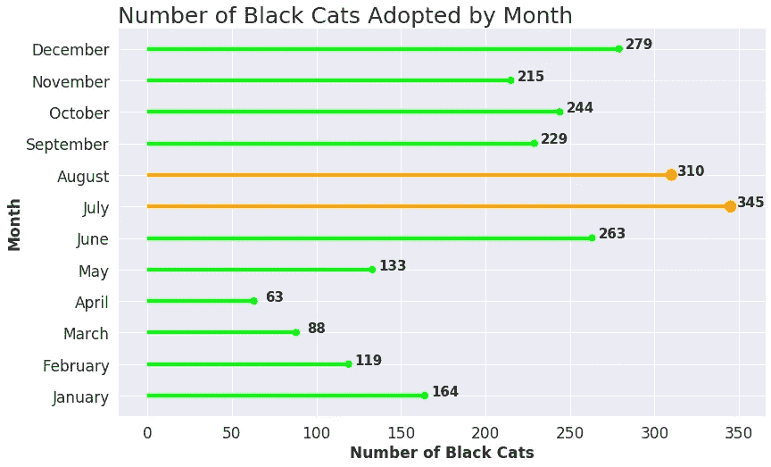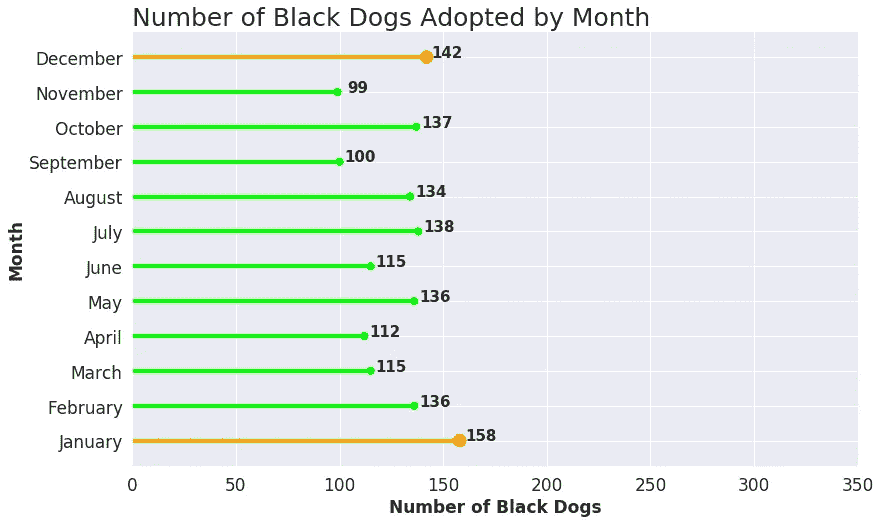

棒棒糖计划查看每月收养黑人动物的数量

看起来对猫的促销确实增加了黑猫在七月和八月被收养的数量，但是对黑狗的促销并不影响它们被收养的数量。另一个有趣的趋势是季节性采用。大多数猫在夏天被收养，狗在冬天被收养。

## 进一步探索

由于收容所对黑色动物的推广，自 2013 年以来，黑猫和狗的收养率有所增加。此外，黑色宠物的摄入量在 2013 年至 2019 年期间有所下降。

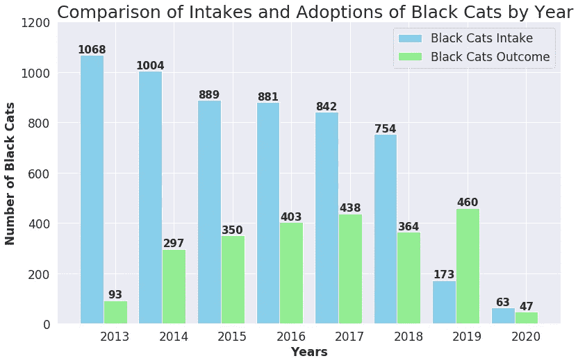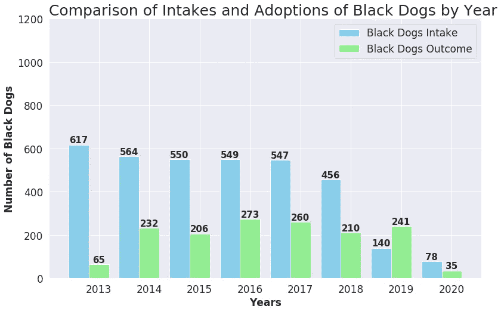

条形图显示每年黑人动物的摄入量和收养量

## 狗和猫在通过颜色被收养之前花了多少时间

下图显示，平均而言，动物在被收养前在收容所的时间不会超过一年，然而，也有很多异常值。我们可以看到狗中有更多的离群者，这是因为狗比猫有更难的收养过程。

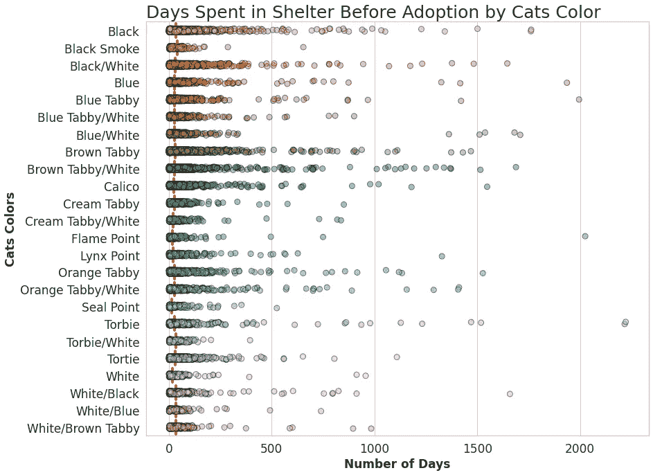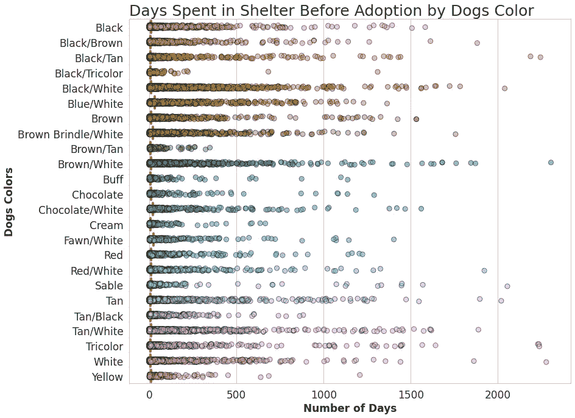

用动物的颜色显示收养前在收容所度过的日子

## 最后

总结我的观察和数据分析，我可以得出这样的结论:黑猫和狗很难被收养，而且几乎总是被忽视。人们倾向于收养皮毛颜色更浅更亮的动物。黑猫和黑狗综合症是真实的，然而，这是在不久前。

目前的数据分析显示，由于促销活动和人们接受教育，黑狗和黑猫与任何其他颜色的狗和猫一样友好、可爱、忠诚，因此几乎 45%的黑色宠物被收养。

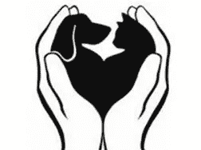

欣赏所有动物

注意:

这个项目是作为数据科学课程的一部分为 Lambda School(Bloom Technology now)完成的。

链接到源代码:

[Github 知识库黑猫和黑狗综合症分析](https://github.com/tigju/Black-Cats-And-Black-Dogs-Syndrome/blob/master/Black_Cats_and_Black_Dogs_Syndrome_Analysis.ipynb)