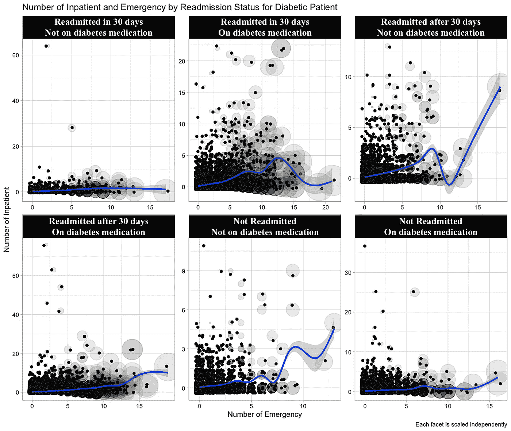
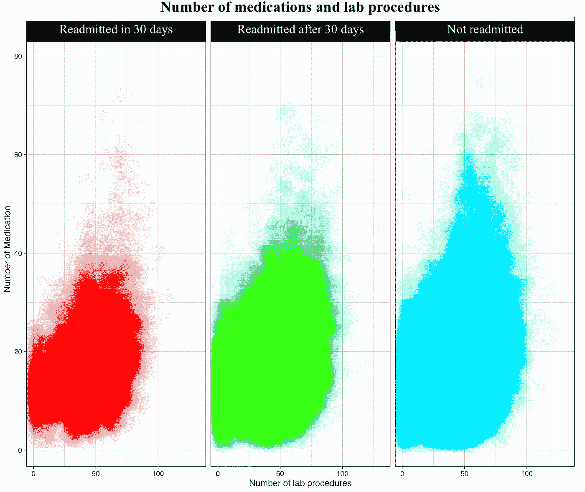
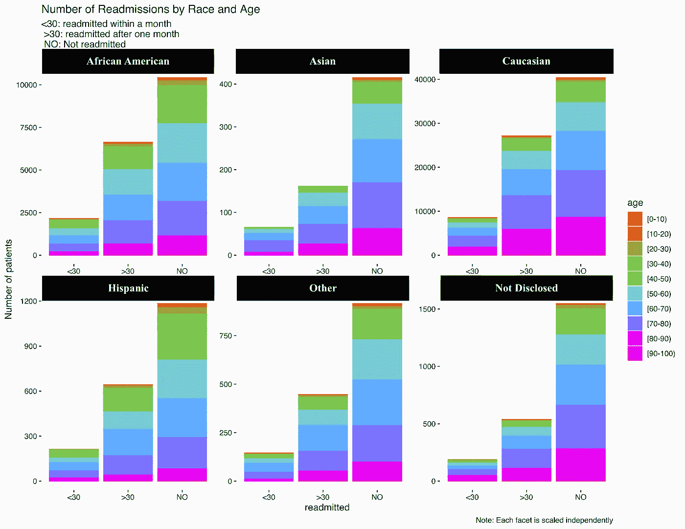
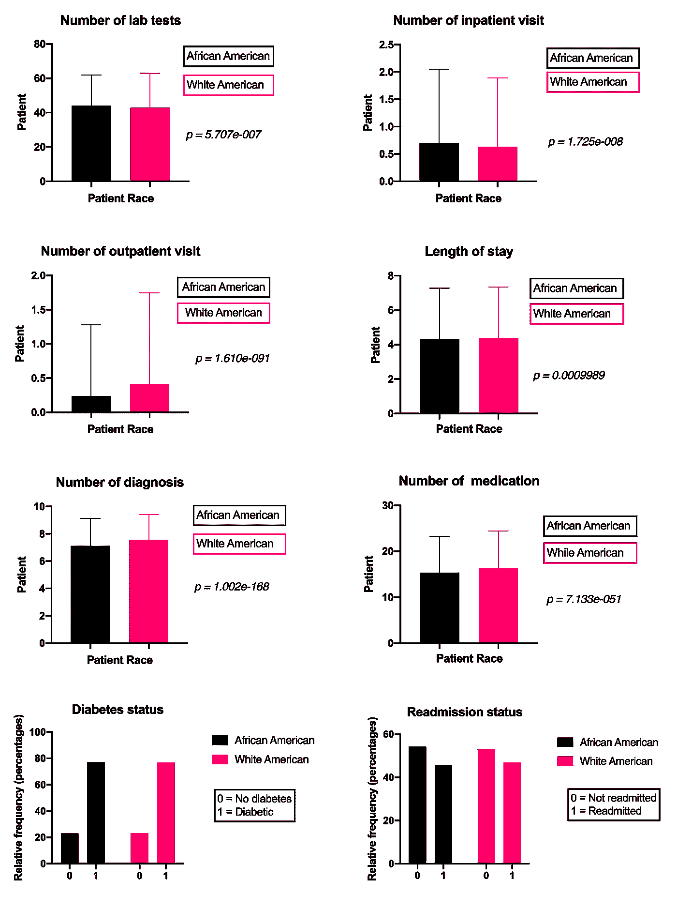
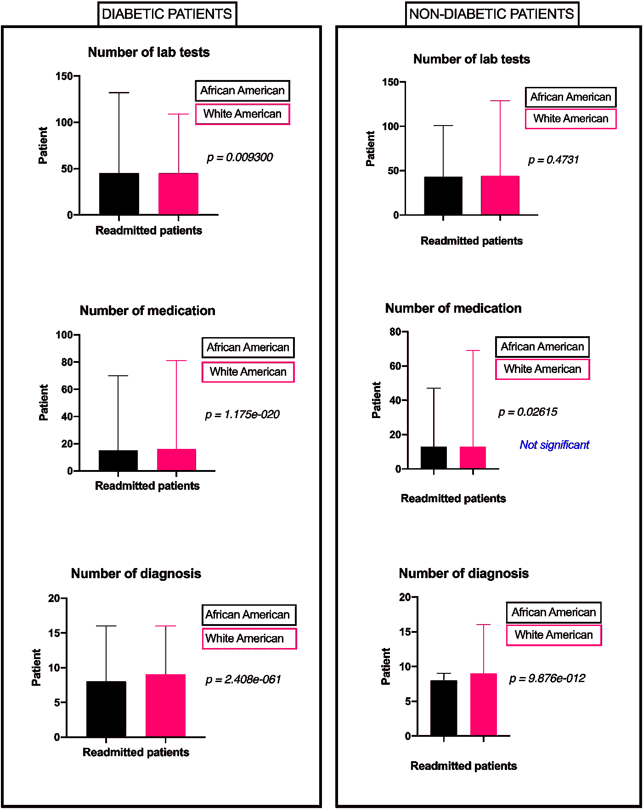
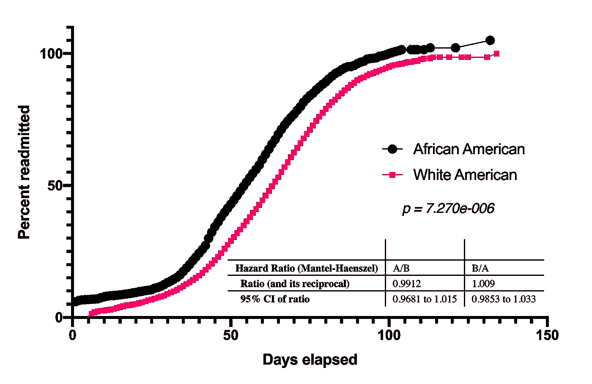

# 黑人的生命也很重要

> 原文：<https://towardsdatascience.com/black-lives-also-matters-4f8ae03ede17?source=collection_archive---------54----------------------->

## 不幸的现实

# 很难相信，但是…

医疗保健中的种族差异被很好地记录下来，防止它们仍然是一个全国性的问题。医疗保健中的种族差异极大地导致了不利的患者健康结果。根据国家健康科学中心的数据，尽管美国的健康水平和死亡率有了显著的提高，但是白种人和黑种人之间的健康差距在 1950 年仍然很大。


由[马库斯·斯皮斯克](https://unsplash.com/@markusspiske?utm_source=medium&utm_medium=referral)在 [Unsplash](https://unsplash.com?utm_source=medium&utm_medium=referral) 上拍摄的照片

在男性中，死亡率的种族差异随着时间的推移有所增加。美国国家健康科学中心也报告说，美国黑人患有多种疾病，其后果比美国白人更糟糕。

> 黑人女性比白人女性更不容易患乳腺癌。然而，他们死于这种疾病的可能性要高出 40%[1]。

健康差异包括几个因素，如社会经济地位。属于高社会经济地位的人群通常拥有更好的健康状况。然而，社会经济地位并不能完全证明种族健康差异的合理性，这种差异甚至在高收入群体中也持续存在。

> 根据 2012 年全国医疗保健差异报告，在 191 项指标中，有 43%的指标显示，具有可比 SES 和保险的黑人患者比白人患者获得的护理质量更差[1]。

# 更多证据

1.  一项研究分析了 100 多万名患有类似呼吸系统疾病的儿童的临床访问，报告称，与白人儿童相比，黑人儿童获得的抗生素较少[1]。

2.在美国进行的另一项全国性研究表明，失去一根手指的黑人儿童断指再植的可能性是白人儿童的一半[1]。

3.根据对 800，000 份出院记录的回顾，患有外周动脉疾病的黑人患者比白人患者有 77%的机会截肢[1]。

4.与白人女性相比，接受乳腺癌化疗的黑人女性更倾向于非标准治疗方案[1]。

# 因糖尿病和循环系统疾病入院的黑人和白人患者的再入院率有差异吗？

## 回答:是的

```
ggplot(readmission, 
 aes(x= number_inpatient,
 y=number_emergency))+
 geom_point(alpha=1/10,size=number_inpatient)+ 
 geom_jitter()+ geom_smooth() +
 facet_wrap(readmitted~diabetesMed, scales = “free” )+
 labs(y=”Number of Inpatient”, 
 x=”Number of Emergency”,
 title = “Number of Inpatient and Emergency by Readmission Status for Diabetic Patient”,
 caption=”Each facet is scaled independently”)+
 theme_light()
```

# 视觉叙事



作者照片

```
ggplot(readmission, 
 aes(y= num_medications,
 x=num_lab_procedures, color=readmitted))+
 scale_color_discrete()+ 
 geom_point(alpha=1/100,size=number_diagnoses)+ 
 geom_jitter(alpha=1/40)+
 facet_wrap(~readmitted)+
 labs(y=”Number of Medication”, 
 x=”Number of lab procedures”,
 title = “Number of medications and lab procedures”)+
 theme_dark()
```



作者照片

```
ggplot(readmission, aes(x=readmitted, color=age ))+ 
 geom_histogram( stat = “count”, aes(fill=age))+
 facet_wrap(~race,scales = “free”)+ scale_color_discrete()+
 labs(y=”Number of patients”, 
 title = “Number of Readmissions by Race and Age”,
 subtitle = “<30: readmitted within a month \n >30: readmitted after one month \n NO: Not readmitted “, 
 caption = “Note: Each facet is scaled independently”)
```



作者照片

分析显示，总体而言，患有类似疾病的美国黑人和白人患者受到了不同的对待。如下图所示，所有因素，如“实验室检查次数”、“住院患者就诊次数”、“门诊患者就诊次数”、“住院时间”、“诊断次数”、“药物治疗次数”都有显著差异。



作者照片(使用的软件:PRISM9)

如下所示，详细的分析还表明，与糖尿病黑人患者相比，糖尿病白人患者接受了更多的药物治疗和诊断测试。对于非糖尿病患者，美国白人接受了更多的实验室检查和诊断程序。然而，非糖尿病黑人和白人患者接受的药物治疗数量相似。



作者照片(使用的软件:PRISM9)

下面的分析表明，美国黑人比美国白人更有可能被重新接纳。



作者照片(使用的软件:PRISM9)

# 参考

[1]乔因特·柯，奥拉夫·EJ，贾·阿克。按种族和医疗场所划分的医疗保险受益人的 30 天再入院率。 *JAMA。* 2011 年；305(7):675–681.doi:10.1001/jama