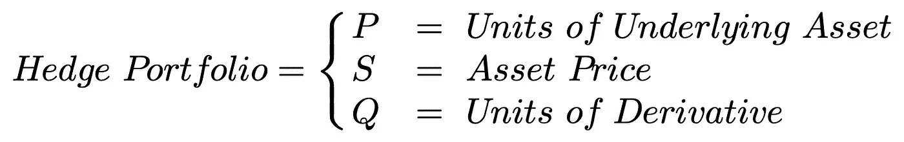
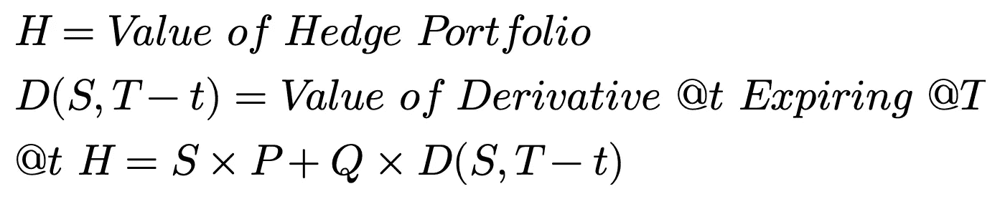
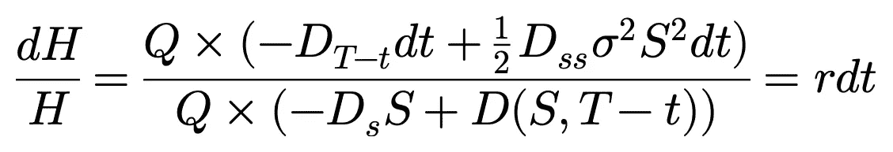
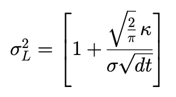

# 布莱克-斯科尔斯期权定价是错误的

> 原文：<https://towardsdatascience.com/black-scholes-option-pricing-is-wrong-b62cd13baf42?source=collection_archive---------47----------------------->

## 理论、假设、问题和从业者的解决方案

照片由[像素](https://www.pexels.com/photo/accounting-administration-books-business-267582/?utm_content=attributionCopyText&utm_medium=referral&utm_source=pexels)的[皮克斯拜](https://www.pexels.com/@pixabay?utm_content=attributionCopyText&utm_medium=referral&utm_source=pexels)拍摄

Black 和 Scholes (1973)提出的公式是欧式期权的标准理论定价模型。关键词是*理论上的*，因为布莱克-斯科尔斯模型做出了一些关键假设，但在实践中却立即遭到了违反。

**关键模型假设:**

*   没有交易成本
*   无套利
*   连续交易

## 理论与实践

布莱克-斯科尔斯模型依赖于复制投资组合的概念(更具体地说，一个*抵消*复制投资组合，或*对冲*——见[波动性交易 101](/volatility-trading-101-6f934cce5be3) )。复制投资组合反映了期权的现金流，它是通过在基础资产中建立一个相对于基础资产的布莱克-斯科尔斯方程的一阶偏导数的头寸(期权 delta)来实现的。完美抵消的复制投资组合和期权头寸的组合创建了风险中性的投资组合，该投资组合必须赚取无风险利率，在 ***无套利*** 的假设下，将微分方程的期权定价解绑定到 Black-Scholes 模型。

投资组合 H 由*抵消*复制投资组合和赚取无风险利率的期权组成

*完整解释见* [*推导布莱克-斯科尔斯模型*](https://medium.com/swlh/deriving-the-black-scholes-model-5e518c65d0bc) *。*

然而，完美的复制投资组合只存在于理论上。假设基础资产遵循扩散过程(几何布朗运动，见[鞅和马尔可夫过程](https://medium.com/swlh/martingales-and-markov-processes-724de97dab1c))。这个过程提供了无限量的变化，为了保持一个完美的复制投资组合，我们必须随着期权的 delta 变化不断调整我们的头寸。理论上，我们假设 ***没有交易成本*** 和 ***连续交易*** ，允许我们根据需要自由调整抵消复制投资组合。在实践中，尽管大多数人认为，除了潜在的流动性问题之外，大部分时间没有套利，但在期权的整个生命周期中，不断调整抵消复制投资组合将积累惊人的交易成本。学者和从业者实施了各种解决方案来寻找维持抵消复制投资组合的最佳频率和策略。在本文中，我想介绍这一研究潮流的创始人，他在 1985 年写了一篇名为[带交易成本的期权定价和复制](http://pages.stern.nyu.edu/~lpederse/courses/LAP/papers/Derivatives/Leland85.pdf)的论文。

## 利兰(1985)

利兰是第一个研究交易成本对期权价格影响的人。为了将期权价格重新绑定到 Black-Scholes 模型中，他开发了一种针对短期和长期头寸的方差修正方法。Black-Scholes 模型的这一修正方差旨在反映在期权有效期内维持复制投资组合所需的预期交易成本。其中 kappa 是交易成本占交易量的比例(复制投资组合调整或套期保值间隔)…

空头期权头寸的利兰方差

Leland 通过让套期保值区间之间的时间趋近于零，证明了他的方差修正方程，产生了与原始期权具有相同现金流的复制投资组合，在无套利假设下，再次将期权价格绑定到 Black-Scholes 模型。因此，具有这个修改的方差项的期权的 delta 更平坦，这降低了 gamma。直观上，交易成本在买入时会提高基础资产价格，在卖出时会降低基础资产价格，这可以被建模为基础资产价格的波动性高于实际价格。尽管利兰方差允许我们在期权价格模型中包含预期交易成本，但它并没有提到维持对冲的最佳频率或策略。

## 其他文献

如果你有兴趣了解更多关于对冲频率或策略问题的解决方案，请访问我的网站…

 [## 研究

### 摘要:交易成本违反了布莱克-斯科尔斯模型的一个关键假设。这造成了不完美的复制…

romanthequant.com](https://romanthequant.com/research/) 

学术研究为从业者提供了各种有用和不良的解决方案。我目前正在进行一个关于这个主题的文献综述，我有一个非常粗略的参考当前文献的草稿。

## 参考

利兰，H. (1985 年)。有交易费用的期权定价和复制。《金融杂志》,第 40 卷第 5 期，1283-1301 页。doi:10.2307/2328113

保鲁奇河(2020 年)。市场约束下的最优套期保值。我们的资本工作文件。